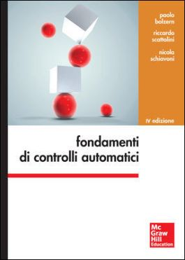

```{=latex}
\begin{center}
```



```{=latex}
\end{center}
```

\newpage

# Sistemi tempo continui

Un sistema si dice tempo continuo se la variabile t è una variabile reale ($t \in \Re$).\
Si definiscono le seguenti equazioni:

* $\dot x(t) = f(x(t),u(t),t)$\space \space \space \space detta equazione di stato
* $y(t) = h(x(t),u(t),t)$\space \space \space \space detta equazione (o trasformazione) di uscita

Con ovviamente $\dot x(t) := \frac{d}{dt}x(t)$\
Dove:

* $x(t)\in \Re^n$ stato del sistema all'istante t
* $u(t)\in \Re^m$ ingresso del sistema all'istante t
* $y(t)\in \Re^p$ uscita del sistema all'istante t