```{=latex}
\begin{center}
```


```{=latex}
\end{center}
```

\newpage

# SISTEMI IN FORMA DI STATO

Un sistema si dice **tempo continuo** se la variabile t è una variabile reale ($t \in \mathbb{R}$).\
Si definiscono le seguenti equazioni:

* $\dot x(t) = f(x(t),u(t),t)$\space \space \space \space detta equazione di stato
* $y(t) = h(x(t),u(t),t)$\space \space \space \space detta equazione (o trasformazione) di uscita

Con ovviamente $\dot x(t) := \frac{d}{dt}x(t)$\
Dove:

* $x(t)\in \mathbb{R}^n$ stato del sistema all'istante t
* $u(t)\in \mathbb{R}^m$ ingresso del sistema all'istante t
* $y(t)\in \mathbb{R}^p$ uscita del sistema all'istante t

Quindi: $x(t)=\begin{bmatrix} x_{1}(t) \\  \vdots \\ x_{n}(t)\end{bmatrix}$ $u(t)=\begin{bmatrix} u_{1}(t) \\  \vdots \\ u_{m}(t)\end{bmatrix}$ $y(t)=\begin{bmatrix} y_{1}(t) \\  \vdots \\ y_{p}(t)\end{bmatrix}$

#### Equazione di stato

È un'equazione differenziale ordinaria vettoriale del prim'ordine:\ $$ \dot x_{1}(t)=f_{1}(\begin{bmatrix} x_{1}(t) \\  \vdots \\ x_{n}(t)\end{bmatrix},\begin{bmatrix} u_{1}(t) \\  \vdots \\ u_{m}(t)\end{bmatrix},t) $$ $$ \vdots $$ $$  \dot x_{n}(t)=f_{n}(\begin{bmatrix} x_{1}(t) \\  \vdots \\ x_{n}(t)\end{bmatrix},\begin{bmatrix} u_{1}(t) \\  \vdots \\ u_{m}(t)\end{bmatrix},t) $$
Dove $\mathbb{R}^n$ si dice spazio di stato e $n$ ordine del sistema.\
Mentre $f : \mathbb{R}^n \times \mathbb{R}^m \times \mathbb{R} \rightarrow \mathbb{R}^n$ è detta funzione di stato

#### Equazione di uscita

È un'equazione algebrica: $$ \dot y_{1}(t)=h_{1}(\begin{bmatrix} x_{1}(t) \\  \vdots \\ x_{n}(t)\end{bmatrix},\begin{bmatrix} u_{1}(t) \\  \vdots \\ u_{m}(t)\end{bmatrix},t) $$ $$ \vdots $$ $$  \dot y_{p}(t)=h_{p}(\begin{bmatrix} x_{1}(t) \\  \vdots \\ x_{n}(t)\end{bmatrix},\begin{bmatrix} u_{1}(t) \\  \vdots \\ u_{m}(t)\end{bmatrix},t) $$
Dove $h : \mathbb{R}^n \times \mathbb{R}^m \times \mathbb{R} \rightarrow \mathbb{R}^p$ è detta funzione di uscita


Se la soluzione $x(t)$ a partire da un istante iniziale $t_{0}$ è univocamente determinata da $x(t_{0})$ e $u(\tau)$, $\tau \ge t_{0}$, allora il sistema è detto **causale**.
\newpage
Un sistema di dice **tempo discreto** se $t$ è una variabile intera ($t \in \mathbb{Z}$).\
Si definiscono: 

* $x(t + 1) = f(x(t),u(t),t)$\space \space \space \space detta equazione di stato
* $y(t) = h(x(t),u(t),t)$\space \space \space \space detta equazione (o trasformazione) di uscita


**NB**: l'equazione di stato non è più differenziale ordinaria ma è un'equazione alle differenze finite.\
\
La definizione di stato, uscita e ingresso rimane invariata rispetto al caso tempo continuo.

### ESEMPIO carrello massa molla

```{=latex}
\begin{center}
```

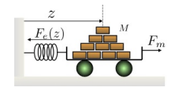

```{=latex}
\end{center}
```

Utilizzando la legge di Newton (prendendo $z$ come la posizione del centro di massa) si ha: $$ M\ddot{z}=-F_{e}+F_{m} $$ con M massa e $F_{e}$ forza elastica data da: $$ F_{e}(z(t),t) = k(t)z(t) $$ sostituendo: $$ M\ddot z(t) = -k(t)z(t) + F_{m}(t) $$ Definiamo:

- $x_{1} := z$ (posizione), $x_{2} := \dot z$ (velocità) di conseguenza lo stato risulta $x := [x_{1}x_{2}]^T$
- $u := F_{m}$ ingresso

Supponendo di misurare z(t) con un sensore allora $y:=z$, sia $k(t)=k$ e considerando come uscita l'energia totale $E_{T}(t)=\frac{1}{2}(k z^{2}(t) + M\dot z^{2}(t))$: $$ \dot x_{1} = x_{2}(t) $$ $$ \dot x_{2}(t)=-\frac{k(t)}{M}x_{1}(t)+\frac{1}{M}u(t)=-\frac{k}{M}x_{1}(t)+\frac{1}{M}u(t) $$ $$ y(t)=x_{1}(t)=\frac{1}{2}(k x_{1}^{2}(t)+M x_{2}^{2}(t)) $$


### ESEMPIO pendolo

```{=latex}
\begin{center}
```


```{=latex}
\end{center}
```

Equazione dei momenti ($C_{m}$ coppia motore): $$ M l^{2} \ddot \theta = C_{grav} + C_{drag} + C_{m} $$ con M massa e $C_{grav}$ e $C_{drag}$ date da $$ C_{grav} = -Mgl\textrm{sin}(\theta),\quad C_{drag}=-b\dot \theta$$ con $b$ coefficiente d'attrito.\
Definiamo:

- $x_{1}:=\theta$ (posizione angolare) e $x_{2}:=\dot \theta$ (velocità angolare), di conseguenza lo stato $x := [x_{1}x_{2}]^T$
- $u:=C_{m}$ ingresso

Supponiamo di misurare $\theta$ tramite un sensore angolo, allora $y:=\theta$: $$ \dot x_{1}(t) = x_{2}(t) $$ $$ \dot x_{2}(t) = -\frac{g}{l}\textrm{sin}(x_{1}(t)) -\frac{b}{M l^2}x_{2}(t) +\frac{1}{M l^2}u(t) $$ $$ y(t)=x_1(t) $$ Se invece misuriamo la posizione verticale tramite sensore, allora $y:=-l\textrm{cos}(\theta)$: $$ \dot x_{1}(t) = x_{2}(t) $$ $$ \dot x_{2}(t) = -\frac{g}{l}\textrm{sin}(x_{1}(t)) -\frac{b}{M l^2}x_{2}(t) +\frac{1}{M l^2}u(t) $$ $$ y(t)=-l\textrm{cos}(x_1(t)) $$

##### Definizione di traiettoria

> Dato un istante iniziale $t_0$ e uno stato iniziale $x_{t_{0}}$, la funzione del tempo $(x(t),u(t))$, $t\ge t_0$, che soddisfa l'equazione di stato $\dot x(t)=f(x(t),u(t),t)$ si dice **traiettoria**  (o movimento) **del sistema**. In particolare, $x(t)$ si dice traiettoria dello stato. Consistentemente, $y(t)$ si dic traiettoria dell'uscita.\
Per sistemi senza ingresso (detti non forzati) la traiettoria (dello stato) $x(t)$, $t\ge t_0$, è determinata solo dallo stato iniziale $x_{t_0}$.

### EQUILIBRIO DI UN SISTEMA

#### Equilibrio di un sistema non forzato

Dato un sistema non forzato $\dot x(t) = f(x(t),t)$, uno stato $x_e$ si dice __equilibrio__ del sistema se $x(t) = x_e$, $t \ge t_0$ è una traiettoria del sistema.

#### Coppia di equilibrio 

Dato un sistema forzato $\dot x(t) = f(x(t),u(t),t)$, $(x_e$,$u_e)$ si dice coppia di equilibrio se $(x(t)$,$u(t)) = (x_e$,$u_e)$, $t \ge t_0$, è traiettoria del sistema. 
\
Per sistemi $\dot x(t) = f(x(t),u(t))$ (tempo invarianti) vale la seguente proprietà: data una coppia di equilibrio $(x_e$,$u_e)$ vale $f(x_e$,$u_e) = 0$, vale lo stesso per sistemi non forzati (se $x_e$ equilibrio allora $f(x_e) = 0$).

Quindi ricapitolando:

- se $x(t) = x_e \forall t \Longrightarrow \dot x(t)=0 \Longrightarrow f(x(t),t)=0$ (sistemi non forzati)
- se $\dot x(t) = f(x(t))$: $f(x_e)=0 \Longrightarrow x_e$ equilibrio (sistemi non forzati tempo invarianti).
- se $\dot x(t) = f(x(t),u(t))$: $f(x_{e},u_{e}) = 0 \Longrightarrow (x_{e},u_{e})$ coppia di equilibrio (sistemi forzati tempo invarianti). 

### CLASSIFICAZIONE DI SISTEMI IN FORMA DI STATO

Dato il caso generale, $x \in \mathbb{R}^n , u \in \mathbb{R}^m , y \in \mathbb{R}^p$ $$ \dot x(t) = f(x(t),u(t),t) \textrm{equazione di stato} $$ $$ y(t) = h(x(t),u(t),t) \textrm{equazione di uscita} $$

I sistemi in forma di stato si possono classificare in:

* **SISO** (Single Input Single Output), sotto classe dei sistemi MIMO (Multiple Input Multiple Output): se $m=p=1$ altrimenti MIMO
* **Strettamente propri**, sotto classe di propri: se $y=h(x(t),t)$
* **Non forzati**, sotto classe di forzati:
    $\dot x(t)=f(x(t),t)$
    $y(t)=h(x(t),t)$
* **Tempo invarianti** sotto classe dei tempo varianti: se data una traiettoria $(x(t),u(t),t), t\ge t_0$, con $x(t_{0})=x_{0}, \forall \Delta \in \mathbb{R}$, vale che per $x(t_{0}+\Delta)=x_{0}$ allora $(x_{\Delta}(t),u_{\Delta}(t)) = (x(t-\Delta),u(t-\Delta))$ è una traiettoria.
    Si può dimostrare che i sistmei tempo invarianti sono del tipo:\
    $\dot x(t) = f(x(t),u(t)) \quad x(0)=x_0$\
    $y(t) = h(x(t),u(t))$\
    senza perdita di generalità si può porre $t_{0}=0$
* **Linearità** sotto classe dei non lineari

### SISTEMI LINEARI

Un sistema è detto lineare se le funzioni di stato e di uscita sono lineari in $x$ ed $u$. $$\dot x_{1}(t)=a_{11}(t)x_{1(t)}+\cdots+a_{1n(t)}x_{n}(t)+b_{11}(t)u_{1}(t)+\cdots+b_{1m}(t)u_{m}(t) $$ $$ \vdots $$ $$ \dot x_{n}(t)=a_{n1}(t)x_{1}(t)+\cdots+a_{nn}(t)x_{n}(t)+b_{n1}(t)u_{1}(t)+\cdots+b_{nm}(t)u(t)$$ \ $$ y_{1}(t)=c_{11}(t)x_{1}(t)+\cdots+c_{1n}(t)x_{n}(t)+d_{11}(t)u_{1}(t)+\cdots+d_{1m}(t)u_{m}(t) $$ $$ \vdots $$ $$ y_{p}(t)=c_{p1}(t)x_{1}(t)+\cdots+c_{pn}(t)x_{n}(t)+d_{p1}(t)u_{1}(t)+\cdots+d_{pm}(t)u_{m}(t) $$
Quindi raggruppando tutti i coefficienti in matrici del tipo:
$$ A(t)=\left[ {\begin{array}{ccc} a_{11}(t) & \cdots & a_{1n}(t)\\ \vdots & \ddots\\ a_{n1}(t) & \cdots & a_{nn}(t)\\ \end{array} } \right] \quad B(t)=\left[ {\begin{array}{ccc} b_{11}(t) & \cdots & b_{1m}(t)\\ \vdots & \ddots\\ b_{n1}(t) & \cdots & b_{nm}(t)\\ \end{array} } \right]$$
$$ C(t)=\left[ {\begin{array}{ccc} c_{11}(t) & \cdots & c_{1n}(t)\\ \vdots & \ddots\\ c_{p1}(t) & \cdots & c_{pn}(t)\\ \end{array} } \right] \quad D(t)=\left[ {\begin{array}{ccc} d_{11}(t) & \cdots & d_{1m}(t)\\ \vdots & \ddots\\ d_{p1}(t) & \cdots & d_{pm}(t)\\ \end{array} } \right] $$\
Dove $A(t) \in \mathbb{R}^{n\times n}$, $B(t) \in \mathbb{R}^{n\times m}$, $C(t) \in \mathbb{R}^{p\times n}$, $D(t) \in \mathbb{R}^{p \times m}$\
Di conseguenza le equazioni di stato e di uscita diventano: $$ \dot x(t) = A(t)x(t) + B(t)u(t) $$ $$ y(t) = C(t)x(t) + D(t)u(t) $$

## SISTEMI LINEARI TEMPO INVARIANTI

Un sistema si dice **lineare tempo invariante** se è lineare e le funzioni del movimento sono indipendenti dal tempo: $$ \dot x(t) = Ax(t) + Bu(t) $$ $$ y(t) = Cx(t) + Du(t) $$ $A(t) \in \mathbb{R}^{n\times n}$, $B(t) \in \mathbb{R}^{n\times m}$, $C(t) \in \mathbb{R}^{p\times n}$, $D(t) \in \mathbb{R}^{p \times m}$\
Se **SISO**: $A(t) \in \mathbb{R}^{n\times n}$, $B(t) \in \mathbb{R}^{n\times 1}$, $C(t) \in \mathbb{R}^{1\times n}$, $D(t) \in \mathbb{R}^{1 \times 1} \Longrightarrow B$ è un vettore, $C$ è un vettore riga e $D$ è uno scalare.

#### Principio di sovrapposizione degli effetti

> Sia $(x_{a}(t), u_{a}(t))$ traiettoria con $x_{a}(t_{0}) = x_{0a}$\
Sia $(x_{b}(t), u_{b}(t))$ traiettoria con $x_{b}(t_{0}) = x_{0b}$\
Allora $\forall \alpha , \beta \in \mathbb{R} \textrm{ dato lo stato iniziale } x_{ab}(t_0) = \alpha x_{0a} + \beta x_{0b}, \textrm{si ha che: }$ $$ (x_{ab}(t),u_{ab}(t)) = (\alpha x_{a}(t) + \beta x_{b}(t), \alpha u_{a}(t) + \beta u_{b}(t)) $$ è una **traiettoria del sistema**. Ovvero applicando in ingresso $u_{ab}(t) = \alpha u_{a}(t) + \beta u_{b}(t)$  la traiettoria di stato è $x_{ab}(t)=\alpha x_{a}(t) + \beta x_{b}(t)$\
**Importante**: NON vale per sistemi non lineari

#### Evoluzione libera e forzata

\
\
Sia $x_{\ell}(t)\textrm{, } t\ge t_0$ la traiettoria di stato ottenuta per $x_{\ell}(t_{0}) = x_{0}$ e $u_{l}(t)=0 \textrm{, } t\ge t_{0}$, detta **evoluzione libera**\
Sia $x_{f}(t)\textrm{, } t\ge t_0$ la traiettoria di stato ottenuta per $x_{f}(t_{0}) = 0$ e $u_{f}(t)=u(t) \textrm{, } t\ge t_{0}$, detta **evoluzione forzata**\
Applicando il principio di sovrapposizione degli effetti si ha che fissato lo stato iniziale $x(t_0)=x_{0}$ e applicando l'ingresso $u(t)$, $t\ge t_0$ la traiettoria di stato è data da $$ x(t) = x_{\ell}(t) + x_{f}(t) $$ Ciò NON vale per sistemi non lineari (il principio di sovrapposizione vale solo per sistemi lineari)

\newpage

### Traiettorie di un SLTI e rappresentazioni equivalenti

Dato il SLTI generico: $x \in \mathbb{R}^{n}$, $u \in \mathbb{R}^{m}$, $y \in \mathbb{R}^{p}$ $$ \dot x(t) = Ax(t) + Bu(t) \quad \quad x(0) = x_{0} $$ $$ y(t) = Cx(t) + Du(t) $$ Dalla notazione introdotta nel paragrafo precedente si può scrivere: $$ x(t) = e^{At}x_{0} + \int_{0}^{t} e^{A(t-\tau)}Bu(\tau)d\tau $$ $$ y(t) = Ce^{At}x_{0} + C \int_{0}^{t} e^{A(t-\tau)}Bu(\tau)d\tau + Du(t) $$ Ricorda: $$ e^{At} = I + At + \frac{(At)^2}{2!} + \frac{(At)^3}{3!} + \cdots = \sum_{n=0}^{\infty} \frac{(At)^n}{n!} $$

Proprietà della matrice esponenziale:

* Esponenziale e cambio di base: $e^{TAT^{-1}t}=Te^{At}T^{-1}$
* Esponenziale di una matrice diagonale a blocchi (forma di Jordan): l'esponenziale di una matrice di questo tipo è una matrice diagonale a blocchi in cui ciascun blocco è l'esponenziale del blocco corrispondente della matrice di partenza

Difatti l'esponenziale di una matrice diagonale $\Lambda = diag\{\lambda _{1}, \ldots, \lambda _{n}\}$ è: $e^{\Lambda t}=diag\{e^{\lambda _{1}}, \ldots, e^{\lambda _{n} t}\}$\
\
\
Dalle proprietà sopraelencate si può giungere ad una rappresentazione equivalente delle equazioni di traiettorie e uscite dei SLTI effettuando un cambio di vase mediante una matrice $T$ (invertibile):
$$ \hat x(t) = Tx(t) $$ $$ x(t) = T^{-1}\hat x(t) $$ $$ \dot{\hat x}(t) = \hat A \hat x(t) + \hat B u(t) $$ $$ y(t) = \hat C \hat x(t) + \hat D u(t) $$ con: $\hat A = TAT^{-1}$, $\hat B = TB$, $\hat C = CT^{-1}$, $\hat D = D$\
Tutto questo per cambiare la posizione dell'origine in modo tale da non avere errore (non avere un gap fra l'origine e lo stato iniziale).

### Modi naturali

Dato il SLTI generico: $x \in \mathbb{R}^{n}$, $u \in \mathbb{R}^{m}$, $y \in \mathbb{R}^{p}$ $$ \dot x(t) = Ax(t) + Bu(t) \quad \quad x(0) = x_{0} $$ $$ y(t) = Cx(t) + Du(t) $$ Indicando con $\lambda _{1}, \ldots, \lambda _{r}$ gli $r\le n$ autovalori (reali e complessi coniugati) distinti della matrice $A$, con molteplicità algebrica $n_{1}, \ldots, n_{r} \ge 0$ tali che $\sum_{i=1}^{r} n_{i} = n$.\
Le componenti dell'evoluzione libera dello stato $x_{\ell}(t)$ si possono scrivere come: $$ x_{\ell,j}(t) = \sum_{i=1}^{r} \sum_{q=1}^{h_{i}} \gamma _{jiq}t^{q-1}e^{\lambda _{i}t} \textrm{, } \quad j=1,\ldots,n $$ per opportuni valori di $h_{i}\le n_{i}$, dove i coefficienti $\gamma _{jiq}$ dipendono dallo stato iniziale $x(0)$.\
I termini $t^{q-1}e^{\lambda _{i} t}$ sono detti **modi naturali** del sistema. L'evoluzione libera è **combinazione lineare dei modi**.\
Inoltre poichè l'uscita è lineare nello stato, anche l'evoluzione libera dell'uscita è combinazione lineare dei modi.

#### Forma reale dei modi di un sistema

Se la matrice $A$ del SLTI è reale e $\lambda _{i} = \sigma _{i} + j \omega _{i}$ è un autovalore complesso, allora il suo complesso coniugato $\bar \lambda _{i} = \sigma _{i} - j \omega _{i}$ è autovalore di $A$, inoltre si può dimostrare che i coefficienti $\gamma _{jiq}$ corrispondenti agli autovalori complessi coniugati sono anch'essi complessi coniugati. Si verifica inoltre per calcolo diretto che $x_{\ell,j}(t)$ sono sempre reali e che i modi del sistema corrispondenti ad autovalori complessi coniugati $\lambda _{i}$ e $\bar \lambda _{i}$ sono del tipo: $$ t^{q-1}e^{\sigma _{i}t}cos(\omega _{i}t + \phi _{i}) $$ con opportuni valori della fase $\phi _{i}$.\
Nel caso in cui le molteplicità algebriche $n_{1},\ldots,n_{r}$ degli autovalori di $A$ coincidano con le molteplicità geometriche, allora i coefficienti $h_{i}$ sono tutti pari ad 1 e l'espressione dei modi si semplifica in $$ e^{\lambda _{i}t} \quad \quad \textrm{per autovalori reali} $$ $$ e^{\sigma _{i}t}cos(\omega _{i}t + \phi _{i}) \quad \quad \textrm{per autovalori complessi coniugati} $$
\
$$ \textrm{\bf Modi naturali: autovalori reali semplici (m.a. = m.g.)} $$

+----------------------------------------------------------------+-------------------------------------------------------------------+-----------------------------------------------------------------+
|\ \ \ \ \ \  $$ e^{\lambda_{i}t}, \lambda_{i} > 0 $$            |\ \ \ \ \ \  $$ e^{\lambda_{i}t}, \lambda_{i} = 0 $$               |\ \ \ \ \ \  $$ e^{\lambda_{i}t}, \lambda_{i} < 0 $$             |
|                                                                |                                                                   |                                                                 |
+----------------------------------------------------------------+-------------------------------------------------------------------+-----------------------------------------------------------------+
| 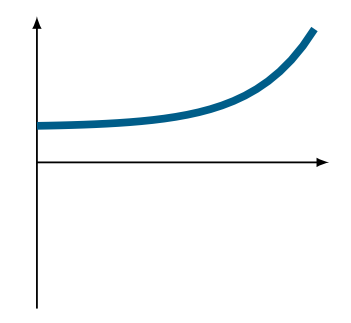{#uno height=150px}                             | 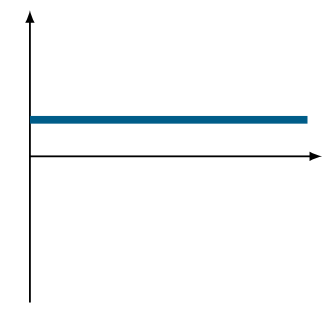{#due height=150px}                                | 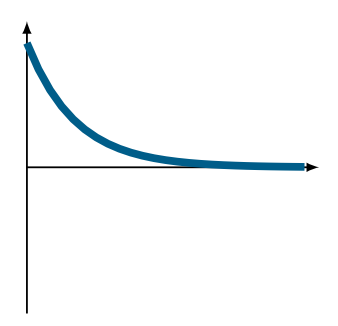{#tre height=150px}                              |
+----------------------------------------------------------------+-------------------------------------------------------------------+-----------------------------------------------------------------+
$$ \textrm{\bf Modi naturali: autovalori complessi coniugati semplici (m.a. = m.g.)} $$

+-----------------------------------------------------------------------+----------------------------------------------------------------------+----------------------------------------------------------------------+
|\ \  $$ e^{\sigma_{i}t}cos(\omega_{i}t + \phi_{i}), \sigma_{i} > 0 $$  |\ \  $$ e^{\sigma_{i}t}cos(\omega_{i}t + \phi_{i}), \sigma_{i} = 0 $$ |\ \  $$ e^{\sigma_{i}t}cos(\omega_{i}t + \phi_{i}), \sigma_{i} < 0 $$ |
|                                                                       |                                                                      |                                                                      |
+-----------------------------------------------------------------------+----------------------------------------------------------------------+----------------------------------------------------------------------+
| 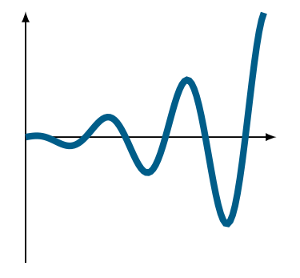{#qua height=150px}                                   | 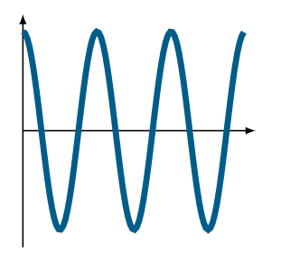{#cin height=150px}                                  | 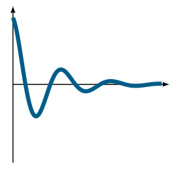{#sei height=150px}                                  |
+-----------------------------------------------------------------------+----------------------------------------------------------------------+----------------------------------------------------------------------+

\newpage

$$ \textrm{\bf Modi naturali: autovalori reali (m.a. > m.g.)} $$

+-------------------------------------------------------------------+----------------------------------------------------------------------+--------------------------------------------------------------------+
|\ \ \ \ \  $$ t^{q}e^{\lambda_{i}t}, \lambda_{i} > 0 $$            |\ \ \ \ \  $$ t^{q}e^{\lambda_{i}t}, \lambda_{i} = 0 q > 1 $$         |\ \ \ \ \  $$ t^{q}e^{\lambda_{i}t}, \lambda_{i} < 0 $$             |
|                                                                   |                                                                      |                                                                    |
+-------------------------------------------------------------------+----------------------------------------------------------------------+--------------------------------------------------------------------+
| 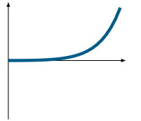{#set height=150px}                                | 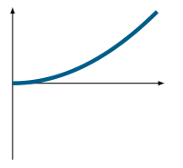{#ott height=150px}                                   | 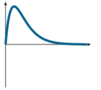{#nov height=150px}                                 |
+-------------------------------------------------------------------+----------------------------------------------------------------------+--------------------------------------------------------------------+

$$ \textrm{\bf Modi naturali: autovalori complessi coniugati (m.a. > m.g.)} $$

+--------------------------------------------------------------------------+-------------------------------------------------------------------------+-------------------------------------------------------------------------+
|\  $$ t^{q}e^{\sigma_{i}t}cos(\omega_{i}t + \phi_{i}), \sigma_{i} > 0 $$  |\  $$ t^{q}e^{\sigma_{i}t}cos(\omega_{i}t + \phi_{i}), \sigma_{i} = 0 $$ |\  $$ t^{q}e^{\sigma_{i}t}cos(\omega_{i}t + \phi_{i}), \sigma_{i} < 0 $$ |
|                                                                          |                                                                         |                                                                         |
+--------------------------------------------------------------------------+-------------------------------------------------------------------------+-------------------------------------------------------------------------+
| 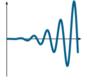{#die height=150px}                                       | 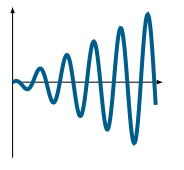{#und height=150px}                                      | 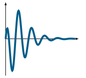{#dod height=150px}                                       |
+--------------------------------------------------------------------------+-------------------------------------------------------------------------+-------------------------------------------------------------------------+

$$ \textrm{\bf Modi naturali: tabella riassuntiva} $$

+-----------------------------------------------------------------+-------------------------------------------------------------+
|\ \ \ \ \  Modi naturali m. algebrica = m. geometrica            |\ \ \ \ \  Modi naturali m. algebrica > m.geometrica         |
|                                                                 |                                                             |
+-----------------------------------------------------------------+-------------------------------------------------------------+
| 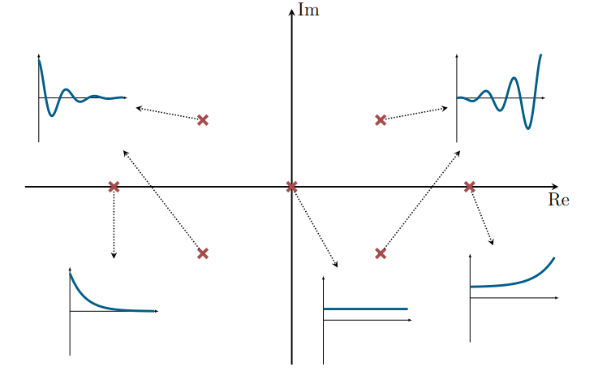{#set width=300px}                                | 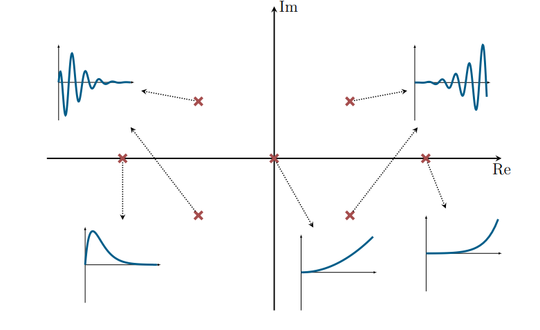{#ott width=300px}                            |
+-----------------------------------------------------------------+-------------------------------------------------------------+

\newpage

#### Forma di Jordan di una matrice

\
Per una generica matrice $A$ si può dimostrare che esiste sempre $T$ tale che: $$ J = TAT^{-1} $$ di $\mu$ autovalori distinti $\lambda _{1}, \ldots, \lambda _{\mu}$ con $n_{i}$ molteplicità algebrica di $\lambda _{i}$ $$ J = diag\{J_{1}, \ldots, J_{\mu}\} $$ con $J_i$ blocco di Jordan associato all'autovalore $\lambda _i$ dato da $$ J_{i} = diag\{J_{i1}, \ldots, J_{i\nu _{i}}\} $$ con $J_{ih} \in \mathbb{R}^{\eta _{ih} \times \eta _{ih}}$ miniblocchi di Jordan dell'autovalore $\lambda _{i}$ dati da $$ J_{ih} = \left[ {\begin{array}{ccccc} \lambda _{i} & 1 & 0 & \cdots & 0\\ 0 & \lambda _{i} & 1 & \cdots & 0\\ \vdots &  & \ddots\\ 0 & \cdots & 0 & \lambda _{i} & 1\\ 0 & \cdots & 0 & 0 & \lambda _{i} \end{array} } \right] $$ dove $\sum_{h=1}^{\nu_i} \eta_{ih} = n_i$

#### Esponenziale di un miniblocco

\
Dato $J_{ih}$ definito come nel paragrafo precedente allora il suo esponenziale $e^{J_{ih}t}$ è dato da ($\lambda _{i}$ reale o complesso)
$$ e^{J_{ih}t} = e^{\lambda _{i}t} \left[ {\begin{array}{ccccc} 1 & t & \frac{t^2}{2!} & \cdots & \frac{t^{\eta _{ih} -1}}{(\eta _{ih} - 1)!}\\ 0 & 1 & t & \cdots\\ \vdots & \ddots & \ddots\\ 0 & \cdots & 0 & 1 & t\\ 0 & \cdots & 0 & 0 & 1 \end{array} } \right] $$

#### Esempio: carrello

\
Prendendo in esempio il carrello con la massa e la molla e considerando $k$ costante cosicchè il sistema sia LTI, si ha: $$ \begin{bmatrix} \dot x_{1}(t)\\ \dot x_{2}(t) \end{bmatrix} = \begin{bmatrix} 0 & 1\\ -\frac{k}{M} & 0 \end{bmatrix} \begin{bmatrix} x_{1}(t)\\ x_{2}(t)\end{bmatrix} + \begin{bmatrix} 0\\ \frac{1}{M}\end{bmatrix} u(t) $$ $$ y(t) = \begin{bmatrix} 1 & 0 \end{bmatrix} \begin{bmatrix} x_{1}(t)\\ x_{2}(t)\end{bmatrix} + 0u(t) $$ Autovalori: $\lambda _{1} = j\sqrt{\frac{k}{M}}$, $\lambda _{2} = -j\sqrt{\frac{k}{M}}$\
Se applichiamo un controllo $u=-hx_{2}$ gli autovalori diventano:\
$\lambda _{1}=-\frac{h}{2M}+\sqrt{\frac{h^2}{4M^2} - \frac{k}{M}}$, $\lambda _{2}=-\frac{h}{2M}-\sqrt{\frac{h^2}{4M^2} - \frac{k}{M}}$\
Se $h^2 > 4Mk$ allora autovalori reali, se $h^2 < 4Mk$ autovalori complessi coniugati.\
Se $h^2 = 4Mk \Longrightarrow \lambda _{1} = \lambda _{2} = -\frac{h}{2M}$ (m.a.$=2$), si può dimostrare che m.g.$=1$, quindi blocco di Jordan $2 \times 2$: $$ J = TAT^{-1} = \begin{bmatrix} -\frac{h}{2M} & 1\\ 0 & -\frac{h}{2M}\end{bmatrix} \quad \quad \quad e^{Jt} = e^{-\frac{h}{2M}t} \begin{bmatrix} 1 & t\\ 0 & 1\end{bmatrix} $$ $$ \hat x_{\ell}(t) = \begin{bmatrix} e^{-\frac{h}{2M}t}\hat x_{1}(0) + te^{-\frac{h}{2M}t}\hat x_{2}(0)\\ e^{-\frac{h}{2M}t}\hat x_{2}(0)\end{bmatrix} $$

# STABILITÀ

#### Equilibrio stabile

Uno stato di equilibrio $x_e$ si dice stabile se $\forall \epsilon > 0, \exists \delta > 0$ tale che $\forall x_0$ tale che $\Vert x_{0} - x_{e} \Vert \le \delta$ allora risulti $\Vert x(t) - x_{e} \Vert \le \epsilon$, $\forall t \ge 0$

#### Equilibrio instabile

Uno stato di equilibrio $x_e$ si dice instabile se non è stabile.

#### Equilibrio attrattivo

Uno stato di equilibrio $x_e$ si dice attrattivo se $\exists \delta > 0$ tale che $\forall x_0$ tale che $\Vert x_{0} - x_{e} \Vert \le \delta$ allora risulti $\lim_{t\to+\infty}{\Vert x(t) - x_{e} \Vert} = 0$

#### Equilibrio asintoticamente stabile

Uno stato di equilibrio $x_e$ si dice asintoticamente stabile se è stabile e attrattivo

#### Stabilità locale

Le definizioni date sottointendono la parola locale, cioè la proprietà vale in un intorno di $x_e$

#### Stabilità globale

Le proprietà di stabilità ed asintotica stabilità sono globali se valgono $\forall x_{e} \in \mathbb{R}^n$

#### Stabilità di una traiettoria

Le definizioni di stabilità si possono generalizzare a una traiettoria $\bar x(t)$, $t \ge 0$

## STABILITÀ INTERNA DI SLTI

Nei sistemi lineari se $u=0$ allora $x=0$ è **sempre** un equilibrio. Nei sistemi lineari si può dimostrare che tutti gli equilibri e tutte le traiettorie hanno le stesse proprietà di stabilità, per questo motivo si parla di **stabilità del sistema**. \
\
**Teorema 1**

> Un SLTI è asintoticamente stabile se e solo se tutti gli autovalori hanno parte reale strettamente negativa.

**Teorema 2**

> Un SLTI è stabile se e solo se tutti gli autovalori hanno parte reale minore o uguale a zero e tutti gli autovalori a parte reale nulla hanno molteplicità geometrica uguale alla molteplicità algebrica (i miniblocchi di Jordan associati hanno dimensione 1)

Conseguenza immediata è che se si ha almeno un autovalore a parte reale positiva o se almeno un autovalore a parte reale nulla ha m.a. $>$ m.g.\
\
Prendendo in esame l'esempio del carrello, se $h^2 > 4Mk$ o se $h^2 < 4Mk$ gli autovalori, in entrambi i casi, sono a parte reale negativa, quindi il sistema è asintoticamente stabile. Se, invece, $h^{2} = 4Mk$, $\lambda _{1} = \lambda _{2} = - \frac{h}{2M}$ (m.a. $=2$), si può però dimostrare che m.g. $=2$ e che gli autovalori sono a parte reale negativa quindi il sistema è asintoticamente stabile.

### RETROAZIONE DELLO STATO

$$ \dot x(t) = Ax(t) + Bu(t) $$ $$ y(t) = Cx(t) + Du(t) $$ 
Supponendo di misurare l'intero stato, ovvero se $y(t) = x(t)$ allora possiamo progettare $$ u(t)=Kx(t) + v(t) $$ con $K \in \mathbb{R}^{m\times n}$ una matrice di guadagni e $v(t)$ un ulteriore ingresso per il sistema retroazionato. Risulta quindi $$ \dot x(t) = (A+BK)x(t) + Bv(t) $$ Se vogliamo il sistema ad anello chiuso asintoticamente stabile dobbiamo progettare $K$ tale che $(A+BK)$ abbia autovalori tutti a parte reale negativa. La possibilità di scegliere gli autovalori di $(A+BK)$ dipende dalla coppia di matrici $(A,B)$ ed è legata alla proprietà di **raggiungibilità**.\
Se non è possibile misurare l'intero stato, ovvero se $x(t)\ne y(t)$, esistono tecniche per ricostruire lo stato a partire dalle misure mediante sistemi ausiliari detti **osservatori**. Se si possa ricostruire o meno lo stato dipende dalla coppia $(A,C)$ ed è legato alla proprietà di osservabilità.

## LINEARIZZAZIONE DI SISTEMI NON LINEARI (tempo invarianti)

$$ \dot x(t) = f(x(t), u(t)) $$ $$ y(t) = h(x(t), u(t)) $$ Sia $(x_{e}, u_{e})$ una coppia di equilibrio, $f(x_{e}, u_{e}) = 0$, consideriamo una traiettoria a partire da stato iniziale $x(0) = x_{e} + \tilde x_{0}$ $$ x(t) = x_{e} + \tilde x(t) $$ $$ u(t) = u_{e} + \tilde u(t) $$ $$ y(t) = h(x_{e}, u_{e}) + \tilde y(t) = y_{e} + \tilde y(t) $$ Essendo una traiettoria vale $$ \frac{d}{dt} (x_{e} + \tilde x(t)) = f(x_{e} + \tilde x(t), u_{e} + \tilde u(t)) $$ $$ y_{e} + \tilde y(t) = h(x_{e} + \tilde x(t), u_{e} + \tilde u(t)) $$
Sviluppando in serie di Taylor ($f$ e $h$ suff. regolari) in $(x_{e}, u_{e})$ $$ \frac{d}{dt} (x_{e} + \tilde x(t)) = f(x_{e}, u_{e}) + \frac{\partial}{\partial x} f(x,u)\bigg|_{\substack{x=x_{e}\\ u=u_{e}}} + \frac{\partial}{\partial u} f(x,u)\bigg|_{\substack{x=x_{e}\\ u=u_{e}}} + \textrm{term. ord. sup.} = $$ $$ = f(x_{e}, u_{e}) + A_{e}\tilde x(t) + B_{e}\tilde u(t)+ \textrm{term. ord. sup.} = $$ $$ = A_{e}\tilde x(t) + B_{e}\tilde u(t) $$ \
$$ y_{e} + \tilde y(t) = h(x_{e}, u_{e}) + \frac{\partial}{\partial x} h(x,u)\bigg|_{\substack{x=x_{e}\\ u=u_{e}}} + \frac{\partial}{\partial u} h(x,u)\bigg|_{\substack{x=x_{e}\\ u=u_{e}}} + \textrm{term. ord. sup.} $$ 
\newpage
Quindi $$ \dot {\tilde x}(t) = \frac{\partial}{\partial x} f(x,u)\bigg|_{\substack{x=x_{e}\\ u=u_{e}}} \tilde x(t) + \frac{\partial}{\partial u} f(x,u)\bigg|_{\substack{x=x_{e}\\ u=u_{e}}} \tilde u(t) + \textrm{term. ord. sup.} $$ $$ \tilde y(t) = \frac{\partial}{\partial x} h(x,u)\bigg|_{\substack{x=x_{e}\\ u=u_{e}}} \tilde x(t) + \frac{\partial}{\partial u} h(x,u)\bigg|_{\substack{x=x_{e}\\ u=u_{e}}} \tilde u(t)+ \textrm{term. ord. sup.} $$ Conseguentemente ponendo $$ \frac{\partial}{\partial x} f(x,u)\bigg|_{\substack{x=x_{e}\\ u=u_{e}}} = A_{e} \in \mathbb{R}^{n\times n} \quad \quad \quad  \frac{\partial}{\partial u} f(x,u)\bigg|_{\substack{x=x_{e}\\ u=u_{e}}} = B_{e} \in \mathbb{R}^{n\times m} $$ $$ \frac{\partial}{\partial x} h(x,u)\bigg|_{\substack{x=x_{e}\\ u=u_{e}}} = C_{e} \quad  \quad \quad \frac{\partial}{\partial u} h(x,u)\bigg|_{\substack{x=x_{e}\\ u=u_{e}}} = D_{e} $$ \
$$ \dot {\tilde x}(t) = A_{e}\tilde x(t) + B_{e}\tilde u(t) + \textrm{term. ord. sup.} \quad \quad \tilde x(0) = \tilde x_{0} $$ $$ \tilde y(t) = C_{e}\tilde x(t) + D_{e}\tilde u(t) + \textrm{term. ord. sup.} $$ Approssimando $$ \dot {\tilde x}(t) \approx A_{e}\tilde x(t) + B_{e}\tilde u(t) $$ $$ \tilde y(t) \approx C_{e}\tilde x(t) + D_{e}\tilde u(t) $$ Quindi il sistema linearizzato risulta $$ \dot {\Delta x}(t) = A_{e}\Delta x(t) + B_{e}\Delta u(t) $$ $$ \Delta y(t) = C_{e}\Delta x(t) + D_{e}\Delta u(t) $$ Con $(\Delta x(t), \Delta u(t)), t\ge 0,$ traiettoria del linearizzato.\
Le traiettorie del sistema linearizzato soddisfano $$ x(t) = x_{e} + \tilde x(t) \approx x_{e} + \Delta x(t) $$ $$ u(t) = u_{e} + \tilde u(t) \approx u_{e} + \Delta u(t) $$ $$ y(t) = y_{e} + \tilde y(t) \approx y_{e} + \Delta y(t) $$ per variazioni sufficientemente piccole ($\Delta$ sufficientemente piccolo).
```{=latex}
\begin{center}
```

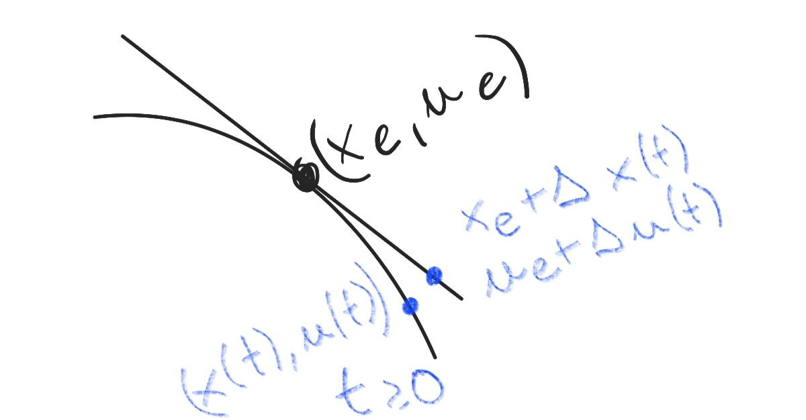{#traitLin height=150px}

```{=latex}
\end{center}
```

**Teorema**

> Dato un sistema non lineare tempo invatiante, $\dot x(t) = f(x(t), u(t))$, sia $(x_{e}, u_{e})$ una coppia di equilibrio. Se il sistema linearizzato intorno a $(x_{e}, u_{e})$ è asintoticamente stabile, allora l'equilibrio $x_e$, relativo all'ingresso $u_e$ è (localmente) asintoticamente stabile.\
**Ricorda**: per vedere se il sistema linearizzato è asintoticamente stabile in un intorno della coppia di equilibrio si guardano gli autovalori di $A$ (o di $A+BK$ se è retroazionato).

**Teorema**

> Dato un sistema non lineare tempo invariante, $\dot x(t) = f(x(t), u(t))$, sia $(x_{e}, u_{e})$ una coppia di equilibrio. Se il linearizzato intorno a $(x_{e}, u_{e})$ ha almeno un autovalore a parte reale positiva, allora l'equilibrio $x_{e}$, relativa all'ingresso $u_{e}$, è instabile.

**N.B.**: non si può dire nulla in caso abbiano solo autovalori a parte reale minore o uguale a zero con almeno un autovalore a parte reale nulla.

### Controllo non lineare mediante linearizzazione

Consideriamo il sistema non lineare $$ \dot x(t) = f(x(t), u(t)) $$ Linearizzazione intorno all'equilibrio $(x_{e}, u_{e})$ $(A_{e} = \frac{\partial}{\partial x} f(x,u)\bigg|_{\substack{x=x_{e}\\ u=u_{e}}}, \quad B_{e} = \frac{\partial}{\partial u} f(x,u)\bigg|_{\substack{x=x_{e}\\ u=u_{e}}})$ $$ \dot {\Delta x}(t) = A_{e}\Delta x(t) + B_{e}\Delta u(t) $$
_Obiettivo_: portare $\Delta x(t)$ a zero, ovvero $x(t)$ a $x_{e}$ "in modo approssimato". Usando retroazione dello stato $\Delta u(t) = K\Delta x(t) + \Delta v(t)$ otteniamo il sistema in anello chiuso: $$ \dot {\Delta x}(t) = (A_{e} + B_{e}K)\Delta x(t) + B_{e}\Delta v(t) $$ Posso progettare $K$ in modo che $(A_{e} + B_{e}K)$ sia asintoticamente stabile. Grazie ai teoremi sulla linearizzazione $x_e$ risulta un equilibrio (localmente asintoticamente stabile per il sistema lineare non in anello chiuso retroazionato).\
Visto che $\Delta x(t) \approx x(t) - x_{e}$: $$ u(t) = u_{e} + K(x(t) - x_{e}) + \tilde v(t) \approx u_{e} + K\Delta x(t) + \tilde v(t) $$ Perciò la legge di controllo finale sarà: $$ u(t) = u_{e} + K(x(t) - x_{e}) + \tilde v(t) \quad \quad \textrm{\textcolor{red}{feedback (retroazione) per il sistema non lineare}} $$ Con la $K$ progettata sul sistema linearizzato.
```{=latex}
\begin{center}
```

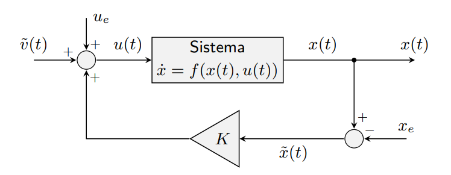{#feedback width=500px}

```{=latex}
\end{center}
```

\newpage

# TRASFORMATA DI LAPLACE 

### Richiami sui numeri complessi

Un numero complesso può essere rappresentato in 2 modi:

* **Forma cartesiana**:
    $$ s = \sigma + j\omega \quad \quad \textrm{$\sigma$ parte reale , $\omega$ parte immaginaria} $$
* **Forma polare**:
    $$ s = \rho e^{j\varphi} \quad \quad \quad \textrm{$\rho$ modulo , $\varphi$ argomento} $$

Ovviamente esistono le formule per il passaggio fra l'una e l'altra: $$ \rho = \sqrt{\sigma^2 + \omega^2} \quad \quad \varphi = atan(\frac{\omega}{\sigma}) $$ $$ \sigma = \rho cos(\varphi) \quad \quad \omega = \rho sin(\varphi) $$

## TRASFORMATA DI LAPLACE

Data una funzione complessa $f$ di variabile reale $t$, $f:\mathbb{R}\longrightarrow\mathbb{C}$\
Sia $s=\sigma + j\omega$ una varaibile complessa, allora: $$ F(s) = \int_{0^{-}}^{+\infty} f(t)e^{-st} dt \quad \quad \quad \textrm{Trasformata di Laplace di $f(t)$} $$ Se esiste per qualche $s$, ossia se l'integrale converge.\
**Notazione**: Trasformazione di Laplace $\mathcal{L}$\ \ \ \ \ $f(t) \xrightarrow[\ \ \ \ \ \ \ ]{\mathcal{L}} F(s)$ \
\ \ \ \ \ \ \ \ \ \ \ \ \ \ \ \ \ \ $F(s) = \mathcal{L}[f(t)]$

### OSSERVAZIONI

#### Ascissa di convergenza

Sia $\bar \sigma > -\infty$ estremo inferiore di $s = \sigma + j \omega$ per cui l'integrale converge. Allora la trasformata esiste nel semipiano $Re(s) > \bar \sigma$. $\bar \sigma$ è detta ascissa di convergenza. La definizione si estende anche a $Re(s) \le \bar \sigma$.\
**N.B.**: solo i valori di $f(t)$ per $t\ge 0$ determinano la trasformata.\
**N.B.**: L'integrale va da $0^{-}$ a $+\infty$ quindi gli impulsi in 0 sono considerati nell'integrazione.

#### Trasformate razionali

$$ F(s) = \frac{N(s)}{D(s)} $$ dove $N(s)$ e $D(s)$ sono polinomi primi fra loro.\
Se $f$ reale allora $N(s)$ e $D(s)$ a coefficienti reali.\
Gli **zeri** sono le radici di $N(s) = 0$\
I **poli** sono le radici di $D(s) = 0$

### ANTITRASFORMAZIONE

$$ f(t) = \frac{1}{2\pi j}\int_{\sigma - j\infty}^{\sigma + j\infty} F(s)e^{st}ds $$ con $\sigma > \bar \sigma$.\
**Notazione**: antitrasformazione di Laplace $\mathcal{L}^{-1}$\ \ \ \ \ $F(s) \xrightarrow[\ \ \ \ \ \ \ ]{\mathcal{L}^{-1}} f(t)$ \
\ \ \ \ \ \ \ \ \ \ \ \ \ \ \ \ \ \ $f(t) = \mathcal{L}^{-1}[F(s)]$ \
**N.B.**: $f(t)$ fornita solo per $t\ge 0$. Si assume $f(t)=0$ per $t<0$.\
**N.B.**: Considerando solo $f(t)$ t.c. $f(t)=0$ per $t<0$ allora c'è corrispondenza biunivoca tra $f(t)$ e $F(s)$, quindi hanno lo stesso contenuto informativo.\
**N.B.**: la definizione è poco usata per l'antitrasformazione.

### PROPRIETÀ

#### Linearità

$$ \mathcal{L}[\alpha f(t) + \beta g(t)] = \alpha \mathcal{L}[f(t)] + \beta \mathcal{L}[g(t)] = \alpha F(s) + \beta G(s) \quad \quad \quad \forall \alpha,\beta \in \mathbb{C} $$

#### Traslazione temporale

$$ \mathcal{L}[f(t-\tau)]=e^{-\tau s}F(s) \quad \quad \quad \forall \tau > 0 $$

#### Traslazione nel dominio della variabile complessa

$$ \mathcal{L}[e^{\alpha t}f(t)]=F(s-a) \quad \quad \quad \forall \alpha \in \mathbb{C} $$

#### Derivazione nel tempo

$$ \mathcal{L}\left[\frac{d}{dt}f(t)\right] = sF(s)-f(0) $$ Ne consegue iterando $$ \mathcal{L}\left[\frac{d^n}{dt^n}f(t)\right] = s^{n}F(s) - \sum_{i=1}^{n} s^{n-i}\frac{d^{i-1}}{dt^{i-1}}f(t)\big|_{t=0} $$

#### Integrazione nel tempo

$$ \mathcal{L}\left[\int_{0}^{t}f(\tau)d\tau \right] = \frac{1}{s}F(s) $$

#### Convoluzione nel tempo

$$ \mathcal{L}\left[\int_{0}^{t}f_{1}(t-\tau)f_{2}(\tau)d\tau \right] = F_{1}(s)F_{2}(s) $$


### TEOREMI DEL VALORE INIZIALE E FINALE

#### Teorema del valore iniziale

> Se $f(t)$ reale con trasformata razione $F(s)$ con grado del denominatore maggiore del grado del numeratore allora $$ f(0) = \lim_{s\to \infty} sF(s) $$

#### Teorema del valore finale

> Se $f(t)$ reale con trasformata razionale $F(s)$ con grado del denominatore maggiore del grado del numeratore e poli nulli o a parte reale negativa allora $$ \lim_{t\to \infty} f(t) = \lim_{s\to 0} sF(s) $$

### TRASFORMATA DI SEGNALI ELEMENTARI

#### Delta di Dirac

$\mathcal{L}[\delta (t)] = 1$

#### Gradino unitario

$\mathcal{L}[1(t)] = \frac{1}{t}$

#### Rampa

$\mathcal{L}[t 1(t)] = \frac{1}{s^2}$

#### Esponenziale

$\mathcal{L}[e^{\alpha t} 1(t)] = \frac{1}{s-\alpha}$

#### Seno

$\mathcal{L}[sin(\omega t)1(t)] = \frac{\omega}{s^2 + \omega^2}$

#### Coseno

$\mathcal{L}[cos(\omega t)1(t)] = \frac{1}{\omega}\mathcal{L}[\frac{d}{dt}sin(\omega t)1(t)] = \frac{s}{\omega}\mathcal{L}[sin(\omega t)1(t)]  = \frac{s}{\omega} \frac{\omega}{s^2 + \omega^2} = \frac{s}{s^2 + \omega^2}$

#### Seno con fase

$\mathcal{L}[sin(\omega t \pm \varphi)1(t)] = \frac{\omega\ cos(\varphi)\  \pm\  s\ sin(\varphi)}{s^2 + \omega^2}$

#### Coseno con fase

$\mathcal{L}[cos(\omega t \pm \varphi)1(t)] = \frac{s\ cos(\varphi) \ \mp\  \omega\ sin(\varphi)}{s^2 + \omega^2}$

## FUNZIONE DI TRASFERIMENTO

### Sistema non variante

$\dot x(t) = f(x(t),u(t))$ \
$\mathcal{L}[\frac{d}{dt} x(t)] = \mathcal{L}[f(x(t),u(t))]$ \
$sX(s)-x(0) = \int_{0^-}^{+\infty} f(x(t), u(t)) e^{-st} dt$

### Sistema lineare tempo variante

$\dot x(t) = A(t)x(t) + B(t)u(t)$ \
$sX(s)-x_0 = \mathcal{L}[A(t)x(t)+B(t)u(t)] = \mathcal{L}[A(t)x(t)]+\mathcal{L}[B(t)u(t)] = \int_{0^-}^{+\infty} A(t)x(t)e^{-st} dt + \int_{0^-}^{+\infty} B(t)u(t)e^{-st} dt$

### SISTEMA LINEARE TEMPO INVARIANTE

Dato il seguente SLTI con $x\in \mathbb{R}^n$ , $u \in \mathbb{R}^m$ ed $y \in \mathbb{R}^p$ $$ \dot x(t) = Ax(t) + Bu(t) $$ $$ y(t) = Cx(t) + Du(t) $$ con $x(0) = x_0$\
Siano $X(s) := \mathcal{L}[x(t)]$ , $U(s)=\mathcal{L}[u(t)]$ e $Y(s)=\mathcal{L}[y(t)]$.\
Trasformando entrambi i membri e ricordando che $\mathcal{L}[\dot x(t)] = sX(s) - x(0)$\ :
\begin{equation*}
    \begin{aligned}
    sX(s) - x(0) &= AX(s) + BU(s) \\
    Y(s) &= CX(s) + DU(s)
    \end{aligned}
\end{equation*}
\begin{equation*}
    \begin{aligned}
    (sI - A)X(s) &= x_0 + BU(s) \\
    Y(s) &= CX(s) + DU(s)
    \end{aligned}
\end{equation*}
\begin{equation*}
    \begin{aligned}
    X(s) &= (sI - A)^{-1} x_0 + (sI - A)^{-1} BU(s)\\
    Y(s) &= C(sI-A)^{-1} x_0 + (C(sI-A)^{-1}B + D)U(s)
    \end{aligned}
\end{equation*}
Si possono quindi individuare le traformate dell'evoluzione libera (quelle dipendenti da $x_0$) e dell'evoluzione forzata (quelle dipendenti da $U(s)$): 

* Evoluzione libera: $$ X_{\ell}(s) = (sI-A)^{-1}x_0 $$ $$ Y_{\ell}(s) = C(sI-A)^{-1} x_0 $$
* Evoluzione forzata: $$ X_{f}(s) = (sI-A)^{-1}BU(s) $$ $$ Y_{f}(s) = (C(sI-A)^{-1}B + D) U(s) $$

Considerando la trasformata dell'evoluzione forzata dell'uscita: $$ Y_{f}(s) = (C(sI-A)^{-1}B + D) U(s) $$ La matrice: $$ G(s) = C(sI-A)^{-1}B + D $$ è detta **funzione di traferimento**.\
Se il sistema è SISO allora è uno scalare.\
Dunque ora si ha una rappresentazione ingress-uscita (detta rappresentazione _esterna_) del tipo: $$ Y_{f}(s) = G(s)U(s) $$ Se si assumesse $x(0)=0$ allora si avrebbe $$ Y(s)=G(s)U(s) $$
**N.B.**: la funzione di trasferimento è data dal rapporto tra la trasformata dell'uscita e dell'ingresso nel caso $x(0) = x_0 = 0$: $$ G(s) = \frac{Y(s)}{U(s)} $$
Operativamente la funzione di traferimento può essere calcolata come: $$ G(s) = C(sI-A)^{-1}B + D = C\frac{adj(sI-A)}{det(sI-A)}B + D $$
\newpage
Nel caso sia SISO la funzione è una funzione razionale fratta: 

* il denominatore di grado $n$ e numeratore di grano $\le n$ ($= n$ se $D \ne 0$ e ne consegue che il sistema sarebbe proprio e NON strettamente proprio)
* il numeratore ed il denominatore possono avere radici comuni e quindi semplificabili, questo comporta un minore contenuto informativo rispetto alla forma di stato
* la relazione fra grado del numeratore e denominatore è detta _grado relativo_

E a livello dimensionale si avrebbe: $D\in\mathbb{R}$ , $C\in\mathbb{R}^{1\times n}$ , $B\in\mathbb{R}^{n\times 1}$ , $adj(sI-A)\in\mathbb{R}^{n\times n}$ e $det(sI-A)$ che è un polinomio di grado $n$.\
Nel caso in cui il sistema non sia SISO comunque $G(s)$ sarebbe una matrice i cui i singoli elementi sono rapporti di polinomi.\
\
La funzione di traferimento: $$ G(s) = C(sI-A)^{-1}B + D $$ Se vista come rapporto di polinomi, può essere scritta: $$ G(s)=\frac{N(s)}{D(s)}=\frac{\beta _{\nu}s^{\nu} + \beta _{\nu -1} s^{\nu - 1}+ ... + \beta _{1} s + \beta _{0}}{s^{\nu} + \alpha _{\nu -1} s^{\nu - 1} + ... + \alpha _{1} s + \alpha _{0}} $$
Le radici di $N(s)$ sono dette **zeri**.\
Le radici di $D(s)$ sono dette **poli**.\
**Molto importante**: i poli sono radici di di $det(sI-A)$ quindi sono gli autovalori di A.\
Un'altra osservazione può essere che poli e zeri sono reali o complessi coniugati poichè sono radici di polinomi a coefficienti reali.\
\
Ma perchè usiamo la traformata di Laplace?

> Perchè, usando la trasformata di Laplace, abbiamo un dominio (diverso da quello del tempo) nel quale non dobbiamo agire e risolvere equazioni differenziali potenzialmente molto complicate, bensì si riduce tutto a rapporti di polinomi di facile risoluzione.

#### Rappresentazioni e parametri della funzione di traferimento

\
Una forma fattorizzata è: $$ G(s) = \frac{\rho\prod_{i} (s+z_i) \prod_{i} (s^2 + 2\zeta _{i} \alpha _{ni} s + \alpha _{ni}^2)}{s^g \prod_{i} (s + p_i) \prod_{i} (s^2 + 2\xi _{i} \omega _{ni} s + \omega _{ni}^2)} $$ 
I cui poli reali sono: $-p_i$. \
E gli zeri reali: $-z_i$.\
Si può dimostrare che $|\xi _{i}| < 1$ perchè devono essere complesse coniugate: 
\begin{equation*}
    \begin{aligned}
        s^2 + \xi _{i} \omega _{ni} s + \omega _{ni}^2 \Rightarrow s_{p_{i_{1,2}}} &= -\xi _{i} \omega _{ni} \pm \sqrt{\xi _{i}^2 \omega _{ni}^2 - \omega _{ni}^2} \\
        &= -\xi _{i} \omega _{ni} \pm \omega _{ni} \sqrt{\xi _{i}^2 - 1} \\
        &= -\xi _{i} \omega _{ni} \pm j \omega_{ni} \sqrt{1 - \xi _{i}^2}
    \end{aligned}
\end{equation*}
Dalla forma presentata in precedenza si può arrivare ad una seconda forma particolarmente di interesse: $$ G(s) = \frac{\mu \prod_{i}(1+\tau _{i}s) \prod_{i}(1+\frac{2\zeta _i}{\alpha _{ni} s} + \frac{s^2}{\alpha _{ni}^2})}{s^g \prod_{i}(1+T_i s) \prod_{i} (1+\frac{2\xi _{i}}{\omega _{ni}} s +\frac{s^2}{\omega _{ni}^2})} $$
detta **forma di Bode**. 
\newpage
_Dimostrazione_:

> $$ G(s) = \frac{\rho\prod_{i} (s+z_i) \prod_{i} (s^2 + 2\zeta _{i} \alpha _{ni} s + \alpha _{ni}^2)}{s^g \prod_{i} (s + p_i) \prod_{i} (s^2 + 2\xi _{i} \omega _{ni} s + \omega _{ni}^2)} $$
$$ \prod_{i} (s+z_i) = \prod_{i} (1+\frac{1}{z_i}s)z_{i} \quad \quad \quad \quad \quad \prod_{i} (s^2 + 2\zeta _{i} \alpha _{ni} s + \alpha _{ni}^2) = \prod_{i} (\frac{s^2}{\alpha _{ni}^2} + \frac{s\zeta _{i}}{\alpha _{ni}}s + 1)\alpha _{ni}^2 $$
$$ \prod_{i} (s+p_i) = \prod_{i} (1+\frac{1}{p_i}s)p_{i} \quad \quad \quad \quad \quad \prod_{i} (s^2 + 2\xi _{i} \omega _{ni} s + \omega _{ni}^2) = \prod_{i} (\frac{s^2}{\omega _{ni}^2} + \frac{s\xi _{i}}{\omega _{ni}}s + 1)\omega _{ni}^2 $$
Quindi la $G(s)$ diventa: 
\begin{equation*}
    \begin{aligned}
        G(s) &= \frac{\rho\prod_{i} (s+z_i) \prod_{i} (s^2 + 2\zeta _{i} \alpha _{ni} s + \alpha _{ni}^2)}{s^g \prod_{i} (s + p_i) \prod_{i} (s^2 + 2\xi _{i} \omega _{ni} s + \omega _{ni}^2)} \\
        &= \frac{\rho\prod_{i} z_i \prod_{i} \alpha _{ni}^2 \prod_{i} (1+\frac{1}{z_i}s) \prod_{i} (1 + \frac{2\zeta _{i}}{\alpha _{ni}^2} s + \frac{s^2}{\alpha _{ni}^2})}{s^g \prod_{i} p_i \prod_{i} \omega _{ni}^2 \prod_{i} (1 + \frac{1}{p_i}) \prod_{i} (1 + \frac{2\xi _{i}}{\omega _{ni}} s + \frac{s^2}{\omega _{ni}^2})}
    \end{aligned}
\end{equation*}
Chiamando: 
$$ \mu = \rho\frac{\prod_{i} z_i \prod_{i} \alpha _{ni}^2}{\prod_{i} p_i \prod_{i} \omega _{ni}^2} \quad \quad \quad \quad \quad \quad \tau _{i} = \frac{1}{z_i} \quad \quad \quad \quad T_i = \frac{1}{p_i} $$
Si ha:
\begin{equation*}
    \begin{aligned}
        G(s) &= \frac{\rho\prod_{i} (s+z_i) \prod_{i} (s^2 + 2\zeta _{i} \alpha _{ni} s + \alpha _{ni}^2)}{s^g \prod_{i} (s + p_i) \prod_{i} (s^2 + 2\xi _{i} \omega _{ni} s + \omega _{ni}^2)} \\
        &= \frac{\rho\prod_{i} z_i \prod_{i} \alpha _{ni}^2 \prod_{i} (1+\frac{1}{z_i}s) \prod_{i} (1 + \frac{2\zeta _{i}}{\alpha _{ni}^2} s + \frac{s^2}{\alpha _{ni}^2})}{s^g \prod_{i} p_i \prod_{i} \omega _{ni}^2 \prod_{i} (1 + \frac{1}{p_i}) \prod_{i} (1 + \frac{2\xi _{i}}{\omega _{ni}} s + \frac{s^2}{\omega _{ni}^2})} \\
        &= \frac{\mu \prod_{i}(1+\tau _{i}s) \prod_{i}(1+\frac{2\zeta _i}{\alpha _{ni} s} + \frac{s^2}{\alpha _{ni}^2})}{s^g \prod_{i}(1+T_i s) \prod_{i} (1+\frac{2\xi _{i}}{\omega _{ni}} s +\frac{s^2}{\omega _{ni}^2})}
    \end{aligned}
\end{equation*}
Da qui una variante un po' più chiara della forma di Bode è: $$ G(s) = \mu \frac{\prod_{i}(1+\tau _{i}s) \prod_{i}(1+\frac{2\zeta _i}{\alpha _{ni} s} + \frac{s^2}{\alpha _{ni}^2})}{s^g \prod_{i}(1+T_i s) \prod_{i} (1+\frac{2\xi _{i}}{\omega _{ni}} s +\frac{s^2}{\omega _{ni}^2})} \quad \quad \quad \quad \quad \quad \quad \blacksquare $$

In cui:

* $\rho$ costante di trasferimento, $\mu$ guadagno
* $g$ tipo
* $-z_i$ zeri reali, $-p_i$ poli reali, $\tau _i$ e $T_i$ costanti di tempo
* $\alpha _{ni} > 0$, $\omega _{ni} > 0$ pulsazioni naturali di zeri e poli complessi coniugati
* $\zeta _{i}$, $\xi _{i}$ ($|\zeta _{i}| < 1$ e $|\xi _{i}| < 1$) smorzamenti di zeri e poli complessi coniugati

Esempio sistemi del II ordine: $G(s)=\frac{\rho}{s^2 + s\xi \omega _{n} + \omega _{n}^2}$\
Esempio: $G(s)=100\frac{s+1}{s(s+10)}=\frac{100}{10}\frac{s+1}{s(1+\frac{1}{10}s)}=10\frac{s+1}{s(1+\frac{1}{10}s)}$\
\ \ \ \ \ \ \ \ \ \ \ \ \ Quindi si ha: $\rho = 100$, $z=1$, $p=10$, $\mu = 10$, $\tau = 1$ e $T=\frac{1}{10}$ 

```{=latex}
\begin{center}
```

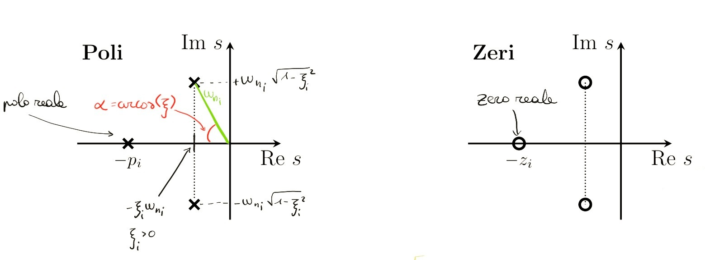

```{=latex}
\end{center}
```

#### Esempio 1

\
Dato il sistema: $$ \dot x_1 = -x_1 + x_2 $$ $$ \dot x_2 = -2x_2 + u $$ $$ y = x_2 $$ Allora 
\begin{equation*}
    \begin{aligned}
        G(s) &= C(sI-A)^{-1}B \\
        &= \begin{bmatrix} 0 & 1 \end{bmatrix} \begin{bmatrix} s+1 & -1\\ 0 & s+2\end{bmatrix}^{-1} \begin{bmatrix} 0 \\ 1 \end{bmatrix} \\
        &= \begin{bmatrix} 0 & 1 \end{bmatrix} \begin{bmatrix} \frac{s+2}{(s+1)(s+2)} & \frac{1}{(s+1)(s+2)} \\ 0 & \frac{s+1}{(s+1)(s+2)} \end{bmatrix} \begin{bmatrix} 0 \\ 1 \end{bmatrix} \\
        &= \frac{s+1}{(s+1)(s+2)} = \frac{1}{s+2}
    \end{aligned}
\end{equation*}

#### Esempio 2

\
Dato il sistema: $$ \dot x_1 = -x_1 -2x_2 + u $$ $$ \dot x_2 = 4x_2 $$ $$ y = x_1 $$ Trasformando entrambi i membri:
\begin{equation*}
    \begin{aligned}
        sX_{1}(s) - x_{1}(0) &= -X_{1}(s) -2X_{2}(s) + U(s) \\
        sX_{2}(s) - x_{2}(0) &= 4X_{2}(s) \\
        Y(s) &= X_{1}(s) 
    \end{aligned}
\end{equation*}
In alternativa calcolandola con $G(s) = C(sI-A)^{-1}B$ si ha $G(s)=\frac{s-4}{(s-4)(s+1)}=\frac{1}{s+1}$

## ANTITRAFORMAZIONE DI LAPLACE

Ricordiamo che la trasformata della risposta di un SLTI SISO è data da: $Y(s) = C(sI-A)^{-1} x(0) + G(s)U(s)$ con $C(sI-A)^{-1} \in \mathbb{R}^{1\times n}$. \
Inoltre sappiamo che si può far vedere che gli elementi di $C(sI-A)^{-1}$ sono rapporti di polinomi.\
Quindi ora si può scrivere: $$ Y(s)=\frac{N(s)}{D(s)} $$ con $N(s)$ e $D(s)$ polinomi opportuni.\
Ora si ricorda che per $x(0) = 0$ (cioè in risposta forzata) si ha: $$ Y(s) = G(s)U(s) $$ E applicando a quest'ultima una delta di Dirac $u(t)=\delta (t)$ (che ha traformata $U(s)=1$) si arriva ad avere: $$ Y(s)=G(s) $$ Indi per cui per la risposta all'impulso le radici di $D(s)$ sono i poli della funzione di traferimento.

#### Esempio di antitrasformazione tramite sviluppo di Heaviside

\
Data la risposta: $$ Y(s) = \frac{10(s+2)}{(s+1)(s+5)} $$ e mettiamo di volerla scrivere come: $$ Y(s) = \frac{10(s+2)}{(s+1)(s+5)} = \frac{r_1}{s+1}+\frac{r_2}{s+5} $$ con $r_1$, $r_2$ coefficienti.\
Calcolando l'antitrasformata: 
\begin{equation*}
    \begin{aligned}
        y(t) = \mathcal{L}^{-1}[Y(s)] &= \mathcal{L}^{-1}\left[\frac{r_1}{s+1}+\frac{r_2}{s+5}\right] \quad \quad \textrm{per linearità della trasformata}\\
        &= \mathcal{L}^{-1}\left[\frac{r_1}{s+1}\right] + \mathcal{L}^{-1}\left[\frac{r_2}{s+5}\right] \\
        &= r_1 \mathcal{L}^{-1}\left[\frac{1}{s+1}\right] + r_2 \mathcal{L}^{-1}\left[\frac{1}{s+5}\right] \quad \quad \textrm{ricordando le trasformate fondamentali} \\
        &= r_1 e^{-t} 1(t) + r_2 e^{-5t} 1(t)
    \end{aligned}
\end{equation*}
Ma come calcolare $r_1$ e $r_2$? \
Si sceglie un polo e si calcola la $Y(s)$ moltiplicata per il fatto che corrisponde al polo per la $s\rightarrow polo$. Nel nostro caso scegliamo $(s+1)$ quindi $polo = -1$: $$ (s+1)Y(s)\bigg|_{s=-1} = (s+1) \frac{10(s+2)}{(s+1)(s+5)}\bigg|_{s=-1} = \frac{10}{4} = \frac{5}{2} $$ $$ (s+1)Y(s)\bigg|_{s=-1} = (s+1)\frac{r_1}{s+1} + (s+1)\frac{r_2}{s+5} \bigg|_{s=-1} = r_1 $$ Allora $$ r_1 = (s+1)Y(s)\bigg|_{s=-1} = \frac{10(s+2)}{s+5}\bigg|_{s=-1} = \frac{5}{2} $$ Si fa lo stesso per $r_2$ e risulta: $$ r_2 = (s+5)Y(s)\bigg|_{s=-5} = \frac{10(s+2)}{s+1}\bigg|_{s=-5} = \frac{15}{2} $$ Riassumento: $$ Y(s) = \frac{5}{2}\frac{1}{s+1}+\frac{15}{2}\frac{1}{s+5} $$ $$ y(t) = \frac{5}{2} e^{-t}1(t)+\frac{15}{2}e^{-5t}1(t) $$

### SVILUPPO DI HEAVISIDE O IN FRATTI SEMPLICI

#### Caso 1: poli reali o complessi coniugati distinti (molteplicità 1)

\
\
Si può scrivere $Y(s)$ come: $$ Y(s) = \frac{N(s)}{D(s)} = \frac{N(s)}{\prod_{i=1}^{n} (s+p_{i})} = \sum_{i=1}^{n} \frac{r_i}{s+p_i} $$ Gli $r_i$ sono detti **_residui_**.\
Consideriamo: $$ (s+p_i)\frac{N(s)}{D(s)}\bigg|_{s=-p_{i}} = \sum_{\substack{j=1\\ j\ne i}}^{n}\frac{r_{j}(s+p_{i})}{s+p_{j}}\bigg|_{s=-p_i} + r_i $$ Quindi ciascun residuo $r_i$ può essere calcolato come $$ r_i = (s+p_{i})\frac{N(s)}{D(s)}\bigg|_{s=-p_{i}} $$ Infine, antitrasformando: $$ Y(s) = \frac{N(s)}{\prod_{i=1}^{n} (s+p_{i})} = \sum_{i=1}^{n} \frac{r_i}{s+p_i} $$ $$ y(t) = \mathcal{L}^{-1}[Y(s)] = \sum_{i=1}^{n}r_{i}\mathcal{L}^{-1}\left[ \frac{1}{s+p_{i}}\right] = \sum_{i=1}^{n}r_{i}e^{-p_{i}t}1(t) $$ **Osservazione**: $r_i$ reali se associati a poli reali, $r_i$ complessi coniugati se associati a poli complessi coniugati.\
\
È interessante notare, inoltre, la forma reale dei poli complessi coniugati trovati col procedimento precedente, quindi cosideriamo la coppia di poli complessi coniugati seguente: $$ p_{i,1} = \sigma _{i} + j\omega _{i} \quad \quad \quad \quad p_{i,2} = \sigma _{i} - j\omega _{i} $$ E i residui associati sono: $$ r_{i,1} = M_{i} e^{-j\varphi _{i}} \quad \quad \quad \quad r_{i,2}=M_{i} e^{j\varphi _{i}} $$ Quindi l'antitrasformata dei due termini associati è data da: 
\begin{equation*}
    \begin{aligned}
        \mathcal{L}^{-1}\left[\frac{r_{i,1}}{s+p_{i,1}}+\frac{r_{i,2}}{s+p_{i,2}}\right] &= M_{i}e^{-j\varphi _{i}}e^{-p_{i,1}t}1(t) + M_{i}e^{j\varphi _{i}}e^{-p_{i,2}t}1(t) \\
        &= M_{i}e^{-j\varphi _{i}}e^{-(\sigma _{i} + j\omega _{i})t}1(t) + M_{i}e^{j\varphi _{i}}e^{-(\sigma _{i} - j\omega _{i})t}1(t) \\
        &= M_{i}e^{-\sigma _{i} t} (e^{-j(\omega _{i} t + \varphi _{i})}+e^{j(\omega _{i} t + \varphi _{i})})1(t) \\
        &= 2M_{i}e^{-\sigma _{i} t} \frac{(e^{-j(\omega _{i} t + \varphi _{i})}+e^{j(\omega _{i} t + \varphi _{i})})}{2}1(t) \\
        &= 2M_{i}e^{-\sigma _{i} t}cos(\omega _{i} t + \varphi _{i})1(t)
    \end{aligned}
\end{equation*}
Da cui valgono le regole di divergenza e convergenza viste per i modi naturali:

* $-\sigma _{i}>0 \Longrightarrow e^{-\sigma _{i} t}cos(\omega _{i} t + \varphi _{i})$ diverge
* $-\sigma _{i}=0 \Longrightarrow e^{-\sigma _{i} t}cos(\omega _{i} t + \varphi _{i})$ rimane costante
* $-\sigma _{i}<0 \Longrightarrow e^{-\sigma _{i} t}cos(\omega _{i} t + \varphi _{i})$ converge 

#### Caso 2: poli reali o complessi coniugati multipli (molteplicità > 1)

\
\
Si può scrivere $Y(s)$ come: $$ Y(s) = \frac{N(s)}{D(s)} = \frac{N(s)}{\prod_{i=1}^{q} (s+p_{i})^{n_i}} = \sum_{i=1}^{q}\sum_{h=1}^{n_i} \frac{r_{i,h}}{(s+p_i)^h} $$ con $r_{i,h}$, $h=1,...,n_i$, residui del polo $-p_i$.\
Si consideri: 
\begin{equation*}
    \begin{aligned}
        (s+p_i)^{n_i}\frac{N(s)}{D(s)} &= \\
        &= (s+p_i)^{n_i} \sum_{\substack{j=1\\ j\ne i}}^{q}\sum_{h=1}^{n_j}\frac{r_{j,h}}{(s+p_j)^h}+\sum_{h=1}^{n_i}(s+p_i)^{n_i-h}r_{i,h} \\
        &= (s+p_i)^{n_i} \sum_{\substack{j=1\\ j\ne i}}^{q}\sum_{h=1}^{n_j}\frac{r_{j,h}}{(s+p_j)^h}+\sum_{h=1}^{n_i-1}(s+p_i)^{n_i-h}r_{i,h} + r_{i,n_i}
    \end{aligned}
\end{equation*}
Quindi il residuo $r_{i,n_i}$ è dato da: $$ r_{i,n_i} = (s+p_i)^{n_i}\frac{N(s)}{D(s)}\bigg|_{s=-p_i} $$ Derivando $(s+p_i)^{n_i}\frac{N(s)}{D(s)}$ si calcolano gli altri residui come: $$ r_{i,h} = \frac{1}{(n_i-h)!}\frac{d^{n_i-h}}{ds^{n_i-h}}\left[(s+p_i)^{n_i}\frac{N(s)}{D(s)}\right]\bigg|_{s=-p_i} $$ Antitrasformando la $Y(s)$ sviluppata in fratti semplici: $$ Y(s) = \frac{N(s)}{D(s)} = \frac{N(s)}{\prod_{i=1}^{q} (s+p_{i})^{n_i}} = \sum_{i=1}^{q}\sum_{h=1}^{n_i} \frac{r_{i,h}}{(s+p_i)^h} $$
\begin{equation*}
    \begin{aligned}
        y(t) = \mathcal{L}^{-1}[Y(s)] &= \sum_{i=1}^{q}\sum_{h=1}^{n_i}r_{i,h}\mathcal{L}^{-1}\left[\frac{1}{(s+p_i)^h}\right] \\
        &\textrm{ricordando le regole di antitrasformazione}\\
        &= \sum_{i=1}^{q}\sum_{h=1}^{n_i}r_{i,h}\frac{t^{h-1}}{(h-1)!}e^{-p_it}1(t)
    \end{aligned}
\end{equation*}
Si può dimostrare che per una coppia di poli complessi coniugati $$ \sigma _{i} + j\omega _{i} \quad \quad \textrm{e} \quad \quad \sigma _{i} - j\omega _{i} $$ con molteplicità $n_i$, il contributo elementare associato è dato da: $$ \sum_{h=1}^{n_i}2M_{i,h}\frac{t^{h-1}}{(h-1)!}e^{-\sigma _{i}t}cos(\omega _{i}t+\varphi _{i,h})1(t) $$ I modi naturali per un polo reale (multiplo) $-p_i$ è dato da: $$ \frac{t^{h-1}}{(h-1)!}e^{-p_{i}t}1(t) $$ Mentre per una coppia di poli complessi coniugati (multipli) $-(\sigma _{i} + j\omega _{1})$ e $-(\sigma _{i} - j\omega _{1})$ è dato da: $$ \frac{t^{h-1}}{(h-1)!}e^{-\sigma _{i}t}cos(\omega _{i}t+\varphi _{i,h})1(t) $$ Da qui le regole di convergenza sono le stesse viste per i modi naturali con molteplicità algebrica maggiore di quella geometrica.

#### Esempio di antitrasformazione tramite sviluppo di Heaviside: caso 2

\
Data la funzione: $$ Y(s) = \frac{s+1}{s(s+2)^2} $$ Si vuole scrivere come: $$ Y(s) = \frac{s+1}{s(s+2)^2} = \frac{r_1}{s}+\frac{r_{2,1}}{s+2}+\frac{r_{2,2}}{(s+2)^2} $$ Si calcola $r_1$: $$ r_1 = s\frac{s+1}{s(s+2)^2}\bigg|_{s=0} = \frac{1}{4} $$ Si procede calcolando $Y(s)(s+2)^2\bigg|_{s=-2}$: $$ Y(s)(s+2)^2\bigg|_{s=-2} = \begin{cases} (s+2)^2\frac{s+1}{s(s+2)^2}\bigg|_{s=-2} = \frac{1}{2} \\ (s+2)^2\frac{r_1}{s}+(s+2)^2\frac{r_{2,1}}{s+2}+(s+2)^2\frac{r_{2,2}}{(s+2)^2}\bigg|_{s=-2} = r_{2,2}\end{cases} \quad \Longrightarrow r_{2,2}=\frac{1}{2} $$ Ora manca solo $r_{2,1}$, per calcolarlo si nota che: $$ Y(s)(s+2)^2=(s+2)^2\frac{r_1}{s}+(s+2)^2\frac{r_2,1}{s+2}+r_{2,2} $$ $$ \frac{d}{ds}\left[Y(s)(s+2)^{2}\right]\bigg|_{s=-2} = \left[2(s+2)\frac{r_1}{s}-(s+2)^2\frac{r_1}{s^2}+r_{2,1}+0\right]\bigg|_{s=-2}=r_{2,1} $$ Quindi: $$ r_{2,1}=\frac{d}{ds}Y(s)(s+2)^2\bigg|_{s=-2}=\frac{d}{ds}\frac{s+1}{s}\bigg|_{s=-2}=-\frac{1}{4} $$ Quindi rimettendo insieme i pezzi: 
\begin{equation*}
    \begin{aligned}
        y(t)&=\mathcal{L}^{-1}[Y(s)] \\
        &=\mathcal{L}^{-1}\left[\frac{s+1}{s(s+2)^2}\right] \\
        &=\mathcal{L}^{-1}\left[\frac{r_1}{s}+\frac{r_{2,1}}{s+2}+\frac{r_{2,2}}{(s+2)^2}\right] \\
        &=r_{1}\mathcal{L}^{-1}\left[\frac{1}{s}\right]+r_{2,1}\mathcal{L}^{-1}\left[\frac{1}{s+2}\right]+r_{2,2}\mathcal{L}^{-1}\left[\frac{1}{(s+2)^2}\right] \\
        &=r_{1}1(t)+r_{2,1}e^{-2t}1(t)+r_{2,2}te^{-2t}1(t) \\
        &=\left(\frac{1}{4}-\frac{1}{4}e^{-2t}+\frac{1}{2}te^{-2t}\right)1(t)
    \end{aligned}
\end{equation*}

### RISPOSTA AD UN INGRESSO GENERICO

Ricordando che: $$ Y(s)=C(sI-A)^{-1}x(0)+G(s)U(s) $$ in cui $C(sI-A)^{-1}$, $G(s)$ e $U(s)$ sono rapporti di polinomi, si può affermare che: $$ y(t)=y_{\ell}(t)+y_f(t)=y_{\ell}(t)+y_{f,G}(t)+y_{f,U}(t) $$ nella quale: 

* $y_{\ell}(t)$ e $y_{f,G}(t)$ sono combinazioni lineari di modi naturali del sistema di matrici $A$, $B$, $C$ e $D$
* $y_{f,U}(t)$ è combinazione lineare di "modi" presenti nell'ingresso $u(t)$ (dovuti alle radici del denominatore di $U(s)$)

### RISPOSTE DI SISTEMI ELEMENTARI

Si ricordi che $$ G(s) = \frac{\rho\prod_{i} (s+z_i) \prod_{i} (s^2 + 2\zeta _{i} \alpha _{ni} s + \alpha _{ni}^2)}{s^g \prod_{i} (s + p_i) \prod_{i} (s^2 + 2\xi _{i} \omega _{ni} s + \omega _{ni}^2)} $$ Considerando il caso di poli distinti. Da quanto visto fin'ora risulta che per $x(0)=0$ (risposta forzata): $$ Y(s)=G(s)U(s)=\sum_{i}\frac{r_i}{s+p_i}+\sum_{i}\frac{a_is+b_i}{s^2+2\xi _i\omega _{n,i}s+\omega _{n,i}^2} $$ Viene da se che è importante studiare le risposte di sistemi elementari.

#### Esempio 1: risposta al gradino sistema del prim'ordine

\
Ricordando: $$Y(s)=G(s)U(s) $$ Si studi la risposta del sistema descritto dalla seguente $G(s)$: $$ G(s)=\frac{\mu}{1+Ts}=\frac{\mu}{T}\frac{1}{s+\frac{1}{T}} $$ Ponendo in ingresso: $$ u(t)=k1(t) $$ Trasformando la $u(t)$ si trova: $$ U(s)=\mathcal{L}[u(t)]=\mathcal{L}[k1(t)]=\frac{k}{s} $$ Quindi la risposta nel dominio di Laplace è: $$ Y(s)=G(s)U(s)=\frac{\mu}{T}\frac{1}{s+\frac{1}{T}}\frac{k}{s}=\frac{k\mu}{s(s+\frac{1}{T})}=\frac{r_1}{s}+\frac{r_2}{s+\frac{1}{T}} $$ Calcolando i residui: $$ r_1=sY(s)\bigg|_{s=0}=\frac{k\mu}{T}\frac{1}{s+\frac{1}{T}}\bigg|_{s=0}=k\mu $$ $$ r_2=\left(s+\frac{1}{T}\right)Y(s)\bigg|_{s=-\frac{1}{T}}=\frac{k\mu}{Ts}\bigg|_{s=-\frac{1}{T}}=-k\mu $$ Si arriva ad una risposta del tipo: $$ Y(s)=\frac{r_1}{s}+\frac{r_2}{s+\frac{1}{T}}=k\mu\frac{1}{s}-k\mu\frac{1}{s+\frac{1}{T}}=k\mu\left(\frac{1}{s}-\frac{1}{s+\frac{1}{T}}\right) $$ Antitrasformando: $$ y(t)=k\mu(1(t)-e^{-\frac{t}{T}}1(t))=k\mu(1-e^{-\frac{t}{T}})1(t) $$

### STABILITÀ ESTERNA o BIBO

Un sistema si dice BIBO (Bounded-Input Nuonded-Output) stabile se la sua uscita forzzata è limitata per ogni ingresso limitato.\
Consideriamo l'uscita forzata ($x(0)=0$): $$ Y(s)=G(s)U(s) $$ Da quanto visto fino ad ora con lo sviluppo di Heaviside si può dedurre che un sistema con funzione di trasferiment $G(s)$ è BIBO stabile se e solo se tutti i poli della $G(s)$ sono a parte reale strettamente minore di zero.

#### Esempio 1
\
Data la seguente $G(s)$ si dica se il sistema descritto da essa è BIBO stabile: $$ G(s)=\frac{r}{s+p} \quad \quad \quad \quad p > 0 $$ In ingresso si ha un rapporto di polinomi: $$ U(s)=\frac{N_U(s)}{D_U(s)} $$ Quindi:
\begin{equation*}
    \begin{aligned}
        Y(s)=G(s)U(s)&=\frac{r}{s+p}\frac{N_U(s)}{D_U(s)} \\
        &=\frac{r_1}{s+p}+\frac{\alpha}{D_U(s)}
    \end{aligned}
\end{equation*}
Il primo addendo antitrasformandolo si ottiene $r_1e^{-pt}1(t) \rightarrow 0,\quad t\rightarrow 0$ e il secondo è la traformata di un segnale limitato, quindi è limitata, indi per cui il sistema è BIBO stabile.

#### Esempio 2

\
Il sistema descritto da: $$ G(s)=\frac{r}{s} \quad \quad \quad \quad u(t)=1(t) $$ è BIBO stabile?\
Trasformando la $u(t)$ si ottiene: $$ U(s)=\frac{1}{s} $$ Da cui $$ Y(s)=G(s)U(s)=\frac{r}{s^2} $$ Che antitrsformando corrisponde a $$ y(t)=rt1(t) $$ che per $t\rightarrow 0$ diverge, quindi la risposta è no, il sistema sopra descritto NON è BIBO stabile.

### ESEMPIO IMPORTANTE

**Risposta al gradino di un sistema del II ordine**\
Date le seguenti equazioni: $$ u(t)=k1(t)\Longrightarrow U(s)=\frac{k}{s} \quad \quad \quad \quad G(s)=\mu\frac{\omega _{n}^2}{s^2 +2\xi\omega _{n}s+\omega _{n}^2} $$ $$ Y(s)=G(s)U(s)=\frac{k\mu\omega _{n}^2}{s(s^2 +2\xi\omega _{n}s+\omega _{n}^2)} $$ Con poli: $$ s_{p_{1,2}}=-\xi\omega _{n}\pm j\omega_{n}\sqrt{1-\xi ^2} $$ Per trovare la risposta nel dominio del tempo come prima cosa bisogna, innanzitutto, la $Y(s)$ come: $$ Y(s)=k\mu\omega _{n}^2 \left(\frac{r_1}{s}+\frac{r_{2,1}}{s+\xi\omega _{n}+j\omega _{n}\sqrt{1-\xi ^2}}+\frac{r_{2,2}}{s+\xi\omega _{n}-j\omega _{n}\sqrt{1-\xi ^2}}\right) $$ Successivamente si trovano i residui: $$ r_1=sY(s)\bigg|_{s=0}=\frac{1}{s^2 +2\xi\omega _{n}s+\omega _{n}^2}\bigg|_{s=0}=\frac{1}{\omega _{n}^2} $$
\begin{equation*}
    \begin{aligned}
        r_{2,1}&=Y(s)\left(s+\omega _{n}\xi+j\omega _{n} \sqrt{1-\xi ^2}\right)\bigg|_{s=-\xi\omega _{n}-j\omega _{n}\sqrt{1-\xi ^2}} \\
        &=\frac{s+\omega _{n}\xi+j\omega _{n} \sqrt{1-\xi ^2}}{s\left(s+\omega _{n}\xi-j\omega _{n} \sqrt{1-\xi ^2}\right)\left(s+\omega _{n}\xi+j\omega _{n} \sqrt{1-\xi ^2}\right)}\bigg|_{s=-\xi\omega _{n}-j\omega _{n}\sqrt{1-\xi ^2}} \\
        &= \frac{1}{\left(-\xi\omega _{n}-j\omega _{n}\sqrt{1-\xi ^2}\right)\left(-\xi\omega _{n}-j\omega _{n}\sqrt{1-\xi ^2}+\omega _{n}\xi-j\omega _{n} \sqrt{1-\xi ^2}\right)} \\
        &=\frac{1}{\left(-\xi\omega _{n}-j\omega _{n}\sqrt{1-\xi ^2}\right)\left(-2j\omega _{n} \sqrt{1-\xi ^2}\right)}\quad\frac{j}{j} \\
        &= \frac{j}{\left(-\xi\omega _{n}-j\omega _{n}\sqrt{1-\xi ^2}\right)2\omega _{n} \sqrt{1-\xi ^2}}\quad\frac{\left(-\xi\omega _{n}+j\omega _{n}\sqrt{1-\xi ^2}\right)}{\left(-\xi\omega _{n}+j\omega _{n}\sqrt{1-\xi ^2}\right)} \\
        &= \frac{\left(-\xi\omega _{n}+j\omega _{n}\sqrt{1-\xi ^2}\right)j}{\left(\xi ^2 \omega _{n}^2+\omega_{n}^2\left(1-\xi ^2\right)\right)2\omega _{n} \sqrt{1-\xi ^2}} \\
        &= \frac{\omega _{n}\left(-\sqrt{1-\xi ^2}-j\xi\right)}{\omega _{n}^2 2\omega _{n}\sqrt{1-\xi ^2}} \\
        &= \frac{-\sqrt{1-\xi ^2}-j\xi}{2\omega _{n}^2\sqrt{1-\xi ^2}} = \frac{1}{2\omega _{n}^2\sqrt{1-\xi ^2}}e^{j\psi}=Me^{j\psi}
    \end{aligned}
\end{equation*}
Si arriva a $r_{2,2}$ con lo stesso procedimento ottenendo che è il complesso coniugato di $r_{2,1}$: $r_{2,2}=\bar r_{2,1}$\
Ricordando (vedi dimostrazione a pag. 23): $$ \mathcal{L} ^{-1}\left[\frac{r_{i,1}}{s+p_{i,1}}+\frac{r_{i,2}}{s+p_{i,2}}\right] = 2M_ie^{-\sigma _i t}cos(\omega _{i}t+\varphi _i)1(t) $$ Si ha:
\begin{equation*}
    \begin{aligned}
        y(t)&=k\mu\omega _{n}^2 \left(\mathcal{L}^{-1}\left[\frac{r_1}{s}\right]+\mathcal{L}^{-1}\left[\frac{r_{2,1}}{s+\xi\omega _{n}+j\omega _{n}\sqrt{1-\xi ^2}}+\frac{r_{2,2}}{s+\xi\omega _{n}-j\omega _{n}\sqrt{1-\xi ^2}}\right]\right) \\
        &=k\mu\omega _{n}^2 \left(\mathcal{L}^{-1}\left[\frac{1}{\omega _{n}s}\right]+\mathcal{L}^{-1}\left[\frac{Me^{j\psi}}{s+\xi\omega _{n}+j\omega _{n}\sqrt{1-\xi ^2}}+\frac{Me^{-j\psi}}{s+\xi\omega _{n}-j\omega _{n}\sqrt{1-\xi ^2}}\right]\right) \\
        &=k\mu\omega _{n}^2\left[\frac{1}{\omega _{n}}+2Me^{-\xi\omega _{n}t}cos\left(\omega _{n}\sqrt{1-\xi ^2}+\psi\right)\right]1(t)
    \end{aligned}
\end{equation*}
\
È utile partire da questo esempio per definire il concetto di **sovraelongazione**: il valore massimo raggiunto dalla $y(t)$ rispetto alla $y_{\infty}$.\
Da qui viene la definizione di **sovraelongazione percentuale**: $$ S\% := \frac{y_{max}-y_{\infty}}{y_{\infty}} $$ E **solo** per i sistemi del II ordine può essere anche scritta come: $$ S\% = 100e^{-\frac{\pi\xi}{\sqrt{1-\xi ^2}}} $$ Un'altra definizione importante è quella di **tempo di assestamento**: tempo $T_{a,\epsilon}$ tale che $$ (1-0.01\epsilon)y_{\infty}\le y(t)\le (1+0.01\epsilon)y_{\infty} \quad \quad \quad \forall t \ge T_{a,\epsilon} $$ Approssimazioni utili per $T_{a,\epsilon}$ sono: $T_{a,5} \approx \frac{3}{\xi\omega _{n}} \quad \quad T_{a,1} \approx \frac{4.6}{\xi\omega _{n}}$
\newpage
Inoltre:

* $\xi$ è detto _coefficiente di smorzamento_
* $\omega _{n}$ è detta _pulsazione naturale_
* $\mu$ è detto _guadagno_

Dato un valore massimo di sovraelongazione $S^*$, dalle formule precedenti, si può ricavare il valore massimo del coefficiente di smorzamento $\xi$ per i sistemi del secondo ordine: $$ S\%\le S^* \Longrightarrow \xi \ge \frac{\left|\ln\left(\frac{S^*}{100}\right)\right|}{\sqrt{\pi ^2+\ln ^2\left(\frac{S^*}{100}\right)}} $$

```{=latex}
\begin{center}
```

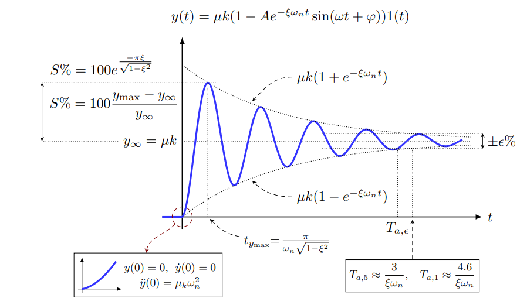{height=300px}

```{=latex}
\end{center}
```

```{=latex}
\begin{center}
```

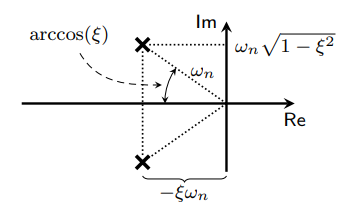

```{=latex}
\end{center}
```

### Luogo di punti a tempo di assestamento costante

Si ricordi che abbiamo approssimato  $T_{a,5} \approx \frac{3}{\xi\omega _{n}} \quad T_{a,1} \approx \frac{4.6}{\xi\omega _{n}}$, inoltre si è visto che $-\xi\omega _{n}$ è la parte reale dei poli complessi coniugati. Ne consegue che sistemi con poli complessi coniugati che hanno la stessa parte reale avranno una risposta al gradino con **stesso tempo di assestamento**.\
Sul piano complesso i luoghi dei punti a tempo di assestamento costante sono rette parallele all'asse immaginario.

```{=latex}
\begin{center}
```

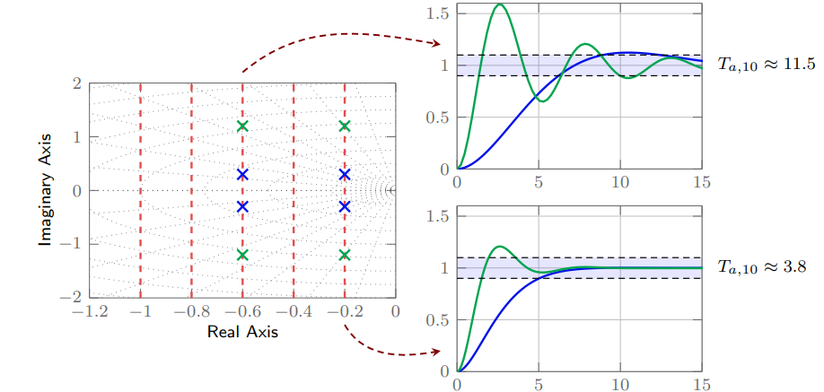{height=200px}

```{=latex}
\end{center}
```

### Luogo dei punti a sovraelongazione costante

Si ricordi che per i sistemi del secondo ordine $S\%=100e^{-\frac{\pi\xi}{\sqrt{1-\xi ^2}}}$, inoltre $arcos(\xi)$ è l'angolo formato con l'asse reale sul piano complesso. Si evince, quindi, che sistemi con stesso coefficiente di smorzamento avranno una risposta al gradino con **stessa sovraelongazione**.\
Sul piano complesso i luoghi dei punti a sovraelongazione costante sono semirette uscenti dall'origine.

```{=latex}
\begin{center}
```

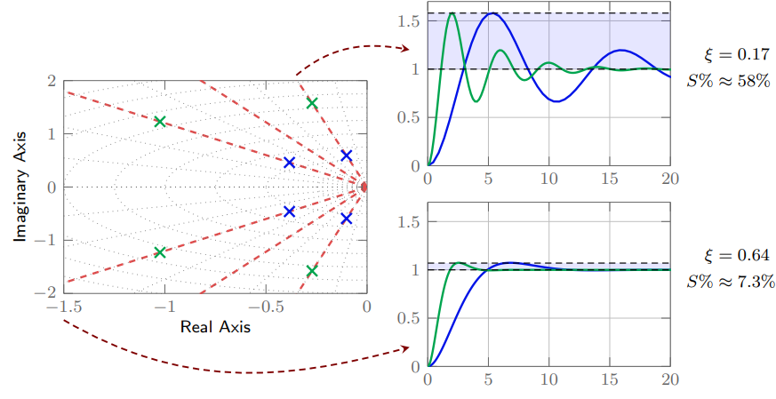{height=200px}

```{=latex}
\end{center}
```

### Mappatura di specifiche temporali nel piano complesso

Si vuole caratterizzare i sistemi del secondo ordine (con poli complessi coniugati) con $S\%\le S^*$ e, per esempio, $T_{a,5}\le T^*$. Tali specifiche sono, quindi, soddisfatte per: $\xi\ge\xi^*$ e $\xi\omega _{n} \ge\frac{3}{T^*}$. Quindi i poli complessi coniugati del sistema si devono trovare all'interno della zona colorata. 

```{=latex}
\begin{center}
```

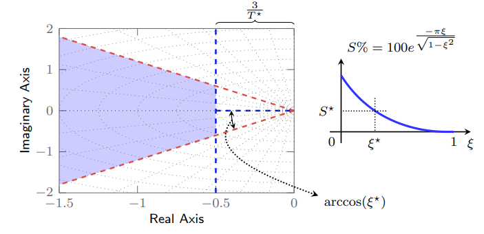{height=200px}

```{=latex}
\end{center}
```

### SISTEMI DEL SECONDO ORDINE CON POLI REALI

#### Caso $T_1 \ne T_2$, $T_1>T_2$

> Avendo $$ G(s)=\frac{\mu}{(1+T_1s)(1+T_2s)}\quad \quad \quad U(s)=\frac{k}{s} $$ Risulta $$ Y(s)=G(s)U(s)=\frac{k\mu}{s(1+T_1s)(1+T_2s)} $$ $$ \mu > 0, \quad k>0, \quad T_1>0, \quad T_2>0 $$ Antitrasformando si ottiene $$ y(t)=k\mu\left(1-\frac{T_1}{T_1-T_2}e^{-\frac{t}{T_1}}+\frac{T_2}{T1-T_2}e^{-\frac{t}{T_2}}\right)1(t) $$ $$ y(0)=0, \quad \dot y(t)=0, \quad \ddot y(0)=\frac{k\mu}{T_1T_2}, \quad y_{\infty}=k\mu $$ Da notare che i modi presenti sono $1(t)$ (dovuto all'ingresso), $e^{-\frac{t}{T_1}}$ e $e^{-\frac{t}{T_2}}$ (dovuti al sistema).

```{=latex}
\begin{figure}[!ht]
    \centering
    \includegraphics[width=0.3\linewidth]{sistIIordinePolR1.png}
    \includegraphics[width=0.3\linewidth]{sistIIordinePolR2.png}
    \label{Grafici corrispondenti all'esempio}
\end{figure}
```

#### Sistemi a polo dominante

Se nel precedente esempio considerassimo $T_1\gg T_2$, nella risposta $e^{-\frac{t}{T_2}}\rightarrow 0$ velocemente e $\frac{T_2}{T_1-T_2}\ll\frac{T_1}{T_1-T_2}\approx 1$, quindi $$ y(t)\approx k\mu\left(1-e^{-\frac{t}{T_1}}\right)1(t) $$

```{=latex}
\begin{center}
```

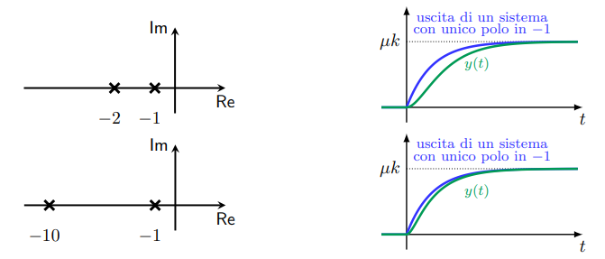{height=200px}

```{=latex}
\end{center}
```

#### Caso $T_1=T_2$ 

> Considerando $$ G(s)=\frac{\mu}{(1+T_1s)^2} \quad \quad \quad U(s)=\frac{k}{s} $$ Risulta $$ Y(s)=G(s)U(s)=\frac{k\mu}{s(1+T_1s)^2} $$ $$ \mu>0, \quad k>0, \quad T_1>0 $$ Antitrasformando $$ y(t)=k\mu\left(1-e^{\frac{t}{T_1}}-\frac{t}{T_1}e^{-\frac{t}{T_1}}\right)1(t) $$ Da notare che i modi presenti nel sistema sono $1(t)$ (dovuto all'ingresso), $e^{-\frac{t}{T_1}}$ e $te^{-\frac{t}{T_1}}$ (dovuti al sistema).

```{=latex}
\begin{center}
```

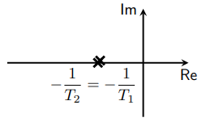{height=100px}

```{=latex}
\end{center}
```
\newpage
A questo punto si possono trarre delle conclusioni riguardo ai sistemi del secondo ordine con poli reali: 

* la risposta è monotòna
* se $T_1\gg T_2$ polo dominante allora il comportamento è simile a quello di un sistema del prim'ordine
* $\dot y(t)=0$ quindi continuità in zero anche della derivata prima
* $T_{a,\epsilon}$ funzione non semplice di $T_1$ e $T_2$

### SISTEMI DEL PRIM'ORDINE CON UNO ZERO

> Considerando $$ \mu\frac{1+\alpha Ts}{1+Ts} \quad \quad \quad U(s)=\frac{k}{s} $$ Risulta $$ Y(s)=G(s)U(s)=k\mu\frac{1+\alpha Ts}{s(1+Ts)} $$ $$ \mu >0,\quad k>0, \quad T>0 $$ Antitrasformando l'uscita $$ y(t)=k\mu\left(1+(\alpha -1)e^{-\frac{t}{T}}\right)1(t) $$ $$ y(0)=k\mu\alpha, \quad y_{\infty}=k\mu $$ Si noti che il grado relativo è zero (grado numeratore uguale al grado del denominatore) quindi c'è collegamento algebrico ingresso-uscita ($y(0)=k\mu\alpha\ne 0$).


```{=latex}
\begin{figure}[!ht]
    \centering
    \includegraphics[width=0.3\linewidth]{sist1ordineZero1.png}
    \includegraphics[width=0.3\linewidth]{sist1ordineZero2.png}
    \label{Grafici corrispondenti all'esempio sistemi del primo ordine con uno zero}
\end{figure}
```

### SISTEMI DEL SECONDO ORDINE CON POLI REALI E ZERO

Considerando $$ G(s)=\mu\frac{1+\tau s}{(1+T_1s)(1+T_2s)} \quad \quad \quad U(s)=\frac{k}{s} $$ $$ Y(s)=G(s)U(s)=k\mu\frac{1+\tau s}{s(1+T_1s)(1+T_2s)} $$ $$ \mu>0,\quad k>0,\quad T_1 >0,\quad T_2>0 $$ Antitrasformando $$ y(t)=k\mu\left(1-\frac{T_1-\tau}{T_1-T_2}e^{-\frac{t}{T_1}}+\frac{T_2-\tau}{T_1-T_2}e^{-\frac{t}{T_2}}\right)1(t) $$ $$ y(0)=0,\quad \dot y(0)=\frac{k\mu\tau}{T_1T_2},\quad y_{\infty}=k\mu $$ Si noti che il segno della derivata $\dot y(0)=\frac{k\mu\tau}{T_1T_2}$ dipende da $\tau$.
\newpage
Da qui si distinguono 3 casi: 

#### Caso $T_1 > T_2$, $\tau < 0$, sistemi a fase NON minima

> si ha sottoelongazione ($\dot y(0)=\frac{k\mu\tau}{T_1T_2} < 0$), il sistema risponde in "senso contrario" ($<0$) rispetto all'ingresso $>0$.

```{=latex}
\begin{figure}[!ht]
    \centering
    \includegraphics[width=0.3\linewidth]{sistIIordinePolZer1.png}
    \includegraphics[width=0.3\linewidth]{sistIIordinePolZer2.png}
    \label{Grafici esempio sistemi del 2 ordine con poli reali e 1 zero tau neg}
\end{figure}
```

#### Caso $\tau >T_1>T_2>0$, sistemi a fase minima (sovraelongazione)

> è presente una sovraelongazione tanto più accentuata quanto più lo zero è vicino all'origine (ovvero al crescere di $\tau$).

```{=latex}
\begin{figure}[!ht]
    \centering
    \includegraphics[width=0.3\linewidth]{sistIIordinePolZer3.png}
    \includegraphics[width=0.3\linewidth]{sistIIordinePolZer4.png}
    \label{Grafici esempio sistemi del 2 ordine con poli reali e 1 zero tau pos}
\end{figure}
```

#### Caso $\tau\approx T_1 \gg T_2$, sistemi a fase minima (code di assestamento)

> a causa della non perfetta cancellazione polo/zero ($\tau\approx T_1$) il modo "lento" $e^{-\frac{t}{T_1}}$ è presente e il suo transitorio si esaurisce lentamente.

```{=latex}
\begin{figure}[!ht]
    \centering
    \includegraphics[width=0.3\linewidth]{sistIIordinePolZer5.png}
    \includegraphics[width=0.3\linewidth]{sistIIordinePolZer6.png}
    \label{Grafici esempio sistemi del 2 ordine con poli reali e 1 zero tau circa t1}
\end{figure}
```
\newpage

### INTERCONNESSIONE SCHEMI A BLOCCHI

#### Serie

```{=latex}
\begin{center}
```

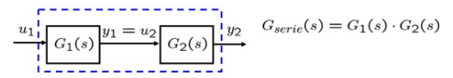{height=70px}

```{=latex}
\end{center}
```
\begin{equation*}
    \begin{aligned}
        Y(s)=G(s)U(s) \Longrightarrow Y_1(s)&=G_1(s)U_1(s) \\
        Y_2(s)&=G_2(s)U_2(s) \\
        &=G_2(s)Y_1(s)=G_2(s)G_1(s)U_1(s) \Longrightarrow G_{serie}(s)=G_1(s)G_2(s) \quad \blacksquare
    \end{aligned}
\end{equation*}

#### Parallelo

```{=latex}
\begin{center}
```

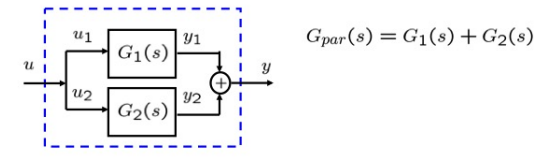{height=100px}

```{=latex}
\end{center}
```
\begin{equation*}
    \begin{aligned}
        Y(s)&=G_1(s)U(s)+G_2(s)U(s) \\
        &=(G_1(s)+G_2(s))U(s) \Longrightarrow G_{parallelo}(s)=G_1(s)G_2(s) \quad \blacksquare
    \end{aligned}
\end{equation*}

#### Retroazione negativa

```{=latex}
\begin{center}
```

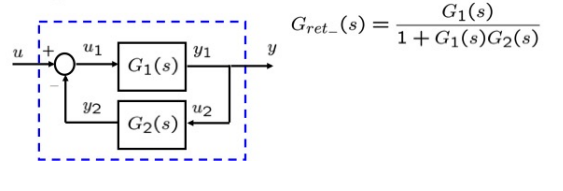{height=110px}

```{=latex}
\end{center}
```
\begin{equation*}
    \begin{aligned}
        Y(s)&=\left[U(s)Y_2(s)\right]G_1(s) \\
        &=\left[U(s)-Y(s)G_2(s)\right]G_1(s) \\
        &=\frac{G_1(s)}{G_2(s)G_1(s)+1}U(s) \Longrightarrow G_{retro-}(s)=\frac{G_1(s)}{1+G_1(s)G_2(s)} \quad \blacksquare
    \end{aligned}
\end{equation*}

\newpage

# RISPOSTA IN FREQUENZA

L'idea d'ora in poi sarà considerare ogni sistema come un filtro.

#### Esempio

\
Si calcoli l'uscita nel dominio del tempo del seguente sistema con il seguente ingresso $$ G(s)=\frac{\mu}{1+Ts} \quad \quad \quad \quad u(t)=Ucos(\omega t), \quad U>0 $$ Innanzitutto si trasforma la $u(t)$ (ricordando le trasformate fondamentali) $$ U(s)=\mathcal{L}[u(t)]=U\frac{s}{s^2+\omega^2} $$ Quindi l'uscita risulta $$ Y(s)=G(s)U(s)=\frac{\mu U s}{(1+Ts)(s^2+\omega ^2)}=\frac{\mu U}{T}\frac{s^2}{\left(s+\frac{1}{T}\right)(s^2+\omega ^2)} $$ Ora si scrive la $Y(s)$ come somma dei residui fratto i poli $$ Y(s)=\frac{r_1}{1+\frac{1}{T}}+\frac{r_u}{s-j\omega}+\frac{\bar r_u}{s+j\omega} \quad \quad \quad r_u=M_ue^{j\varphi _u}=|r_u|e^{jarg(r_u)} $$ Quindi la $y(t)$ risulta $$ y(t)=r_1e^{-\frac{t}{T}}1(t)+2M_ue^{-\sigma t}cos(\omega t+\varphi _u)1(t) $$ In questo esempio si ha $\sigma = 0$.\
Proseguendo $$ y(t)=r_1e^{-\frac{t}{T}}1(t)+2|r_u|cos(\omega t+arg\{r_u\})1(t) $$ Per $t\gg 0$ ($t\rightarrow \infty$): $$ y(t)\approx 2|r_u|cos(\omega t+arg\{r_u\})1(t) $$ Calcolando il residuo si arriva a $$ r_u=Y(s)(s-j\omega)\bigg|_{s=j\omega}=G(s)\frac{Us}{(s-j\omega)(s+j\omega)}(s-j\omega)\bigg|_{s=j\omega}=\frac{G(j\omega)Uj\omega}{2j\omega}=\frac{U}{2}G(j\omega) $$ Quindi la $y(t)$ risulta 
\begin{equation*}
    \begin{aligned}
        y(t)&=2\frac{|G(j\omega)|U}{2} cos(\omega t+arg\{G(j\omega)\})1(t) \\
        &=|G(j\omega)|Ucos(\omega t+arg\{G(j\omega)\})1(t)
    \end{aligned}
\end{equation*}

### RISPOSTA AD UN SEGNALE DI INGRESSO SINUSOIDALE

Dato un SLTI SISO con funzione di trasferimento $G(s)$ si vuole calcolare l'uscita in corrispondenza di un ingresso sinusoidale generico: $$ u(t)=Ucos(\omega t+\varphi) $$ Ricordando che $$ U(s)=U\frac{scos(\varphi)-\omega sin(\varphi)}{s^2+\omega ^2} $$ Quindi $$ Y(s)=G(s)U(s)=G(s)U\frac{scos(\varphi)-\omega sin(\varphi)}{s^2+\omega ^2} $$ Considerando $G(s)$ con poli distinti a parte reale negativa (BIBO stabile). Sviluppando in tratti semplici si ottiene
\begin{equation*}
    \begin{aligned}
        Y(s)&=\underbrace{\sum_{i=1}^{n}\frac{r_i}{s+p_i}}+\underbrace{\frac{r_u}{s-j\omega}+\frac{\bar r_u}{s+j\omega}} \\
        &= \quad Y_1(s) \quad + \quad \quad \ Y_2(s)
    \end{aligned}
\end{equation*}
Antitrasformando la $Y(s)$ si ha 
\begin{equation*}
    \begin{aligned}
        y(t)&=\mathcal{L}^{-1}\left[Y(s)\right] \\
        &=\underbrace{\sum_{i=1}^{n}r_ie^{-p_it}1(t)}+\underbrace{2|r_u|cos(\omega t+arg(r_u))1(t)} \\
        &= \quad \quad y_1(t) \quad \quad + \quad \quad \quad \quad \quad y_2(t)
    \end{aligned}
\end{equation*}
Poichè i poli della funzione di trasferimento sono a parte reale negativa, i contributi $e^{-p_it} sono tutti convergenti a zero. Pertanto $y_1(t)\rightarrow 0$ per $t\rightarrow \infty$.\
Mentre il residuo $r_u$ è dato da
\begin{equation*}
    \begin{aligned}
        r_u&=(s-j\omega)Y(s)\bigg|_{s=j\omega}= UG(j\omega)\frac{j\omega cos(\varphi)-\omega sin(\varphi)}{j\omega+j\omega} \\
        &= UG(j\omega)\frac{jcos(\varphi)-sin(\varphi)}{2j}=UG(j\omega)\frac{cos(\varphi)+jsin(\varphi)}{2}
    \end{aligned}
\end{equation*}
Ricordando che $e^{j\varphi}=cos(\varphi)+jsin(\varphi)$ si ha $$ r_u=UG(j\omega)\frac{e^{j\varphi}}{2}=\frac{U|G(j\omega)|}{2}e^{arg(G(j\omega))+\varphi} $$ dove si è scritto $G(j\omega)=|G(j\omega)|e^{arg(G(j\omega))}$.\
Antitrasformando $Y(s)$ si arriva a $$ y(t)=y_1(t)+U|G(j\omega)|cos(\omega t+\varphi+arg(G(j\omega))) $$ Ma si è visto che $y_1(t)\rightarrow 0$ per $t\rightarrow \infty$, quindi l'uscita $y(t)$ converge a $$ y_2(t)=U|G(j\omega)|cos(\omega t+\varphi+arg(G(j\omega))) $$ ovvero per $t$ sufficientemente grande si ha $$ y(t) \approx U|G(j\omega)|cos(\omega t+\varphi+arg(G(j\omega))) $$ Quanto trovato trova la sua generalizzazione nel seguente teorema.\
\
\
**Teorema**

> Se ad un sistema lineare tempo invariante con funzione di trasferimento $G(s)$ avente poli a parte reale negativa si applica l'ingresso sinusoidale $$ u(t)=Ucos(\omega t+\varphi) $$ l'uscita a transitorio esaurito è data da $$ y_2(t)=U|G(j\omega)|cos(\omega t+\varphi+arg(G(j\omega))) $$

### RISPOSTA A SEGNALI SVILUPPABILI IN SERIE DI FOURIER

In base a quanto visto per un ingresso sinusoidale e sfruttando il principio di sovrapposizione degli effetti per sistemi BIBO stabili si può dimostrare che per $t$ elevati $$ y(t)\approx Y_0+2\sum_{n=1}^{+\infty}|Y_n|cos\left(n\omega _0 t+arg(Y_n)\right) $$ con $$ \omega _0=\frac{2\pi}{T} \quad \quad \quad \quad Y_n=G(jn\omega _0)U_n \quad \quad n=0,1,... $$ $$ |Y_n|=|G(jn\omega _0)||U_n| \quad \quad arg\{Y_n\}=arg(U_n)+arg(G(jn\omega _0)) $$ \
_Osservazione_: $$ G(s)=\mu\frac{(1+\tau _1s)(1+\tau _2s)...}{(1+T_1s)(1+T_2s)...} $$ allora $$ G(0)=\mu $$ \
Tutto ciò può essere schematizzato come segue
```{=latex}
\begin{center}
```

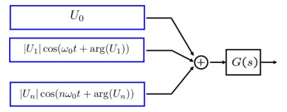{height=100px}

```{=latex}
\end{center}
```
E a $t$ sufficientemente elevati anche con
```{=latex}
\begin{center}
```

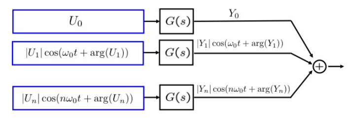{height=100px}

```{=latex}
\end{center}
```
\newpage

### RISPOSTA A SEGNALI DOTATI DI TRASFORMATA DI FOURIER

Dato un segnale non periodico dotato di trasformata di Fourier, si può anche scrivere come $$ u(t)=\frac{1}{2\pi}\int_{-\infty}^{+\infty} 2|U(j\omega)|cos(\omega t+arg(U(j\omega)))d\omega $$ con $$ U(j\omega)=\int_{-\infty}^{+\infty} u(t)e^{-j\omega t}dt $$ Ovvero l'ingresso è scomponibile come un'infinità non numerabile di armoniche con valori di $\omega$ reali maggiori o uguali a $0$.\
Quindi se il sistema è BIBO stabile per $t$ elevati $$ y(t)\approx \frac{1}{2\pi}\int_{-\infty}^{+\infty} 2|Y(j\omega)| cos(\omega t+arg(Y(j\omega)))d\omega $$ con $$ Y(j\omega)=G(j\omega)U(j\omega) $$

## RISPOSTA IN FREQUENZA

La funzione complessa $G(j\omega)$ ottenuta valutando $G(s)$ in $s=j\omega$ è detta **risposta in frequenza**. Il concetto di risposta in frequenza viene esteso anche a sistemi non asintoticamente stabili.\
Per un certo valore di $\omega$, $G(j\omega)$ è un numero complesso 
```{=latex}
\begin{center}
```

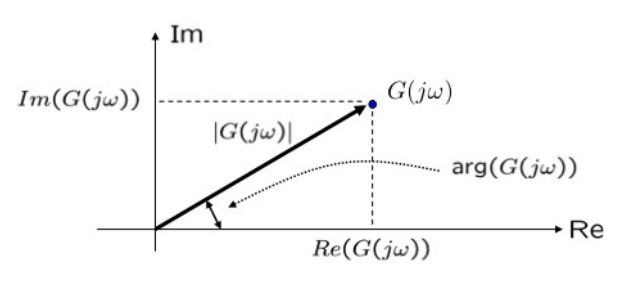{height=130px}

```{=latex}
\end{center}
```
Nel caso in cui la risposta in frequenza non sia nota si possono sfruttare i risultati precedenti per ricavarla sperimentalmente.\
Si vedrà in seguito che dalla rappresentazione grafica di $G(j\omega)$ sarà possibile ricavare: guadagno statico, poli e zeri della funzione di trasferimento $G(s)$.\
Uno dei modi più utilizzati per rappresentare la $G(j\omega)$ sono i **diagrammi di Bode** in cui si rappresentano separatamente modulo ($|G(j\omega)|$) e fase ($arg(G(j\omega))$) in funzione di $\omega$.

### DIAGRAMMI DI BODE

