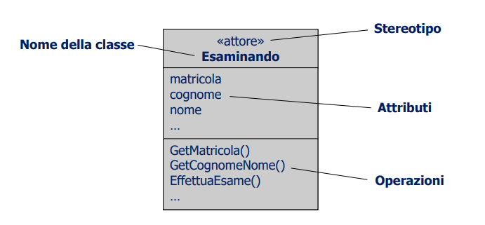
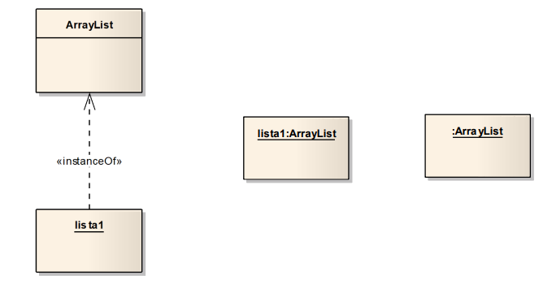

\
\
\

```{=latex}
\begin{center}
```


```{=latex}
\end{center}
```
\newpage

## Recupera lezioni precedenti

# INTRODUZIONE

## FATTORI DI QUALITÀ DEL SOFTWARE

Costruire software con caratteristiche di qualità non significa solo produrre codice che funziona ma anche dare risposta a due domande fondamentali:

* è stata costruita la cosa giusta? (**validazione**)
* il prodotto è stato costruito nel modo giusto? (**verifica**)

Il processo di revisione può avvenire a prodotto costruito o in itinere e secondo approcci _black box_ o a _white box_.\
\
Le **qualità esterne percepibili** da un osservatore esterno, ad esempio l'utente finale, che esamina il prodotto software come se fosse una **black box**: 

* Affidabilità
* Facilità d'uso
* Velocità
* ...

Le qualità esterne devono essere garantite.\
\
Le **qualità interne** sono osservabili esaminando la struttura interna del prodotto software, come se questo fosse una scatola trasparente (**white box**):

* Modularità
* Leggibilità
* ...

Questo tipo di qualità influenzano e sono un modo per realizzare le qualità esterne.

### CARATTERISTICHE ESTERNE

#### CORRETTEZZA (correctness)

\
Data una definizione dei requisiti software che deve soddisfare si dice corretto se rispetta tali requisiti. I requisiti specificati risultano spesso incompleti risoetto ai requisiti reali, per questo è molto importante essere esautisvi nelle specifiche, a scanso di equivoci.

#### ROBUSTEZZA (robustness)

\
Il software si dice **robusto** se si comporta in maniera accettabile anche in corrispondenza di situazioni anomale e comunque non specificate nei requisiti.\
Nel caso di situazioni anomale il software non deve causare danni (perdita dati o peggio): o termina l'esecuzione in modo pulito, o entra in modalità particolare, in cui non sono più attive alcune funzionalità (graceful degradation mode)

#### AFFIDABILITÀ (reliability)

\
Il software si dice affidabile se:

* Le funzionalità offerte corrispondono ai requisiti (il software è corretto)
* in caso di guasto non produce danni fisici o economici (il software è robusto)

$$ \textrm{Affidabilità} = \textrm{Correttezza} + \textrm{Robustezza} $$

#### FACILITÀ D'USO (ease of use)

\
Facilità con cui l’utilizzatore del software è in grado di:

* Imparare ad usare il sistema
* Utilizzare il sistema
* Fornire i dati da elaborare
* Interpretare i risultati
* Gestire condizioni di errore

#### EFFICIENZA (efficiency)

\
Buon utilizzo delle risorse hardware:

* Processori (tempo di calcolo)
* Memoria principale (occupazione di memoria)
* Memorie secondarie
* Canali di comunicazione

### QUALITÀ INTERNE

#### ESTENSIBILITÀ (extensibility)

\
Facilità con cui il software può essere modificato per soddisfare nuovi requisiti. La modifica di programmi di piccole dimensioni non è un problema serio, la modifica di programmi di grandi dimensioni invece sì.\
Infatti i sistemi software di dimensioni medie e grandi possono soffrire di fragilità strutturale: modificando un singolo elemento della struttura si rischia di far collassare l'intera struttura.\
Ci sono 2 principi cardine:

* Semplicità architetturale: più l'architettura è semplice più è facile da modificare
* Modularità e decentralizzazione: più il sistema è suddiviso in moduli autonomi più è facile che una modifica coinvolga un numero limitato di moduli

#### RIUSABILITÀ (reusability)

Il software è riusabile se può essere riutilizzato completamente o in parte in nuove applicazioni. Ciò permette di non dover reinventare soluzioni a problemi già affrontati e risolti. Influenza tutte le altre caratteristiche dei prodotti software.

#### VERIFICABILITÀ (verifiability)

\
Facilità con cui il prodotto software può essere sottoposto a **test**.

#### PORTABILITÀ (portability)

\
Facilità con cui il prodotto software può essere trasferito su altre architetture hardware e/o software.\
\
\
Molte caratteristiche sono definibili soltanto in maniera intuitiva e poco rigorosa. Alcune caratteristiche sono in contrapposizione fra loro (ad esempio efficienza e portabilità), l'importanza dell'una e dell'altra varia o può variare a seconda del settore applicativo. Conseguentemente il costo del software aumenta enormemente se è richiesto un livello molto alto di una qualunque di tali caratteristiche.\
\
**N.B.**: l'efficienza è in contrapposizione con ogni caratteristica interna, il lavoro dell'ingegnere è bilanciare tutto.

# PRINCIPI E CONCETTI OBJECT-ORIENTED

Si passa da avere un caos iniziale dovuto da confusione nel flusso di controllo e nell'accesso ai dati oppure all'utilizzo di variabili globali, ad avere una programmazione più strutturata grazie a l'introduzione dei concetti di sequenza, ripetizione e alternativa e, successivamente, a concetti che definiscono la qualità del software, la leggibilità e modificabilità.

## ADT 

In seguito si passa alla programmazione basata sugli oggetti, fondata sugli ADT (Abstract Data Type) composti da dati e codice che opera su questi dati: interfaccia (visibile) ed implementazione (nascosta). Lo stato di un oggetto è accessibile solo mediante l'interfaccia del suo ADT. Viene quindi definito il principio teorico dell'**information hiding** e viene reso un concetto pratico tramite una tecnica di utilizzo detta **incapsulamento**.\
L'information hiding è utile perchè permette di modificare l'implementazione interna (solitamente per migliorarla) senza che l'utente finale se ne accorga.\
Ricorda la differenza fra interfaccia e classe astratta: l'interfaccia descrive solo il comportamento che deve avere una classe che la implementa, mentre la classe astratta è stata pensata quando il programmatore non vuole che si possano creare oggetti di tale classe.\
Se una classe ha un metodo astratto allora è astratta ma non è vero che una classe è astratta solo perchè ha almeno un metodo astratto.\
\
Per **definire** un ADT occorre definire un'interfaccia (interface): un'insieme di operazioni pubbliche applicabili ai singoli oggetti di quel tipo.\
Per **implementare** un ADT occorre definire una classe (class) che implementa l'ADT: un insieme di attributi privati (implementazione della struttura dati specifica), di metodi pubblici (implementazione dell'interfaccia) e di metodi privati che accedono in esclusiva a tali attributi.\

### INFORMATION HIDING

Un ADT nasconde ai suoi utilizzatori (clienti) tutti i dettagli della struttura interna e del suo funzionamento interno.\
L'obiettivo è nascondere le scelte progettuali (spesso soggette a cambiamenti) in modo da proteggere le parti del programma (i clienti dell'ADT) da eventuali cambiamenti di tali scelte.\
I vantaggi sono:

* minimizzare delle modifiche da fare durante le fasi di sviluppo e di manutenzione
* aumento delle possibilità di utilizzo

In più questa è una tecnica applicabile a tutti i livelli:

* singoli attributi membro di una classe
* singoli componenti del sistema
* ...

#### Parentesi C#

In C# esistono le proprietà. Una proprietà ha la sintassi di un attributo ma ha la semantica di un'operazione.

```cs
public class Timer // in C#
{
    private int _count;
    ...
    public int Count
    {
        get
        {
            return _count;
        }
        set
        {
            if(value < 0)
            throw new ArgumentException("value < 0");
            _count = value;
        }
    }
    ...
}

Timer x = new Timer();
...
x.Count++;
```

### ADT LISTA DI INTERA

Interfaccia:

* `Add(int item)`{.cs}
* `Insert(int index, int item)`{.cs}
* `Remove(int item)`{.cs}
* `RemoveAt(int index)`{.cs}

Implementazione:

* Array
* Linked list
* ...

```{=latex}
\begin{figure}[!ht]
\centering
\includegraphics[width=0.35\linewidth]{LL1.png}
\includegraphics[width=0.5\linewidth]{LL2.png}
\caption{Linked list}
\label{fig_turbulent_wake_vehicles}
\end{figure}
```

## OGGETTI E CLASSI

### OGGETTI

Ogni **oggetto** è identificabile in modo univoco (ha la sua identità), ha un insieme di attributi, ha uno stato (insieme dei valori associati ai suoi attributi), ha un insieme di operazioni che operano sullo stato e forniscono servizi ad altri oggetti, ha un comportamento e interagisce con altri oggetti.

### CLASSI

Gli oggetti sono raggruppabili in classi. Ogni **classe** descrive oggetti con caratteristiche comuni cioè con stessi attributi e stesse operazioni.\
A _compile time_ ogni classe definisce l'implementazione di un tipo di dato astratto.\
A _run time_ ogni oggetto è un'istanza di una classe.\
Un'istanza è un particolare oggetto di una determinata classe e quindi di un particolare tipo. Ogni istanza è separata dalle altre, ma condivide le sue caratteristiche generali con altri oggetti della stessa classe.

## NOTAZIONE UML

```{=latex}
\begin{center}
```

{height=170px}

```{=latex}
\end{center}
```

La **prima sezione** contiene:

* il nome della classe (in grassetto + in corsivo se astratta)

può contenere

* lo stereotipo della classe (ad esempio controllore, attore, evento, tabella ecc)
* il nome del pacchetto (package, namespace, ad esempio `Quizzer::Esaminando`{.cs})

La **seconda sezione** contiene:

* gli attributi

La **terza sezione** contiene:

* le operazioni (in corsivo se astratte)

Per l'implementazione delle interfacce la sitassi è la seguente.

```{=latex}
\begin{figure}[!ht]
\centering
\includegraphics[width=0.35\linewidth]{uml2.png}
\includegraphics[width=0.5\linewidth]{uml3.png}
\caption{Linked list}
\label{La seconda solo se ho già descritto le interfacce da un'altra parte}
\end{figure}
```

La rappresentazione di un oggetto istanza di una classe si può fare in 3 modi, i seguenti:

```{=latex}
\begin{center}
```

{height=150px}

```{=latex}
\end{center}
```

## PROGRAMMAZIONE ORIENTATA AGLI OGGETTI

