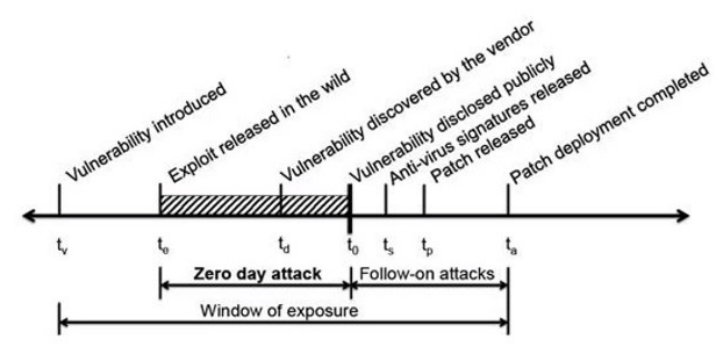
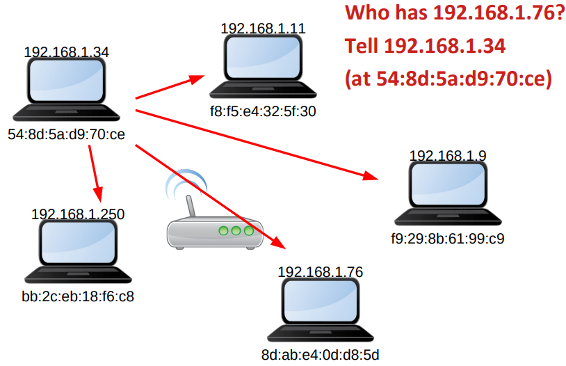

\
\
\
```{=latex}
\begin{center}
```


```{=latex}
\end{center}
```

\newpage

# OFFENSIVE SECURITY

## Il ciclo di vita della vulnerabilità

```{=latex}
\begin{center}
```

{#uno height=200px}

```{=latex}
\end{center}
```

I periodi più critici per la sicurezza sono la finestra degli zero day attack, perchè il produttore del software non sa che esiste questa vulnerabilità, e la finestra dei follow-on attacks perchè dopo la pubblicazione della vulnerabilità molti più attaccanti ne sono a conoscenza.

Qualche definizione:

* Vulnerabilità zero day: una vulnerabilità sconosciuta a coloro che dovrebbero essere interessati a mitigarla. 
* Finestra di opportunità: tempo trascorso da quando il primo exploit del software diventa attivo al momento in cui il fornitore interessato rilascia una patch e viene applicata
* Attacco zero-day:  un attacco che si verifica durante la finestra di opportunità, questa finestra nel 2005 durava in media 54 giorni, dal 2014 è cresciuta ad un anno
* Gli attacchi si intensificano dopo la finestra, perché tutti vengono a conoscenza della vulnerabilità, tipicamente scansioni massicce iniziano dopo 15 minuti dalla pubblicazione della CVE

La comunità pubblica le vulnerabilità scoperte secondo un principio di responsible disclosure su diversi siti:

- Common Vulnerabilities and Exposures http://cve.mitre.org/
- National Vulnerability Database http://nvd.nist.gov/
- Open Sourced Vulnerability Database http://osvdb.org/
- SecurityFocus http://www.securityfocus.com/vulnerabilities
- US-CERT http://www.kb.cert.org/vuls/

Esistono anche iniziative per cercare le vulnerabilità attivamente:

- Google project zero
- Programmi di bug bounty che le pagano profumatamente (es. Zerodium)

Ed esistono database pronti per sfruttarle:

- https://www.cvedetails.com/
- https://www.exploit-db.com/
- https://packetstormsecurity.com/

La maggior parte dell vulnerabilità stanno "fra la tastiera e la sedia" (il programmatore) ma ce ne possono essere anche nelle periferiche, sistema operativo, applicativi vari o interfacce I/O.

```{=latex}
\begin{center}
```

{#uno height=200px}

```{=latex}
\end{center}
```

## OFFENSIVE SECURITY

Consiste nel porsi nel ruolo degli attaccanti e verificare l'esistenza di vulnerabilità, stimare con precisione l'impatto degli attacchi e testare l'efficacia delle contromisure.\
\
Reconnaissance = primo anello della killchain (https://attack.mitre.org/tactics/TA0043/)\
\
Si usano le stesse tecniche degli attaccanti, il problema è che attaccare sistemi informatici è reato!\
Bisogna farlo solo sotto uno preciso contratto e avere il permesso di farlo.\
Il problema è che ci possono essere conseguenze legali e soprattutto effetti imprevisti, che potrebbero essere anche fatti in buona fede, per di più si possono verificare su reti attraversate per raggiungere l'obiettivo lecito.\
Si potrebbe, inoltre, inciampare in un tipo di difesa che contrattacca e quindi si rischia di subire danni ai propri dati o alla propria rete.

## TESTING

A questo punto il testing dei sistemi diventa fondamentale per verificare se sono sfuggite delle vulnerabilità e se il sistema è esposto a rischi nuovi rispetto al momento della progettazione. Tuttavia non si può dimostrare la totale assenza di problemi, si può solo tentare di sollecitare il sistema nel modo più completo possibile per trovare eventuali problemi esistenti.\
Esistono 3 livelli di approfondimento dei test:

1. Vulnerability Assessment (VA)
2. Penetration Testing (PT)
3. Red Team Operations (RTO)

## VA $\longrightarrow$ PT

I test di **Vulnerability Assessment** trovano solo le vulnerabilità note, non procede oltre: sfruttando una vulnerabilità si potrebbe accedere a una vista più interna e approfondita del sistema, svelandone altre.\
In più i VA test sono considerano la specificità del sistema. A volte, infatti, si verificano dei falsi positivi ad esempio i servizi che dichiarano una versione vulnerabile ma sono stati corretti.\
Mentre il **Penetration Testing** è un tipo di test dove il tester (umano) avanza fin dove può, sfruttando le vulnerabilità per mezzo di exploit. Il PT è più realistico, porta ad un report più dettagliato ma molto più RISCHIOSO.

## PENETRATION TESTING

I punti di partenza per il Penetration Testing sono:

* **Valutazione del target**: vengono stabilite le regole di ingaggio e c'è la mappatura, prioritizzazione e tracciamento dei confini
* **Postura e visibilità**: gli attacchi ciechi possono sembrare più realistici, ma fanno solo perdere tempo al tester esperto che è meglio spendere sui dettagli veramente nascosti. Ad esempio se è semplice accedere a determinate informazioni magari si danno queste informazioni al tester e gli si chiede di andare a scovare le vulnerabilità davvero nascoste.
* **Protezione del bersaglio**: dove possibile viene creata una replica per evitare di danneggiare il bersaglio ma alcuni sistemi sono semplicemente troppo complessi oppure altri sono troppo critici per rischiare di perdere qualche dettaglio nella replica che potrebbe alterare il test

### Metodolodie

Seguire una metodologia consente di assicurarsi che il test sia coerente e ripetibile, in più consente di eseguire una misurazione accurata della sicurezza.\
Esistono alcune metodologie generalmente accettate:

* **Open Source Testing Methodology Manual** (OSSTMM): consente a qualsiasi tester di sicurezza di fornire idee per eseguire i test di sicurezza più accurati ed efficienti. Consente la libera diffusione delle informazione e delle proprietà intellettuale.
* **Open Web Application Security Project** (OWASP): specifico per web app
* **Payment Card Industry Data Security Standard** (PCI DSS): per il settore finanziario (la sezione 11.3 riguarda il pentesting)
* **Technical Guide to Information Security Testing and Assessment** (NIST800-115): uno standard ufficiale del governo USA
* **Information Systems Security Assessment Framework** (ISSAF): completo ma non sviluppato attivamente

### Preparazione

La preparazione avviene in 2 fasi:

1. Reconnaissance: raccolta di informazioni utili, estensione del perimetro dei test e preparazione degli strumenti.\
2. Enumeration: delimitazione del perimetro di test e verifica puntuale delle risorse e delle loro proprietà

#### OSINT

sta per Open Source INTelligence e consiste nell'uso di qualsiasi fonte pubblicamente disponibile oer ricavare informazioni su di uno specifico obiettivo. È importante specificare che si tratta di un campo di applicazione più ampio rispetto alla cybersecurity.\
OSINT su altri è una componente della threat intelligence e dell'incident response. Mentre OSINT su se stessi si può scoprire che cosa possono a loro volta scoprire gli avversari e come possono essere usate quelle informazioni.\
È legale ma attenzione alle aree grigie.\
Ci sono strumenti online per fare OSINT: https://osintframework.com/ 
\newpage
Ad esempio per misurare l'esposizione dell'infrastruttura:

* collocazione fisica
    - geolocation
    - rilevazione di indirizzi da documenti e pagine web
* collocazione in rete:
    - domini DNS associati all'obiettivo
    - range di IP
    - provider di connettività e autonomous systems
    - certificati X.509
* accesso ai servizi
    - porte raggiungibili
    - fingerprint dei sistemi $\rightarrow$ anche notoriamente vulnerabili
    - username validi $\rightarrow$ anche relative password

Ogni host bersaglio ha un IP, i blocchi di IP sono assegnati dallo IANA ai RIR (https://www.iana.org/numbers), i RIR sub-allocano ai LIR, tenendo traccia di chi è l'effettivo responsabile di ogni blocco.\
Oltre agli IP sono molto utili i DNS, è sempre lo IANA che coordina la concessione dei Top Level Domains (https://www.iana.org/domains/root/db), mentre innumerevoli *registrar* si occupano della registrazione dei domini di secondo livello.

### Raccolta di informazioni

#### DNS

\
I record DNS possono svelare:

* gli IP registrati dall'obiettivo
* l'esistenza e la collocazione di specifici server applicativi
* l'esistenza di sottoreti non direttamente raggiungibili
* alias per sistemi collocati al di fuori del perimetro dell'obiettivo come risorse cloud o sistemi legati da relazioni di fiducia (ad esempio domini di una foresta di Active Directory)

Questo consente un notevole risparmio di tempo rispetto al brute forcing.\
Questo tipo di pratica può essere resa platealmente più semplice se è stato abilitato il domain transfer, mentre è semplificata, ma non eccessivamente, se vi sono dei rimasti dei record rimossi all'interno della cache del DNS.\
Esistono diversi strumenti per:

* lookup di base: `host`, `dig`, `nslookup`
* strumenti di ricerca che includono guessing e brute force: `dnsenum`, `dnsmap`, `dnsrecon`, `fierce`

#### Indirizzi IP

\
Come noto, un indirizzo IP è composto da 32 bit divisi in 4 byte normalmente rappresentati in base 10 e separati da punti (ad es. `192.168.0.1`).\
Ogni indirizzo fa parte di una rete che inizia con un indirizzo detto di _network_. Originariamente l'estensione era implicita, ora è specificata da una netmask: una subnet logica coincide con una LAN fisica, per instradare un pacchetto verso la destinazione non serve considerare il suo indirizzo ma basta la subnet a cui appartiene.
\newpage
In origine erano state definite delle _classi_ di indirizzi, ovvero dei raggruppamenti da usare per sistemi di una rete locale, in cui i byte erano rigidamente divisi in _network id_e _host id_:

* 128 reti di **classe A** (contenenti 16 Mln di host circa): da `0.*.*.*` a `127.*.*.*`
* 16.384 reti di **classe B** (contenenti 65.000 host circa): da `128.0.*.*` a `191.255.*.*`
* 2.097.152 reti di **classe C** (contenenti fino a 254 host): da `192.0.0.*` a `223.255.255.*`

Gli indirizzi da `224.*.*.*` a `239.*.*.*` sono riservati al _multicast_.\
Gli indirizzi da `240.*.*.*` a `255.*.*.*` sono riservati ad usi futuri.\
Tuttavia seguendo questo metodo di divisione degli indirizzi avendo poche classi e di dimensioni fissati si ha uno spreco di indirizzi. La soluzione a questo problema è utilizzare il CIDR (Classless Inter-Domian Routing). Con questo tipo di soluzione gli indirizzi sono visti come una stringa di 32 bit divisa in net-id e host-id in un punto arbitrario, anzichè per byte. L'unico vero vincolo (ovvio) sta nella dimensione di una rete che, necessariamente, è potenza di 2. Con i classless-IP quindi, una rete locale è identificata da un _network address_ e da una _netmask_ noti a tutti gli host che ne fanno parte.\
Serve quindi un modo per specificare dove cade la divisione delle reti. Si sa che la netmask è un valore di 32 bit composta da tanti 1 quanti sono i bit che identificano una subnet, seguiti da tanti 0 quanti sono i bit che specofocano l'host al suo interno.\
Due valori di ogni subnet hanno un significato speciale e non possono essere usati per indirizzare un host:

* Network address (ottenuto mettendo a 0 tutti i bit dell'host-id)
* Broadcast (ottenuto mettendo a 1 tutti i bit dell'host id)

Ad esempio:

> Volendo partire dall'indirizzo `144.156.166.151/26` si ha che i bit riservati agli host di questa rete sono 6 e quelli della subnet sono 26. Quello specificato è uno solo dei $2^6=64$ indirizzi disponibili:
>
>* $144\longrightarrow 10010000$
>* $156\longrightarrow 10011100$
>* $166\longrightarrow 10100110$
>* $151\longrightarrow 10010111$
>
> Quindi l'indirizzo in binario è: `10010000.10011100.10100110.10010111`\
> Di cui il net-id è: `10010000.10011100.10100110.10`\
> L'host-id è: `010111`\
> La subnet mask è: `11111111.11111111.11111111.11000000` (26 bit di net-id a 1 e 6 bit di host-id a 0)\
> Il net-address è: `10010000.10011100.10100110.10000000` (i 6 bit dell'host-id a 0)\
> Il broadcast è: `10010000.10011100.10100110.10111111` (i 6 bit dell'host-id a 1).

La conoscenza, quindi, dei dettagli organizzativi o di pochi IP validi può permettere di espandere la conoscenza agli interi blocchi allocati all'obiettivo ed ad altri blocchi non evidentemente collegati.\
\
Ogni dispositivo su internet ha un IP (è quello usato da qualsiasi applicazione che affida il traffico allo stack di rete del sistema operativo) ma il trasporto fisico avviene sulla LAN, dove i dispositivi si riconoscono dal MAC address, la traduzione da un indirizzo all'altro avviene tramite ARP (Address Resolution Protocol).

```{=latex}
\begin{center}
```

{#uno height=200px}

```{=latex}
\end{center}
```

### ENUMERAZIONE

#### Host

\
Una volta individuati i blocchi di indirizzi da analizzare si procede con l'individuare gli host effettivamente attivi (live host). Si può fare in diversi modi:

* Tramite `ping`: 1 indirizzo per volta, potrebbe essere bloccato da router o firewall oppure potrebbe essere ignorato dai singoli hostà
* Scansioni massive tramite `masscan`
* Su rete locale con più strumenti: gli host potrebbero ignorare le richieste IP per questo si può fare sniffing passivo (tramite `wireshark`, `tshark`, `tcpdump`) oppure si può utilizzare `arping` per mandare richieste ARP

#### Servizi

\
Determinati gli host raggiungibili si cercano le porte aperte: le due fasi potrebbero collassare in una sola se si sospetta che gli host ignorino i ping, infatti il test di vitalità sarebbe fatto direttamente sondando le porte.\
Il tool più diffuso per la scansione contemporanea di indirizzi e porte è `nmap`: offre un set predefinito di porte "più popolari", è possibile effettuare diversi tipi di scansione e fa anche un fingerprinting del sistema operativo e delle versioni dei servizi.\
Un altro tool molto utile è `unicornscan`, che, rispetto ad `nmap`, fa un fingerprinting più affidabile, è relativamente più veloce e può salvare le risposte per analisi con altri strumenti.

### EVASIONE

Gli scopi della fase di OSINT ed enumerazione sono:

* testare l'efficacia delle difese (Intrusion Detection System, IDS)
* preparare il terreno per condurre un test della massima accuratezza evitando di incorrere in impedimenti (Intrusion Prevention System, IPS)
* Reconnaissance in modalità anonima
* ToR o simili
* creazione di account usa e getta sui siti
* utilizzo di VM diverse e periodicamente sostituite
* Enumerazione in modalità "stealth"
* temporizzazione configurabile
* randomizzazione di indirizzi e porte
* non utilizzare lo stack TCP/IP dell'host di origine (unicornscan) per evitare reverse fingerprinting
* Enumerazione adattativa rispetto a FireWall (FW), IDS e IPS

#### Tentativi di accesso ai servizi

\
Si fa dapprima un'analisi dei protocolli applicativi più comuni come SMB (Server Message Block), SMTP o SNMP (Simple Network Manager Protocol), che può portare ad accesso a dati o alla raccolta di ulteriori informazioni.\
Si può utilizzare il brute forcing applicativo (fuzzing) che consiste nell'invio di payload randomizzati per tentare di sollecitare risposte impreviste (es. `bed`, `doona`, vari tool per SIP,...).\
Altrimenti si utilizzano i framework per lo sviluppo e l'esecuzione di exploit.

### LA POSTURA INTERNA

Reconnaissance ed enumeration sono svolte da una postura esterna al perimetro di difesa dell'obiettivo, ciò è giusto perchè è più fedele alla postura dell'attaccante, ma potrebbero non catturare un metodo di intrusione.\
Una possibilità è anche auto-attaccarsi dalla posizione più vantaggiosa possibile: dall'interno. Infatti, attaccandosi dall'interno, FW e Network IDS (NIDS) sono scavalcati e si possono raggiungere i sistemi più facilmente senza ostacoli, da ciò risulta un miglior test per Host-based Intrusion Detection System e una maggior efficienza.\
Da dentro, inoltre, è possibile fare le verifiche tipiche come l'esposizione dei servizi in rete, controllo dell'accesso (utenti e permessi) e iniezione di software e occultamento di processi.