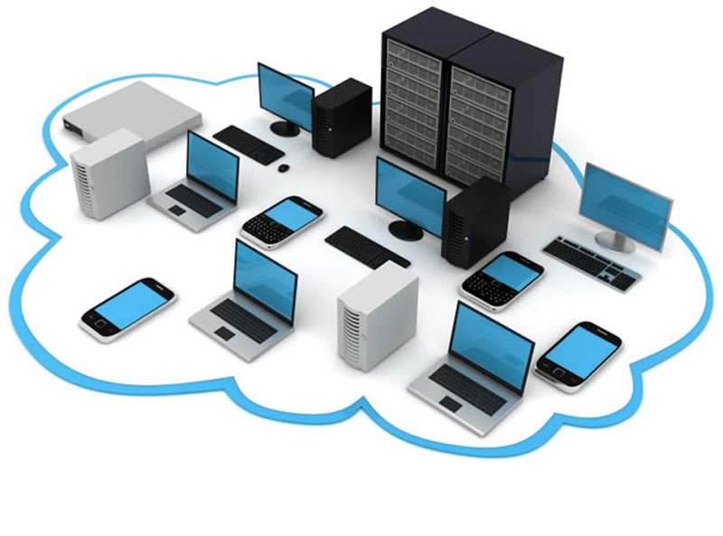
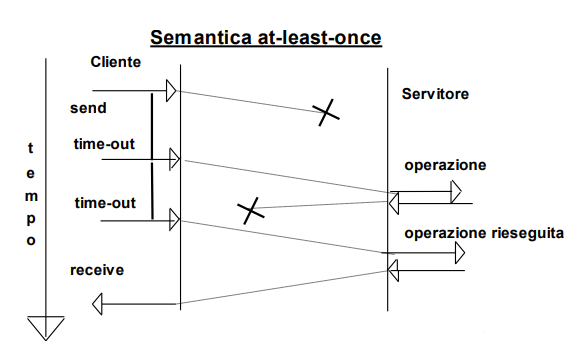
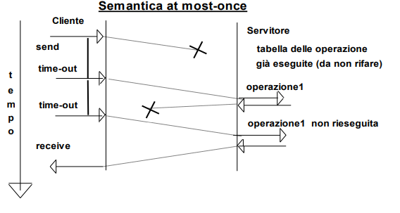
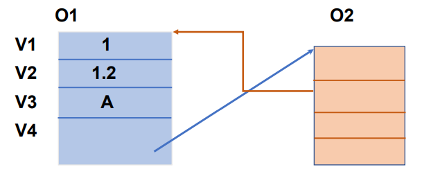
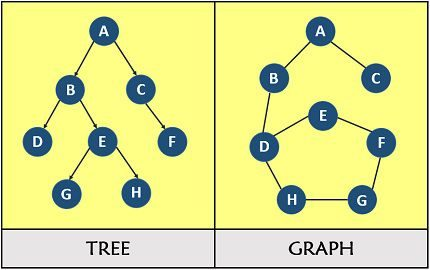
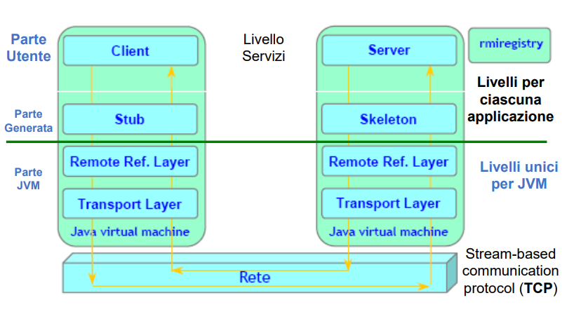

```{=latex}
\begin{center}
```



```{=latex}
\end{center}
```

\newpage

# SISTEMI DI CHIAMATE REMOTE

### Semantica della comunicazione

Internet propone dei protocolli standard se rappresentano un accordo degli utenti ossia che possano essere sempre accettati dalla comunità di uso e condiziona la loro standardizzazione solo se sono approvati dalla comunità degli utenti. I documenti di proposta di standard si chiamano RFC (Request For Comments), essi diventano standard se sono approvati dalla comunità di utilizzo. \
In generale la comunità internet ha sempre mirato a implementazioni di protocolli aperti, efficienti e capaci di fornire soluzione che siano anche molto usabili e semplici.\
Internet risponde alla filosofia di massima usabilità su ogni macchina e con scarse risore: una semantica **MAY-BE** (o BEST-EFFORT). Per limitare i costi ci si basa su un solo invio asincrono di ogni datagramma/informazione, quindi il messaggio può arrivare o meno. Quindi non si fanno azioni per il recupero (recovery) al fine di mantenere il costo basso.\
Il progetto internet è tutto BEST-EFFORT:

* rapprensentato da IP (Internet Protocol) in cui ogni azione è svolta una volta sola senza preoccuparsi di affidabilità qualità e garanzie
* UDP rappresenta il protocollo di trasporto end-to-end in cui in cui per ottenere bassi costi non si fanno per garantire l'affidabilità

Lo standard, quindi, sacrifica la QoS (Quality of Service) alla applicabilità globale in una visione poco aziendale ma molto aperta.

#### Semantica AT-LEAST-ONCE

Internet deve anche fornire altre risposte, maggiore qualità e tenere conto di informazioni ricevute e ritrasmissioni successive a timeout. Utilizzando una semantica AT-MOST-ONCE si prevedono ritrasmissioni ad intervallo da parte del mittente, però il messaggio può arrivare anche più volte a causa dei messaggi duplicati dovuti a ritrasmissioni da parte del mittente.
È la semantica adatta per le azioni idempotenti.\
Implementazione (progetto reliable al mittente): il cliente se non riceve risposta ad un messaggio inviato (o perchè il messaggio di richiesta è andato perso o perchè quello di risposta è andato perso) dopo un timeout ritrasmette, il server non se ne accorge, è il client che si preoccupa dell'affidabilità, ed è sempre il client a decidere in modo unilaterale la durata massima. Il tassello fondamentale è che il server non se ne accorge e riesegue ad ogni richiesta senza preoccuparsi dell\'arrivo di richieste uguali.    

```{=latex}
\begin{center}
```

{height="230px"}

```{=latex}
\end{center}
```

#### Semantica AT-MOST-ONCE

Più invii ad intervalli separati e anche stato sul server. Cliente e servitore lavorano in modo coordinato per ottenere garanzie di correttezza ed affidabilità: il messaggio, se arriva, viene considerato al più una volta dal servitore, in più la semantica non introduce vincoli sulle azioni applicative (idempotenza). Il protocollo che implementa questo tipo di semantica è **TCP**.\
Implementazione (progetto reliable per entrambi): il cliente se non riceve risposta fa delle ritrasmissioni (decise dal protocollo TCP in fase di 3-way handshaking), il server mantiene uno stato per riconoscere i messaggi già ricevuti per non eseguire azioni più di una volta.\
A rigor di logica ci devono essere dei dimensionamenti dei time-out, come detto in precedenza, ma anche della grandezza dei segmenti da inviare per non congestionare la rete, il tutto però, è gestito da TCP. \
Il server inoltre, dovendo mantenere uno stato per garantire correttezza, deve decidere per quanto tempo, mentre il client decide la durata massima solo delle proprie azioni.

```{=latex}
\begin{center}
```

{height="230px"}

```{=latex}
\end{center}
```

#### Semantica EXACLY-ONCE

Se vanno male non si sa cosa sia successo ad entrambi perchè le decisioni sono unilaterali (ognuno prende le sue). A livello applicativo spesso, però, si vuole una maggiore garanzia: semantica EXACLY--ONCE o atomicità. In questo tipo di semantica il messaggio o arriva una sola volta per tutti e due oppure non è considerato da entrambi, ne consegue che questo tipo di approccio è molto coordinato sullo stato. Al termine i pari sanno se l'operazione è stata fatta o no. I pari lavorano per ottenere il massimo dell'accordo e della reliability. Questo tipo di progetto si basa sulla completa conoscenza dello stato finale, di conseguenza i principi base di questo approccio sono l'affidabilità e il coordinamento massimi: si può parlare di semantica tutto o niente.\
Per quanti riguarda i tempi necessari a questo tipo di semantica si può certamente dire che non sono prevedibili: se tutto va bene il messaggio viene ricevuto una ed una sola volta e viene trattato riconoscendo i duplicati, se le cose vanno male invece il client ed il server sanno se il messaggio è arrivato o no e si agisce di conseguenza, quindi, se ad uno dei due non è arrivato niente il tutto deve essere riportato indietro.\
È chiaro che c'è un completo coordinamento delle azioni ai partner, tuttavia non è predicibile la durata delle azioni, come preannunciato, difatti la durata massima può non essere limitata nel peggiore dei casi. Se uno dei due fallisce bisogna aspettare che faccia la recovery, solo allora entrambi sanno realmente com'è andata (tutto o niente).

### Semantica dei protocolli TCP/IP

La semantica dei protocolli IP e UDP, come è ovvio pensare, è di tipo **may-be**: l'azione può essere fatta o meno. Per quaanto riguarda TCP la semantica è **at-most-once**: l'azione può avvenire al più una volta.\
In caso di insuccesso non c'è garanzia di accordo sullo stato della comunicazione e dei partecipanti (si ricomincia da capo), a differenza di una semantica del tipo exacly-once.\
La semantica decisa consente di mantenere accettabile sia la durata delle operazioni si il carico ed il costo dei protocolli in termini di banda e risorse dedicate. Ancor di più per operazioni di gruppo che siano multicast o broadcast.

#### Piccolo focus su TCP

TCP e UDP sono 2 protocolli a livello 4 (trasporto), uno con connessione (TCP) e uno senza (UDP).\
TCP è un protocollo connesso: 

* c'è una connessione bidirezionale tra gli end-point
* differenzia i dati: dati normali senza limiti di banda, i prioritari a banda limitata di 1 byte
* c'è controllo di flusso a byte: ordine corretto dei byte e ritrasmissione nel caso di perdita di messaggi
* c'è controllo di flusso tra i due partecipanti: bufferizzazione
* semantica at-most-once in caso di successo: con l'obiettivo di consentire costi bassi, durata limitata in trasporto, e di avere la possibilità di gestire eccezioni in modo più trasparente possibile. In caso di insuccesso la semantica è NON exacly-once perchè non è prevedibile.

\
\

## JAVA RMI

Prima di parlare di Java RMI (Remote Method Invocation) è necessario rinfrescare alcuni concetti.\
Cos'è un'interfaccia a confronto con una classe?

> Sono entrambi descrittori di istanze (entità di metalivello), uno concreto (con metodi) e l'altro astratto. Per quanto riguarda l'ereditarietà (che è la relazione di derivazione di comportamenti da altre entità descrittive dello stesso tipo: chi eredita ha tutto quello specificato dalla super entità) tra classi si può avere un solo genitore, mentre per quanto riguarda l'ereditarietà fra interfacce si può avere ereditarietà multipla.\
Interfaccia e classe sono entrambe entità di metalivello, ossia descrittive delle istanze. Ogni istanza riferisce una ed una sola classe da cui è creata, una classe implementa molte interfacce, di conseguenza ogni istanza fa riferimento a molte interfacce (dalla sua classe).

Quali sono i tipi di variabili nelle istanze?

> 
* variabili nelle istanze (primitivi e riferimenti ad altre istanze): variabili interne ad un oggetto istanza sono tipizzate
* varibili interfaccia (tipizzate dall'interfaccia): possono puntare ad un'istanza di una classe che implementi l'interfaccia stessa


Che entità/oggetti ci sono in Java a run-time?

> Tutti: classi, interfacce ed istanze

\newpage
Come sono le istanze?

> Un'istanza contiene le variabili descritte dalla classe e riferisce i metodi nella classe (valori per primitivi e riferimenti per oggetti). Gli oggetti non sono contenuti all'interno di altri oggetti bensì si puntano fra di loro creando un grafo per ogni oggetto (semantica locale per riferimento).

```{=latex}
\begin{center}
```

{height="200px"}

```{=latex}
\end{center}
```

Qual è la differenza tra grafo ed albero?

> Un albero può eventualmente essere descritto come caso particolare di un grafo, senza circuiti e loop automatici. In un grafo invece i vari membri si possono collegare senza alcun vincolo, quando invece in un albero non possono collegarsi se hanno già un percorso per essere raggiunti. Sostanzialmente in un grafo ci sono 3 insiemi: archi, vertici e l'insieme che rapprensenta la loro relazione. In un albero, invece, ci sono solo nodi collegati fra loro (e foglie che sono nodi senza collegamenti).

```{=latex}
\begin{center}
```

{height="200px"}

```{=latex}
\end{center}
```

### Motivazioni e generalità

L'architettura RMI introduce la possibilità di richiedere l'esecuzione di metodi remoti in Java (RPC, vedi dopo, in Java) integrando il tutto con il paradigma OO (object-oriented).\
RMI si può definire come insieme di **strumenti, politiche e meccanismi** che permettono ad un' applicazione Java in esecuzione su una macchina di invocare i metodi di un oggetto di un'applicazione Java in esecuzione si una macchina remota: viene creato localmente il **riferimento ad un oggetto remoto** che è invece effettivamente attivo su un nodo sempre remoto ed il programma client invoca i metodi tramite questo oggetto mantenuto in una variabile interfaccia.\
C'è un unico ambiente di lavoro come conseguenza del linguaggio Java ma c'è eterogeneità di sistemi grazie alla portabilità del codice Java (bytecode).\
RMI è presente su qualsiasi JVM installata su qualsiasi pc, il meccanismo di questo sistema si basa sulla serializzazione per lo scambio di dati.\
**Piccolo reminder**: Java è un linguaggio di base compilato in bytecode e poi interpretato, quindi in generale non molto efficiente, anche se le JVM più moderne sono in grado di compilare il codice in base alla macchina su cui si trovano per lo sfruttamento massimo delle risorse e per ottenere l'efficienza massima.

### Accesso ad oggetti remoti

In Java non sono direttamente disponibili riferimenti remoti, ma RMI permette di costruirli basandosi su due proxy: lo **stub** per la parte del client e lo **skeleton** dalla parte del server. Questo pattern detto **Pattern Proxy** permette di nascondere al livello applicativo la natura distribuita dell'applicazione. Come viene naturale pensare le cose cambiano rispetto ad una invocazione di un oggetto locale: affidabilità, semantica e durata.\
Quindi una cosa che è molto importante tenere a mente è che **non è possibile riferire direttamente l'oggetto remoto**: è necessaria un'infrastruttura attiva e distribuita.\
In Java è utile ricordare (come fatto ad inizio capitolo) che le interfacce e le classi sono compilate e presenti a run-time, difatti RMI ricorre alle varibili interfaccia (che se non fossero compilate e presenti a run-time, e quindi caricate in memoria, non saprebbe dove prendere) che possono contenere un riferimento ad un'istanza di una classe qualunque che però implementi l'interfaccia stessa.\
Il **trucco** sta nell'utilizzo di una variabile interfaccia per contenere un riferimento ad un proxy che permette di controllare e preparare il passaggio da un ambiente client ad un ambiente server.

```{=latex}
\begin{figure}[!ht]
\centering
\includegraphics[width=0.5\linewidth]{RMI1.png}
\includegraphics[width=0.49\linewidth]{RMI2.png}
\caption{A sinistra lo schema riassuntivo dell'approccio, a destra il funzionamento con la varibile interfaccia}
\label{fig_turbulent_wake_vehicles}
\end{figure}
```

\newpage

### Architettura RMI

```{=latex}
\begin{center}
```

{height=270px}

```{=latex}
\end{center}
```

Le interazioni sono **solo** SINCRONE e BLOCCANTI.

#### Livelli e componenti dell'architettura

\
**Stub e skeleton** sono generati sotto il controllo dell'utente: lo **stub** è un proxy locale su cui vengono le invocazioni destinate all'oggetto remoto, lo **skeleton** è un'entità remota che riceve le invocazioni fatte sullo stub e le realizza effettuando le corrispondenti chiamate sul server.\
\
Il livello **Remote Reference Layer** (RRL) è responsabile della gestione dei riferimenti agli oggetti remoti dei parametri e delle astrazioni di una connessione stream-oriented.\
I proxy sono entità intermedie ma presenti e per questo sono da considerare.