# TECNOLOGIE AVANZATE PER FRONTEND

## REACT.JS

React è una **libreria JS** per la creazione di interfacce utente (GUI) web. L'obiettivo è diventare la soluzione semplice, intuitiva e definitiva per sviluppatori front-end e app basate su HTML5.\
Essendo una libreria JS viene eseguito all'interno del browser ne consegue che React.js NON è uno strumento per lo sviluppo lato back-end. Quindi React non interagisce con DB o qualsiasi altra sorgente di dati si trovi su back-end, tuttavia permette di invocare delle API lato server. Può interagire con diverse tecnologie back-end in Python/Flask, Ruby on Rails, Java/Sping, PHP ecc

### L'approccio in sintesi

React si ispira alla metodologia di sviluppo delle GUI del tipo Single Page Application (SPA). Una **SPA** è un'applicazione web che interagisce col browser per modificare pagine web in modo dinamico dei in funzione dei dati che arrivano dal back-end, a differenza dell'approccio classico in cui il browser carica nuove pagine a seguito dell'interazione con l'utente. Si dice, infatti, che la SPA è un contenitore all'interno del quale la pagina evolve dinamicamente.\
Lo sviluppo dell'applicazione avviene attraverso la scrittura di "componenti" i quali interagiscono con le API della libreria che manipolano, a loro volta, il DOM per la creazione di elementi di interfaccia utente.\
\
React ha introdotto il concetto di Virtual DOM: al verificarsi di un evento, invece di modificare il DOM del browser, modifica una esatta copia del DOM (il virtual DOM) del browser e si trova in RAM. La modifica del virtual DOM è più leggera di quella del DOM browser, infatti lavorando su di esso React sarà in grado di inviare al DOM del browser solo le modifiche strettamente necessarie rendendo il processo di rendering della pagina più leggero, efficiente e veloce.\
\
Ma quindi cosa succedeva con il DOM normale?

> Se si modificasse un solo elemento del DOM (supponendo di averne tanti), con la tecnologia normale si andrebbe a riscrivere l'intero DOM

E React cosa fa?

> React dice al browser di modificare solo le parti effettivamente modificate e possibilmente, prima di modificare il DOM del browser, accorpa un certo numero di modifiche fatte dall'utente e decide lui quando mandare le modifiche al browser

### I vantaggi

I vantaggi per lo sviluppatori sono: 

* L'approccio a componenti permette allo sviluppatore di costruire interfacce complesse attraverso la composizione di mattoncini
* Un altro vantaggio dell'approccio a componenti è la possibilità di riuso in modo semplice
* Lo sviluppatore definisce la logica dei componenti e la loro posizione all'interno della GUI. La gestione del virtual DOM, delle sue trasformazioni e della comunicazione con il DOM del browser è completamente a carico di React.js

Per l'utente finale invece l'impiego del virtual DOM alleggerisce il processo di rendering dell'interfaccia sul browser con conseguente aumento delle prestazioni percettibili dall'utilizzatore.
\newpage
Un primo approccio con React può essere:

```html
<!DOCTYPE html>
<html>
    <head>
        <meta charset="UTF-8" />
        <title>Primi passi con React</title>
        <!-- IMPORT DELLE LIBRERIE REACT -->
        <script src="https://unpkg.com/react@15/dist/react.js"></script>
        <script src="https://unpkg.com/react-dom@15/dist/react-dom.js"></script>
        <script src="https://cdnjs.cloudflare.com/ajax/libs/babel-core/5.8.24/browser.js"></script>
    </head>
    <body>

        <!-- CREO IL CONTENITORE -->
        <div id="root"></div>

        <script type="text/babel">
            //  CREAZIONE DI UN REACT ELEMENT
            const elem = <p>Hello <strong>React</strong>!</p>;
        
            //  REINDIRIZZA IL TUTTO: 
            //      - elem è cosa visualizzare 
            //      - il document.getElementById(...) è dove visualizzarlo
            ReactDOM.render(elem, document.getElementById('root'));
        </script>
    </body>
</html>

```
Nell'esempio è stato definito un _React Element_ e successivamente è stato chiesto al DOM del browser di visualizzare l'elemento in una specifica posizione. Un **React Element** è un oggetto semplice ed immutabile che descrive cosa si vuole visualizzare sullo schermo. Solitamente un element è un nodo html ma può anche avere al suo interno istanze di componenti.\
La notazione ` const elem = <p>Hello <strong>React</strong>!</p>;` è un esempio di JSX (JavaScript XML), difatti in JS vanilla non si può fare.

Un altro esempio:

```html
<!DOCTYPE html>
<html>
    <head>
        <meta charset="UTF-8" />
        <title>Primi passi con React</title>
        <script
        src="https://unpkg.com/react@15/dist/react.js"></script>
        <script src="https://unpkg.com/react-dom@15/dist/reactdom.js"></script>
        <script src="https://cdnjs.cloudflare.com/ajax/libs/babelcore/5.8.24/browser.js"></script>
    </head>
    <body>
        <div id="root"></div>
        <script type="text/babel">
            // SI POSSONO DEFINIRE DEI COMPONENT DI TIPO CLASS
            class HelloWorld extends React.Component{
                render() { // Funzione che ritorna l'elemento da visualizzare
                    return <p>Hello <strong>React</strong>!</p>;
                }
            };
            ReactDOM.render(<HelloWorld />,document.getElementById('root'));
        </script>
    </body>
</html>
```
Nell'esempio precendente il risultato è lo stesso di quello che lo precede ma è fatto tramite una classe.\
Si noti che quando vado a fare il `ReactDOM.render(...)` metto un tag "nuovo" che ha lo stesso nome della classe.\
La differenza sostanziale fra i due esempi sta nel fatto che nel primo ho usato un **React Element** mentre nel secondo ho usato un **React Component**. I _React component_ possono essere di tipo class (come nell'esempio) o di tipo function. Questi componenti sono oggetti complessi e dinamici che ricevono input dall'esterno e forgiano l'elemento grafico da restituire. Sostanzialmente ricevono dei dati in ingresso come delle funzioni e restituiscono l'elemento grafico da visualizzare.

### JSX

Negli esempi visualizzati è stata usata una sintassi particolare che mescola JS e HTML: **JSX**. JSX sta per JavaScript XML e permette allo sviluppatore di scrivere facilmente tag HTML all'interno di codice JS e di piazzarli all'interno del DOM senza l'uso di `createElement()` e/o `appendChild()`.\
Non è obbligatorio usare JSX però semplifica molto la vita del developer. React però mette comunque a disposizione funzioni per la creazione di elementi HTML.\
Un esempio dell'utilità di JSX (creazione di una lista di 3 elementi):

* Con JSX:

    ```javascript
    // Creazione della lista degli elementi -->
    const listElement = <ul className="list-of-items">
            <li className="item-1" key="key-1">Item 1</li>
            <li className="item-2" key="key-2">Item 2</li>
            <li className="item-3" key="key-3">Item 3</li>
        </ul>;
    // Esecuzione del rendering nella pagina
    ReactDOM.render(listElement, document.getElementById("container"));
    ```
* Senza JSX:

    ```javascript
    // Creazione degli elementi da inserire in una lista non ordinata
    var item1 = React.DOM.li({ className: "item-1", key: "key-1"}, "Item 1");
    var item2 = React.DOM.li({ className: "item-2", key: "key-2"}, "Item 2");
    var item3 = React.DOM.li({ className: "item-3", key: "key-3"}, "Item 3");
    // Creazione di un array degli elementi
    var itemArray = [item1, item2, item3];
    // Creazione della lista degli elementi
    var listElement = React.DOM.ul({ className: "list-of-items" }, itemArray);
    // Avvio del rendering nella pagina
    ReactDOM.render(listElement, document.getElementById("container"));
    ```

Si possono inserire delle variabili all'interno della notazione JSX come segue:

```javascript
const nome = 'Giuseppe Verdi';
const element = <h1>Hello, {nome}</h1>;
ReactDOM.render(element, document.getElementById('root'));
```
Per inserire le variabili, espressioni di ogni tipo e funzioni che restituiscono valori si mettono fra parentesi graffe `{}`.\
Ma come fa a funzionare?

> Funziona perchè prima di essere interpretato dal browser, il codice che include JSX, viene pre-compilato da un interprete che è in grado di tradurre il codice JSX in JavaScript. In questo corso si usa **babel** (open source). Babel mette a disposizione tool per tradurre molti linguaggi in JS.

A runtime sostanzialmente viene eseguito un compilato che corrisponde al javascript che è stato dedotto dal codice scritto in React.

### I COMPONENTI

I **React Components** sono i mattoncini fondamentali che consentono di passare da una pagina statica a un'applicazione web dinamica la cui interfaccia è in grado di ripondere agli eventi che si verificano nella pagina, ossia reagire (e da qui il nome React) e aggiornare se stessa di conseguenza. Ognuno di questi ha un ruolo ben definito dal punto di vista di ciò che rappresenta graficamente e si fa carico di gestire le interazioni con l'utente su quella particolare interfaccia.

```{=latex}
\begin{center}
```
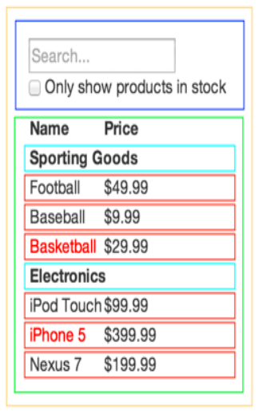{#esComp height=200px}

```{=latex}
\end{center}
```

* La sezione più esterna, quella col bordo giallo, è il componente React che rappresenta l’applicazione e contiene tutti gli altri componenti.
* A "livello" più basso, il riquadro blu contiene il pannello per la ricerca incrementale dei prodotti
* Allo stesso livello, con colore verde, c'è la lista dei prodotti che a sua volta è formata da altri componenti interni
* Per ogni riquadro di colore diverso sarà stato dichiarato un componente React

#### Tipi di componenti

\
In React i componenti sono pezzi di codice indipendenti e riusabili. Esistono 2 tipi di componenti: 

* il tipo **class**
* il tipo **function**

Entrambe devono reindirizzare del codice HTML. La cosa che li differenzia è che quelli di tipo function non salvano lo stato, se si necessita di salvare lo stato bisogna usare i componenti di tipo class.\
\
Regola generale per la definizione di un componente è che il nome del componente deve avere la lettera maiuscola.\
Per definire un componente di tipo function:

```javascript
function Car() {
    return <h2>I am a Car!</h2>;
}
ReactDOM.render(<Car />, document.getElementById('root'));
```
La funzione deve restituire l'elemento di cui fare il rendering tramite `return`. Come già visto `ReactDOM.render(...)` è l'istruzione che attiva la manipolazione del DOM e il successivo rendering del browser.\
\
Per definire un componente (uguale) di tipo class:

```javascript
class Car extends React.Component {
    render() {
        return <h2>Hi, I am a Car!</h2>;
    }
}
ReactDOM.render(<Car />, document.getElementById('root'));
```
Per creare un componente di tipo class, occorre creare una classe che estenda da React.Component e implementi obbligatoriamente il metodo `render()`. Così come per i componenti di tipo function, occorre che questo metodo restituisca l'elemento da renderizzare attraverso la parola chiave `return`. Come si vede il metodo di visualizzazione sul DOM è uguale.
\
\
Sia per i componenti di tipo class che quelli di tipo function si possono definire delle **props** (proprietà). Sono dei parametri in sola lettura che si passano all'oggetto, sono immutabili e sono utili per configurare, per esempio, il comportamento grafico del componente. L'oggetto built-in che contiene queste proprietà prende il nome di props (keyword riservata). Quando si fa il rendering si può accedere alle props di un component richiamandole come se fossero attributi di un tag HTML.
```javascript
function Car(props) {
    //props.colore è READ ONLY per Car
    return <h2>I am a {props.colore} Car!</h2>;
}
ReactDOM.render(<Car colore="red"/> /*qua colore lo posso cambiare*/, 
    document.getElementById('root'));
```
```javascript
class Car extends React.Component {
    render() {
        //Per le class si usa this.props
        return <h2>Hi, I am a Car. My name is {this.props.nome}</h2>;
    }
}
ReactDOM.render(<Car nome="Saetta McQueen"/>, document.getElementById('root'));
```
Essendo un oggetto JS che punta ad un'area di memoria che può non contenere dei campi con determinati nomi se non sono stati definiti nel rendering (si rischia che sia un puntatore a nullo).\
Ogni volta che si mette un tag si crea un oggetto diverso quindi si possono definire diversi valori delle props.\
Ma perchè questa scelta?

> Se ho tanti componenti il passaggio per valore (e non per indirizzo) è utile sapere che se le proprietà cambiano inaspettatamente non è perchè è scritto male il componente.

\
Eventualmente si può utilizzare una factory per la creazione inline delle classi:
```javascript
var Car = React.createClass({
    render: function() {
        return <h2>Hi, I am a Car!</h2>;
    }
});
```

#### Il concetto di state

\
\
Tutti i componenti di tipo **class** possiedono un oggetto built-in che prede il nome di **state**. A differenza delle _props_ le proprietà definite nell'oggetto state SONO mutabili, infatti state è pensato proprio per contenere proprietà che possono cambiare nel tempo. Quando si cambia un attributo all'interno di state viene invocata la ri-renderizzazione del relativo componente.\
**N.B.**: le componenti **function** sono stateless, ovvero l'oggetto state non lo possiedono.
\
Come per tutti i linguaggi ad oggetti anche per il tipo class si può definire un costruttore che viene invocato prima del rendering e funge da inizializzatore delle proprietà del componente. Il costruttore in generale serve per inizializzare lo stato del componente e per inizializzare la gestione degli eventi.\
Nel costruttore si può invocare il metodo `super()` per invocare il costruttore dell'oggetto padre e per inizializzare correttamente il componente stesso. Se non si usa non si potrà utilizzare la keyword `this`.
```javascript
class Car extends React.Component {
    constructor() {
        super();
        this.state = {brand: "Ford", model: "Mustang", color: "red", year: 1964};
    }
    render() {
        return (
            <div>
            <h1>My {this.state.brand}</h1>
            <p> It is a {this.state.color} {this.state.model} from {this.state.year}</p>
            </div>
        );
    }
}
ReactDOM.render(<Car />, document.getElementById('root'));
```
Si possono includere anche componenti in altri componenti, e quando verrà fatto il render del componente che ne contiene altri, viene fatto anche di tutti i sotto componenti.\
\
L'oggetto state di un componente class può essere modificato attraverso la funzione `setState()` che viene definita nella classe `React.Component` e quindi viene ereditata dai componenti class. L'invocazione di tale funzione scatena la re-invocazione della funzione `render()` del componente e di tutti i suoi componenti nested. L'oggetto state è incapsulato all'interno di un componente, il quale è l'unico ad avere diritto e responsabilità di mutarlo, nessun altro può modificarlo: ciò è utile per quando si debugga, sapendo che lo stato è stato modificato in modo errato allora l'errore sta per forza nel componente a cui appartiene lo stato sbagliato.
\newpage
Esempio di un componente per il lancio di un dado:
```javascript
class Dado extends React.Component {
    constructor(props) {
        super(props);
        this.state = {numeroEstratto: 0};
    }
    randomNumber() {
        return Math.round(Math.random() * 5) + 1;
    }
    lanciaDado() {
        this.setState({numeroEstratto: this.randomNumber()});
    }
    render() {
        let valore;
        if (this.state.numeroEstratto === 0) {
            valore = <small>Lancia il dado cliccando <br /> sul pulsante
            ottostante</small>;
        }else{
            valore = <span>{this.state.numeroEstratto}</span>;
        }
        return (
            <div className="card" >
                <p className="card__number">{valore}</p>
                <button className="card__button" onClick={() => this.lanciaDado()}>
                    Lancia il Dado
                <button>
            </div>
        )
    }
}
```
Nell'esempio, per farlo funzionare correttamente, bisogna inserire tutto il resto:

* Tag html, head, body
* Inclusione delle librerie di React e JSX
* Rendering del componente all'interno di un div contenitore

#### Uso raccomandato di state e props

Non tutti i componenti dovranno avere state, al contrario è consigliato costruire componenti **stateless**. Solitamente l'applicazione React è realizzata come una gerarchia di componenti: ci sono componenti ai vertici che saranno resposabili di mantenere lo stato dell'applicazione e di passare le informazioni giù ai componenti figli tramite *props*.

### GESTIONE DEGLI EVENTI

Gli eventi sono solitamente gestiti da un **handler** realizzato attraverso un metodo della classe.\
Facciamo subito un esempio pratico:

```javascript
class App extends React.Component {
    constructor(props) {
        super(props);
    }
    /*HANDLER DELL'EVENTO*/
    handleClick(e) {
        console.log("Pulsante premuto - Evento click");
    }
    render() {
        return (
            <button onClick={this.handleClick} >Pulsante</button>
        )
    }
}
```

Il parametro *e* (nella firma dell'handler) è un evento sintetico, React definisce questo tipo di eventi in base alle specifiche W3C, quindi non ci sono problemi di compatibilità tra browser.\
È utile sapere che gli eventi React sono lievemente diversi rispetto agli eventi nativi di JS.\
**N.B.**: se l'handler dell'evento deve fare accesso allo *state* del componente occorre apportare accorgimenti al codice di gestione dell'evento.\
\
Per accedere allo state da parte dei metodi di classe innanzitutto è necessario che l'oggetto che invoca l'handler dell'evento sia il componente: a tal fine si ricorrerà alla keyword *this*. Ci sono 2 alternative:

* All'interno del costruttore, forzare bind di this del metodo a this del componente.\
    Ad esempio:

    ```javascript
    class Interruttore extends React.Component {
        constructor(props) {
            super(props);
            this.state = {acceso: true};
            this.handleClick =
                this.handleClick.bind(this);
        }
        handleClick() {
            this.setState({acceso: !this.state.acceso}
            // in alternativa
            // this.setState(state => ({
            // acceso: !state.acceso
            // }));
        }
        render() {
            return (
                <button onClick={this.handleClick}>
                    {this.state.acceso ? 'Acceso' : 'Spento'}
                </button>
            );
        }
    }

    ```

\newpage

* Invocare l'handler come arrow function.\
    Ad esempio:

    ```javascript
    class Interruttore extends
        React.Component {
            constructor(props) {
                super(props);
                this.state = {acceso: true};
            }
            handleClick() {
                this.setState({acceso:
                !this.state.acceso})
                // in alternativa
                // this.setState(state => ({
                // acceso: !state.acceso
                // }));
            }
            render() {
                return (
                    <button onClick = {() = >
                        this.handleClick()}>
                        {this.state.acceso ? 'Acceso' : 'Spento'}
                    </button>
                );
            }
        }

    ```

### I FORM

È utile sottolineare che gli elementi dei **form** in React funzionano in modo leggermente differente rispetto ad HTML, e la motivazione fondamentale è che gli elementi di un form mantengono, naturlamente, uno stato interno. Infatti gli elementi di un form (`<input>`, `<texarea>`, ...) mantengono e aggiornano il proprio stato in base all'input dell'utente.\
Nel seguente esempio si creerà un input in react:

```javascript
class EsempioForm extends React.Component {
    constructor(props) {
        super(props);
        this.state = {value: ''};
        this.handleChange = this.handleChange.bind(this);
        this.handleSubmit = this.handleSubmit.bind(this);
    }
    handleChange(event) {
        this.setState({value: event.target.value});
        console.log('onChange: lo stato ora vale ' +
        event.target.value);
    }
    handleSubmit(event) {
        alert('E\' stato inserito un nome: ' + this.state.value);
        //previene l'esecuzione del comportamento predefinito 
        event.preventDefault();
    }
```
\newpage
```javascript
    render() {
        return (
            <form onSubmit={this.handleSubmit}>
                <label>
                    Nome:
                    <input type="text" value={this.state.value} onChange={this.handleChange} />
                </label>
                <input type="submit" value="Submit" />
            </form>
        );
    }

```
#### Invocazione risorsa sul server

In React si possono effettuare HTTP request in diversi modi: uno dei più eleganti e semplici fa uso di *Fetch API* fornite da JS nativo. Esse forniscono un'interfaccia JS per accedere e manipolare parti della pipeline HTTP (request e response), inoltre mettono a disposizione un metodo che fornisce un modo semplice e logico per recuperare le risorse in modo asincrono. Nell'esempio seguente viene mostrata la composizione di una request HTTP di tipo POST all'interno di un handler (`FormData` è un'interfaccia JS nativa supportata da tutti i browser):

```javascript
class MyForm extends
React.Component {
    constructor() {
        super();
        this.handleSubmit =
        this.handleSubmit.bind(this);
    }
    handleSubmit(event) {
        event.preventDefault();
        const data = new FormData(event.target);
        fetch('/api/form-submit-url', {
            method: 'POST',
            body: data,
        });
    }
    render() { 
        return (
            <form onSubmit={this.handleSubmit}>
                <label htmlFor="username">Enter username</label>
                    <input id="username" name="username" type="text" />
                <label htmlFor="email">Enter your email</label>
                    <input id="email" name="email" type="email" />
                <label htmlFor="birthdate">Enter your birth date</label>
                    <input id="birthdate" name="birthdate" type="text" />
                <button>Send data!</button>
            </form>
        );
    }
}
```

\newpage

### LIBRERIE E FRAMEWORK ALTERNATIVI A REACT.JS

Oltre a React esistono numerose iniziative che propongono librerie e framework basate su javascript. L'obiettivo di ciascuna iniziativa è quello di fornire allo sviluppatore uno strumento/ambiente di sviluppo lato front-end più "comodo" rispetto a javascript (soprattutto per la gestione del DOM) e che possa abbattere i tempi di sviluppo delle interfacce delle applicazioni Web. Di seguito proponiamo alcune tra librerie/framework più popolari e più utilizzati, elencandone le caratteristiche principali.

#### JQUERY

La libreria opensource jQuery è in assoluto la più utilizzata e conosciuta dalla comunità degli sviluppatori. JQuery semplifica molto la gestione degli elementi DOM e presenta diverse funzioni per questo scopo: con i selettori del CSS3 si possono selezionare facilmente e manipolare gli elementi della pagina. Inoltre, offre una gestione semplificata delle richieste Ajax. Il codice è compatibile con tutti i browser ed esistono molti plug-in. È una componente essenziale di molti CMS come WordPress, Drupal o Joomla! La sua estension jQuery UI è particolarmente adatta per realizzare effetti semplici ed elementi interattivi come drag&drop, ingrandimento e ridimensionamento degli elementi del sito, animazioni ed effetti vari.

#### Angular

Creato e mantenuto da Google, è il successore di AngularJS. Insieme a React.js, dispone di una grande community di sviluppatori. È riconosciuto come l'antagonista principale di React.js. Analogamente a React.js, serve per realizzare Single Page Application. Implementa il design pattern MVVM (Model View ViewModel). Si basa su jQuery Lite, una variante compatta della altrettanto famosa libreria js jQuery. Rispetto al suo antecedente (AngularJS) la differenza principale è che per la programmazione non viene più utilizzato JavaScript, ma TypeScript, un linguaggio di programmazione sviluppato da Microsoft che si basa su javascript. Punto di forza è la facilità di sviluppo delle applicazioni per diversi dispositivi (desktop, mobile, tablet).

#### VUE.JS

Analogamente ad Angular e React, Vue.js è un framework js per lo sviluppo di Single Page Application. Adotta il design pattern Model–View–ViewModel. L’intento degli sviluppatori di Vue.js è stato quello di creare uno strumento più facile per i principianti rispetto agli altri framework. Ciò, però, va a discapito della completezza di funzionalità (in cui i competitor eccellono), per le quali però è comunque possibile integrare un numero ristretto di librerie aggiuntive opzionali.

#### METEOR

Meteor, chiamato a volte MeteorJS, è un framework javascript particolarmente adatto per lo sviluppo su diverse piattaforme. Consente agli sviluppatori di creare con lo stesso codice sia applicazioni Web sia app per i dispositivi mobili. Un altro vantaggio consiste nel fatto che le modifiche al codice possono essere inoltrate direttamente ai client grazie al protocollo proprietario Distributed Data Protocol (DDP). Questo framework js funziona su una base Node.js (ne parleremo presto), pertanto può essere impiegato sia per sviluppo front-end che per sviluppo back-end Risulta molto utile disporre di conoscenze su Node.js. per lavorare con Meteor.

#### BACKBONES

Backbones non è un vero e proprio framework ma, piuttosto, un ottimo strumento per modellare e strutturare il codice. Grazie a questa caratteristica, backbones lascia più spazio al programmatore. Per contro, impiegato da solo non fornisce un framework completo, quindi lo si deve abbinare obbligatoriamente ad altre librerie quali underscore.js e jquery. È nato per sviluppare applicazioni single-page ed adotta il design pattern Model-View-Presenter (MVP).

/newpage

# TECNOLOGIE AVANZATE PER BACKEND

## JAVA MODEL 2

Nel progetto di applicazioni web in Java esistono 2 modelli di ampio uso e riferimento: **Model 1** e **Model 2**.\
Per quanto riguarda **Model 1** si può dire che è un pattern semplice in cui codice il codice responsabile per presentazione contenuti è mescolato alla logica di business (suggerito solo per applicazioni piccole).\
**Model 2** è design pattern più complesso e articolato che separa chiaramente il livello di presentazione dei contenuti dalla logica utilizzata per manipolare e processare contenuti stessi (suggerito per applicazioni medio-grandi). Usualmente questo design pattern è associato al paradigma MVC (Model View Controller).

### ARCHITETTURA MVC

Architettura adatta per le web app interattive (ma non solo). È composto da:

* **Model**: rappresenta il livello dei dati, incluse le operazione per accesso e modifica. Model deve notificare view associate quando modello viene modificato e deve supportare:

    - possibilità per view di interrogare lo stato di model
    - Possibilità per controller di accedere alle funzionalità incapsulate da model

* **View**: si occupa del rendering dei contenuti di model. Accede ai dati tramite model e specifica come i dati debbano essere presentati:

    - aggiorna presentazione dei dati quando model cambia
    - gira input utente verso controller

* **Controller**: definisce comportamento dell'applicazione (contiene la logica di business):

    - fa dispatching di richieste utente e seleziona view per presentazione
    - interpreta input utente e lo mappa su azioni che devono essere eseguite dal model


```{=latex}
\begin{center}
```
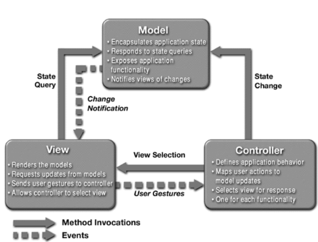{#esComp height=250px}

```{=latex}
\end{center}
```

Mapping possibile su applicazioni web Java-based: in applicazioni conformi a Model 2, richieste del browser cliente vengono passate a controller (usualmente implementato da servlet o EJB session bean).\
Il **controller** si occupa di eseguire logica la business necessaria per ottenere il contenuto da mostrare. Controller mette il contenuto (usualmente sotto forma di JavaBean o Plain Old Java Object - POJO) in un messaggio e decide a quale view (usualmente implementata da JSP) passare la richiesta.\
La **view** si occupa del rendering contenuto (ad es. stampa dei valori contenuti in struttura dati o bean, ma anche operazioni più complesse come invocazione metodi per ottenere dati)

### PERCHÈ APPLICATION SERVER?

* Complessità del middle tier
* Duplicazione dei servizi di sistema per la maggior parte delle applicazioni enterprise:
    - controllo concorrenza e transazioni
    - load-balancing e sicurezza
    - gestione delle risorse e connection pooling

Come si possono risolvere questi problemi?

* Container condiviso che gestisce i servizi di sistema
* Si può optare per una soluzione proprietaria o basata su standard aperti

#### Soluzioni a Container: Proprietarie vs. Standard-based

\
Soluzioni proprietarie:

* Usano il modello componente-container
    - Componenti per la business logic
    - Container per fornire servizi di sistema
* Il contratto componenti-container è ben definito, ma in modo proprietario (problema di vendor lock-in)
    - Esempi: Tuxedo, .NET

Le soluzioni basate su standard aperti usano il modello componente-container e il container fornisce i servizi di sistema in modo ben definito in accordo a standard industriali (ad esempio J2EE e Java Specification Request, JSR).\
\
\

Cos'è l'application server JEE?

> È una piattaforma _open_ e standard per lo sviluppo, il deployment e la gestione di applicazioni enterprise n-tier, web-enabled, server-centric e basate su componenti

```{=latex}
\begin{figure}[!ht]
\centering
\includegraphics[width=0.48\linewidth]{applServJEE1.png}
\includegraphics[width=0.48\linewidth]{applServJEE2.png}
\label{Application server JEE}
\caption{Application server e le varie edizioni della piattaforma Java}
\end{figure}
```

### ARCHITETTURA J2EE PER APPLICATION SERVER

È importante capire L'architettura per capire alcune direzioni di Java Model 2, di che cosa si occupa il container J2EE, e le differenze rispetto ad approcci a container leggero come Spring, almeno dobbiamo avere parziale comprensione del modello.

```{=latex}
\begin{center}
```
{#j2eeAS height=250px}

```{=latex}
\end{center}
```

#### J2EE per applicazioni n-tier

* Modello 4-tier e applicazioni J2EE: Cliente HTML, JSP/Servlet, EJB, JDBC/Connector
* Modello 3-tier e applicazioni J2EE: Cliente HTML, JSP/Servlet, JDBC
* Modello 3-tier e applicazioni J2EE: Applicazioni standalone EJB client-side, EJB, JDBC/Connector
* Applicazioni enterprise B2B:  Interazioni tra piattaforme J2EE tramite messaggi JMS o XML-based

#### Delega al container

Il container può fornire "automaticamente" molte delle funzioni per supportare il servizio applicativo verso l’utente:

* Supporto al ciclo di vita\
    Attivazione/deattivazione del servitore\
    Mantenimento dello stato\
    Persistenza trasparente e recupero delle informazioni (interfaccia DB)\
* Supporto al sistema dei nomi\
    Discovery del servitore/servizio\
    Federazione con altri container\
* Supporto alla qualità del servizio\
    Tolleranza ai guasti, selezione tra possibili deployment\
    Controllo della QoS richiesta e ottenuta\
* Sicurezza

## EJB

In breve è una tecnologia per componenti server-side e per lo sviluppo e deployment semplificato di applicazioni Java (distribuite, con supporto alle transazioni, multi-tier, portabili, scalabili, sicure, ecc).\
Porta e aplifica i benefici del modello a componenti sul lato server.\
Un altro vantaggio è la separazione fra logica di business e codice di sistema, infatti utlizza il container per la fornitura dei servizi di sistema. È un modello a container **pesante** contrapposto a modelli alternativi a container leggero come Spring (vedi dopo).\
Rende possibile e semplice la configurazione a deployment time tramite il deployment descriptor.

#### EJB: principi di design

I principi di design degli EJB sono: 

* Applicazioni EJB e i loro componenti devono essere debolmente accoppiati (loosely coupled)
* Comportamento di EJB definito tramite interfacce
* Applicazioni EJB NON si occupano della gestione delle risorse
* Applicazioni EJB sono N-tier:
    * Session tier come API verso l'applicazione
    * Entity tier come API verso le sorgenti dati 

### ARCHITETTURA EJB

L'idea di base è avere un container pesante attivo all'interno dell'EJB Server (Application Server). Il cliente può interagire remotamente con un componente EJB tramite interfacce ben definite passando **sempre** attraverso il container.

```{=latex}
\begin{center}
```
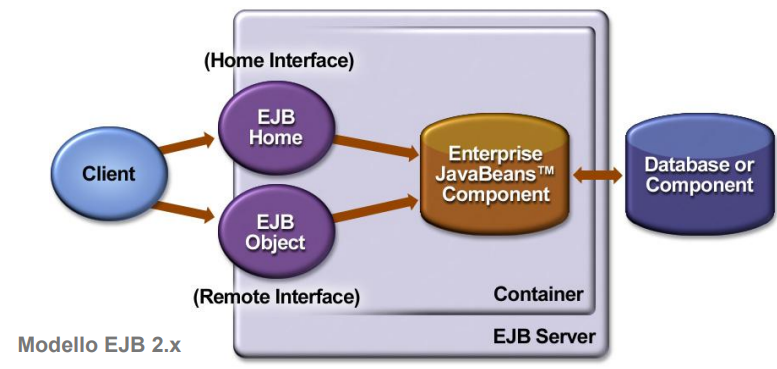{#ejbArch height=250px}

```{=latex}
\end{center}
```

Fondamentali diventano i **descrittori di deployment** che forniscono le istruzioni al container su come gestire e controllare il comportamento (anche a runtime) di componenti J2EE ad esempio: transazioni, sicurezza e persistenza. Inoltre permettono la personalizzazione tramite specifica dichiarativa (e quindi viene totalmente tolta la personalizzazione tramite programmazione). Un altro vantaggio dei descrittori di deployment sta nella semplificazione della portabilità del codice (proprio perchè la personalizzazione non è a livello di programmazione ma a livello dichiarativo). Sono stati sostituiti o resi sostituibili con le annotazioni a partire da Java5, si possono usare entrambi, uno non esclude l'altro.

### PRINCIPALI COMPONENTI EJB

```{=latex}
\begin{center}
```
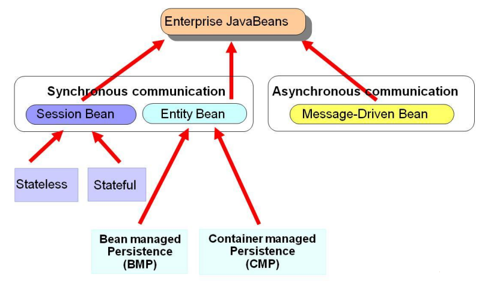{#ejbComp height=250px}

```{=latex}
\end{center}
```

Ci sono 3 tipologie di componenti: 

* **Session Bean**:
    * Stateful session bean
    * Stateless session bean
* **Entity Bean**:
    * Bean Managed Persistence (BMP)
    * Container Managed Persistence (CMP)
* **Message Driven Bean**:
    * Per Java Message Service (JMS)
    * Per Java API for XML Messaging (JAXML)

#### SESSION BEAN

\
Lavorano tipicamente per un singolo cliente. Non sono persistenti (vita media relativamente breve) e vengono persi in caso di failure di EJB server.\
Non rappresentano dati in un DB, anche se possono accedere/modificare questi dati.\
In EJB2.x classe Bean deve implementare interfaccia `javax.ejb.SessionBean`; in EJB3.x solo uso di annotazioni.\
L'uso tipico di questo tipo di bean è la modellazione di oggetti di processo o, anche, il controllo specifico per un particolare cliente. Vengo spesso utilizzati anche per modellare workflow o attività di gestione e per coordinare le interazioni fra i bean. Ultimo caso di utilizzo è per muovere la logica di business dal lato client a lato server.\
Come visto, questi bean si dividono in:

* **Stateless**: che eseguono una richiesta e restituiscono una risposta senza salvare alcuna informazione di stato relativa al cliente
* **Stateful**: possono mantenere uno stato specifico per un cliente

#### ENTITY BEAN

\
Forniscono una vista ad oggetti dei dati mantenuti in un DB: il tempo di vita non è, quindi, connesso alla durata delle interazioni con i clienti, infatti i componenti permangono nel sistema fino a che i dati esistono nel DB (long lived) e, nella maggior parte dei casi, i componenti sono sincronizzati con i relativi DB relazionali.\
C'è accesso condiviso per clienti differenti.\
In EJB2.x classe Bean deve implementare interfaccia `javax.ejb.EntityBean`; in EJB3.x supporto alla persistenza simile ad Hibernate

#### MESSAGE-DRIVEN BEAN

\
Svolgono il ruolo di consumatori di messaggi asincroni. Non possono essere invocati direttamente dai clienti, infatti vengono attivati solo in seguito all'arrivo di un messaggio.I clienti possono interagire con MDB tramite l'invio di messaggi verso le code o i topic per i quali questi componenti sono in ascolto (listener). Sono privi di stato.\
Nel caso si voglia usare JMS:

* MDB corrispondente deve implementare l'interfaccia `javax.jms.MessageListener` interface
* L'implementazione del metodo `onMessage()` deve contenere la business logic
* Il bean viene configurato come listener per queue o topic JMS

#### Tipologie di Bean EJB 3.0

In EJB 3.0, i bean di tipo sessione e message-driven sono classi Java ordinarie (Plain Old Java Object - POJO) quindi sono stati rimossi i requisiti di interfaccia. Il tipo di bean viene specificato da una annotation (o da un descrittore), le annotazioni principali sono: `@Stateless`, `@Stateful`e `@MessageDriven` (specificati nella classe del bean). Gli entity bean di EJB2.x non sono stati modificati e possono continuare a essere utilizzati ma Java Persistence API supporta nuove funzionalità. L'annotazione `@Entity` si applica solo alle nuove entità relative a Java Persistence API.

### SERVIZI CONTAINER BASED

Oltre ai dettagli di programmazione, ancora più rilevante è capire quali servizi di supporto/sistema e come vengano supportati in un modello a container pesante:

* **Pooling e concorrenza** 
* Transazionalità
* Gestione delle connessioni a risorse
* Persistenza (vedi Java Persistence API – JPA - e supporto Hibernate ORM)
* Messaggistica (vedi Java Messaging System – JMS)
* (Sicurezza)

#### Gestione della concorrenza

Il problema è molto presente ed è causato dal fatto che migliaia (se non milioni) di oggetti vengono usati simultaneamente. Le strade per gestire il problema della relazione fra numero di clienti e numero di oggetti distribuiti richiesti per servire le richieste del client sono 2:

* _Resource pooling_: pooling dei componenti server-side da parte di EJB container (instance pooling). L'idea base è di evitare di mantenere un'istanza separata di ogni EJB per ogni cliente. Si applica a stateless session bean e message-driven bean. Anche pooling dei connector.
* _Activation_: utilizzata da stateful session bean per risparmiare risorse.

Per definizione, i session beans non possono essere concorrenti, nel senso che una singola istanza è associata ad un singolo cliente: vietato l’utilizzo di thread a livello applicativo e, ad esempio, della keyword `synchronized`.\
Come nel caso di stateless session bean, Message Driven Bean non mantengono stato della sessione e quindi il container può effettuare pooling in modo relativamente semplice. Le strategie di pooling sono analoghe a quelle descritte nei prossimi paragrafi. Unica differenza che ogni EJB container contiene molti pool, ciascuno dei quali è composto di istanze con la stessa destination JMS.

#### Stateless Session Bean

Ogni EJB container mantiene un insieme di istanze del bean pronte per servire richieste cliente. Non esiste stato di sessione da mantenere fra richieste successive, ogni invocazione di metodo è indipendente dalle precedenti. Implementazione delle strategie di instance pooling demandate ai vendor di EJB container, ma analoghi principi.\
Il ciclo di vita di uno Stateless Session Bean consiste in:

1. No state: non istanziato, stato iniziale e terminale del ciclo di vita
2. Pooled state: istanziato ma non ancora associato ad alcuna richiesta cliente
3. Ready state: già associato con una richiesta EJB e pronto a rispondere ad una invocazione di metodo

Istanza del bean nel pool riceve un riferimento a `javax.ejb.EJBContext` (in caso di richiesta di injection nel codice tramite apposita annotation). EJBContext fornisce un'interfaccia per il bean per comunicare con l'ambiente EJB.\
Quando il bean passa in stato ready, EJBContext contiene anche informazioni sul cliente che sta utilizzando il bean. Inoltre contiene il riferimento al proprio EJB stub, utile per passare riferimenti ad altri bean. Ricordiamo che il fatto di essere stateless è indicato
semplicemente tramite annotation `@javax.ejb.Stateless`.\
NOTA: variabili di istanza non possono essere usate per mantenere stato della sessione

#### Stateful Session Bean: Activation

Usata nel caso di stateful session bean. Gestione della coppia oggetto EJB e istanza di bean stateful tramite:

* Passivation: disassociazione fra stateful bean instance e suo oggetto EJB, con salvataggio dell'istanza su memoria (serializzazione). Processo del tutto trasparente per cliente
* Activation: recupero dalla memoria (deserializzazione) dello stato dell’istanza e riassociazione con oggetto EJB

Nella specifica J2EE, non richiesto che la classe di uno stateful session bean sia serializzabile.\
C'è dipendenza dall'implementazione dello specifico vendor e attenzione al trattamento dei transient.\
La procedura di activation può essere associata anche all'invocazione di metodi di callback sui cambi di stato nel ciclo di vita di uno stateful session bean.\
Ad esempio, l'annotation `@javax.ejb.PostActivate` associa l'invocazione del metodo a cui si applica immediatamente dopo l'attivazione di un'istanza. Similmente, `@javax.ejb.PrePassivate` (prima dell’azione di passivation).\
Vengono utilizzati spesso per la chiusura/apertura di connessioni a risorse per gestione più efficiente.

#### Esempio per i Session Beans

Immaginando un e-ecommerce che usa una JSP come homepage la control/business logic può essere implementata tramite Session Bean:

* OperationsBean: Stateless SB contenente la definizione di somma, divisione, sottrazione e moltiplicazione
* CalculatorBean: Stateful SB che
    1. seleziona operazione da svolgere in base a parametri forniti
    2. effettua operazione richiesta (non direttamente ma demandando ad altro componente)
    3. mantiene il risultato parziale delle operazioni

## SPRING FRAMEWORK

Spring è um'implementazione di modello a container leggero per la costruzione di applicazioni Java SE e Java EE. Molti dei concetti chiave alla base di Spring soni stati di successo così rilevante da essere diventati linee guida per l'evoluzione di EJB 3.0.

### FUNZIONALITÀ CHIAVE

Le funzionalità chiave sono:

* Inversion of Control (IoC) e Dependency injection
* Supporto alla persistenza
* Integrazione con Web tier
* Aspect Oriented Programming (AOP)

#### DEPENDENCY INJECTION (e Persistenza)

\
La gestione della configurazione dei componenti applica principi di **Inversion-of-Control** e utilizza **Dependency Injection**, quindi c'è un'eliminazione della necessità di binding manuale fra componenti.\
L'idea fondamentale è quella di una factory per componenti (BeanFactory) utilizzabile globalmente. Si occupa fondamentalmente del ritrovamento di oggetti per nome e della gestione delle relazioni fra oggetti (configuration management).\
\
Per quanto riguarda la **persistenza** c'è un livello di astrazione generico per la gestione delle transazioni con i DB (senza essere forzati a lavorare dentro un EJB container). In più è presente un'integrazione con framework di persistenza con Hibernate, JDO, JPA.

#### WEB TIER E AOP

\
Per l'**integrazione con Web tier** Spring è un framework MVC per applicazioni WEB, costruito sulle funzionalità base di Spring, con supporto per diverse tecnologie per la generazione di viste, ad es. JSP, FreeMarker, Velocity, Tiles, iText e POI (Java API per l'accesso a file in formato MS). È presente un Web Flow per la navigazione a grana fine.\
\
Anche per il **supporto ad Aspect Oriented Programming** c'è un framework di supporto a servizi di sistema, come la gestione delle transazioni, tramite tecniche AOP, che porta un miglioramento in termini di modularità, parzialmente correlata è anche la facilità di testing.


Ma quindi è un altro Container/Framework?

> NO. Spring rappresenta un approccio unico (che poi influenzò anche i container futuri perchè va verso tecnologie a microcontainer).

Sostanzialmente ha delle _proprietà originali_:

* Spring come framework modulare. Architettura a layer, possibilità di utilizzare anche solo alcune parti in isolamento: anche la possibilità di introdurre Spring incrementalmente in progetti esistenti e di imparare a utilizzare la tecnologia pezzo per pezzo
* Supporto a importanti aree non coperte da altri framework diffusi, come la gestione degli oggetti di business
* Tecnologia di integrazione di soluzioni esistenti
* Facilità di testing

### ARCHITETTURA DI SPRING

```{=latex}
\begin{center}
```
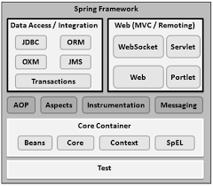

```{=latex}
\end{center}
```

I soli moduli che ci interessano sono:
* **Core package**: parte fondamentale del framework. Consiste in un container leggero che si occupa di _Inversion of Control_ (Dependency Injection).L'elemento fondamentale è _BeanFactory_ che fornisce una implementazione estesa del pattern factory ed elimina la necessità di gestione di singleton a livello di programmazione, permettendo di disaccoppiare configurazione e dipendenze dalla logica applicativa
* **MVC package**: Ampio supporto a progettazione e sviluppo secondo architettura MVC per applicazioni Web

### DEPENDENCY INJECTION IN SPRING

Applicazione più nota e di maggiore successo del principio di Inversion of Control è l'Hollywood Principle: in breve se un attore non ha provini e parti in film o serie tv e quotidianamente chiama il proprio agente cercando di sapere se ci sono parti per lui ma un giorno l'agente gli dice che lo chiamerà lui se avrà una parte a disposizione.\
A livello più professionale, il container si occupa di risolvere (injection) le dipendenze dei componenti attraverso l'opportuna configurazione dell'implementazione dell'oggetto (push). Questo è del tutto opposto ai pattern più classici di istanziazione di componenti o Service Locator, dove è il componente che deve determinare l'implementazione della risorsa desiderata (pull).\
I principali benefici sono:

* **Flessibilità**: eliminazione del codice di lookup nella logica di business
* **Possibilità e facilità di testing**: nessun bisogno di dipendere da risorse esterne o da container in fase di testing. Inoltre esiste la possibilità di abilitare il _testing automatico_
* **Manutenibilità**: permette il riutilizzo in diversi ambienti applicativi cambiando semplicemente i file di configurazione (o in generale le specifiche dependency injection) e non il codice

```{=latex}
\begin{figure}[!ht]
\centering
\includegraphics[width=0.48\linewidth]{senzaDepInj.png}
\includegraphics[width=0.48\linewidth]{conDepInj.png}
\label{dependecy injection}
\end{figure}
```

**Senza Dependecy Injection** (a sinistra): un oggetto/componente deve esplicitamente istanziare gli oggetti/componenti di cui ha necessità (le sue dipendenze). C'è un accoppiamento stretto tra oggetti/componenti.\
**Con Dependency Injection** (a destra): il supporto a Dependency Injection si occupa di creare oggetti/componenti quando necessario e di passarli automaticamente agli oggetti/componenti che li devono utilizzare. Un'idea base per l'implementazione può essere: costruttori in oggetto A che accettano B e C come parametri in ingresso, oppure A contiene metodi setter che accettano interfacce B e C come parametri in ingresso.

#### Implementazione

\
Ci sono due modi per implementare la Dependency Injection:

* A livello **costruttore**: dipendenze fornite attraverso i costruttori dei componenti
```java
public class ConstructorInjection {
    private Dependency dep;
    public ConstructorInjection(Dependency dep) {
        this.dep = dep; 
    } 
}
```
* A livello di metodi **setter**: dipendeze fornite attraverso i metodi di configurazione dei componenti (metodi setter in stile JavaBean). Nella comunità degli sviluppatori è la più usata.
```java
public class SetterInjection {
    private Dependency dep;
    public void setMyDependency(Dependency dep) {
        this.dep = dep; 
    } 
}
```

#### BEANFACTORY

\
L'oggetto BeanFactory è responsabile della gestione dei bean che usano Spring e delle loro dipendenze.\
Ogni applicazione interagisce con la dependency injection di Spring (IoC container) tramite l'interfaccia `BeanFactory`: l'oggetto `BeanFactory` viene creato dall'applicazione nella forma di `XmlBeanFactory`, una volta creato l'oggetto legge un file di configurazione e si occupa di fare l'injection (wiring).\
`XmlBeanFactory` è un'estensione di `DeafultBeanFactory` per leggere definizioni di bean da un oggetto XML.\
Ad esempio:
```java
public class XmlConfigWithBeanFactory {
    public static void main(String[] args) {
        XmlBeanFactory factory = new XmlBeanFactory(new FileSystemResource("beans.xml"));
        SomeBeanInterface b = (SomeBeanInterface) factory.getBean(“nameOftheBean”); 
    } 
}
```

#### File di configurazione

\
\
A livello di metodo **setter**:
```xml
<!DOCTYPE beans PUBLIC "-//SPRING//DTD BEAN//EN" 
    "http://www.springframework.org/dtd/spring-beans.dtd">
<beans>
    <bean id="renderer" class="StandardOutMessageRenderer">
        <property name="messageProvider">
            <ref local="provider"/>
        </property>
    </bean>
    <bean id="provider" class="HelloWorldMessageProvider"/>
</beans>
```

Oppure a livello di **costruttore**:
```xml
...
<beans>
    <bean id="provider" class="ConfigurableMessageProvider">
        <constructor-arg>
            <value> Questo è il messaggio configurabile</value>
        </constructor-arg>
    </bean> 
</beans>
```

#### Uso della Dependency Injection

```java
public class ConfigurableMessageProvider implements MessageProvider {
    private String message;
    // usa dependency injection per config. del messaggio
    public ConfigurableMessageProvider(String message) {
        this.message = message;
    }
    public String getMessage() { return message; }
}
```

\
\
Per chiarezza a livello grafico ecco la differenza fra modello a container pesante e leggero:

```{=latex}
\begin{center}
```
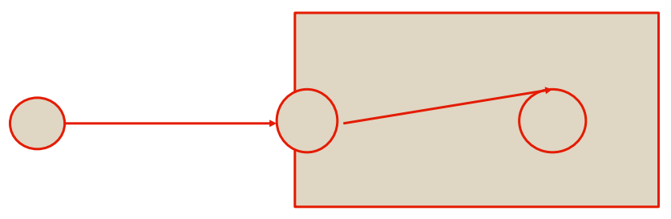{width=300px}

```{=latex}
\end{center}
```

```{=latex}
\begin{center}
```
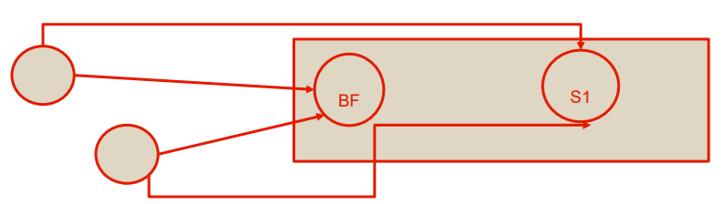{width=300px}

```{=latex}
\end{center}
```

Logicamente ci sono svantaggi e vantaggi (alcuni elencati sotto):

* Prestazioni

    - il modello a container leggero è leggermente più veloce
    - il modello a container pesante è più lento

* Passaggio per proxy

    - nel modello a container leggero il client passa attraverso un proxy solo la prima volta, dopo è difficile controllare che cosa fa il client tramite il link diretto fornito
    - nel modello a container pesante il client è obbligato a passare tramite un proxy, quindi è facile controllare l'accesso a determinate risorse

* Livello

    - il modello a container leggero è un modello a più basso livello, ciò può essere un vantaggio se usato nel modo giusto, ma risulta più complicato se non lo si usa nella maniera corretta
    - il modello a container pesante è più ad alto livello

* Overhead

    - il modello a container leggero presenta poco overhead
    - il modello a container pesante presenta molto più overhead

* Trasparenza

    - il modello a container leggero è poco trasparente quindi è più facile vedere l'implementazione di determinate cose
    - il modello a container pesante è molto trasparente

#### Tipo di parametri di Injection

Spring supporta diversi tipi di parametri con cui fare injection:

1. Valori semplici
2. Bean all'interno della stessa factory
3. Bean anche in diverse factory
4. Collezioni (collection)
5. Proprietà definite esternamente

Tutti questi tipi possono essere usati sia per injection sui costruttori che sui metodi setter. Ad esempio:
```xml
<beans>
    <bean id="injectSimple" class="InjectSimple">
        <property name="name"> <value>John Smith</value></property>
        <property name="age"> <value>35</value> </property>
        <property name="height"> <value>1.78</value> </property>
    </bean>
</beans>
```
Se le dipendenze scritte a loro volta hanno delle dipendeze da altri bean le injection vengono fatte ricorsivamente fino all'ultima: se un bean dipende da un altro bean automaticamente viene fatta l'injection anche del secondo bean e così via.\
\
Si può fare l'injection di bean dalla stessa factory. È usata quando è necessario fare injection di un bean all'interno di un bean (target bean).\
Si usa il tag `<ref>` in `<property>` o `<constructor-arg>` del target bean.\
Viene fatto un controllo lasco sul tipo del bean iniettato rispetto a quanto definito dal target: se il tipo definito nel target è **un'interfaccia** il bean injected deve essere un'implementazione di tale interfaccia, se il tipo nel terget è una **classe** il bean injected deve essere della stessa classe o di una sottoclasse.\
Ad esempio: 
```xml
<beans>
    <bean id="injectRef" class="InjectRef">
        <property name="oracle">
            <ref local="oracle"/>
        </property>
    </bean>
</beans>
```

#### Naming dei componenti Spring

\
Come fa BeanFactory a trovare il bean richiesto (pattern singleton come comportamento di default)?

> Ogni bean deve avere un nome unico all'interno della BeanFactory contenente.

La procedura per la risoluzione dei nomi è: 

* Se un tag `<bean>` ha un attributo di nome **_id_**, il valore di questo attributo viene usato come nome
* Se non c'è l'attributo id, Spring cerca un attributo **_name_**
* Se non è definito né id né name, Spring usa il nome della classe del bean come suo nome 

### SUPPORTO A MVC IN SPRING

Supporto a componenti "controller", responsabili per interpretare richieste utente e interagire con business object application.\
Una volta che il controller ha ottenuto i risultati (parte model), decide a quale view fare forwarding del model; view utilzza i dati in model per creare una presentazione verso l'utente.\
I vantaggi sono:

* Chiara separazione ruoli: controller, validator, oggetti command/form/model, DispatcherServlet, handler mapping, view resolver, ...
* Adattabilità e riutilizzabilità: possibilità di utilizzare qualsiasi classe per controller purché implementi interfacciapredefinita
* Flessibilità nel trasferimento model: via un Map nome/valore, quindi possibilità di integrazione con svariate tecnologie per view
* Facilità di configurazione: grazie al meccanismo standard di dependency injection di Spring
* Handler mapping e view resolution configurabili
* Potente libreria di JSP tag (Spring tag library): supporto a varie possibilità di temi (theme)
* Componenti con ciclo di vita scoped e associati automaticam a HTTPrequest o HTTPsession (grazie a WebApplicationContext di Spring)

#### Spring DispatcherServlet

\
\
È progettato attorno ad una servlet centrale che fa da dispatcher delle richieste (DispatcherServlet) completamente integrata con _IoC container_ di Spring. La DispatcherServlet può essere viso come "Front Controller". Essendo DispatcherServlet una normalissima servlet e quindi serve URL mapping tramite `web.xml`.\
La devo scrivere io?

> No. È già presente all'interno di Spring

Come funziona?

* Intercetta le HTTP Request in ingresso che giungono al web container
* Cerca un controller che sappia gestire la richiesta
* Invoca il controller ricevendo un model (output business logic) e una view
* Cerca un View Resolver opportuno tramite cui scegliere la view e creare una HTTP response

```{=latex}
\begin{center}
```
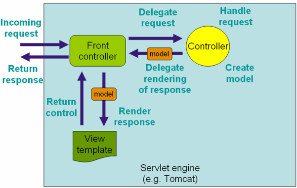{width=320px}

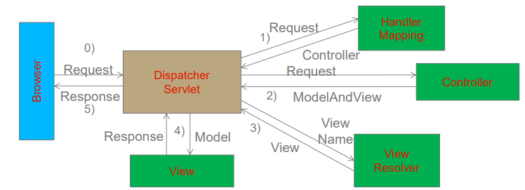{width=400px}

```{=latex}
\end{center}
```

In sintesi le operazioni svolte da DispatcherServlet sono:

* WebApplicationContext è associato alla richiesta (controller e altri componenti potranno utilizzarlo) `DispatcherServlet.WEB_APPLICATION_CONTEXT_ATTRIBUTE`
* "locale" resolver associato alla richiesta (può servire nel processamento richiesta e view rendering)
* theme resolver associato alla richiesta (view potranno determinare quale theme usare)
* Viene cercato un handler appropriato. Se trovato, viene configurata una catena di esecuzione associata all’handler (preprocessori, postprocessori e controller); risultato è preparazione di model
* Se restituito un model, viene girato alla view associata (perché un model potrebbe non essere ricevuto?)

#### Spring Controller

\
\
Spring supporta la nozione di controller in modo astratto permettendo creazione di ampia varietà di controller: form-specific controller, command-based controller, controller che eseguono come wizard ecc.\
La base di partenza è un'interfaccia:
```java
org.springframework.web.servlet.mvc.Controller
public interface Controller {
    ModelAndView handleRequest( HttpServletRequest request,
            HttpServletResponse response) throws Exception; 
} 
```
Molte implementazioni di questa interfaccia sono già disponibili: ad esempio l'`AbstractController`. Questa classe offre già supporto per il caching: quando lo si usa come baseclass è necessario fare l'overriding di metodo: `handleRequestInternal(HttpServletRequest, HttpServletResponse)`. Una possibile implementazione è:
```java
public class SampleController extends AbstractController {
    public ModelAndView handleRequestInternal( HttpServletRequest request,
                    HttpServletResponse response) throws Exception {
        ModelAndView mav = new ModelAndView("hello");
        mav.addObject("message", "Hello World!");
        return mav; 
    } 
}
```
`AbstractController` opera automaticamente direttive di caching verso il cliente per obbligarlo a caching locale. Nell'esempio di config XML seguente per esempio il tempo è di 2 minuti:
```xml
<bean id="sampleController" class="samples.SampleController">
    <property name="cacheSeconds" value="120"/> 
</bean>
```

Altri implementazioni possibili sono:

* ParameterizableViewController: simile all’esempio precedente, con possibilità di specificare nome view in Web application context (senza bisogno di farne hard-code nella classe Java del controllore)
* UrlFilenameViewController: esamina URL passato, estrae filename del file richiesto e lo usa automaticam. come nome di view

#### Command Controller

\
\
Command controller permettono di associare dinamicam. parametri di `HttpServletRequest` verso oggetti dati specificati. Alcuni controller disponibili sono:

* AbstractCommandController: \
    nessuna funzionalità form, solo consente di specificare che fare con
    oggetto command (JavaBean) popolato automaticam. coi parametri richiesta
* AbstractFormController: \
    offre supporto per form; dopo che utente ha compilato form, mette i
    campi in oggetto command. Il programmatore deve specificare metodi
    per determinare quali view utilizzare per presentazione form
* SimpleFormController:\
    oltre al precedente, anche nome view per form, nome view per pagina
    da mostrare all’utente quando form submission completata con successo, ecc
* AbstractWizardFormController:\
    il programmatore deve implementare metodi (abstract) `validatePage()`,
    `processFinish()` e `processCancel()`; altri metodi di cui fare overriding sono
    referenceData (per passare model ad una vista sotto forma di oggetto Map);
    getTargetPage (se wizard vuole cambiare ordine pagine o omettere pagine
    dinamicamente), onBindAndValidate(se si desidera overriding del flusso usuale di
    associazione valori e validazione form)


#### Spring Handler

\
\
Funzionalità base: fornitura di HandlerExecutionChain, che contiene un handler per la richiesta e può contenere una lista di handler interceptor da applicare alla richiesta, prima o dopo esecuzione dell'handler.\
All’arrivo di una richiesta, DispatcherServlet la gira a handler per ottenere un HandlerExecutionChain appropriato; poi DispatcherServlet esegue i vari passi specificati nella chain.\
Concetto potente e molto generale: si pensi ad un handler custom che determina una specifica catena non solo sulla base dell’URL della richiesta ma anche dello stato di sessione associata.\
Diverse possibilità per handler mapping in Spring. Maggior parte estendono AbstractHandlerMapping e condividono le proprietà seguenti:

* _interceptors_: lista degli intercettori 
* _defaultHandler_: default da utilizzare quando no matching specifico possibile
* _order_: basandosi su questa proprietà (org.springframework.core.Ordered), Spring ordina tutti handler mapping disponibile e sceglie il primo in lista

#### Spring View

\
\
Spring mette a disposizione anche componenti detti "view resolver" per semplificare rendering di un model su browser, senza legarsi a una specifica tecnologia per view (ad es. collegandosi a JSP, Velocity template, ecc).\
Due interfacce fondamentali sono ViewResolver e View:

* _ViewResolver_: per effettuare mapping fra nomi view e reale implementazione di view
* _View_: per preparazione richieste e gestione richiesta verso una tecnologia di view

Possibili ViewResolver sono:

* AbstractCachingViewResolver:\
    realizza trasparentemente caching di view per ridurre tempi preparazione
* XmlViewResolver:\
Accetta file di configurazione XML con stessa DTD della classica bean factory Spring. File di configurazione /WEB-INF/views.xml
* UrlBasedViewResolver:\
Risolve direttamente nomi simbolici di view verso URL

### SPRING TAG E GESTIONE ECCEZIONI

#### Spring tag library

Ampio set di tag specifici per Spring per gestire elementi di form quando si utilizzano JSP e Spring MVC:

* Accesso a oggetto command
* Accesso a dati su cui lavora controller

Libreria di tag contenuta in spring.jar, descrittore chiamato spring-form.tld, per utilizzarla:
```tld
<%@ taglib prefix="form" uri="http://www.springframework.org/tags/form" %>
```
dove `form` è prefisso che si vuole utilizzare per indicare tag nella libreria

#### Gestione eccezioni

`HandlerExceptionResolver` per semplificare gestione di eccezioni inattese durante esecuzione controller; eccezioni contengono info su handler che stava eseguendo al momento dell’eccezione.\
Implementazione di interfaccia `HandlerExceptionResolver` (metodo `resolveException(Exception, Handler)` e restituzione di oggetto `ModelAndView`).\
Possibilità di uso di classe `SimpleMappingExceptionResolver`, con mapping automatico fra nome classe eccezione e nome view

### Convenzioni e configurazione di default

In molti casi è sufficiente usare convenzioni pre-stabilite e ragionevoli default per fare mapping senza bisogno di configurazione. Approccio basato su **Convention-over-configuration**: Riduzione quantità di configurazioni necessarie per configurare handler mapping, view resolver, istanze ModelAndView, ecc. Vantaggi soprattutto in termini di prototipazione rapida.\
Ad esempio, per `Controller`, la classe `ControllerClassNameHandlerMapping` usa convenzione per determinare mapping fra URL e istanze controller. Ad es.:
```java
public class ViewShoppingCartController implements Controller {
    public ModelAndView handleRequest(HttpServletRequest request,
        HttpServletResponse response) { ... } 
} 
```
```xml
<bean
    class="org.springframework.web.servlet.mvc.support.ControllerClassNa
    meHandlerMapping"/>
<bean id="viewShoppingCart"
class="x.y.z.ViewShoppingCartController"> 
    ...
</bean>
```

ControllerClassNameHandlerMapping trova vari bean controller definiti e toglie
"Controller" dal nome per definire automaticamente mapping. Ad es:

* WelcomeController si mappa su URL: /welcome*
* HomeController si mappa su URL: /home*
* IndexController si mappa su URL: /index*

## NODE JS E HTTP 3.0

### NODE JS

L'idea centrale è il supporto efficiente ad I/O asincrono non-bloccante. È una tecnologia server-side senza l'utilizzo di thread/processi dedicati. È maggiormente scalabile e va verso l'esasperazione del concetto di server stateless.\
Per l'utilizzo di nodejs è necessario server-side un runtime environment JS che ospiti Google Chrome V8 engine: soluzione server-side per JS che compila il codice (a differenza del classico interprete) per una maggiore efficienza runtime.\
È stato progettato per un'estrema concorrenza e scalabilità, senza thread o processi dedicati definiti a livello di applicazione. In più è **sempre** non bloccante, persino per chiamate I/O-oriented.\
Nodejs sfrutta la sematica ad **Event loop**: al posto dei thread usa un event loop con stack riducendo fortemente overhead di context switching. In più usa il framework `CommonJS` leggermente più simile a un vero linguaggio di programmazione Object Oriented.

#### Thread vs. Event-driven

+--------------------------------+--------------------------------------+
| **Thread**                     | **Asynchronous Event-driven**        |
+================================+======================================+
| Blocca applicazione/richieste  | Un solo thread, che fa ripetutamente |
| con listener-worker thread     | fetching di eventi da una coda       |
+--------------------------------+--------------------------------------+
| Usa modello incoming-request   | Usa una coda di eventi e processa    |
|                                | eventi presenti                      |
+--------------------------------+--------------------------------------+
| Multithreaded server potrebbe  | Salva stato e passa poi a processare |
| bloccare una richiesta che     | il prossimo evento in coda           |
| coinvolge eventi multipli      |                                      |
+--------------------------------+--------------------------------------+
| Usa context switching          | No contention e NO context           |
|                                | switching                            |
+--------------------------------+--------------------------------------+
| Usa ambienti multithreading in | Usa framework con meccanismi per     |
| cui listener e worker thread   | il cosiddetto I/O asincrono          |
| spesso acquisiscono            | (callback, NO poll/select,           |
| incoming-request lock          | O_NONBLOCK)                          |
+--------------------------------+--------------------------------------+

# WEBSOCKET E JSF

## WEB SOCKET

I limiti del modello HTTP si presentano quando si ha bisogno di usare HTTP per comunicazione 2-way:

* Pollimg
* Long polling
* Streaming/forever response
* Connessioni multiple

Allora è stata ideata un'estensione (proprietaria) e la tecnologia Web Socket.\
Le Web Socket possono servire a migliorare lo sviluppo (più facile e naturale) ed esecuzione runtime di applicazioni web bidirezionali e non strettamente request-response.\
\
La prima soluzione proprietaria integrata con JS in alcuni browser e poi supportata da specifici Web server. Grazie al fatto che le web socket hanno avuto molto successo sono state standardizzate:

* Protocollo Web Socket (basato su TCP/IP) - RFC 6455
* Integrazione di Web Socket in HTML 5 (via JS) e in JEE (a partire da v7)
* Web Socket API per Java definite in JSR 356 (equivalente di un RFC ma della Java community)

### I LIMITI DI HTTP

I limiti di HTTP si vedono subito quando si tratta di un'interazione 2-way. Ci sono alcuni metodi per ovviare a ciò che però sono MOLTO poco efficienti e altamente sconsigliati (per questo sono state inventate le web socket):

#### Polling

```{=latex}
\begin{center}
```
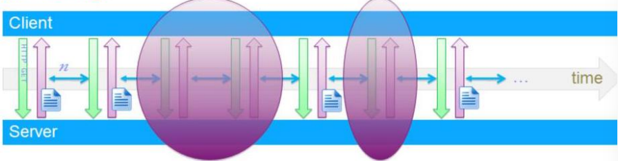{width=400px}

```{=latex}
\end{center}
```
Realizzabile anche in JS per esempio.\
Il client fa polling a intervalli prefissati e server risponde immediatamente, il che è una soluzione ragionevole quando periodicità nota e costante, e logicamente è inefficiente quando il server non ha dati da trasferire.

#### Long Polling

```{=latex}
\begin{center}
```
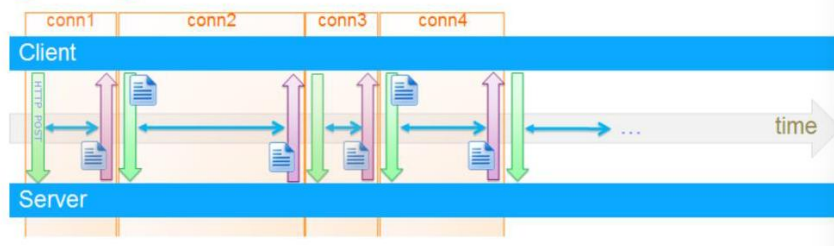{width=400px}

```{=latex}
\end{center}
```
Client manda la richiesta iniziale e il server attende fino a che ah dati da inviare, quando il client riceve la risposta reagisce mandando immediatamente una nuova richiesta. Ogni request/response si appoggia a una nuova connessione.

#### Streaming/forever response

```{=latex}
\begin{center}
```
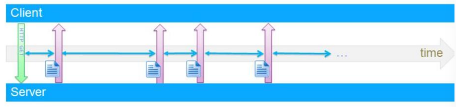{width=400px}

```{=latex}
\end{center}
```
Il cliente manda la richiesta iniziale e il server attende fino a che ha dati da inviare. Il server risponde con streaming su una connessione mantenuta sempre aperta per aggiornamenti push (risposte parziali). La comunicazione diventa sostanzialmente half-duplex: solo server to client dopo la prima request del client.\
Uno dei tanti problemi può essere che i proxy intermedi potrebbero avere difficoltà con le risposte parziali.

#### Connessioni multiple

```{=latex}
\begin{center}
```
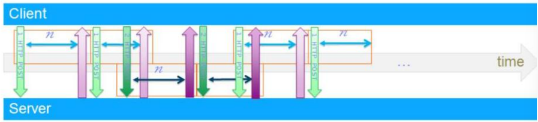{width=400px}

```{=latex}
\end{center}
```

È long polling su due connessioni HTTP separate:

* Una per long polling tradizionale
* Una per dati da cliente verso servitore

Complesso è il coordinamento e la gestione connessioni e logicamente c'è overhead di due connessioni per ogni cliente.

### LE PRINCIPALI CARATTERISTICHE DELLE WEBSOCKET

Le principali caratteristiche delle websocket sono:

* **Bi-direzionali**: client e server possono scambiarsi messaggi quando desiderano
* **Full-duplex**: nessun requisito di interazione solo come coppia request/response e di ordinamento messaggi
* **Unica connessione long running**
* **Visto come «upgrade» di HTTP**: nessuno sfruttamento di protocollo completamente nuovo, nessun bisogno di nuova «infrastruttura»
* **Uso efficiente di banda e CPU**: messaggi possono essere del tutto dedicati a dati applicativi
* **Handshake**: cliente comincia connessione e servitore risponde accettando upgrade
* **Una volta stabilita connessione Web Socket**: entrambi endpoint notificati che socket è aperta ed entrambi endpoint possono inviare messaggi e chiudere socket in ogni istante

```{=latex}
\begin{center}
```
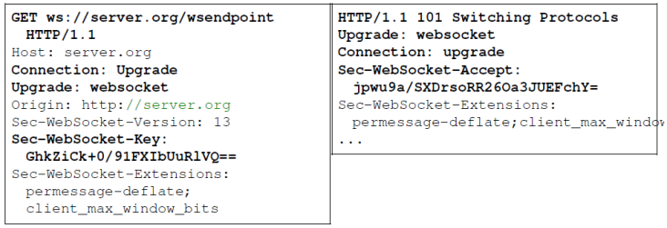{width=400px}

```{=latex}
\end{center}
```

#### Metodi per ottimizzare i messaggi

Per l'ottimizzazione dei messaggi si è deciso che i dati vengono trasmessi con un minimo overhead in termini di header, e vie è, inoltre, la possibilità di frammentare un messaggio in più frame (però un frame NON può contenere più messaggi).

```{=latex}
\begin{center}
```
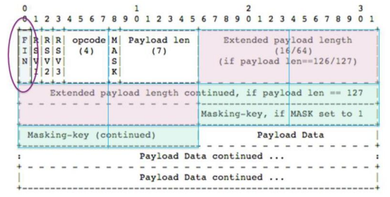{width=400px}

```{=latex}
\end{center}
```

### WEBSOCKET API LATO SERVER

Approccio delle websocket è integrato con JS lato client e la programmazione JEE lato server.\
Le API lato server (JSR-356) sono:

* Per la gestione del ciclo di vita:
    - `onOpen`
    - `onClose`
    - `onError`
* Per la comunicazione tramite messaggio:
    - `onMessage`
    - `send`
* Possibilità dell'uso della sessione
* Encoder e decoder per la formattazione dei messaggi

Ad esempio:
```java
@ServerEndpoint("/actions")
public class WebSocketServer{
    @OnOpen
    public void open(Session session){ ... }

    @OnClose
    public void close(Session session){ ... }

    @OnError
    public void onError(Throwable error){ ... }

    @OnMessage
    public void handleMessage(String message, Session session){
        // message processing
    }
}
```

### INVIO E RICEZIONE MESSAGGI

Gli endpoint WebSocket possono inviare/ricevere messaggi sotto forma di testo o binary.

#### Invio

\
\
Per l'invio serve seguire i seguenti passi:

1. Ottenere oggetto Session dalla connessione: disponibile come parametro in molti metodi. Ad esempio, nel metodo che ha ricevuto un messaggio (metodo annotato con `@OnMessage`); oppure, come variabile di istanza della classe endpoint nel metodo `@OnOpen`
2. Usare oggetto Session per ottenere un RemoteEndpoint: Session.getBasicRemote e Session.getAsyncRemote restituiscono RemoteEndpoint.Basic e RemoteEndpoint.Async rispettivamente:
    * `void RemoteEndpoint.Basic.sendText(String text)`
    * `void RemoteEndpoint.Basic.sendBinary(ByteBuffer data)`
    * `void RemoteEndpoint.Basic.sendPing(ByteBuffer appData)`
3. Inviare messaggi a tutti i peer connessi a un Endpoint: ogni istanza di classe endpoint class è normalmente associata con una connessione e un peer; tuttavia, è possible anche associare una istanza a una pluralità di peer connessi, per esempio per applicazioni di chat, quindi si usa l'interfaccia session e il metodo `getOpenSessions`

```java
@ServerEndpoint("/echoall")
public class EchoAllEndpoint {
    @OnMessage
    public void onMessage(Session session, String msg) {
        try {
            for (Session sess : session.getOpenSessions()){ 
                if (sess.isOpen())
                    sess.getBasicRemote().sendText(msg); 
            } 
        }
    catch (IOException e) { ... } 
    } 
}
```

#### Ricevere

\
\
Per quanto riguarda la ricezione è utile sapere che si possono avere al massimo 3 metodi annotati con `@OnMessage` in un endpoint, uno per ogni tipo di messaggio: text, binary o ping.

```java
@ServerEndpoint("/receive")
public class ReceiveEndpoint {
    @OnMessage
    public void textMessage(Session session, String msg) {
        System.out.println("Text message: " + msg); 
    }
    @OnMessage
    public void binaryMessage(Session session, ByteBuffer msg) {
        System.out.println("Binary message: " + msg.toString()); 
    }
    @OnMessage
    public void pingMessage(Session session, PongMessage msg) {
        System.out.println("Pong message: " + msg.getApplicationData().toString()); 
    } 
}
```

### MANTENIMENTO DELLO STATO DEL CLIENT

Il container lato server crea una istanza della classe endpoint per ogni connessione, quindi si possono usare variabili di istanza per salvare stato cliente.\
Inoltre, il metodo `Session.getUserProperties` restituisce una modifiable map per memorizzare proprietà utente.
```java
@ServerEndpoint("/delayedecho")
public class DelayedEchoEndpoint {
    @OnOpen 
    public void open(Session session) {
        session.getUserProperties().put("previousMsg", " "); 
    }
    @OnMessage 
    public void message(Session session, String msg) {
        String prev = (String) session.getUserProperties().get("previousMsg");
        session.getUserProperties().put("previousMsg", msg);
        try { session.getBasicRemote().sendText(prev); }
        catch (IOException e) { ... } 
    } 
} 
```
In realtà per le info comuni a tutti i clienti si possono usare le variabili di classe (static), in tal caso la responsabilità di assicurare la thread-safety ricade sullo sviluppatore.

### USO DI ENCODER E DECODER

Le Java API per le WebSocket forniscono supporto per la conversione di messaggi WebSocket se e solo se sono oggetti Java su cui è stato usato un encoder e per decifrarlo un decoder.\
Lo sviluppatore non deve preoccuparsi della serializzazione e deserializzazione dei processi perchè è tutto automatico.\
Encoder tipici generano rappresentazioni JSON, XML o binarie a partire da oggetti Java.

#### Uso di encoder

\
\
Per utilizzare l'encoder bisogna prima realizzarlo.\
Per realizzare l'encoder bisogna creare una classe che implementi una delle due interfaccie:

* `Encoder.Text<T>` per messaggi testuali
* `Encoder.Binary<T>` per messaggi binary

Queste interfacce specificano il metodo `encode`. Occorre quindi implementare una encoder class per ogni tipo Java custom che si vuole inviare come messaggio WebSocket.\
Inoltre, serve aggiungere il nome delle classi encoder al parametro opzionale della annotazione `@ServerEndpoint`.\
Infine per fare l'encoding dell'oggetto e mandarlo serve utilizzare il metodo `sendObject(Object data)` di `RemoteEndpoint.Basic` o di `RemoteEndpoint.Async`, così facendo il container cerca un encoder che faccia il match con il tipo e lo usa per la conversione verso un messaggio WebSocket.\
Ad esempio se volessi inviare 2 tipi Java (`MessageA` e `MessageB`) come messaggi testuali:

```java
public class MessageATextEncoder implements Encoder.Text<MessageA> {
    @Override public void init(EndpointConfig ec) { }
    @Override public void destroy() { }
    @Override
    public String encode(MessageA msgA) throws EncodeException {
        // Access msgA's properties and convert to JSON text...
        return msgAJsonString;
    }
}

public class MessageBTextEncoder implements Encoder.Text<MessageA> {
    @Override public void init(EndpointConfig ec) { }
    @Override public void destroy() { }
    @Override
    public String encode(MessageA msgB) throws EncodeException {
        // Access msgB's properties and convert to JSON text...
        return msgBJsonString;
    }
}

@ServerEndpoint(
 value = "/myendpoint",
 encoders = { MessageATextEncoder.class, MessageBTextEncoder.class }
)
public class EncEndpoint { ... }
...
MessageA msgA = new MessageA(...);
MessageB msgB = new MessageB(...);
session.getBasicRemote.sendObject(msgA);
session.getBasicRemote.sendObject(msgB);
```

Come per gli endpoint, le istanze di encoder sono associate con una connessione e un peer WebSocket, quindi c'è solo 1 thread ad eseguire il codice di un'istanza di encoder ad ogni istante.

#### Uso di decoder

\
\
La procedura per il decoder è identica, solo che le interfaccie da implementare sono (una delle 2):

* `Decoder.Text<T>` per i messaggi testuali
* `Decoder.Binary<T>` per i messaggi binary

Come detto la procedura è identica tranne per il fatto che non serve creare una decoder class per ogni tipo Java custom che si vuole ricevere.\
Passando direttamente all'esempio:
```java
public class MessageTextDecoder implements Decoder.Text<Message> {
    @Override public void init(EndpointConfig ec) { }
    @Override public void destroy() { }
    @Override public Message decode(String string) throws DecodeException {
        // Read message...
        if ( /* message is an A message */ )
            return new MessageA(...);
        else if ( /* message is a B message */ )
            return new MessageB(...);
    }
    @Override
    public boolean willDecode(String string) {
        return canDecode;
    } 
}

@ServerEndpoint(
 value = "/myendpoint",
 encoders = { MessageATextEncoder.class, MessageBTextEncoder.class },
 decoders = { MessageTextDecoder.class }
)
public class EncDecEndpoint { ... }

...
@OnMessage
public void message(Session session, Message msg) {
    if (msg instanceof MessageA) {
        // We received a MessageA object...
    } else if (msg instanceof MessageB) {
        // We received a MessageB object...
    }
}
```

Come per gli endpoint, le istanze di decoder sono associate con una sola connessione e un solo peer WebSocket, quindi un solo thread esegue il codice di una istanza di decoder in ogni istante.

### INTEGRAZIONE CON JAVASCRIPT E WEBSOCKET API LATO CLIENT

Un esempio introduttivo:
```javascript
var socket = new WebSocket("ws://server.org/wsendpoint");
socket.message = (event) => {
    var data = JSON.parse(event.data);
    if(data.action === "addMessage"){
        //message processing...
    }
    if(data.action === "removeMessage"){
        //message processing...
    }
}
```

#### WebSocket in JS

\
\
_Costruttore_: `WebSocket(url[, protocols])`\
Alcune delle **proprietà** principali:

* `WebSocket.bufferedAmount`: sola lettura, numero di byte di dati accodati
* `WebSocket.onclose`: listener all’evento di chiusura della connessione
* `WebSocket.onerror`: listener all’evento di errore sull’uso della WebSocket
* `WebSocket.onmessage`: listener all’evento di ricezione di un messaggio dal server
* `WebSocket.onopen`: listener all’evento di connessione aperta
* `WebSocket.protocol`: sola lettura, sub-protocol selezionato dal servitore
* `WebSocket.readyState`: sola lettura, stato corrente della connessione (WebSocket.CONNECTING 0, WebSocket.OPEN 1, WebSocket.CLOSING 2, WebSocket.CLOSED 3) 
* `WebSocket.url`: sola lettura, URL assoluto associato

**Metodi**:

* `WebSocket.close([code[, reason]])`: chiude la connessione
* `WebSocket.send(data)`: accoda nuovi dati per l’invio

**Eventi**: \
è possibile agganciarsi a questi eventi usando addEventListener() o assegnando un event listener alla proprietà onNomeEvento

* `close`: evento di chiusura connessione, anche disponibile tramite proprietà onclose
* `error`: evento di errore che ha prodotto la chiusura di WebSocket, ad esempio con mancato invio di un dato; anche disponibile tramite proprietà onerror
* `message`: evento associato alla ricezione di un messaggio dal server, anche disponibile tramite proprietà onmessage
* `open`: evento di apertura di una connessione WebSocket, anche disponibile tramite proprietà onopen

## JSF

È una tecnologia fortemente basata su componenti, sia da inserire nelle pagine web sia collegati tramite essi a componenti server-side (backend bean). Sono ricche di API per la rappresentazione di componenti, per la gestione del loro stato, per la gestione degli eventi, validazione e conversione dati server-side, definizione di percorso di navigazione delle pagine e supporto all'internaionalizzazione.\
Ha un'ampia libreria di tag per aggiungere componenti a pagine web e per collegarli a componenti server side.\
Può essere considerato on top del supporto Java Servlet e come alternativa a JSP.

```{=latex}
\begin{center}
```
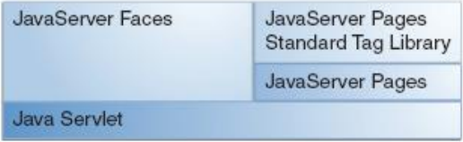{width=400px}

```{=latex}
\end{center}
```

### ESEMPIO INIZIALE

Per iniziare si può costruire un backend bean (o managed bean) in modo semplice.

```java
package hello;
import javax.faces.bean.ManagedBean;
@ManagedBean
public class Hello {
    final String world = "Hello World!";
    public String getworld() {
        return world; 
    }
}
```
La notazione `@ManagedBean` registra automaticamente il componente come risorsa utilizzabile all'interno del container JSF, da parte di tutte le pagine che conoscano come riferirlo.\
Il bean creato (se pur semplice) contiene il cui risultato finale è, in modo diretto o tramite invocazione di altri componenti, di produrre dati _model_.\
Si procede creando una pagina web scritta in XHTML che usi il backing bean. La connessione tramite pagina web e componente avviene tramite espressioni in Expression Language (EL).
```xml
<html xmlns="http://www.w3.org/1999/xhtml" xmlns:h="http://java.sun.com/jsf/html">
    <h:head>
        <title>Facelets Hello World</title>
    </h:head>
    <h:body>
        #{hello.world}
    </h:body>
</html>
```
Il linguaggio per la costruzione di view JSF e di alberi di componenti si chiama **Facelets** (supporto a XHTML, tag library per Facelets/JSF, supporto per EL, templating per componenti e pagine Web).\
Nella tecnologia JSF è inclusa una servlet predefinita chiamata **FacesServlet** che si occupa della gestione delle richieste per pagine JSF (serve mapping tramite solito descrittore di deployment, web.xml).
```xml
<servlet>
    <servlet-name>Faces Servlet</servlet-name>
    <servlet-class>javax.faces.webapp.FacesServlet</servlet-class>
    <load-on-startup>1</load-on-startup>
</servlet>
<servlet-mapping>
    <servlet-name>Faces Servlet</servlet-name>
    <url-pattern>/faces/*</url-pattern>
</servlet-mapping>
```

### CICLO DI VITA DI UNA FACELETS APP

Prima di specificare il ciclo di vita è importante notare che il programmatore può non voler avere la visibilità della gestione del ciclo di vita dell'applicazione Facelets che è svolta, infatti, automaticamente dal container per JSF (che è il solito container JSP/Servlet, ma con il supporto a JSF).\
\
Il ciclo di vita tipico, quindi, è:

1. Deployment dell’applicazione su server; prima che arrivi prima richiesta utente, applicazione in stato non inizializzato (anche non compilato)
2. Quando arriva una richiesta, viene creato un albero dei componenti contenuti nella pagina (messo in FacesContext), con validazione e conversione dati automatizzata
3. Albero dei componenti viene popolato con valori da backing bean (uso di espressioni EL), con possibile gestione eventi e handler
4. Viene costruita una view sulla base dell’albero dei componenti
5. Rendering della vista al cliente, basato su albero componenti
6. Albero componenti deallocato automaticamente
7. In caso di richieste successive (anche postback), l’albero viene ri-allocato

```{=latex}
\begin{figure}[!ht]
\centering
\includegraphics[width=0.48\linewidth]{lifecycleJSF1.png}
\includegraphics[width=0.48\linewidth]{lifecycleJSF2.png}
\label{Prima parte del ciclo di vita delle JSF}
\caption{Prima parte del ciclo di vita delle JSF}
\end{figure}
```

```{=latex}
\begin{figure}[!ht]
\centering
\includegraphics[width=0.48\linewidth]{lifecycleJSF3.png}
\includegraphics[width=0.48\linewidth]{lifecycleJSF4.png}
\label{Seconda parte del ciclo di vita delle JSF}
\caption{Seconda parte del ciclo di vita delle JSF}
\end{figure}
```

### JSF MANAGED BEAN

Sono configurati nella seconda parte di faces-config.xml\
Sono dei semplici JavaBean che seguono delle regole standard:

* Costruttore senza argomenti (empty)
* No variabili di istanza public
* Metodi "accessor" per evitare accesso diretto a campi
* Metodi `getXxx()` e `setXxx()`

I JSF Managed Beans hanno anche metodi cosiddetti "action": sono metodi invocati automaticamente in risposta ad un'azione utente o ad un evento (sono simili a classi Action di STRUTS).\
Gli scope possibili per questo tipo di bean sono:

* Application – singola istanza per applicazione
* Session – nuova istanza per ogni nuova sessione utente
* Request – nuova istanza per ogni richiesta
* Scopeless – acceduta anche da altri bean e soggetta a garbage collection come ogni oggetto Java

```xml
<managed-bean>
    <managed-bean-name>library</managed-bean-name>
    <managed-bean-class>com.oreilly.jent.jsf.library.model.Library
    </managed-bean-class>
    <!-- 
        Dentro al seguente tag si può mettere: 
            - application
            - session
            - request
            - non mettere niente e allora è scopeless
     -->
    <managed-bean-scope>application</managed-bean-scope>
</managed-bean>
```

### JSF E TEMPLATING

Due delle caratteristiche generali tipiche di JSF sono l'estensione e il riuso. Difatti il templating è fortemente presente all'interno di JSF. Il templating è l'utilizzo di pagine come base (o template) per altre pagine.\
Degli esempi di tag protrebbero essere:

* `ui:insert` – parte di un template in cui potrà essere inserito contenuto (tag di amplissimo utilizzo)
* `ui:component` – definisce un componente creato e aggiunto all'albero dei componenti
* `ui:define` – definisce contenuto con cui pagina “riempie” template (vedi insert)
* `ui:include` – incapsula e riutilizza contenuto per pagine multiple
* `ui:param` – per passare parametri a file incluso

Un esempio di template può essere:\
File: `template.xhtml`
```xml
<!DOCTYPE html PUBLIC "-//W3C//DTD XHTML 1.0 Transitional//EN" 
    "http://www.w3.org/TR/xhtml1/DTD/xhtml1-transitional.dtd">
<html xmlns="http://www.w3.org/1999/xhtml" 
  xmlns:ui="http://java.sun.com/jsf/facelets"
  xmlns:h="http://java.sun.com/jsf/html">
    <h:head>
        <meta http-equiv="Content-Type" content="text/html; charset=UTF-8"/>
        <link href="./resources/css/default.css" rel="stylesheet" type="text/css"/>
        <link href="./resources/css/cssLayout.css" rel="stylesheet" type="text/css"/>
        <title>Facelets Template</title>
    </h:head>
    <h:body>
        <div id="top" class="top">
            <ui:insert name="top">Top Section</ui:insert>
        </div>
        <div>
            <div id="left">
                <ui:insert name="left">Left Section</ui:insert>
            </div>
            <div id="content" class="left_content">
                <ui:insert name="content">Main Content</ui:insert>
            </div>
        </div>
        </h:body>
</html>
```
File che utilizza il template:
```xml
<!DOCTYPE html PUBLIC "-//W3C//DTD XHTML 1.0 Transitional//EN"
    "http://www.w3.org/TR/xhtml1/DTD/xhtml1-transitional.dtd">
<html xmlns="http://www.w3.org/1999/xhtml"
  xmlns:ui="http://java.sun.com/jsf/facelets"
  xmlns:h="http://java.sun.com/jsf/html">
    <h:body>
        <ui:composition template="./template.xhtml">
            <ui:define name="top"> 
                Welcome to Template Client Page
            </ui:define>
            <ui:define name="left">
                <h:outputLabel value="You are in the Left Section"/>
            </ui:define>
            <ui:define name="content">
                <h:graphicImage value="#{resource[’images:wave.med.gif’]}"/>
                <h:outputText value="You are in the Main Content Section"/>
            </ui:define>
        </ui:composition>
    </h:body>
</html>
```
faces-config.xml
```xml
<?xml version='1.0' encoding='UTF-8'?>
...
<faces-config>
    <application>
        <locale-config>
            <default-locale>en</default-locale>
        </locale-config></application>
    <validator>
        <validator-id>ISBNValidator</validator-id>
        <validator-class>
            com.oreilly.jent.jsf.library.validator.ISBNValidator
        <validator-class> 
    </validator>
    <navigation-rule> ...
    <managed-bean> ...
</faces-config> 
```
C'è la necessità di creare questo file soprattutto per la _navigation rule_ e per il _managed bean_.

#### Navigation rule

Ogni regola di navigazione è come un flowchart con un ingresso e uscite multiple possibili.\
Un singolo `<from-view-id>` per fare match con URI. Quando è restituito controllo, la stringa risultato viene valutata (ad es. success, failure, verify, login): 

* <from-outcome> deve fare match con stringa risultato
* <to-view-id> determina URI verso cui fare forwarding

Esempio breve:

```xml
<navigation-rule>
    <from-view-id>/login.xhtml</from-view-id>
    <!-- Caso 1 di navigazione -->
    <navigation-case>
        <from-action>#{LoginForm.login}</from-action>
        <from-outcome>success</from-outcome>
        <to-view-id>/storefront.xhtml</to-view-id>
    </navigation-case>
    <!-- Caso 2 di navigazione -->
    <navigation-case>
        <from-action>#{LoginForm.logon}</from-action>
        <from-outcome>failure</from-outcome>
        <to-view-id>/logon.xhtml</to-view-id>
    </navigation-case>
</navigation-rule>
```

### UN ESEMPIO UN PO' PIÙ COMPLETO

Managed bean:
```java
package guessNumber;
import java.util.Random;
import javax.faces.bean.ManagedBean;
import javax.faces.bean.SessionScoped;
@ManagedBean
@SessionScoped
/*
L’annotazione @SessionScoped fa sì che lo scope del bean sia la
sessione. Altre possibilità: request, application, scopeless
*/
public class UserNumberBean {
    Integer randomInt = null; 
    Integer userNumber = null;
    String response = null; 
    private long maximum=10;
    private long minimum=0;
    public UserNumberBean() {
        Random randomGR = new Random();
        randomInt = new Integer(randomGR.nextInt(10));
        System.out.println("Numero estratto: " + randomInt);
    }
    public void setUserNumber(Integer user_number) { userNumber = user_number; }
    public Integer getUserNumber() { return userNumber; }
    public String getResponse() {
        if ((userNumber != null) && (userNumber.compareTo(randomInt) == 0)) {
            return "Indovinato!";
        } else { return "Mi dispiace, "+userNumber+" non corretto"; }
    }
    public long getMaximum() { return (this.maximum); }
    public void setMaximum(long maximum) { this.maximum = maximum; }
    public long getMinimum() { return (this.minimum); }
    public void setMinimum(long minimum) { this.minimum = minimum; }
}
```
File xhtml con form per indovinare il numero:
```xml
<!DOCTYPE html PUBLIC "-//W3C//DTD XHTML 1.0 Transitional//EN"
  "http://www.w3.org/TR/xhtml1/DTD/xhtml1-transitional.dtd">
<html xmlns="http://www.w3.org/1999/xhtml"
  xmlns:h="http://java.sun.com/jsf/html"
  xmlns:f="http://java.sun.com/jsf/core">
    <h:head>
        <title>Guess Number Facelets Application</title>
    </h:head>
    <h:body> 
        <h:form>
            <h:graphicImage value="#{resource[’images:wave.med.gif’]}"/>
            <h2> 
                Sto pensando a un numero fra #{userNumberBean.minimum}
                e #{userNumberBean.maximum}. Vuoi indovinarlo? 
                <p></p>
                <h:inputText id="userNo" value="#{userNumberBean.userNumber}">
                <f:validateLongRange minimum="#{userNumberBean.minimum}"
                  maximum="#{userNumberBean.maximum}"/>
                </h:inputText>
                <h:commandButton id="submit" value="Submit"
                  action="response.xhtml"/>
                <h:message showSummary="true" showDetail="false"
                  style="color: red; font-family: ’New Century Schoolbook’, serif;
                    font-style: oblique; text-decoration: overline"
                    id="errors1" for="userNo"/>
            </h2>
        </h:form>
    </h:body>
```
Da notare che:

* i tag HTML Facelets per aggiungere componenti alla pagina (cominciano con h:)
* il tag `f:validateLongRange` per validazione automatica dell’input utente

Inoltre, utilizzo di funzionalità di navigazione implicita, ridirezione della risposta verso response.xhtml.\
\
File response.xhtml:
```xml
<!DOCTYPE html PUBLIC "-//W3C//DTD XHTML 1.0 Transitional//EN"
  "http://www.w3.org/TR/xhtml1/DTD/xhtml1-transitional.dtd">
<html xmlns="http://www.w3.org/1999/xhtml"
  xmlns:h="http://java.sun.com/jsf/html">
    <h:head>
        <title>Guess Number Facelets Application</title>
    </h:head>
    <h:body>
        <h:form>
            <h:graphicImage value="#{resource[’images:wave.med.gif’]}"/>
            <h2> 
            <h:outputText id="result" value="#{userNumberBean.response}"/> </h2>
            <h:commandButton id="back" value="Back" action="greeting.xhtml"/>
        </h:form>
    </h:body>
</html>
```

