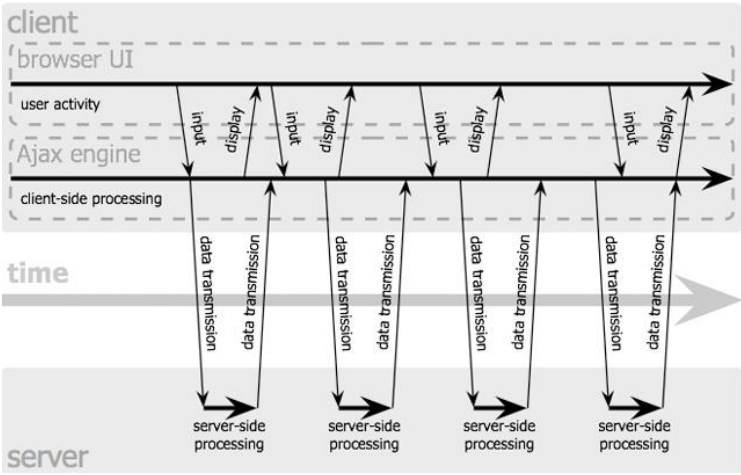
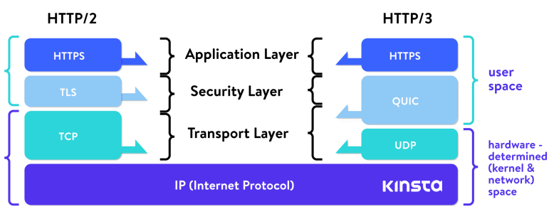
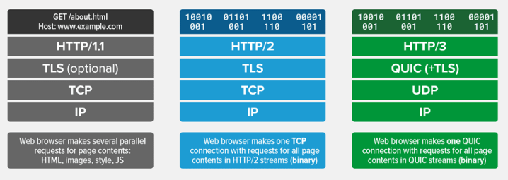
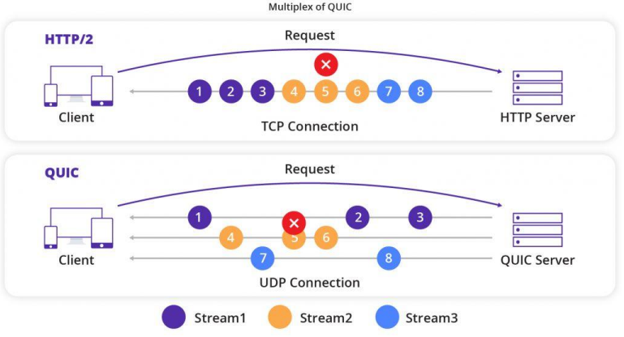
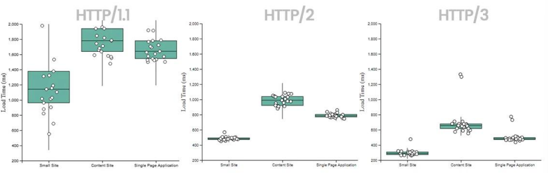
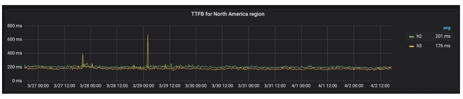

```{=latex}
\begin{center}
```


```{=latex}
\end{center}
```

\newpage

# URI E URL

Il web statico delle origini è composto da URL, HTTP, HTML. L'URL è un meccanismo di naming per identificare una risposa sul server (che è un nodo del grafo).\
Gli URI (si cui sono un sotto tipo gli URL) sono nati per:  

* Identificare il server che fornisce un elemento dell'ipertesto (una pagina o una risorsa all'interno della pagina).  
* Identificare la risorsa che vogliamo accedere  
* Per l'utilizzo di meccanismi che permettessero l'accesso alla risorsa 

## URI

Gli URI (Uniform Resource Identifier) sono un sovrainsieme degli URL (li contegono), gli URL sono un caso particolare di URI. Essi forniscono un meccanismo semplice ed estensibile per identificare una risorsa. Sono un meccanismo per dare un identificativo a una risorsa oppure un mapping identificativo a un'entità che dovrebbe durare nel tempo ed essere indipendente dalla versione dell'entità esistente in un dato momento.\
**NB**: Con il termine risorsa intendiamo qualunque entità abbia una identità: un 
documento, un'immagine, un servizio, una collezione di altre risorse. Il concetto di 
risorsa è lasciato generale.\
Le caratteristiche di un URI sono:

* È un concetto generale: non fa riferimento necessariamente a risorse accessibili  tramite HTTP o a entità disponibili in rete 
* È mapping concettuale ad una entità: non si riferisce necessariamente ad una particolare versione dell'entità esistente in un dato momento 
* Mapping può rimanere inalterato anche se cambia il contenuto della risorsa 

### LA SINTASSI URI

Gli URI rispettano una sintassi standard, semplice e regolare, per questo sono definiti degli identificatori uniformi.\
Il fatto che siano unformi ha dei vantaggi:  

* Convenzioni sintattiche comuni 
* Comune semantica per l'interpretazione 
* Possibilità di usare nello stesso contesto differenti tipologie di identificatori anche con meccanismi (protocolli) di accesso diversi 
* Facilità nell'introduzione di nuovi tipi di identificatori (estensibilità)

Un identificatore è un frammento di informazione che fa riferimento ad una entità dotata di un'identità (risorsa).\
Nel caso degli URI gli identificatori sono stringhe con una sintassi definita, dipendente dallo schema, che può essere espressa nella forma più generale in questo modo: `<scheme>:<scheme-specific-part>`.
Dove:

* scheme: la cosa che precede i due punti definisce lo schema di naminig. (Come nello scheme degli URL è "http")
* scheme-specific-part: La cosa che è dopo i due punti identifica l'entità specifica. Per questa parte non esiste una struttura o una semantica comune a tutti gli URI. 

Esiste un sottoinsieme di URI che condivide una sintassi comune per rappresentare relazioni gerarchiche in uno spazio di nomi: `<scheme>://<authority><path>?<query>`.\
A parte `<scheme>`, le altre parti possono talora essere omesse, come nei casi in cui 
non è inclusa la componente `<authority>` o non è inclusa la componente `<query>`.

## URN

Un sottotipo di URI sono gli URN, questi non usati nel web.\
URN identifica una risorsa per mezzo di un "nome" che deve essere globalmente unico e restare valido anche se la risorsa diventa non disponibile o cessa di esistere.\  
Un URN identifica una risorsa mediante un nome in un particolare dominio di 
nomi (namespace). 

### CARATTERISTICHE DI URN

Le caratteristiche fondamentali di un URN sono:

* Unico  
* Duraturo  
* Consente di "parlare" di una risorsa prescindendo dalla sua ubicazione e dalle modalità con cui è possibile accedervi 

Un esempio molto noto è il codice ISBN (International Standard Book Number) che identifica a livello internazionale in modo univoco e duraturo un libro o una edizione di un libro di un determinato editore. (Non ci dice nulla su come e dove procurarci il libro): `urn : isbn : 0-9553010-9`.\
La parte a destra dei due punti non dice dove si trova la risorsa che si sta cercando. \
URN e URL differiscono per il fatto che uno ha dentro di se la locazione di dove si trova la risorsa (URL) e l'altro no.

## URL

### CARATTERISTICHE DI UN URL

Le caratteristiche di un URL sono:

* Un URL tiene conto anche della modalità per accedere alla risorsa 
* Specifica il protocollo necessario per il trasferimento della risorsa stessa (non solo HTTP, quindi...) 
* Tipicamente il nome dello schema corrisponde al protocollo utilizzato 
* La parte rimanente del nome dipende dal protocollo

### SCHEMA E SINTASSI

Nella sua forma più comune (schema HTTP-like) sintassi è:\
`<protocol>://[<username>:<password>@]<host>[:<port>][/<path>[?<query> [#fragment]]`\
Questa forma vale per diversi protocolli di uso comune: HTTP, HTTPS, FTP, WAP, ... Ma non, ad esempio, per la posta elettronica.\
È composto da due parti:

1. `<protocol>` è la parte sinistra dei due punti, Descrive il protocollo da utilizzare per l'accesso al server (HTTP, HTTPS, FTP, MMS, …) Il più comune è l'http.  
2. `[<username>:<password>@]<host>[:<port>][/<path>[?<query>][#fragment]]` La parte da destra rispetto i due punti varia in base alla locazione in cui si trova la risorsa. Dentro c'è anche l'indirizzo IP di dove si trova la risorsa, quindi se si sposta da un server a l'altro di deve cambiare l'URL. Questo facilita la reperibilità della risorsa, ma se questa viene spostata URL 
non funziona più e quindi non è duraturo.

ALtri campi sono:

* `[<username>:<password>@]` credenziali per l'autenticazione. È una parte opzionale ed ormai è caduta in disuso per la poca sicurezza. 
* `<host>`  indirizzo server su cui risiede la risorsa. Può essere un indirizzo IP logico o fisico. È l'indirizzo IP della macchina (anche se mettessi IP in numeri funzionerebbe). Nel caso in cui si usi un servizio di naming poi andrà convertito. 
* `[:<port>]` definisce la porta da utilizzare (TCP come protocollo di trasporto per HTTP, che vedremo è a livello applicativo). Se non viene indicata, si usa porta standard per il protocollo specificato (per HTTP è 80). Se indichi la porta allora la richiesta va a quella porta, se non c'è nessuno allora non ricevi risposta. (Invece se non trova il file risponde che "file not found").
* `/<path>` percorso (pathname) che identifica la risorsa nel file system del server. Se manca, tipicamente si accede alla risorsa predefinita (es. home page) (in parole povere: è il nome della risorsa nel file system del server).
* `<query>` una stringa di caratteri che consente di passare al server uno o più parametri (sono i parametri per l'eseguibile) . Di solito ha questo formato: `parametro1=valore&parametro2=valore2...`

HTTPs è la versione più sicura di HTTP. È lo stesso protocollo ma si basa solo su un canale cifrato per trasferire sia la richiesta che la risposta.

## URI OPACHE E URI GERARCHICHE

Le **URI opache** sono già nella loro forma finale, quindi non devono essere trasformate prima di arrivare alla loro forma identificativa. Quindi non è soggetto ad altre operazioni di parsing. Ad esempio: `mailto:paolo.rossi@disi.unibo.it`.\
**URI gerarchica** appare incompleto perchè deve essere trasformato prima di diventare completo. Infatti, è soggetta a ulteriori operazioni di parsing. Per esempio per separare l'indirizzo del server dal percorso all'interno file system.\
Un esemoio di URI gerarchica è: `http://informatica.unibo.it/`. Questo è un URL incompleto perchè manca il path. Le pagine web, infatti, di solito hanno una landing page dove si arriva nel caso in cui si digiti solo l'host e non il path.\
`../../../lab/examples/ant/build.xml` questo andrebbe trasformato nell'URI reale sostituendo a `..` Quello che ci dovrebbe essere, questo processo è detto normalizzazione.

### OPERAZIONI SULLE URI GERARCHICHE

Le operazioni che vengono fatte sulle URI gerarchiche sono:

* Normalizzazione: processo di rimozione dei segmenti "." e ".. " (e altri caratteri speciali) dal path di una URI gerarchica. La normalizzazione si applica solo a URI gerarchiche, su URI opache non ha effetto.  
* Risoluzione: è il processo che a partire da una URI originaria porta all'ottenimento di una URI risultante. La URI originaria viene risolta basandosi su una terza URI, detta base URI.  
* Relativizzazione: è il processo inverso alla risoluzione. dall'URL completo si arriva all'URL parziale.

Quando si usa un URL locale si può spostare la risorsa dalla cartella e poi modificare solo il base URL.

\newpage
# IL PROTOCOLLO HTTP
Il protocollo **HTTP** (**H**yper**T**ext **T**ransfer **P**rotocol) è un protocollo di livello applicativo utilizzato per trasferire le risorse web. È in grado di gestire sia le richiesta inviate al server tramite URL sia le risposte inviate al client sotto forma di pagine.\
Ne client ne server mantengono, a livello di protocollo, uno stato (informazioni relative a messaggi precedentemente scambiati): è un protocollo **_stateless_**.

### La terminologia
Ci sono diverse entità in gioco:

* **Client**: programma applicativo che stabilisce una connessione per inviare richieste
* **Server**: programma applicativo che accetta connessioni al fine di ricevere richieste e inviare le risposte con le risorse corrispondenti
* **Connessione**: collegamento (circuito virtuale) stabilito a livello 4 (trasporto ISO/OSI) tra 2 applicazioni per comunicare
* **Messaggio**: è l'unità di base di comunicazione HTTP definita come una specifica sequenza di byte concettualmente atomica:
    - **Request**: messaggio HTTP di richiesta
    - **Response**: messaggio HTTP di risposta
* **Resource**: oggetto di tipo dato univocamente definito
* **URI**: **U**niform **R**esource **I**dentifier - identificatore unico di risorsa 

### Funzionamento di base
HTTP è un protocollo basato su TCP: sia client che server trasmettono le rechieste e le risponde su uno stream TCP.\
A titolo esemplificativo lo schema sottostante riporta il funzionamento di base richiedendo una pagina HTML e 10 immagini in formato jpeg:\
```{=latex}
\begin{center}
```

{#funzionamentoHTTP height=30%}

```{=latex}
\end{center}
```
\newpage
### Le diverse versioni
Esistono diverse versioni di HTTP ma quelle considerate in questo corso sono 2:

* HTTP v1.0
* HTTP v1.1 e v1.1 con pipelining

```{=latex}
\begin{center}
```

{#versioniHTTP height=30%}

```{=latex}
\end{center}
```

La differenza principale tra la 1.0 e 1.1 consiste nella possibilità del riutilizzo della stessa connessione HTTP per più richieste, difatti nella **versione 1.0** per **ogni richiesta** si apriva e chiudeva **una connessione**, mentre dall 1.1 in poi il server lascia aperta la connessione HTTP per eventuali nuove richieste
e la chiude solo nel caso in cui nell'header del messaggio HTTP sia specificata la volontà del client di chiudere la connessione oppure dopo un time out.\
Per migliorare le prestazioni di HTTP venne introdotto il pipelining che consiste nell'invio di molteplici richieste anche prima di aver ricevuto tutte le risposte. Il protocollo specifica che le risposte devono essere mandate **nello stesso ordine** delle richieste poichè non ci sono modi di ricondurre la risposta alla richiesta (non vi è, da protocollo, modo per associare richieste e risposte)\
Esistono ulteriori versioni di HTTP:

* HTTP/2: ha l'obiettivo di migliorare le performance pur mantenendo la compatibilità con v1.1. È basato su SPDY, protocollo open networking promosso da Google. In particolare introduce:

    - request-response multiplexing
    - header compression
    - server push

* HTTP/3: vuole migliorare HTTP basandolo sul nuovo protocollo di trasporto QUIC (invece che TCP). Introduce:

    - stream multiplexing
    - controllo di flusso per stream
    - realizzazione di connessioni a bassissima latenza

\

### I MESSAGGI HTTP

Un messaggio HTTP è composto da 2 strutture:

* Message Header: contiene le tutte le informazioni necessarie per l'identificazine del messaggio
* Message Body: contiene i dati trasportati dal messaggio

Esistono degli standard per ogni tipo di messaggio che non possono essere modificati.\
I messaggi di response contengono i dati relativi ai messaggi di request. I dati sono codificati nel formato specificato nell'header, solitamente sono in formato MIME (Multipurpose Internet Mail Extensions)

#### Header HTTP

Gli headers sono costituiti da coppie **nome:valore** che specificano le richieste del messaggio inviato/ricevuto. Ci sono headers di diverso tipo:

- Header generali di trasmissione:
    Data, codifica, versione, tipo di comunicazione ecc.
- Header relativi all'entità trasmessa
    Content-type, Content-length, data di scadenza ecc.
- Header riguardo alla richiesta effettuata
    Chi fa la richiesta, a chi viene fatta la richiesta, che tipo di caratteristiche il client può accettare, quale autorizzazione ecc.
- Header della risposta generata
    Che server da la risposta, che tipo di autorizzazione è necessaria

Il protocollo utilizza messaggi in formato ASCII.
Un esempio abbastanza completo di **richiesta**:
```
GET /search?q=Introduction+to+XML+and+Web+Technologies HTTP/1.1
Host: www.google.com
User-Agent: Chrome/38.0 (X11; U; Linux i686; en-US; rv:1.7.2) 
Gecko/20040803
Accept: text/xml,application/xml,application/xhtml+xml, 
text/html;q=0.9,text/plain;q=0.8,image/png,*/*;q=0.5
Accept-Language: da,en-us;q=0.8,en;q=0.5,sw;q=0.3
Accept-Encoding: gzip,deflate
Accept-Charset: ISO-8859-1,utf-8;q=0.7,*;q=0.7
Keep-Alive: 300
Connection: keep-alive
Referer: http://www.google.com/
```
##### I METODI DI RICHIESTA

\

###### **GET**

Serve per richiedere una risorsa ad un server, è il più utilizzato. È quello che viene attivato facendo click su un link ipertestuale di un documento HTML o specificando l'URL nel browser. Il passaggio dei parametri avviene tramite la parte < query > dell'URL. Una limitazione può essere che la lunghezza di un URL è limitata.

###### **POST**

Come GET serve per richiedere una risorsa, ma a differenza di quest'ultimo i parametri non sono passati all'interno dell'URL bensì nel body del messaggio di richiesta. Conseguentemente non ci sono limitazioni sulla lunghezza dei parametri di request. Viene spesso utilizzato per sottomettere dati di un form HTML ad una CGI. Tutto ciò non comporta la creazione di risorse sul server.

\

###### **PUT e DELETE**

Differentemente dal post creano (nel caso del PUT) e cancellano (nel caso del DELETE) risorse sul server all'URL specificato. Sono entrambi normalmente disabilitati sui server pubblici.

###### **HEAD, OPTIONS e TRACE**

L'HEAD è uguale al GET con la differenza che chiede al server di rispondere con solo headers relativi alla risposta ma senza body. Solitamente viene utlizzato per verificare la validità di un URL e se serve una autenticazione per quel URL.\
OPTIONS server per richiedere informazioni sulle opzioni disconibiliper la comunicazione\
TRACE è usato per invocare il loop-back remoto a livello applicativo del messaggio di richiesta. Viene utilizzato in diagnostica e testing dei servizi Web.

#### IL FORMATO DELLA RISPOSTA

```
HTTP/1.1 200 OK 
Connection: close
Date: Thu, 06 Aug 2008 12:00:15 GMT 
Server: Apache/2.3.0 (Unix) 
Last-Modified: Mon, 22 Jun 2008 …... 
Content-Length: 6821 
Content-Type: text/html
 
<!DOCTYPE HTML PUBLIC "-//W3C//DTD 
HTML 4.51 Transitional//EN">
 <html>...</html>
```

Quanto sopra fa vedere un esempio di HTTP response, che in v1.0 corisponde a chiudere la connession, mentre in v.1.1 il server mantiene aperta la connessione oppure la chiude se si aggiunge la clausola: ```Connection: close```.

##### I CODICI DI STATO 

\
Nella prima riga sono esposti protocollo e codice di stato. La prima cifra del codice di stato indica la classe di appartenenza ad una classe:

* **1xx** Informational: una risposta temporanea alla richiesta durante il suo svolgimento (sconsigliato da HTTP 1.0)
* **2xx** Successful: il server ha ricevuto, capito e accettato la richiesta
* **3xx** Redirection: il server ha ricevuto e capito la richiesta, ma sono necessarie altre azioni da parte del client per portare a termine la richiesta
* **4xx** Client Error: la richiesta del client non può essere soddisfatta per un errore da parte del client (richiesta non autorizzata o errore sintattico)
* **5xx** Server Error: La richiesta può essere corretta, ma il server non è in grado di soddisfare la richiesta per un problema interno

### I COOKIE

Parallelamente alle sequenze request/response, il protocollo preve una struttura dati che si muove come un tocken da client a server e viceversa: **i cookie**. I cookie possono essere generati da entrambe le parti, e dopo la loro creazione vengono mandati ad ogni trasmissione. Scopo dei cookie è quello di supportare un mantenimento di stato in nel protocollo HTTP (stateless).
\newpage
I cookie sono una collezione di stringhe: 

- Key: identificatore univoco all'interno di un dominio:path
- Value: valore associato al cookie (max 255 caratteri) 
- Path: posizione nell'albero del sito a cui è associato
- Domain: dominio dove è generato
- Max-age: numero di secondi di vita (opzionale)
- Secure: i cookie di questo tipo vengono trasferiti solo se si usa HTTPS (opzionale)
- Version: versione del protocollo di gestione dei cookie

### **AUTENTICAZIONE**

**Riconoscimento ip**
\
È una soluzione poco utilizzata perchè presenta diversi svantaggi dovuti a NAT, DHCP e spoofing (tecniche per presentarsi con un IP falso)

**HTTP basic**
\
Consiste nella notifica, da parte del server, della necessità di autorizzazione per accedere ad una determinata risorsa, si aprirà un prompt sul client per la richiesta di username e password che saranno inviate (criptate) al server alla successiva request.

**Form**
\
Si utilizza un form HTML normalmente con method=POST e valgono le stesse considerazioni fatte per HTTP Basic 

### SICUREZZA

Per la trasmissione di informazioni si necessita, semore più spesso, di sicurezza. Esistono 2 tipi di sicurezza per il canale di trasporto:

* SSL: Secure Sockets Layer
* TLS: Transport Layer Security

    - Sostituisce SSL
    - È alla base di HTTPS

Sostanzialmente viene posto un livello che si occcupa della gestione di confidenzialità, autenticità ed integrità della comunicazione HTTP e TCP. Si accede tramite https://...\
È tutto basato su crittografia a chiave pubblica e privata e tramite certificati per autenticare un server.

### ARCHITETTURE DISTRIBUITE PER IL WEB

* **Proxy**: programma applicativo in grado di agire sia come Client che come Server al fine di effettuare richieste per conto di altri Clienti. Le Request vengono processate internamente oppure vengono ridirezionate al Server. Un proxy deve interpretare e, se necessario, riscrivere le Requestprima di inoltrarle.
* **Gateway**: server che agisce da intermediario per altri Server. Al contrario dei proxy, il gateway riceve le request come se fosse il server originale e i Client non sono in grado di identificare che Response proviene da un gateway. Detto anche reverse proxy o server-side proxy.
* **Tunnel**: programma applicativo che agisce come "blind relay" tra due connessioni. Una volta attivo (in gergo "salito") non partecipa alla comunicazione HTTP

### CACHE 

L'idea di base è memorizzare copie temporanee di documenti web al fine di ridurre l'utilizzo di banda e i tempi di attesa per il client. Una web cache memorizzano i documenti che la attraversano e, sotto specifiche condizioni, riutilizza questi documenti alle successive richieste del client.

#### USER AGENT CACHE

\
Lo user agent (browser) mantiene una cache delle pagine che ha visitato l'utente. Questo tipo di caching era importante in passato quando i client non avevano accesso a connessioni con banda larga. Tutt'ora è molto usato nei dispositivi mobili per permettere di lavorare anche con connettività intermittente e per ridurre i tempi di latenza.

#### PROXY CACHE

* **Forward Proxy Cache**: servono per ridurre le necessità di banda, il proxy intercetta il traffico e mette le pagine in cache in modo tale che alle successive richieste non si vada fino al server per scaricarle
* **Reverse (o server-side) Proxy Cache**: Gateway cache. Lavorano per conto del server per ridurre i carichi computazionali sulle macchine. I client non sono in grado di capire se le pagine arrivano dal server o dal gateway. Si utilizza ICP (Internet Caching Protocol) per il coordinamento fra le diverse cache, alla base per il Content Delivery Network.

\
HTTP definisce vari meccanismi che possono avere effetti collaterali per la gestione lazy dell'aggiornamento cache: 

* **Freshness**: controllatalato server da Expires response header e lato cliente da direttiva CacheControl: max-age
* **Validation**: può essere usato percontrollare se un elemento in cache è ancora corretto, ad es. nel caso in cui sia in cache da molto tempo (ad es. tramite richieste HEAD)
* **Invalidation**: è normalmente uneffetto collaterale di altre request che hanno attraversato la cache. Se per esempio viene mandata una POST, una PUT o una DELETE a un URL il contenuto della cache deve essere e viene automaticamente invalidato

# HTML CSS e JS

## HTML

### STRUTTURA DI UN DOCUMENTO HTML

```{=latex}
\begin{center}
```

{#htmldoc height=30%}

```{=latex}
\end{center}
```

### DOM

È una struttura dati che il browser tengono in memoria ed è la struttura ad albero con tutti i tag che ci sono dentro . È anche usato per vedere quale elemento ha generato quale evento.

### TAG DI HTML 5

Sono in aggiunta. Inoltre, ha una gestione degli eventi diversa da quella del DOM.

#### Canvas

L'elemento `<canvas>` definisce un'area rettangolare in cui disegnare direttamente immagini bidimensionali e modificarle in relazione a eventi, tramite funzioni Javascript.
```html
<canvas id="esempio" width="196" height="96"> 
</canvas>
<!-- 
 Gli attributi sono:
    - width
    - height 
 --->
```

#### Video

È usato per inserire dei video.
```html
<video id="sampleMovie" width="640" height="360" preload controls="metadata"> 
<source src="movie.mp4" type="video/mp4" codecs="avc1.42E01E, mp4a.40.2" > 
<source src="..." type="..." codecs="..."> 
<source src="..." type="..." codecs="..."> 
...
</video>
<!-- 
 Gli attributi sono:
    - type: tipo di file audio o video
    - codecs: contiene tutti i codec che detiene il browser per visualizzare il video o l'audio. 
 -->
```
Il `<source>` è fondamentale: rappresenta il nome del file che va rappresentato e permette di rappresentare tipi di file diversi e codec diversi (tramite i suoi attributi).

#### Audio

Per inserire degli audio. Ogni browser web ha il suo plugin per leggere gli audio o visualizzare gli video (detti codec).

## CSS

Il CSS da uno stile solo di pura visualizzazione ad ognuno dei nodi del DOM.\
L'idea di CSS è che sia utile avere più fogli CSS per lo stile. Nel caso di più fogli CSS ha delle regole per la priorità di quale stile applicare in casi di conflitto.\
Il file CSS è un file di testo che ha una sequenza di regole di stile da applicare.\
Di solito si usano stili esterni (con un file separato).

### STRUTTURA E SELETTORI CSS

```
selettore { 
    proprietà1 : valore1; 
    proprietà2 : valore2, valore3; 
}
```
I tipi di selettori sono:

* **Selettore universale**: identifica qualunque elemento. Si applica a tutti gli elementi: `*{ ... }`
* **Selettori di tipo**: si applicano a tutti gli elementi di un determinato tipo, ovvero di un determinato tag: `tipo_elemento { ... }`
* **Selettori di classi**: si applicano a tutti gli elementi he presentano l'attributo `class="nome_classe"`. Questo attributo è opzionale. Se scritto così e basta è applicato indipendentemente dal tipo di tag: `.nome_classe { ... }`
* **Selettori di identificatori**: si applicano a tutti gli elementi che presentano l'attributo id="nome-id": `#nome_id { ... }`
* **Selettori combinati**: `tipo_elemento.nome_classe { ... }` oppure `tipo_elemento#nome_id { ... }`
* **Pseudoclassi**: si applicano a tutti gli elementi di un dato tipo che hanno un determinato legame gerarchico (discendente, figlio, fratello) con elementi di un altro tipo: 
    - `tipo1 tipo2 { ... }` tipo2 discende da tipo1, basta che sia sotto di lui (nel HTLM che sia dentro di lui) 
    - `tipo1>tipo2 { ... }` tipo2 è figlio di tipo1, tipo2 che sono direttamente figli di tipo 1, quindi solo un livello di distanza nel albero gerarchico
    - `tipo1+tipo2 { ... }`  tipo2 è fratello di tipo1

### VALORI DELLE PROPRIETÀ

I numeri usano come separatore il punto "." . 
Unità di misura relative: 

* em: è relativa alla dimensione del font in uso (es. se il font ha corpo 12pt, 1em varrà 12pt, 2em varranno 24pt) 
* px: pixel, sono relativi al dispositivo di output e alle impostazioni del computer dell'utente 

Unità di misura assolute:

* in: pollici; (1 in =2.54 cm) 
* cm: centimetri 
* mm: millimetri 
* pt: punti tipografici (1/72 di pollice) 
* pc: pica = 12 punti

### ATTRIBUZIONE DELLO STILE AD UN ELEMENTO

C'è un foglio di stile di default interno, quindi c'è sempre uno stile anche se non è specificato.

#### Ereditarietà

Una definizione di stile più in alto nell'albero del dom viene ereditata dai nodi sottostanti, a meno che non sia stato sovrascritto dai nodi sottostanti in maniera specifica (overrrding). Viene detta ereditarietà. Non funziona per la formattazione dei box.\
**Vince la definizione più interna (più specifica).**

#### Algoritmo Cascade

Si usa l'algoritmo Cascade:

* Se le regole stanno in fogli di stile di origine diversi si da la priorità nell'ordine: autore, utente e browser.  
* Se le regole sono nello stesso foglio allora vince il selettore con specificità maggiore. In ordine dal più generico al meno generico: selettore di elemento, selettore di classe, elemento ID  
* A parità di regola su uno stesso elemento ma con valore diverso vale l'ultima che è stata dichiarata nel file.

#### Forzare una regola di stile

`p.myClass {text-color: red !important}`. L'important non segue l'algoritmo di cascade, salta completamente l'origine e la specificità.

## JAVASCRIPT

Al giorno d'oggi Javascript copre più del 99% delle pagine web attive, ovvero che 
sono dinamiche a lato cliente (sono diverse da quelle che abbiamo visto prima).\
Javascript aveva varie varianti, come Livescript e poi JScript. Per unificare il tutto è 
stato dato un nome ufficiale ECMAScript e diventa uno standard.\
È un linguaggio di programmazione special purpose, permette di scrivere codice che può essere eseguito all'interno di una pagina web da parte del cliente. Non è un linguaggio general purpose, quindi non è detto che tutto quello che vogliamo fare sia implementato. Per esempio gli accessi al file system sono molto limitate (è molto difficile leggere e soprattutto scrivere un file locale).

### JS e JAVA

Javascript non è necessario compilarlo, c'è un interprete runtime che lo compila a 
tempo runtime. Come per le JSP.\
Per Javascript ogni variabile è un oggetto ma non è un'istanza di una classe.\
In Javascript non è obbligatorio che una variabile sia definita nel tipo in maniera statica. Non c'è un controllo nei tipi e possono essere cambiati runtime (posso assegnarli dei dati di tipo diverso).\
I dati invece hanno un tipo.

### JS ENGINE

Il browser è definito da:

* Il DOM (albero di oggetti interni al browser)  
* Ospita un interprete runtime (di alta complessità). È lui che si occupa di mettere in esecuzione il codice Javascript. Questo ha tutte le strutture per la gestione del codice Javascript. Per esempio, lo stack, la heap, coda per gli eventi (che viene usata per processare gli eventi e invocare le callback associate agli eventi).
* Timeout

L'interprete fa profilazione e poi lo compila prima di eseguirlo per renderlo più ottimizzato.\
Processo passo passo (da copilot):

* Parsing: Il primo step è il parsing, dove il codice sorgente viene letto e trasformato in una struttura ad albero chiamata Abstract Syntax Tree (AST). Questo processo include la lettura del codice sorgente riga per riga (tokenizzazione) e la costruzione di questo albero basato sulla sintassi. 
* Interprete: Una volta creato l'AST, l'interprete entra in gioco. L'interprete esegue il codice direttamente dall'AST, riga per riga, traducendolo in codice macchina basilare. Questa fase non è ottimizzata, quindi può essere più lenta. 
* Profilatore (Profiler): Durante l'esecuzione del codice, il profilo (profiler) monitora le performance e identifica i colli di bottiglia nel codice, cioè le parti che vengono eseguite più frequentemente o che richiedono miglioramenti di performance. 
* Compilatore: Dopo aver identificato le parti critiche del codice, entra in scena il compilatore. Questo trasforma le parti più utilizzate e critiche del codice in codice macchina ottimizzato. Questo step di ottimizzazione può includere tecniche come l'inlining, la loop unrolling, etc. 
* Codice ottimizzato: Infine, il codice ottimizzato viene eseguito direttamente dalla macchina, rendendo l'esecuzione molto più veloce rispetto all'interprete iniziale. 

### COSA SI FA CON JS

Non è che quando si interagisce con la pagina questo scatena una richiesta GET con i parametri di ingresso e il servitore calcola una risposta e poi aggiorna la pagina. Ma il codice Javascript locale viene eseguito in base agli eventi che si generano interagendo con la pagina e viene eseguito dal browser.\
Quindi ci si può scaricare un pezzo di codice che viene messo sul browser quando si scarica la pagina. In questo modo si rendere la pagina dinamica lato cliente e non server.\
Serve per rendere la pagine più interattive. I cambiamenti di visualizzazione, come per esempio cambiare anche il layout in base a come interagiamo con la pagina (passare sopra un bottone), non necessitano un interazione con il server ma  necessitano di tempi di reattività molto brevi. Quindi si rimane lato browser.\
Le azioni che permette Javascript sono delle azioni che sono legate all'interazione/modifica di una pagina.\
Lato servitore questa pagina è statica, quindi quando viene chiesta dal browser al server questa viene passata come tale senza fare altro. Solo quando il browser riceve la pagina inizia a eseguire il codice Javascript tramite l'interprete che è embedded dentro al browser. \
Il codice di Javascript presente nella pagina web viene sempre seguito lato cliente e **non servitore**.

### SINTASSI

Le variabili di Javascript sono dei puntatori ad aree di memoria, per questo posso assegnarli qualsiasi tipo di dato e il tipo della variabile varia in modo dinamico. Possono anche puntare pezzi di codice.

### BROWSER OBJECTS

Browser Object: posso sapere che Browser è, le sue proprietà (Browser size, ...).\
Necessario perchè i browser supportano le cose in maniera diversam quindi devono scoprire dinamicamente su che browser sono e in funzione di questo gaire opportunamente.

### COSTRUZIONE DINAMICA DELLA PAGINA

Implemento degli event handler: l'utente interagisce e in risposta viene eseguito il codice corrispondente (attivato da Javascript solo se avviene un particolare evento).

### EVENTI

Su un oggetto potrebbero essere scatenati anche più eventi. Eventi possono essere generati secondo svariate azioni dell'utente attraverso il mouse o alla tastiera. \
ES. per gestire l'evento click su un bottone devo andare a definire la funzione.\
Sono eventi che vengono autogenerati e se si vuole si possono gestire con nostre 
funzioni (o inline o dichiarate a parte). \
Tutta questa serie di operazioni viene fatta solamente se l'utente clicca sul campo (viene lanciato il segnale che va a riferirsi al gestore `onClick`).\
Se avessi più form dovevo fare form. quello a cui volevo andare a riferirmi.\
Dentro alla funzione associata a `onChange()` posso impostare l'eventHandler andando a controllare i campi e guardando se ciò che è stato inserito corrisponde ai requisiti.\
`onChange` si applica ad alcuni elementi come il campo text (man mano che l'utente scrive le parole invocandolo posso andare a vedere cosa è appena stato scritto dall'utente). Attenzione perchè questi eventi appesantiscono i browser (es controllo se una mail è stata scritta correttamente, per esempio se è stata messa la @).\
Funzioni all'interno dei tag script che stanno dentro a head sono dichiarazioni di funzioni. Queste non vengono eseguite quando la pagina viene renderizzata.\
`Qty_check` restituirà un booleano. Vado a parsare item.value e in base a delle condizioni che non vengono soddisfatte dico all'utente che ha sbagliato (restituisco falso), se invece passo il controllo mi restituisce vero. 

\newpage

# WEB DINAMICO

Il modello statico, quello visto fin'ora, con solo HTML e CSS è chiamato così perchè pur essendo basato sul concetto di ipertesto distribuito l'insieme dei concetti è prefissato staticamente, le pagine sono preparate a priori e non esistono contenuti composti dinamicamente in base ad una qualsiasi interazione con l'utente. È sicuramente un modello semplice, potente, di facile implementazione ed efficiente, tuttavia presenta evidenti limitazioni.\
Prima di tutte proprio la limitata interazione con l'utente e quindi l'impossibilità di produrre dei risultati sulla base di input dell'utente. Ad esempio non è possibile implementare un qualsiasi tipo di ricerca all'interno del sito web visitato.

## CGI

Una prima soluzione proposta per risolvere questo problema sono le **CGI** (Common Gateway Interface) presenti nel protocollo HTTP dalla versione 1.0. CGI è uno standard per le interfacce esterne con web server. I programmi scritti con questo tipo di standard prendono il nome di programmi CGI, possono essere scritti in un qualunque linguaggio di programmazione (C, PHP, Perl, Python ecc).
\newpage
L'interazione avviene nel seguente modo: 

1. il client invia una richiesta HTTP al server in cui chiede di eseguire un programma CGI con alcuni parametri in ingresso
2. Il server, attraverso l'interfaccia CGI, chiama il programma passandogli i parametri
3. Eseguite le operazioni, il programma rimanda al server i dati elaborati (pagina HTML) sempre tramite interfaccia CGI
4. Il server risponde al client con una HTTP response contenete i dati elaborati dal programma CGI

```{=latex}
\begin{center}
```


```{=latex}
\end{center}
```

I programmi CGI ed il server comunicano tramite:

- Variabili d'ambiente
- Parametri sulla linea di comando: usati con il metodo GET, limitativo perchè la linea di comando ha una lunghezza massima, quindi la quantità di dati è limitata
- Standard input: usato con il metodo POST
- Standard output: per restituire l'HTML di risposta

Prima in chiamare il programma CGI il server imposta alcune env. var:

* REQUEST_METHOD: method usato nel form
* QUERY_STRING: parte dell'URL dopo ?
* REMOTE_HOST: host che ha inviato la richiesta
* CONTENT_TYPE: tipo MIME dell'informazione contenuta nel body della richiesta (POST)
* CONTENT_LENGTH: lunghezza dei dati inviati
* HTTP_USER_AGENT: nome e versione del browser usato dal client

L'**output** è generato dopo l'elaborazione dei dati ed è comunicato al server tramite stdout, il server lo preleva e lo invia incapsulandolo in un messaggio HTTP.\
Purtroppo questa soluzione presenta diversi problemi:

- Problemi di **prestazioni**: ogni volta che viene invocata una CGI si crea un processo (probabilmente pesante) che viene distrutto al termine dell'elaborazione
- **Robustezza**: le CGI, soprattutto se scritte in C, possono essere poco robuste in quanto è difficile capire che cosa potrebbe accadere in caso di errore bloccante
- Poco **riutilizzo** di codice già scritto: ogni programma CGI deve reimplementare una serie di parti comuni (accesso a DB, logica di interpretazione delle HTTP request, gestione di stato)
- **Sicurezza**: scarse garanzie di sicurezza

Per ovviare al problema del riutilizzo del codice si potrebbe creare un'unica CGI che implementa diverse funzioni, ma si finirebbe per avere un'applicazione monolitica di difficile scalabilità e aggiornamento, in più cosa potrebbe succede se incappasse in errore? Nessuna funzionalità funzionerebbe più? Dipende dal linguaggio di programmazione, ma non si può correre questo rischio.

## APPLICATION SERVER

La soluzione migliore è quella di realizzare un contenitore in cui far vivere le funzioni server-side. Il contenitore si occupa di fornirei servizi di cui le applicazioni hanno bisogno:

- interfacciamento con il web server
- gestione del tempo di vita (attivazione on-demand delle funzioni)
- interfacciamento con in database
- gestione della sicurezza

La soluzione così pensata è modulare e le funzionalità ripetitive vengono portate a fattor comune. Un ambiente di questo tipo si chiama **application server**.


```{=latex}
\begin{center}
```

{#appServ height=280px}

```{=latex}
\end{center}
```

### MODELLI A CONTENIMENTO

Molte funzionalità possono non essre controllate direttamente ma lasciate come respondabilità ad un entità deletagata supervisore (detta **contenitore**) che se ne occupa. Solitamente se ne occupa introducendo politiche di default, evitando che si verifichino errori e controllando gli eventi. I contenitori (detti anche container, engine o middleware) possono occuparsi di azioni automatiche sgravando l'utilizzatore che deve solo specificare la parte di alto livello, non ripetitiva e fortemente dipendente dalla logica applicativa. Si vedranno a titolo esemplificativo: CORBA (per gli aspetti C/S), Engine per framework a GUI e Container per servlet. Questi ultimi possono ospitare componenti più trasportabili, riutilizzabili e mobili.\
Il container fornisce molte delle funzioni per supportare l'interazione con l'utente:

* Supporto al ciclo di vita: 

    - Attivazione/deattivazione del server
    - Mantenimento di stato
    - Persistenza trasparente e recupero delle informazioni

* Supporto al sistema di nomi (DNS):

    - Discovery del servizio
    - Federazione con altri container

* Supporto alla qualità del servizio:

    - Tolleranza ai guasti, selezione tra possibili deployment
    - Controllo della QoS richiesta e ottenuta

* Sicurezza

### APPLICATION SERVER E TECNOLOGIE SERVER SIDE

Due tecnologie storicamente diffuse nell'ambito degli application server sono: 

* .NET per componenti Microsoft ed evoluzioni
* Java J2EE per componenti EJB e Web Java-oriented

Altre tecnologie interessanti sono quelle basate su Perl, Python o JavaScript server side (node.js).\
Altre soluzioni di struttura più semplice che però non sono application server ma spesso solo interpreti sono:

- PHP o Ruby
- Le vecchie tecnologie ISAPI e ASP di Microsoft

In queste però si parla di moduli di estensione del Web server.

### LO STATO

L'interazione fra client e server può essere di 2 tipi:

* **Stateful**: esiste il concetto di stato dell'interazione e quindi l'n-esimo messaggio può essere messo in relazione con gli n-1 precedenti
* **Stateless**: non si tiene traccia dello stato, ogni messaggio è indipendente dagli altri

#### INTERAZIONE STATELESS

Un'interazione stateless è feasible senza generare grossi problemi solo se il protocollo applicativo è progettato con operazioni **idempotenti**. Le operazioni si dicono idempotenti se producono sempre lo stesso risultato indipendentemente dal numero di messaggi M ricevuti dal server stesso.

#### INTERAZIONE STATEFUL

In generale tutte le volte che abbiamo bisogno di personalizzazione delle richieste Web possiamo beneficiare di interazioni stateful. Per esempio se è prevista un'autenticazione è necessario tener traccia fra una chiamata e l'altra del fatto che l'utente si è autenticato in modo tale da non dover rifare l'autenticazione ad ogni request, e da qui nasce il concetto di **stato**.
\
Nelle applicazioni Web è possibili classificare precisamente lo stato:

* **Stato di esecuzione** (insieme di dati parziali per una elaborazione): rappresenta un'avanzamento in stato di esecuzione, può essere mantenuto in memoria lato server come stato di uno o più oggetti. Per sua definizione è volatile.
* **Stato di sessione** (insieme dei dati che caratterizzano una interazione con uno specifico utente): la sessione viene gestita di solito in modo unificato attraverso l'uso di istanze di oggetti specifici (supporto ad oggetti di sessione).
* **Stato informativo persistente** (ad esempio gli ordini inseriti in un eCommerce): viene normalmente mantenuto in una struttura persistente tipo un database.

\newpage
### LA SESSIONE

La sessione rappresenta lo stato associatoad una sequenza di pagine visualizzate dall'utente. Contiene tutte le informazioni necessarie durante l'esecuzione: le informazioni di sistema (IP di provenienza, lista delle pagine visualizzate, ...) e quelle di natura applicativa (nome e cognome, username, quanti e quali prodotti messi nel carrello ...). Lo **scope** di sessione è dato da:

- Tempo di vita dell'interazione con l'utente (*lifespan*)
- Accessibilità: usualmente concessa alla richiesta corrente e alle future provenienti dallo stesso processo browser

La **conversazione** rappresenta una sequenza delle pagine di senso compiuto (ad esempio tutte le pagine necessarie per comprare un prodotto), è univocamente definita dall'insieme delle pagine che la compongono e dall'insieme delle interfacce di I/O per la comunicazione (flusso della conversazione).\
Lo stato di sessione **deve** essere condiviso da client e server, inoltre è associato a uno o più conversazioni effettuate da ogni singolo utente, ne segue che ciascun user possiede il suo stato. Per gestire tutto ciò ci sono due tecniche: utilizzo dei **cookie** (storage lato client) e la gestione di uno stato sul server per ogni utente collegato (**session** e server side). Queste tecniche non sono necessariamente alternativa ma anche integrabili. La gestione della sessione è uno dei supporti orizzontali messi a disposizione di un application server.

### ARCHITETTURA FREQUENTE DEI SISTEMI WEB

```{=latex}
\begin{center}
```

{#arcSW height=280px}

```{=latex}
\end{center}
```

La struttura rappresentata in figura rispecchia i 3 principali servizi che realizzano un sistema Web, possono risiedere tutti sullo stesso HW oppure essere su macchine separate (**distribuzione verticale**). La distribuzione non necessita di nessun accorgimento specifico e solitamente viene realizzata per migliorare le performance soprattutto quando si separa il livello applicativo dal livello del DB. Così com'è rappresentata non prevede replicazione quindi non è utile per risolvere i problemi di fault tolerance.\
Per provvedere a questo problema si distribuisce orizzontalmente ogni livello: si replica il servizio su diverse macchine, purtroppo questo comporta importanti accorgimenti strettamente dipendenti dalla tecnologia in uso. La **distribuzione orizzontale** non è fatta solo per gestire la fault tolerance ma anche per distribuire e bilanciare il carico computazionale al fine di migliorare le performance.

```{=latex}
\begin{center}
```

{#distrOV height=280px}

```{=latex}
\end{center}
```

Per la natura di HTTP il **Web server** è stateless e quindi molto facile da replicare. Il fatto che IP è embedded in URL può essere gestisto sia tramite soluzione HW che SW. Si possono inoltre applicare politiche di load balancing con diverse euristiche usando i dispositivi appositi.\
Per la replicazione del livello di **application server** si parla principalmente di replicazione dello stato di sessione. Può però accedere che un application server utilizzi oggetti o componenti con stato per motivi di performance o altre necessità specifiche, alcuni framework permettono la replicazione con tecniche di clustering ma altri framework non sono in grado di replicare orizzontalmente. Tuttavia se si mantiene lo stato di sessione concentrato all'interno della sessione e la sessione viene gestita internamente attraverso i cookie è possibile realizzare un framework applicativo interamente stateless lato server, ottenendo così una realizzazione più semplice e primitiva di configurazione completamente replicabile orizzontalmente.\
La replicazione del **database** è molto delicata perchè deve mantenere il principio di atomicità delle transazioni. In più il database server è normalmente stateful, il che può creare non poche complicazioni nella replicazione. I database commerciali come Oracle e Microsoft SQL Server prevedono delle configurazioni di clustering in grado di gestire in modo trasparente un numero variabile di CPU e macchine distinte, anche se generalmente in numero basso (qualche unità).
\

## SERVLET

Prima di dare la definizione e le modalità d'uso delle servlet è necessario introdurre un po' di definizioni:

* **Web application**: è un gruppo di risorse server-side che nel loro insieme creano un'applicazione interattiva fruibile via web
* **Risorse server side**: includono classi server-side, JSP, risorse statiche (doc. html, css, immagini, ...), applet e JS e/o altri componenti che diventeranno attivi client-side, e informazioni di config e deployment
* **Web container**: forniscono un ambiente di esecuzione per web application, in generale garantiscono servizi di base alle applicazioni sviluppate secondo paradigma a componenti

\newpage
Una **servlet** è una classe (java) che fornisce un servizio comunicando con il client mediante protocolli di tipo request/response, tra questi il più diffuso è HTTP. Le servlet estendono le funzionalità di un web server generando contenuti dinamici e superando i classici limiti delle applicazioni CGI. Esse eseguono direttamente in un web container.\
A livello pratico tutte le servlet sono sottoclassi della classe `HttpServlet` che implementa vari metodi che si andranno a ridefinire. Tutte le classi che ci interessano si trovano all'interno del package `javax.servlet.http.*`.

```{=latex}
\begin{center}
```

{#servletUml height=280px}

```{=latex}
\end{center}
```

Gli oggetti **Request** rappresentano la chiamata fatta dal server al client. Sono caratterizzati da chi ha fatto la request e quali parametri e headers sono stati passati nella request.\
Gli oggetti **Response** rappresentano le informazioni restituite al client (in risposta alla request). In particolare contengono: status line (status code e status phrase), gli headers e il response body. Ha come interfaccia tipo l'interfaccia `HttpResponse` che espone metodi per:

* specificare lo status code
* indicare il content type (es text/html)
* ottenere un output stream
* indicare se l'output è bufferizzato
* gestire i cookie


### Il ciclo di vita di una servlet

Il Servlet container controlla e supporta automaticamente il ciclo di vita di una servlet.\
Se non esiste un'istanza della classe servelet nel container:\
\ \ Carica la classe della servlet\
\ \ Crea un'istanza della classe\
\ \ Inizializza la servlet (invocando `init()`)\
A regime:\
\ \ Invoca la servlet (`doGet()` o `doPost()`) passando gli oggetti di tipo `HttpServletRequest` e \
\ \ `HttpServletResponse`\
\newpage

#### **Servlet e multithreading**

In un modello normale c'è una sola istanza di servlet e un thread assegnato ad ogni request per la servlet anche se altre richieste sono già in esecuzione. Di conseguenza, avendo più thread che condividono una risorsa sola (servlet) si crea concorrenza: 

- il metodo `init()` è invocato una sola volta quando il web container crea la servlet
- `service()` e `destroy()` possono essere chiamati solo dopo il completamento di `init()`
- il metodo `service()`, e quindi `doGet()` e `doPost()`, può essere invocato da numerosi client in modo concorrente ed è quindi necessario gestire le sezioni critiche (a carico del programmatore) tramite l'uso di blocchi `synchronized`, semafori e mutex

Si può anche pensare ad un modello single-threaded ma è deprecato e altamente inefficiente. Per implementare ciò una servlet dovrebbe implementare l'interfaccia `SingleThreadModel`

#### I metodi del controllo del ciclo di vita

\
\
`init()`

> Viene chiamato una sola volta al caricamento della servlet. In questo metodo si può inizializzare l'istanza (ad es. si crea la connessione ad un DB).\
È definito nella classe `GenericServlet`

`service()`

> Viene chiamato ad ogni request. Chiama la `doGet()` o la `doPost()` a seconda della tipologia di request ricevuta.\
È un metodo astratto definito nella classe `GenericServlet`\
`HTTPServlet` fornisce un'implementazione di questo metodo che delega la richiesta a seconda del metodo:\
    \ \ \ - `doGet()`\
    \ \ \ - `doPost()`\
    \ \ \ - `doPut()`\
    \ \ \ - `doDelete()`

`destroy()`

> Viene chiamato una sola volta quando la servlet deve essere disattivata, solitamente serve per rilasciare le risorse acquisite.\
È definito nella classe `GenericServlet`

#### Gestione dello status code

\

È possibile definire lo status code della response tramite:

```java
    public void setStatus(int statusCode);
```

Mentre per gli errori:

```java
    public void sendError(int statusCode);
    public void sendError(int code, String message);
```

#### Gestione degli headers

Ci sono le funzioni per gestire gli headers della response:

```java
public void setHeader(String headerName, String headerValue); //imposta un header arbitrario
public void setDateHeader(String name, long millisec); // imposta la data
public void setIntHeader(String name, int headerValue); // imposta un header con valore intero 
```

Quelle elencate sopra sono generali ma esistono anche:

- `addHeader`, `addDateHeader`, `addIntHeader` aggiungono una nuova occorrenza dell'header dato
- `setContentType` configura il content-type. **Si usa sempre**
- `setContentLength` utile per la gestione di connessioni persistenti
- `addCookie` consente di gestire i cookie nella risposta
- `sendRedirect` imposta location header e cambia status code in modo da fare la redirezione

#### Gestione del contenuto

Per gestire il contenuto della response si possono utlizzare due metodi di `response`:

```java
public PrintWriter getWriter();
public ServletOutputStream getOutputStream();
```

Il primo è solitamente utile per restituire un testo nella risposta perchè mette a disposizione uno stream di caratteri.\
Il secondo mette a disposizione uno stream di byte quindi è più utile per l'invio di un'immagine ad esempio.

#### **L'oggetto request**

È un'istanza di una classe che implementa l'interfaccia `HttpServletRequest`, contiene i dati della request HTTP. Viene creato dal servlet container e passato come parametro ai metodi `doGet()` e `doPost()`. Fornisce metodi per accedere alle varie info (HTTP Request URL, HTTP Request headers, autenticazione, user info, cookie e session)\
\
**Ricorda!!**\
L'URL HTTP ha la seguente sintassi: `http://[host]:[port]/[request path]?[query string]`: il request path è composto dal contesto e dal nome della web application, la query string è composta da un insieme di parametri se la richiesta è in get (il metodo `getParameter(...)` di request ci permette di avvedere ai vari parametri)
\
\
Esistono tutti i vari metodi per accedere all'URL, agli headers e alle user info, autenticazione, cookie e sicurezza

### Il Deployment

Un'applicazione web deve essere installata sul server prima di poter essere utilizzata: questa operazione prende il nome di **deployment**. Esso comprende:

* La definizione del runtime environment di una web app
* La mappatura delle URL sulle servlet
* La definizione delle impostazioni di default dell'applicazione come la welcome page o la error page
* La configurazione delle caratteristiche di sicurezza dell'applicazione

La modalità con cui avviene il deployment è rappresentata dagli Web Archives (.war), non sono altro che dei file .jar con una struttura particolare.\
Per crearli si usa il comando jar ad esempio `jar -cvf newArchive.war myWebApp/*`

```{=latex}
\begin{center}
```
{#warStructure height=150px}
```{=latex}
\end{center}
```
La struttura di dir delle Web app è basata su Servlet 2.4 specification.\
web.xml è in sostanza un file di configurazione che contiene una serie di elementi descrittivi. Contiene l'elenco delle servlet attive sul server (nome e classe Java), il **loro mapping URL** e per ognuna permette di definire una serie di parametri nome-valore o di inizializzazione.\
Esempio di mappatura della servlet

```xml
<web-app>
<servlet>
 <servlet-name>myServlet</servlet-name>
 <servlet-class>myPackage.MyServlet</servlet-class>
</servlet>
<servlet-mapping>
 <servlet-name>myServlet</servlet-name>
 <url-pattern>/myURL</url-pattern>
</servlet-mapping>
</web-app>
```
E l'URL mappato su myServlet è `http://MyHost:8080/MyWebApplication/myURL`

### Servlet configuration

Una servlet accede ai propri parametri di configurazione mediante l'interfaccia ServletConfig. Ci sono 2 modi per accedere a oggetti di questo tipo:

- tramite il parametro passato al metodo `init()`
- tramite il metodo `getServletConfig()` della servlet, invocabile in qualsiasi momento

L'interfaccia `ServletConfig` espone un metodo per ottenere il valore di un parametro in base al nome: 

```java 
    String getInitParameter(String parName)
```
Esempio di parametro di configurazione:

```xml
<init-param>
 <param-name>parName</param-name>
 <param-value>parValue</param-value>
</init-param>
```

### **Servlet context**

Ogni Web application esegue in un contesto: corrispondenza 1:1 tra una Web-app e suo contesto. L'interfaccia `ServletContext` è la vista della Web application (del suo contesto) da parte della servlet. Si può ottenere un'istanza di tipo `ServletContext` all'interno della servlet utilizzando il metodo `getServletContext()`. L'istanza consente di accedere ai parametri di inizializzazione, agli attributi di contesto e alle risorse statiche della web app (ad es le immagini) mediante il metodo `getResourceAsStream(String path)`. Molto importante è ricordare che il servlet context è condiviso fra tutti gli utenti, tutte le richieste e tutti i componenti server-side della stessa web app.  

#### Parametri di inizializzazione del contesto

sono definiti all'interno di elementi di tipo `context-param` nel web.xml e sono accessibili in lettura a tutte le servlet della web app.\
Nel web.xml:
```xml
<web-app>
<context-param>
<param-name>feedback</param-name>
<param-value>feedback@deis.unibo.it</param-value>
</context-param> ...
</web-app>
```
Nelle servlet:
```java
ServletContext ctx = getServletContext();
String feedback =
ctx.getInitParameter("feedback");
```

#### Attributi di contesto

sono accessibili a tutte le servlet e sono sostanzialmente delle variabili globali, possono essere creati, scritti e letti dalle servlet e possono contenere oggetti complessi (serializzazione/deserializzazione).
```java
//SCRITTURA                                    //LETTURA
ServletContext ctx = getServletContext();      ServletContext ctx = getServletContext();
User giorgio = new User("Giorgio Bianchi");    Enumeration aNames = ctx.getAttributeNames();
User paolo = new User("Paolo Rossi");          while (aNames.hasMoreElements){
User claudio = new User("Claudio Neri");          String aName = (String)aNames.nextElement();
ctx.setAttribute("utente1", giorgio);             User user = (User) ctx.getAttribute(aName);   
ctx.setAttribute("utente2", paolo);               ctx.removeAttribute(aName);
ctx.setAttribute("utente3", claudio);          }
```
### Gestione dello stato (di sessione)

Essendo HTTP un protocollo stateless non fornisce meccanismi nativi per la gestione dello stato, il problema sta nel fatto che la maggior parte delle web app attuali hanno bisogno di stato. Per questo si utilizzano i **cookie** (basso livello) oppure la **sessione** (alto livello). La sessione stessa è un'utile astrazione del concetto che rappresenta, per funzionare utilizza 2 meccanismi: i cookie e l'URL rewriting. Dei cookie si è gia parlato in precedenza ma sostanzialmente sono un'unità di informazione che il web server deposita sul web browser client-side, tuttavia possono essere rifiutati dal browser (per esempio se sono disabilitati o se l'utente non ne consente l'uso) e spesso sono considerati un fattore di rischio.

#### La classe Cookie

Modella il cookie HTTP, si recuperano i cookie della `request` utilizzando il metodo `getCookies()` e si aggiungono alla `response` usando `addCookie()`. Un cookie contiene un certo numero di informazioni, per esempio:

* coppia nome-valore
* il dominio internet che ne fa uso
* path dell'applicazione 
* una expiration date in secondi (-1 se il cookie non verrà memorizzato)
* un valore boolean per definire il livello di sicurezza (usando `setSecure(true)` il client è forzato a inviare il cookie solo tramite protocollo HTTPS)


```java
//LETTURA                                            //CREAZIONE
Cookie[] cookies = request.getCookies();             Cookie c = new Cookie("MyCookie", "test");
if(cookies != null){                                 c.setSecure(true);
    for(int j=0; j<cookies.length(); j++){           c.setMaxAge(-1);
        Cookie c = cookies[j];                       c.setPath("/");
        out.println("Un cookie: " +                  response.addCookie(c);
        c.getName()+"="+c.getValue());
    }
}
```

#### Uso della sessione in web container

\
La sessione web è un'entità gestita dal web container, è condivisa da tutte le richieste provenienti da uno stesso client (consente di mantenere uno stato). Può contenere dati di varia natura ed è identificata da un **session id**. Viene utilizzata dai componenti della web app proprio per mantenere uno stato, che HTTP standard non prevede, durante le molteplici interazioni con l'utente.

##### Accesso e gestione della sessione

\
L'accesso avviene mediante l'interfaccia `HttpSession`. Per ottenere l'accesso ad un oggetto di tipo `HttpSession` si utilizza il metodo dell'interfaccia `HttpServletRequest`:
```java
public HttpSession getSession(boolean createNew);
//AD ESEMPIO
HttpSession session = request.getSession(true);
```
Se `createNew` è a valore `true` ritorna la sessione esistente, se non esiste ne crea una nuova.\
Se invece `createNew` è `false` ritorna, se esiste, la sessione esistente, altrimenti `null`.\
Negli attributi di sessione si possono memorizzare dati specifici dell'utente (coppia nome-valore), simili agli attributi di contesto anche se con **scope** totalmente diverso.
```java
//Recupero di un oggetto dagli attributi
Cart sc = (Cart)session.getAttribute("shoppingCart");
sc.addItem(item);
session.setAttribute("shoppingCart", new Cart());
session.removeAttribute("shoppingCart");
Enumeration e = session.getAttributeNames();
while(e.hasMoreElements())
    out.println("Key; " + (String)e.nextElements());
```
\newpage
Ci sono altre operazioni che si possono compiere su un oggetto sessione:

* `String getID()` Restituisce l'ID di sessione
* `boolean isNew()` dice se la sessione è nuova
* `void invalidate()` permetti di invalidare (distruggere) la sessione
* `long getCreationTime()` dice da quanto tempo è attiva la sessione in millisecondi
* `long getLastAccessTime()` dà informazioni su quando è stata utilizzata l'ultima volta

Un esempio di utilizzo di queste funzioni (e metodi) è il seguente, dove si prende l'ID di sessione, si controlla se è nuova, si invalida e si mostrano da quanto tempo è attiva e l'ultima volta che si è fatto un accesso alla sessione:
```java
String sessionID = session.getId();
if(session.isNew())
    out.println("La sessione e' nuova");
session.invalidate();
out.println("Millisec:" + session.getCreationTime());
out.println(session.getLastAccessedTime());
```

Il **session ID** è usato per identificare le richieste provenienti dallo stesso utente e mapparle sulla corrispondente sessione. Ci sono due tecniche per trasmettere questo dato:

* Tramite cookie che però non in tutti i browser sono attivi
* Si include nell'URL: si parla di **URL rewriting**. È buona prassi codificare gli URL generate dalle servlet usando il metodo `encodeURL()` della `HttpServletResponse` (si usa sia per i tag `a href="...">` che per i form).

### Scope differenziati

Gli oggetti di tipo `ServletContext`, `HttpSession` e `HttpServletRequest` forniscono metodi per immagazzinare e ritrovare oggetti nei loro rispettivi **scope**. Lo scope è definito dal lifespan (tempo di vita) e dall'accessibilità da parte delle servlet:

+-------------+---------------------------+----------------------------+---------------------------------------+
| **Ambito**  | **Interfaccia**           | **Tempo di vita**          | **Accessibilità**                     |
+=============+===========================+============================+=======================================+
| Request     | `HttpServletRequest`      | Fino all'invio della       | Servelet corrente e ogni altra pagina |
|             |                           | risposta                   | interrogata tramite include o forward |
+-------------+---------------------------+----------------------------+---------------------------------------+
| Session     | `HttpSession`             | Durata della sessione      | Ogni richiesta dello stesso client    |
|             |                           | utente                     |                                       |
+-------------+---------------------------+----------------------------+---------------------------------------+
| Application | `ServletContext`          | Lo stesso                  | Ogni richiesta alla stessa web app    |
|             |                           | dell'applicazione          | anche da client diversi per servlet   |
|             |                           |                            | diverse                               |
+-------------+---------------------------+----------------------------+---------------------------------------+

Gli oggetti scoped forniscono i seguenti metodi per immagazzinare e rirovare oggetti nei rispettivi ambiti:

* `void setAttribute(String name, Object o)`
* `Object getAttribute(String name)` per assegnarlo ad una variabile con chiarezza serve il cast
* `void removeAttribute(String name)`
* `Enumeration getAttributeNames()`

### Inclusione di risorse web

Includere risorse web può essere utile quando si vogliono aggiungere contenuti creati da un'altra risorsa. Si possono includere 2 tipi di risorse: 

* risorse statiche, ad esempio un'altra pagina html
* risorse dinamiche: la servlet inoltra una request ad un componente web che la elabora e restituisce il risultato che viene poi incluso nella pagina prodotta dalla servler

La risorsa inclusa può lavorare con il responsive body.\
Per **includere** una risorsa si ricorre ad un oggetto di tipo `RequestDispatcher` che può essere richiesto al contesto indicando la risorsa da includere. Per effettuare l'effettiva inclusione si utilizza il metodo `include(...)` e come parametri devono essere passati la request e la response che vengono così condivisi con la risorsa inclusa. Se necessario l'URL originale può essere salvato come un attributo di request. Un esempio:
```java
// come parametro si passa l'URL della risorsa da includere
RequestDispatcher dispatcher =
getServletContext().getRequestDispatcher("/inServlet"); 
dispatcher.include(request, response);
```
Oltre all'inclusione si può fare anche l'**inoltro** ad un'altra risorsa. Solitamente si usa in situazioni in cui la servlet si occupa di parte dell'elaborazione della richiesta e delega a qualcun altro la gestione della risposta: è importante ricordare che in questo caso la response è di competenza esclusiva della risorsa che riceva l'inoltro, nel caso nella servlet che inoltra si faccia un accesso a `ServletOutputStream` o a `PrintWriter` si ottine una `IllegalStateException`. Anche in questo caso si ottiene un oggetto di tipo `RequestDispatcher` da request passando come parametro il nome della risorsa, e per effettuare l'inoltro si utilizza il metodo `forward(...)` passando anche qui request e response. Come per l'inclusione si può, se necessario, salvare l'URL originale come attributo di request. Un esempio:
```java
// come parametro si passa l'URL della risorsa a cui si inoltra
RequestDispatcher dispatcher =
getServletContext().getRequestDispatcher("/inServlet"); 
dispatcher.forward(request, response);
```
**Attezione**: completamente diversa è la ridirezione del browser. Difatti è anche possibile inviare al browser una risposta che lo forza ad accedere ad un'altra pagina (ridirezione). Come visto in precedenza, si utilizza uno dei codici di stato HTTP dedicati a questo tipo di informazioni, in particolare si usa il 301 `Moved permanently`: URL non valida, il server indica la nuova posizione. Per ottenere questo risultato si può agire direttamente sull'oggetto response in due possibili modi:

* invocando il metodo: `public void sendRedirect(String url)`
* Lavorando a livello più basso tramite header:\
    `response.setStatus(response.SC_MOVED_PERMANENTLY);`\
    `response.setHeader("Location", "http://...");`


\newpage

## JSP

Le JSP, Java Server Pages, sono uno dei due componenti di base della tecnologia J2EE, relativamente alla parte web hanno template per la generazione di contenuto dinamico ed estendono HTML con codice Jaava custom.\
Quando viene effettuata una richiesta a una JSP (in sintesi): 

1. la parte in HTML vanilla viene direttamente trascritta sullo stream di output
2. il codice Java viene eseguito sul server per la generazione del contenuto HTML dinamico
3. la pagina HTML finale (parte statica + parte generata dinamicamente) viene restituita al client

Per certi versi le JSP sono assimilabili a linguaggi di scripting come PHP o Perl, ma in realtà vengono trasformate in servlet dal container.\
Le richieste JSP sono gestite da una particolare servlet (ad es. su Tomcat si chiama JspServlet) che effettua le seguenti operazioni: 

- come detto in precedenza, la JSP viene tradotta in servlet
- compilazione della servlet risultate in un .class
- esecuzione

I primi due passi vengono eseguiti soltanto quando il codice della JSP cambia. \
Dal momento che le JSP sono compilate in servlet, il ciclo di vita delle JSP, dopo la compilazione, è controllato sempre dal medesimo web container.
```{=latex}
\begin{figure}[!ht]
\centering
\includegraphics[width=0.6\linewidth]{creazioneJSP.png}
\includegraphics[width=0.7\linewidth]{cicloVitaJSP.png}
\caption{Sopra la creazione di una JSP e sotto il ciclo di vita}
\label{fig_turbulent_wake_vehicles}
\end{figure}
```
\newpage
Ma quindi perchè usare JSP invece delle servlet?

> Nelle servlet la generazione del documento HTML è completamente implementata in Java, infatti il processo di generazione è time-consuming, ripetitivo e soggetto a errori, in più l'aggiornamento delle pagine è scomodo. Le JSP invece nascono per facilitare la progettazione grafica e l'aggiornamento delle pagine: si può separare facilmente il lavoro fra grafici e programmatori, gli web designer possono produrre pagine senza dover conoscere i dettagli della logica server-side e, infine, la generazione del codice dinamico è implementata in Java.

E allora quale devo usare?

> La risposta giusta a questa domanda è: dipende. Le servlet forniscono il completo controllo della web app agli sviluppatori, inoltre se si vogliono fornire contenuti differenziati a seconda di diversi parametri (ad es. identità dell'utente, condizioni date dalla businness logic ecc.). JSP invece si usa quando si devono fare pagine dinamiche HTML o XML e di uso frequente in quanto sono molto semplici da implementare tramite questo linguaggio di scripting. Tuttavia JSP, come tutti i linguaggi di scripting che generano codice, rende più problematico il testing e il controllo della correttezza.

### COME FUNZIONANO LE JSP

Prima di cominciare con la trattazione sulla sintassi e gli esempi è utile fare un paio di considerazioni sul flusso. Ricordando come funziona HTTP e la struttura delle pagine HTML: il client si aspetta di ricevere prima tutto il response header e poi solo successivamente il body, quindi JSP prima deve effettuare le modifiche all'header prima di cominciare con il body.\
Una volta che il web server comincia a restituire la response non può più interrompere il processo, altrimenti il browser visualizzerebbe solo la frazione parziale che ha ricevuto, ne consegue che una volta che JSP ha cominciato a produrre output non si può più effettuare la forward ad un'altra JSP (proprio come le servlet).\
\
Ogni volta che arriva una request il server compone dinamicamente il contenuto della pagina. Ogni volta che incontra un tag JSP valuta l'espressione Java contenuta all'interno e inserisce il risultato nell'output. Come è facile immaginare questo meccanismo permette di creare dinamicamente le pagine.

#### I tag

\
I tag sono le parti variabili della pagina, valutate ad hoc per ogni request. Esistono 2 tipi di tag: 

* Scripting-oriented tags,\
    sono definiti da delimitatori entro cui è presente lo script (self-contained):
    
    - `<%!  %>` Dichiarazione
    - `<%=  %>` Espressione
    - `<%   %>` Scriptlet
    - `<%@  %>` Direttiva

* XML-oriented tags,\
    seguono la sintassi XML, esistono tags equivalenti a quelli elencati sopra (ma si usano prevalentemente gli scripting-oriented tags):

    - `<jsp:declaration>`declaration`</jsp:declaration>`
    - `<jsp:expression>`expression`</jsp: expression>`
    - `<jsp:scriptlet>`java_code`</jsp:scriptlet>`
    - `<jsp:directive.dir_type dir_attribute />`


Ecco un esempio di Hello World con possibile nome del visitatore della pagina:
```jsp
<html>
    <body>
    <% String visitor=request.getParameter("name");
    if (visitor == null) visitor = "World"; %>
    Hello, <%= visitor %>!
    </body>
</html>
```
Se chiamassi questa pagina con URL del tipo `http://hostname:port/webAppName/helloworld.jsp` il risultato sarebbe:
```html
<html>
    <body>
    Hello, World!
    </body>
</html>
```
Se invece l'URL fosse `http://hostname:port/webAppName/helloworld.jsp?name=Pier` il risultato sarebbe:
```html
<html>
    <body>
    Hello, Pier!
    </body>
</html>
```

**Le Dichiarazioni**: come definito in precedenza si usa il tag `<%!  >` per dichiarare variabili e metodi. Le variabili e i metodi dichiarati possono essere referenziati in ogni punto del codice JSP. I metodi diventano metodi della servlet quando la JSP viene tradotta.\
Ad es.:
```jsp
<%! String name = "Paolo Rossi";
    double[] prices = {1.5, 76.8, 21.5};
    double getTotal() {
    double total = 0.0;
    for (int i=0; i<prices.length; i++)
        total += prices[i];
        return total;
    }
%>
```

**Le espressioni**: si usano i delimitatori `<%=` e `%>` per valutare le espressioni java. Il risultato viene convertito in stringa ed inserito al posto del tag nella pagina.\
Ad es.:
```jsp
<p>Sig. <%=name%>,</p>
<p>l'ammontare del suo acquisto è: <%=getTotal()%> euro.</p>
<p>La data di oggi è: <%=new Date()%></p>
```
Diventa una cosa del tipo:
```html
<p>Sig. Paolo Rossi,</p>
<p>l'ammontare del suo acquisto è: 99.8 euro.</p>
<p>La data di oggi è: Tue Feb 20 11:23:02 2010</p>
```

**Le Scriptlet**: si usa il tag `<%  %>` per aggiungere un frammento di codice Java eseguibile dalla JSP. Solitamente permette di inserire logiche di controllo di flusso nella produzione della pagina. L'insieme di tutti gli scriptlet in una JSP devono definire un blocco logino completo di codice Java.\
Ad es.:
```jsp
<% if (userIsLogged) { %>
    <h1>Benvenuto Sig. <%=name%></h1>
<% } else { %>
    <h1>Per accedere al sito devi fare il login</h1>
<% } %>
```

**Le direttive**: sono comandi JSP valutati a tempo di compilazione. Le più importati e di cui si farà una trattazione più dettagliata in seguito sono: page, include e taglib. È importante segnalare che non producono alcun output visibile.\
Ad es.:
```jsp
<%@ page info="Esempio di direttive" %>
<%@ page language="java" import="java.net.*" %>
<%@ page import="java.util.List, java.util.ArrayList" %>
<%@ include file="myHeaderFile.html" %>
```

**_La direttiva page_**\
Permette di importare di importare package, dichiarare pagine di errore, definire modello di esecuzione JSP relativamente alla concorrenza, ecc.\
La sintassi:
```jsp
<%@ page
    [ language="java" ]
    [ extends="package.class" ]
    [ import="{package.class | package.*}, ..." ]
    [ session="true | false" ]
    [ buffer="none | 8kb | sizekb" ]
    [ autoFlush="true | false" ]
    [ isThreadSafe="true | false" ]
    [ info="text" ]
    [ errorPage="relativeURL" ]
    [ contentType="mimeType [ ;charset=characterSet ]"|"text/html ; charset=ISO-8859-1" ]
    [ isErrorPage="true | false" ]
%>
```

* `language="`**`java`**`"` definisce il linguaggio di scripting nelle parti dinamiche, l'unico valore ammesso è Java (allo stato attuale)
* `import="{package.class|package.*},..."` lista di package da importare. Gli import più comuni sono impliciti (`java.lang.*`, `javax.servlet.*`, `javax.servlet.jsp.*`, `javax.servlet.http.*`)
* `session="`**`true`**`|false"` indica se la pagina fa uso o no della sessione (se è a `false` non si può usare l'oggetto session)
* `buffer="none|`**`8kb`**`|sizekb"` dimensione in KB del buffer di uscita
* `autoFlush="`**`true`**`|false"` dice se il buffer viene svuotato automaticamente quando è pieno. Se è `false` e il buffer è pieno viene lanciata un'eccezione.
* `isThreadSafe="`**`true`**`|false"` indica se il codice della pagina è thread-safe. Se vale `false` le chiamate alla JSP vengono serializzate
* `info="text"` testo di commento (può essere letto con `Servlet.getServletInfo()`)
* `error-page="relativeURL"` indirizzo della pagina a cui vengono inviate le eccezioni 
* `isErrorPage="true|`**`false`**`"` indica se la JSP corrente è una pagina di errore (si può utilizzare l'oggetto eccezione solo se l'attributo è `true`)
* `contentType="mimeType [;charset=charSet ]" | "text/html;charset=ISO-8859-1"` indica il tipo MIME e il codice di caratteri usato nella risposta

I valori in grassetto indicano i valori di default.\
\
**_La direttiva include_**\
Serve ad includere il contenuto del file specificato. È possibili nidificare un numero qualsiasi di inclusioni, l'inclusione viene fatta a tempo di compilazione (eventuali modifiche al file incluso non determinano una ricompilazione della pagina corrente).\
Ad es.:
```jsp
<%@ include file="/shared/copyright.html"%>
```

**_La direttiva taglib_**\
Le JSP permettono di definire dei tag custom oltre a quelli predefiniti. Una taglib è una collezione di questi tag non standard realizzata mediante classe Java.\
La sintassi è: `<%@ taglib uri="tagLibraryURI" prefix="tagPrefix"%>`

### BUILT-IN OBJECTS

Le specifiche JSP forniscono 9 oggetti built-in utilizzabili senza dover creare istanze, rappresentano utili riferimenti ai corrispondenti oggetti Java.

+-----------+------------------------------------------+
|**Oggetto**| **Classe/interfaccia**                   |
+===========+==========================================+
|page       | `javax.servlet.jsp.HttpJspPage`          |
+-----------+------------------------------------------+
|config     | `javax.servlet.ServletConfig`            |
+-----------+------------------------------------------+
|request    | `javax.servlet.http.HttpServletRequest`  |
+-----------+------------------------------------------+
|response   | `javax.servlet.http.HttpServletResponse` |
+-----------+------------------------------------------+
|out        | `javax.servlet.jsp.JspWriter`            |
+-----------+------------------------------------------+
|session    | `javax.servlet.http.HttpSession`         |
+-----------+------------------------------------------+
|application| `javax.servlet.ServletContext`           |
+-----------+------------------------------------------+
|pageContext| `javax.servlet.jsp.PageContext`          |
+-----------+------------------------------------------+
|exception  | `Java.lang.Throwable`                    |
+-----------+------------------------------------------+

#### L'oggetto page

rappresenta l'istanza corrente della servlet, ha come tipo l'interfaccia `HTTPJspPage` che discende da JSP page, la quale a sua volta estende Servlet, quindi può essere utilizzato per accedere a tutti i metodi definiti nelle servlet. Ad es.:
```jsp
<%@ page info="Esempio di uso page." %>
<p>Page info:
<%=page.getServletInfo() %>
</p>
```
Risulta:
```html
<p>Page info: Esempio di uso di page</p>
```

#### L'oggetto config

contiene la configurazione della servlet (parametri di inizializzazione), è un oggetto poco usato in quanto nelle JSP sono poco usati i parametri di inizializzazione. I metodi referenziabili tramite l'oggetto `config` sono: 

* `getInitParameterName()` restituisce tutti i nomi dei parametri di inizializzazione
* `getInitParameter(name)` restituisce il valore del parametro passato per nome

#### L'oggetto request

È l'oggetto request che viene passato al metodo `service()` della servlet. Rappresenta la richiesta alla pagina JSP, consente l'accesso a tutte le informazioni relative alla richiesta HTTP. Ad es.:
```jsp
<%  String xStr = request.getParameter("num");
    try{
        long x = Long.parseLong(xStr); %>
        Fattoriale: <%= x %>! = <%= fact(x) %>
    <%}
    catch (NumberFormatException e) { %>
        Il parametro <b>num</b>non contiene un valore intero.
    <%} %>
```
Alcuni metodi di questo oggetto sono:

* `String getParameter(String parName)` restituisce valore di un parametro individuato per nome
* `Enumeration getParameterNames()` restituisce l'elenco dei nomi dei parametri
* `String getHeader(String name)` restituisce il valore di un header individuato per nome sotto forma di stringa
* `Enumeration getHeaderNames()` elenco nomi di tutti gli header presenti nella richiesta
* `Cookie[] getCookies()` restituisce un array di oggetti cookie che client ha inviato alla request

I metodi sono gli stessi identici dell'oggetto request delle Servlet

#### L'oggetto response

è l'oggetto legato all'I/O della pagina JSP. Rappresenta la risposta che viene restituita al client. Consente di inserire nella risposta diverse informazioni, per esempio: content type ed encoding, eventuali header di risposta, URL Rewriting e i cookie. I metodi associati a questo oggetto sono gli stessi legati all'oggetto response passato alla Servlet nel metodo `service()`: 

* `public void setHeader(String headerName, String headerValue)` imposta header
* `public void setDateHeader(String name, long millisecs)` imposta data
* `addHeader`, `addDateHeader`, `addIntHeader` aggiungono nuova occorrenza di un dato header
* `setContentType` determina content-type
* `addCookie` consente di gestire i cookie nella risposta
* `public PrintWriter getWriter()` restituisce uno stream di caratteri (un'istanza di `PrintWriter`)
* `public ServletOutputStream getOuputStream()` restituisce uno stream di byte (un'istanza di `ServletOutputStream`) 

Ad es.:
```jsp
<%  
    response.setDateHeader("Expires", 0);
    response.setHeader("Pragma", "no-cache");
    if (request.getProtocol().equals("HTTP/1.1")){
        response.setHeader("Cache-Control", "no-cache");
    }
%>
```

#### L'oggetto out

È legato all'I/O della pagina JSP: è uno stream di caratteri e rappresenta lo stream di output della pagina. I metodi associati a quest'oggetto sono:

* `isAutoFlush()`: dice se l'output buffer è stato impostato in modalità autoFlush o meno
* `getBufferedSize()`: restituisce dimensioni del buffer
* `getRemaining()`: indica quanti byte liberi ci sono nel buffer
* `clearBuffer()`: ripulisce il buffer
* `flush()`: forza l'emissione del contenuto del buffer
* `close()`: fa flush e chiude stream

Esempio di uso dell'oggetto out:
```jsp
<p>Conto delle uova
    <%
        int count = 0;
        while (carton.hasNext()){
            count++;
            out.print(".");
        }
    %>
<br/>
Ci sono <%= count %> uova.
</p>
```

#### L'oggetto session

Fornisce informazioni sul contesto di esecuzione della JSP in termini di sessione utente. Ricorda che l'attributo `session` della direttiva `page` deve essere true affinchè JSP partecipi alla sessione. I metodi associati a quest'oggetto sono:

* `String getID()`: restituisce ID di una sessione
* `boolean isNew()`: dice se sessione è nuova
* `void invalidate()`: permette di invalidare (distruggere) una sessione
* `long getCreationTime()`: ci dice da quanto tempo è attiva la sessione (in ms)
* `long getLastAccessedTime()`: ci dice quando è stata utilizzata l'ultima volta

Un esempio dell'uso dell'oggetto session:

```jsp
<% 
    UserLogin userData = new UserLogin(name, password);
    session.setAttribute("login", userData);
%>
<%
    UserLogin userData=(UserLogin)session.getAttribute("login");
    if (userData.isGroupMember("admin")) {
        session.setMaxInactiveInterval(60*60*8);
    } else {
        session.setMaxInactiveInterval(60*15);
    }
%>
```

#### L'oggetto application

Fornisce informazioni su contesto di esecuzione della JSP con scope di visibilità comune a tutti gli utenti (è `ServletContext`). Rappresenta la web app a cui JSP appartiene. Consente di interagire con l'ambiente di esecuzione: 

* fornisce la versione di JSP Container
* garantisce l'accesso a risorse server-side
* permette accesso ai parametri di inizializzazione relativi all'applicazione
* consente di gestire gli attributi di un'applicazione

#### L'oggetto pageContext

Fornisce informazione sul contesto di esecuzione della pagina JSP, rappresenta l'insieme degli oggetti built-in di una JSP: consente l'accesso a tutti gli oggetti impliciti e ai loro attributi, inoltre consente il trasferimento del controllo ad altre pagine.

#### L'oggetto exception

È l'oggetto connesso alla gestione degli errori, rappresenta l'eccezione che non viene gestita in un blocco catch. Non è automaticamente disponibile in tutte le pagine ma solo nelle Error Page (quelle dichiarate con l'attributo `errorPage` settato a true).\
Ad esempio:

```jsp
<%@ page isErrorPage="true" %>
    <h1>Attenzione!</h1>
    E' stato rilevato il seguente errore:<br/>
    <b><%= exception %></b><br/>
    <%
        exception.printStackTrace(out);
    %>
```

### AZIONI

Le azioni sono comandi JSP tipicamente per l'interazione con altre pagine JSP, servlet, o componenti JavaBean; sono espresse usando sintassi XML. Sono previsti 6 tipi di azioni definite dai seguenti tag:

* `useBean`: istanzia JavaBean e gli associa un identificativo
* `getProperty`: ritorna property indicata come oggetto
* `setProperty`: imposta valore della property indicata per nome
* `include`: include nella JSP contenuto generato dinamicamente da un'altra pagina locale
* `forward`: cede controllo ad un'altra JSP o servlet
* `plugin`: genera contenuto per scaricare plug-in Java se necessario

Ad esempio:

```jsp
<html>
    <body>
    <jsp:useBean id="myBean" class="it.unibo.deis.my.HelloBean"/>
    <jsp:setProperty name="myBean" property="nameProp" param="value"/>
    Hello, <jsp:getProperty name="myBean" property="nameProp"/>!
    </body>
</html>
```

#### Forward

Consente il trasferimento del controllo dalla pagina JSP corrente ad un'altra pagina sul server locale: l'attributo `page` definisce l'URL della pagina a cui trasferire il controllo, la request viene completamente trasferita in modo trasparente per il client.\
La sintassi è: `<jsp:forward page="localURL" />`\
L'attributo `page` è anche generabile dinamicamente: `<jsp:forward page='<%="message"+statusCode+".html"%>'/>`\
Gli oggetti `request`, `response` e `session` della pagina d'arrivo sono gli stessi della pagina chiamante, ma viene istanziato un nuovo oggetto `pageContext`.\
_Attenzione_: forward è possibile solo se non è stato prodotto alcun output.\
È possibile aggiungere parametri all'oggetto request della pagina chiamata utilizzando il tag `<jsp:param>`, ad esempio:

```jsp
<jsp:forward page="localURL">
    <jsp:param name="parName1" value="parValue1"/>
        ...
    <jsp:param name="parNameN" value="parValueN"/>
</jsp:forward>
```

#### Include

Consente di includere il contenuto generato dinamicamente da un'altra pagina locale all'interno dell'output della pagina corrente.\
Trasferisce temporaneamente controllo ad un'altra pagina.\
L'attributo page definisce l'URL della pagina da includere.\
L'attributo flush stabilisce se sul buffer della pagina corrente debba essere eseguito flush prima di effettuare l'inclusione.\
Gli oggetti session e request per pagina da includere sono gli stessi della pagina chiamante, ma viene istanziato un nuovo contesto di pagina.\
La sintassi è: `<jsp:include page="localURL" flush="true" />`
Come per la forward si possono aggiungere dei parametri all'oggetto request tramite `<jsp:param>`. Ad esempio:

```jsp
<jsp:include page="localURL" flush="true">
    <jsp:param name="parName1" value="parValue1"/>
        ...
    <jsp:param name="parNameN" value="parValueN"/>
</jsp:include>
```

```{=latex}
\begin{center}
```

{height=150px}

```{=latex}
\end{center}
```

### JAVABEAN

Scriptlet ed espressioni consentono uno sviluppo centrato sulla pagina, il che è uno svantaggio quando si vuole dividere la logica applicativa e la presentazione dei contenuti in quanto questo tipo di modello non lo consente e putroppo le applicazioni complesse necessitano di maggiore modularità ed estensibilità tramite un'architettura a più livelli.\
A tal fine le JSP consentono anche lo sviluppo basato su un modello a componenti.\
Il modello a componenti di base Java è basato sui **JavaBeans**.\
Un **_JavaBean_**, o più semplicemente un bean, non è altro che una classe Java dotata di alcune caratteristiche:

* Classe public
* Ha un contruttore public di default senza argomenti
* Espone proprietà sotto forma di coppie di metodi di accesso (accessors) costruiti secondo le regole che abbiamo appena esposto (getters e setters)
* Espone eventi con metodi di registrazione che seguono regole precise

#### Le Proprietà

\
\
Le proprietà sono elementi dello stato del componente che vengono esposti in modo protetto. In Java sono solo una convenzione: sono coppie di metodi di accesso che seguono regole di denominazione.\
La proprietà (per esempio) `prop` è definita da due metodi `getProp()` e `setProp()`, logicamente il tipo del parametro passato a `setProp()` e il valore di ritorno di `getProp()` devono essere uguali. Se si definisse solo il metodo get si avrebbe una proprietà in sola lettura.\
Per le proprietà di tipo `boolean` la regola è leggermente diversa: il metodo in scrittura rimane uguale, mentre il metodo in lettura invece che essere `getProp()` è `isProp()`.\
Esiste, inoltre, la possibilità di definire proprietà indicizzate per rappresentare collezioni di valori. In questi casi sia get che set prevedono il paramentro che fa da indice. Ad esempio `String getItem(int index)` e `String setItem(int index, String value)` definiscono la proprietà indicizzata `String item[]`.

#### Componenti e container

\
\
I componenti vivono all'interno di contenitori che gestiscono il tempo di vita dei singoli componenti e i collegamenti fra componenti e il resto del sistema.\
I container non conoscono a priori i componenti che devono gestire quindi interagiscono con loro mediante meccanismi di tipo dinamico (spesso reflection).\
Un container per un JavaBean prende il nome di **bean container**, esso è in grado di interfacciarsi con i bean utilizzando Java Reflection che fornisce strumenti di instrospezione e di dispatching.\
L'obbligo del costruttore di default ha proprio lo scopo di consentire la creazione dinamica delle istanze.\
\
\
Un esempio di JavaBean che espone l'ora corrente in ore e minuti (in sola lettura):

```java
import java.util.*;
public class CurrentTimeBean{
    private int hours;
    private int minutes;
    public CurrentTimeBean(){
        Calendar now = Calendar.getInstance();
        this.hours = now.get(Calendar.HOUR_OF_DAY);
        this.minutes = now.get(Calendar.MINUTE);
    }
    public int getHours() { return hours; }
    public int getMinutes() { return minutes; }
}
```

#### JSP e JavaBean

\
Le JSP prevedono una serie di tag per agganciare un bean e utilizzare le sue proprietà all'interno della pagina. I tag sono di 3 tipi:

* Tag per creare un riferimento al bean (creazione di un'istanza)
* Tag per impostare il valore delle proprietà del bean
* Tag per leggere il valore delle proprietà del bean e inserirlo nel flusso della pagina

Esempio dell'uso di un bean:

```jsp
<jsp:useBean id="user" class="RegisteredUser" scope="session"/>
<jsp:useBean id="news" class="NewsReports" scope="request">
    <jsp:setProperty name="news" property="category" value="fin."/>
    <jsp:setProperty name="news" property="maxItems" value="5"/>
</jsp:useBean>
<html>
    <body>
    <p>Bentornato
    <jsp:getProperty name="user" property="fullName"/>,
    la tua ultima visita è stata il
    <jsp:getProperty name="user" property="lastVisitDate"/>.
    </p>
    <p>
    Ci sono <jsp:getProperty name="news" property="newItems"/>
    nuove notizie da leggere.</p>
    </body>
</html>
```

#### Tempo di vita di un bean

\

+-------------+----------------------------------+---------------------------------------+
| **Scope**   | **Tempo di vita**                | **Accessibilità**                     |
+=============+==================================+=======================================+
| page        | Fino a quando la pagina viene    | Solo nella pagina corrente            |
|             | completata o fino al forward     |                                       |
+-------------+----------------------------------+---------------------------------------+
| request     | Fino alla fine dell'elaborazione | La pagina corrente, quelle incluse    |
|             | della richiestae restituzione    | e quelle a cui si fa forward          |
|             | della risposta                   |                                       |
+-------------+----------------------------------+---------------------------------------+
| session     | Tempo di vita della sessione     | Richiesta corrente e tutte le altre   |
|             |                                  | richieste dello stesso client         |
+-------------+----------------------------------+---------------------------------------+
| application | Tempo di vita dell'applicazione  | Richiesta corrente e ogni altra       |
|             |                                  | richiesta che fa parte della stessa   |
|             |                                  | applicazione                          |
+-------------+----------------------------------+---------------------------------------+

#### Tag jsp:useBean

Inizializza e crea il riferimento al bean. Gli attributi principali sono: l'_id_ che rappresenta il nome con cui l'istanza del bean verrà indicata nel resto della pagina, la _class_ è la classe Java che definisce il bean e lo _scope_ che definisce l'ambito di accessibilità dell'oggetto (di default è `page`). Sintassi:
```jsp
<jsp:useBean id="beanName" class="class" scope="page|request|session|application"/>
```

#### Tag jsp:getProperty

Consente l'accesso alle proprietà del bean. Produce come output il valore della proprietà del bean. Non ha mai body e ha solo 2 attributi: _name_ che rappresenta il nome del bean a cui fa riferimento e _property_ che è il nome della proprietà di cui si vuole leggere il valore. Sintassi:
```jsp
<jsp:getProperty name="beanName" property="propName"/>
```

#### Tag jsp:setProperty

Consente di modificare il valore delle proprietà del bean. Gli attributi di questo tag sono il _name_ del bean, la _property_ da modificare e il _value_ da impostare. Sintassi:
```jsp
<jsp:setProperty name="beanName" property="propName" value="propValue"/>
```

#### Proprietà indicizzate

I tag per JavaBean non supportano proprietà indicizzate però un bean è un normalissimo oggetto Java ed è quindi possibile accedere a metodi e variabili. Ad es:
```jsp
<jsp:useBean id="weather" class="weatherForecasts"/>
<p>
    <b>Previsioni per domani:</b>:
    <%= weather.getForecasts(0)%>
</p>
<p>
    <b>Resto della settimana:</b>
    <ul>
        <% 
        for (int index=1; index < 5; index++) { %>
            <li><%= weather.getForecasts(index) %></li>
        <% } 
        %>
    </ul>
</p>
```

## AJAX

L'utilizzo di DHTML (JS/Eventi + DOM + CSS) delinea un nuovo modello per applicazioni web, ci si avvicina a un modello a eventi simile a quello delle app tradizionali.\
A livello concettuale abbiamo, però, due livelli di eventi:

* **Eventi locali** che portano ad una modifica diretta DOM da parte di Javascript e quindi a cambiamento locale della pagina
* **Eventi remoti** ottenuti tramite ricaricamento della pagina che viene modificata lato server in base ai parametri passati in GET o POST

Il ricaricamento della pagina per rispondere ad un'interazione con l'utente pre il nome di **postback**.\
Quando si lavora con applicazioni desktop siamo abituati a un livello elevato di interattività e le applicazioni sono in grado di reagire in modo rapido ed intuitivo ai comandi. Le applicazioni web tradizionali, invece, espongono un modello di interazione rigido: questo tipo di modello prende il nome di "click, wait and refresh" proprio perchè è necessario il refresh della pagina da parte del server per la gestione di un qualunque evento. È ancora un modello **sincrono**: l'utente effettua una richiesta e deve attendere la risposta dal server.

```{=latex}
\begin{center}
```

{height=190px}

```{=latex}
\end{center}
```

### AJAX E ASINCRONICITÀ

AJAX non è un acronimo ma spesso viene interpretato come Asynchronous Javascript And Xml. Non è una tecnologia per se ma è basato ssu tecnologie standard e combinate insieme per realizzare un modello di interazione più ricco.\
AJAX punta a supportare applicazioni user friendly con elevata interattività (RIA, Rich Interface Application), infatti l'idea di base di AJAX è quella di consentire agli script JS di interagire direttamente con il server.\
L'elemento centrale è l'utilizzo di un oggetto JS: `XMLHttpRequest`, il quale consente di ottenere dati dal server senza ricaricare l'intera pagina, difatti realizza una comunicazione **asincrona** fra client e server (il client non interrompe l'interazione con l'utente anche quando è in attesa di risposte dal server).

```{=latex}
\begin{center}
```

{height=190px}

```{=latex}
\end{center}
```

Una tipica **sequenza AJAX** consta di:

1. Si verifica un evento determinato dall'interazione fra utente e pagina web
2. L'evento comporta l'esecuzione di una funzione JS in cui:
    * Si istanzia un oggetto della classe `XMLHttpRequest`
    * Lo si configura: si associa una funzione di callback, ...
    * Si effettua la chiamata asincrona al server
3. Il server elabora la richiesta e risponde al client
4. Il browser invoca la funzione di callback che:
    * Elabora il risultato
    * Aggiorna il DOM della pagina per mostrare i risultati dell'elaborazione

### FOCUS SU XMLHTTPREQUEST

È l'oggetto `XMLHttpRequest` che effettua la richiesta di una risorsa via HTTP al server web. È importante sottolineare che NON sostituisce URI corrente con quello della richiesta e NON provoca cambio di pagina, in più può inviare parametri sotto forma di variabili (come nei form).\
Può effettuare richieste sia di tipo POST che di tipo GET, esse possono essere:

* Sincrone: bloccano il flusso di esecuzione del codice JS
* Asincrone: NON interrompono il flusso di esecuzione del codice JS né le operazioni dell'utente sulla pagina (quindi hanno un thread dedicato)

I browser recenti supportano `XMLHttpRequest` come oggetto nativo quindi per crearlo basta scrivere: 

```javascript
var xhr = new XMLHttpRequest();
```

Invece la gestione della compatibilità con browser molto vecchi complica le cose: difatti alcune versioni di IE lo supportano come oggetto ActiveX (e non nativo), in più solo dalla versione 4 e, per altro, in modi differenti. Per essere compatibili con ogni versione di browser ancora istallata bisogna procedere nel seguente modo:

```javascript
function myGetXmlHttpRequest(){
    var xhr = false;
    var activeXopt = new Array("Microsoft.XmlHttp", "MSXML4.XmlHttp",
    "MSXML3.XmlHttp", "MSXML2.XmlHttp", "MSXML.XmlHttp" );
    // prima come oggetto nativo
    try
        xhr = new XMLHttpRequest();
    catch (e) { }
    // poi come oggetto activeX dal più al meno recente
    if (! xhr){
        var created = false;
        for (var i = 0;i < activeXopt.length && !created;i++){
            try {
                xhr = new ActiveXObject( activeXopt[i] );
                created = true; 
            }
            catch (e) { }
        }
    }
    return xhr;
}
```

**Attenzione**: per motivi di sicurezza `XMLHttpRequest` può essere utilizzata solo verso il dominio da cui proviene la risorsa che la utilizza.\
\
La lista dei metodi disponibili dipende da browser a browser ma in generale si usano quelli presenti in Safari (sottoinsieme più limitato ma comune a tutti i browser che supportano AJAX):

* `open()`
* `setRequestHeader()`
* `send()`
* `getResponseHeader()`
* `getAllResponseHeaders()`
* `abort()`

#### Metodo open()

Ha lo scopo di inizializzare la richiesta da formulare al server. Lo standard W3C prevede 5 parametri di cui 3 opzionali: `open (method, uri [,async][,user][,password])`.\
L'uso più comune è: `open (method, uri, true)` dove `method` è una stringa e assume i valori "get" o "post", `uri` è una stringa che identifica la risorsa da ottenere ed, infine, `async` è un booleano che deve essere impostato a `true` per indicare al metodo che la richiesta da fare è di tipo asincrono.

#### Metodo setRequestHeader()

Consente di impostare gli header HTTP della richiesta da inviare: 

* viene invocato più volte (una per ogni header da impostare)
* per una richiesta GET gli header sono opzionali
* sono, invece, necessari per impostare la codifica utilizzata nelle richieste post
* è comunque importante impostare l'header `connection` di solito al valore `close`

Sintassi: `setRequestHeader(nomeheader, valore)`

#### Metodo send()

Consente di inviare la richiesta al server. Non è bloccate in attesa della risposta se il parametro `async` di open è stato impostato a `true`. Prende come parametro una stringa che costituisce il body.`\
Sintassi: `send(body)`

Un esempio di richiesta di tipo GET potrebbe essere:

```javascript
var xhr = new XMLHttpRequest();
xhr.open("get", "pagina.html?p1=v1&p2=v2", true );
xhr.setRequestHeader("connection", "close");
xhr.send(null);
```

Mentre una di tipo POST:

```javascript
var xhr = new XMLHttpRequest();
xhr.open("POST", "pagina.html", true);
xhr.setRequestHeader("Content-type", "application/x-www-form-urlencoded");
xhr.setRequestHeader("connection", "close"); 
xhr.send("p1=v1&p2=v2");
```

Stato e risultati della richiesta vengono memorizzati dall'interprete JS all'interno dell'oggetto `XmlHttpRequest` durante la sua esecuzione. Le proprietà comuni a vari browser sono: 

* `readyState`
* `onreadystatechange`
* `status`
* `statusText`
* `responseText`
* `responseXML`

#### Proprietà readyState

Proprietà in sola lettura di tipo intero che consente di leggere in ogni momento lo stato della richiesta. Ammette 5 valori:

* 0: uninitialized - l'oggetto esiste, ma non è stato ancora richiamato `open()`
* 1: open - è stato invocato il metodo `open()`, ma `send()` non ha ancora effettuato l'invio dati
* 2: sent - metodo `send()` è stato eseguito e ha effettuato la richiesta
* 3: receiving – la risposta ha cominciato ad arrivare
* 4: loaded - l'operazione è stata completata

Attenzione, però, che questo ordine non è sempre identico e sfruttabile allo stesso modo su tutti i browser. L'unico stato supportato da tutti i browser è il 4.

#### Proprietà onreadystatechange

Come si è detto l'esecuzione del codice non si blocca sulla `send` in attesa di risultati, quindi per gestire la risposta si adotta un approccio ad eventi. Occorre registrare la funzione di callback che viene richiamata in modo asincrono ad ogni cambio di stato della proprietà `readyState`. Bisogna fare attenzione ad evitare comportamenti imprevedibili, per fare ciò basta fare l'assegnamento prima della `send()`.`
La sintassi è: 
```javascript
//METODI EQUIVALENTI:
/*1*/
xhr.onreadystatechange = nomefunzione
/*2*/
xhr.onreadystatechange = function(){istruzioni}
/*3*/
xhr.onreadystatechange = () => {istruzioni}
```

#### Proprietà status

Contiene un valore intero corrispondente al codice HTTP dell'esito della richiesta:

* 200 in caso di successo (l'unico in base al quale i dati ricevuti in risposta possono essere ritenuti corretti e significativi)
* Possibili altri valori (in particolare d'errore: 403, 404, 500, ...)

#### Proprietà statusText

Contiene invece una descrizione testuale del codice HTTP restituito dal server. Per esempio: 
```javascript
if ( xhr.status != 200 )
    alert( xhr.statusText );
```

#### Proprietà responseText

Stringa che contiene i dati restituiti dal server nel body della risposta HTTP, è disponibile **solo** a interazione ultimata, quindi quando `readyState === 4`.

#### Proprietà responseXML

Come la precedente contiene i dati restituiti dal server nel body della risposta ma convertito, se possibile, in documento XML. Questo è utile perchè consente la facile navigazione via JS. Nel caso il body della HTTP response non sia convertibile in un documento XML (e quindi non sia un documento ben formato) questa proprietà vale `null`.

#### Metodi getResponseHeader() e getAllResponseHeaders()

Consentono di leggere gli header HTTP che descrivono la risposta del server:

* Sono utilizzabili solo nella funzione di callback
* Possono essere invocati sicuramente in modo safe solo a richiesta conclusa (readystate==4)
* In alcuni browser possono essere invocati anche in fase di ricezione della risposta (readystate==3)

La sintassi è: `getAllResponseHeaders()` e `getResponseHeader(header_name)`.

#### Ruolo della funzione di callback

Usa `readyState` per leggere lo stato di avanzamento della richiesta, per questo è chiamata ad ogni variazione di tale proprietà. Inoltre, usa `status` per verificare l'esito della richiesta.\
Ha accesso agli headers tramite i due metodi descritti sopra (`getAllResponseHeaders()` e `getResponseHeader()`).\
Se `readyState === 4` $\Longrightarrow$ può leggere il contenuto della risposta con `responseText` e/o `responseXML`.

### VANTAGGI E SVANTAGGI DI AJAX

Sicuramente si guadagna in espressività ma si perde la linearità dell'interazione.\
Mentre l'utente è all'interno della stessa pagina le **richieste** sul server possono essere **numerose** ed **indipendenti**.\
Il **tempo di attesa** passa in secondo piano o non è avvertito affatto.\
Infine possono presentarsi criticità (meglio descritte in seguito) sia per l'utente che per lo sviluppatore.

#### Criticità nell'interazione con l'utente

\
Le richieste AJAX permettono all'utente di continuare a interagire con la pagina ma non necessariamente lo informano di che cosa stia succedendo e possono durare troppo. L'effetto finale è un possibile disorientamento dell'utente. Solitamente si agisce di conseguenza su due fronti per limitare i comportamenti impropri a livello utente:

* Si rende visibile in qualche modo l'andamento della chiamata tramite barre di scorrimento o info utente
* Si interrompono le richieste che non terminano in tempo utile per sovraccarichi del server o momentanei problemi di rete (timeout)

Per interrompere le operazioni di invio e ricezione esiste il metodo `abort()`: non ha bisogno di parametri e termina immediatamente la trasmissione dei dati.\
Attenzione: non ha senso chiamarlo all'interno della funzione di callback in quanto se `readyState` non cambia il metodo non viene richiamato, e, se la risposta si fa attendere, `readyState` non cambia.\
Solitamente si crea un'altra funzione da far richiamare in modo asincrono al sistema mediante il metodo: 
```javascript
setTimeOut(funzioneAsincronaPerAbortire, timeOut);
```
Al suo interno si valuta se continuare l'attesa o abortire l'operazione.

#### Criticità per il programmatore

\
Alcuni aspetti critici per il programmatore sono: 

* L'accrescimento della complessità delle web app
* La ripartizione della logica di presentazione fra client-side e server-side
* Le applicazioni AJAX pongono problemi di debug, test e mantenimento

Aspetti secondari ma non meno importanti sono:

* Il test di codice JavaScript è complesso
* Il codice JavaScript ha problemi di modularità
* I toolkit AJAX sono molteplici e solo recentemente hanno raggiunto una discreta maturità
* Mancanza di standardizzazione di `XMLHttpRequest` e assenza di supporto nei vecchi browser

### GESTIONE DELLA RISPOSTA

Spesso i dati scambiati fra client e server sono codificati in XML: AJAX come abbiamo visto è in grado di ricevere documenti XML. In particolare è possibile elaborare i documenti XML
ricevuti utilizzando API W3C DOM. Il modo con cui si opera su dati in formato XML è
analogo a quello visto per ambienti Java: si usa un parser e si accede agli elementi di nostro interesse e per visualizzare i contenuti ricevuti si modifica il DOM della pagina HTML.\
\
La domanda che a questo punto sorge spontanea è: ma XML è la scelta giusta?

> Si può dimostrare che lo scambio di dati in formato XML fra client e server porta alla generazione ed utilizzo di quantità di byte piuttosto elevate e non ottimizzate, in più non è semplice da leggere e da manutenere ed è oneroso in termini di elaborazione (JS è interpretato).

E allora esiste un'alternativa più efficiente e semplice da manipolare tramite AJAX?

> La risposta è sì. Il formato alternativo prende il nome di JSON.

### JSON

JSON (JavaScript Object Notation) è un formato per lo scambio dei dati considerato molto più comodo di XML: 

* Leggero in termini di quantità di dati scambiati
* Molto semplice ed efficiente da elaborare da parte del supporto runtime al linguaggio di programmazione (in particolare JS)
* Ragionevolmente semplice da leggere per l'operatore umano

È largamente supportato dai maggiori linguaggi di programmazione e si basa sulla notazione usata per le costanti oggetti (object literal) e le costati array (array literal) in JS.

#### Oggetti e costanti oggetto

In è è possibile creare un oggetto in base a una costante oggetto: 
```javascript
var Beatles =
    {
    "Paese" : "Inghilterra",
    "AnnoFormazione" : 1959,
    "TipoMusica" : "Rock"
    } 
```
Che è del tutto equivalente a: 
```javascript
var Beatles = new Object();
Beatles.Paese = "Inghilterra";
Beatles.AnnoFormazione = 1959;
Beatles.TipoMusica = "Rock";
```

#### Array e costanti array

In modo analogo è possibile creare un array utilizzando una costante di tipo array:
```javascript
var Membri = ["Paul","John","George","Ringo"];
```
Del tutto uguale a:
```javascript
var Membri = new Array("Paul","John","George","Ringo");
```
Si possono anche creare oggetti che contengono array:
```javascript
var Beatles =
    {
    "Paese" : "Inghilterra",
    "AnnoFormazione" : 1959,
    "TipoMusica" : "Rock",
    "Membri" : ["Paul","John","George","Ringo"]
    }
```
Infine si possono creare array di oggetti:
```javascript
var Rockbands = [
    {
     "Nome" : "Beatles",
     "Paese" : "Inghilterra",
     "AnnoFormazione" : 1959,
     "TipoMusica" : "Rock",
     "Membri" : ["Paul","John","George","Ringo"]
    },
    {
     "Nome" : "Rolling Stones",
     "Paese" : "Inghilterra",
     "AnnoFormazione" : 1962,
     "TipoMusica" : "Rock",
    "Membri" : ["Mick","Keith","Charlie","Bill"]
    }
]
```

La sintassi JSON si basa su quella della costanti oggetto e array JS: un oggetto JSON non è altro che una stringa equivalente a una costante oggetto di JS.\
\
Per la conversione da stringa ad oggetto JS mette a disposizione la funzione `eval()` che invoca l'interprete per la traduzione della stringa passata come parametro: la sintassi JSON è un sottoinsieme di JS, quindi con `eval()` possiamo trasformare una stringa JSON in un oggetto, tuttavia la sintassi della stringa passata deve essere: '(espressione)' quindi bisogna racchiudere la stringa JSON fra parentesi tonde. Ad esempio:
```javascript
var s ='{
    "Paese" : "Inghilterra", 
    "AnnoFormazione" : 1959, 
    "TipoMusica" : "Rock", 
    "Membri" : ["Paul","John","George","Ringo"]
    }';
var o = eval('('+s+')');
```
L'uso di `eval()` presenta diversi rischi: la stringa passata come parametro potrebbe contenere codice malevolo, infatti di solito si preferisce utilizzare parser che traducono solo oggetti JSON e non espressioni JS di qualunque tipo. Alcuni dei più diffusi sono:

* Google GSON
* jabsorb

Ad esempio il parser jabsorb espone l'oggetto JSON con 2 metodi:

* `JSON.parse(strJSON)` che converte una stringa JSON in un oggetto JS
* `JSON.stringify(objJSON)` che converte un oggetto JS in una stringa JSON

#### JSON e AJAX

Si riporta un esempio di un'interazione client-server in cui il client vuole trasferire un oggetto JSON.\
\
Sul lato client:

* Si crea un oggetto JavaScript e si riempiono le sue proprietà con le informazioni necessarie
* Si usa `JSON.stringify()` per convertire l'oggetto in stringa JSON
* Si usa la funzione `encodeURIComponent()` per convertire la stringa in un formato utilizzabile in una richiesta HTTP (vedi esercitazione su AJAX)
* Si manda la stringa al server mediante `XMLHttpRequest` (stringa viene passata come variabile con GET o POST) 

Sul lato server:

* Si decodifica la stringa JSON e la si trasforma in oggetto Java utilizzando un apposito parser 
* Si elabora l'oggetto
* Si crea un nuovo oggetto Java che contiene dati della risposta
* Si trasforma l'oggetto Java in stringa JSON usando il parser suddetto
* Si trasmette la stringa JSON al client nel corpo della risposta HTTP: `response.out.write(strJSON);`

Sul lato client al momento della ricezione:

* Si converte la stringa JSON in un oggetto Javascript usando `JSON.parse()`
* Si usa liberamente l'oggetto per gli scopi desiderati

#### Parsing JSON in Java: GSON

Gson è una libreria java per il parsing/deparsing di oggetti JSON. È stata realizzata da Google per l'esclusivo sviluppo di prodotti interni, ora Gson è libreria open source.\
È una libreria molto potente e largamente utilizzata sia in ambito accademico che industriale. Alcuni dei suoi punti di forza sono:

* Fornisce dei metodi semplici e facili da usare per "conversione" Java-JSON e viceversa
* Genera output JSON compatti e leggibili
* Consente rappresentazioni custom per gli oggetti
* Consente la conversione da/a JSON di oggetti Java immodificabili pre-esistenti (non occorre modificare sorgente)
* Supporta oggetti di complessità arbitraria

Esempio di utilizzo di GSON (in versioni recenti, a partire da 2.8):\
\
Inizializzazione dell'oggetto Gson:
```javascript
Gson g = new Gson();
```
Serializzazione di un oggetto:
```javascript
Person santa = new Person("Santa", "Claus", 1000);
g.toJson(santa);
```
Deserializzazione di un oggetto:
```javascript
Person peterPan = g.fromJson(json, Person.class);
```

### UN PICCOLO RIASSUNTO

* AJAX consente gestione asincrona
* AJAX aggiunge un nuovo elemento al modello a eventi
* L'uso di XmlHttpRequest rappresenta una modalità alternativa per gestire gli eventi remoti
* Si può adottare la tecnologia in modo più "radicale" e utilizzare solo AJAX eliminando i caricamenti di pagina (Single Page Applications)
* Nei casi più comuni però AJAX e la modalità di navigazione tradizionale convivono


Si ha quindi:

* Una modalità per gestire gli eventi a livello locale
* Due modalità per gestire gli eventi remoti (postback e XmlHttpRequest)

# TECNOLOGIE AVANZATE PER FRONTEND

## REACT.JS

React è una **libreria JS** per la creazione di interfacce utente (GUI) web. L'obiettivo è diventare la soluzione semplice, intuitiva e definitiva per sviluppatori front-end e app basate su HTML5.\
Essendo una libreria JS viene eseguito all'interno del browser ne consegue che React.js NON è uno strumento per lo sviluppo lato back-end. Quindi React non interagisce con DB o qualsiasi altra sorgente di dati si trovi su back-end, tuttavia permette di invocare delle API lato server. Può interagire con diverse tecnologie back-end in Python/Flask, Ruby on Rails, Java/Sping, PHP ecc

### L'approccio in sintesi

React si ispira alla metodologia di sviluppo delle GUI del tipo Single Page Application (SPA). Una **SPA** è un'applicazione web che interagisce col browser per modificare pagine web in modo dinamico dei in funzione dei dati che arrivano dal back-end, a differenza dell'approccio classico in cui il browser carica nuove pagine a seguito dell'interazione con l'utente. Si dice, infatti, che la SPA è un contenitore all'interno del quale la pagina evolve dinamicamente.\
Lo sviluppo dell'applicazione avviene attraverso la scrittura di "componenti" i quali interagiscono con le API della libreria che manipolano, a loro volta, il DOM per la creazione di elementi di interfaccia utente.\
\
React ha introdotto il concetto di Virtual DOM: al verificarsi di un evento, invece di modificare il DOM del browser, modifica una esatta copia del DOM (il virtual DOM) del browser e si trova in RAM. La modifica del virtual DOM è più leggera di quella del DOM browser, infatti lavorando su di esso React sarà in grado di inviare al DOM del browser solo le modifiche strettamente necessarie rendendo il processo di rendering della pagina più leggero, efficiente e veloce.\
\
Ma quindi cosa succedeva con il DOM normale?

> Se si modificasse un solo elemento del DOM (supponendo di averne tanti), con la tecnologia normale si andrebbe a riscrivere l'intero DOM

E React cosa fa?

> React dice al browser di modificare solo le parti effettivamente modificate e possibilmente, prima di modificare il DOM del browser, accorpa un certo numero di modifiche fatte dall'utente e decide lui quando mandare le modifiche al browser

### I vantaggi

I vantaggi per lo sviluppatori sono: 

* L'approccio a componenti permette allo sviluppatore di costruire interfacce complesse attraverso la composizione di mattoncini
* Un altro vantaggio dell'approccio a componenti è la possibilità di riuso in modo semplice
* Lo sviluppatore definisce la logica dei componenti e la loro posizione all'interno della GUI. La gestione del virtual DOM, delle sue trasformazioni e della comunicazione con il DOM del browser è completamente a carico di React.js

Per l'utente finale invece l'impiego del virtual DOM alleggerisce il processo di rendering dell'interfaccia sul browser con conseguente aumento delle prestazioni percettibili dall'utilizzatore.
\newpage
Un primo approccio con React può essere:

```html
<!DOCTYPE html>
<html>
    <head>
        <meta charset="UTF-8" />
        <title>Primi passi con React</title>
        <!-- IMPORT DELLE LIBRERIE REACT -->
        <script src="https://unpkg.com/react@15/dist/react.js"></script>
        <script src="https://unpkg.com/react-dom@15/dist/react-dom.js"></script>
        <script src="https://cdnjs.cloudflare.com/ajax/libs/babel-core/5.8.24/browser.js"></script>
    </head>
    <body>

        <!-- CREO IL CONTENITORE -->
        <div id="root"></div>

        <script type="text/babel">
            //  CREAZIONE DI UN REACT ELEMENT
            const elem = <p>Hello <strong>React</strong>!</p>;
        
            //  REINDIRIZZA IL TUTTO: 
            //      - elem è cosa visualizzare 
            //      - il document.getElementById(...) è dove visualizzarlo
            ReactDOM.render(elem, document.getElementById('root'));
        </script>
    </body>
</html>

```
Nell'esempio è stato definito un _React Element_ e successivamente è stato chiesto al DOM del browser di visualizzare l'elemento in una specifica posizione. Un **React Element** è un oggetto semplice ed immutabile che descrive cosa si vuole visualizzare sullo schermo. Solitamente un element è un nodo html ma può anche avere al suo interno istanze di componenti.\
La notazione ` const elem = <p>Hello <strong>React</strong>!</p>;` è un esempio di JSX (JavaScript XML), difatti in JS vanilla non si può fare.

Un altro esempio:

```html
<!DOCTYPE html>
<html>
    <head>
        <meta charset="UTF-8" />
        <title>Primi passi con React</title>
        <script
        src="https://unpkg.com/react@15/dist/react.js"></script>
        <script src="https://unpkg.com/react-dom@15/dist/reactdom.js"></script>
        <script src="https://cdnjs.cloudflare.com/ajax/libs/babelcore/5.8.24/browser.js"></script>
    </head>
    <body>
        <div id="root"></div>
        <script type="text/babel">
            // SI POSSONO DEFINIRE DEI COMPONENT DI TIPO CLASS
            class HelloWorld extends React.Component{
                render() { // Funzione che ritorna l'elemento da visualizzare
                    return <p>Hello <strong>React</strong>!</p>;
                }
            };
            ReactDOM.render(<HelloWorld />,document.getElementById('root'));
        </script>
    </body>
</html>
```
Nell'esempio precendente il risultato è lo stesso di quello che lo precede ma è fatto tramite una classe.\
Si noti che quando vado a fare il `ReactDOM.render(...)` metto un tag "nuovo" che ha lo stesso nome della classe.\
La differenza sostanziale fra i due esempi sta nel fatto che nel primo ho usato un **React Element** mentre nel secondo ho usato un **React Component**. I _React component_ possono essere di tipo class (come nell'esempio) o di tipo function. Questi componenti sono oggetti complessi e dinamici che ricevono input dall'esterno e forgiano l'elemento grafico da restituire. Sostanzialmente ricevono dei dati in ingresso come delle funzioni e restituiscono l'elemento grafico da visualizzare.

### JSX

Negli esempi visualizzati è stata usata una sintassi particolare che mescola JS e HTML: **JSX**. JSX sta per JavaScript XML e permette allo sviluppatore di scrivere facilmente tag HTML all'interno di codice JS e di piazzarli all'interno del DOM senza l'uso di `createElement()` e/o `appendChild()`.\
Non è obbligatorio usare JSX però semplifica molto la vita del developer. React però mette comunque a disposizione funzioni per la creazione di elementi HTML.\
Un esempio dell'utilità di JSX (creazione di una lista di 3 elementi):

* Con JSX:

    ```javascript
    // Creazione della lista degli elementi -->
    const listElement = <ul className="list-of-items">
            <li className="item-1" key="key-1">Item 1</li>
            <li className="item-2" key="key-2">Item 2</li>
            <li className="item-3" key="key-3">Item 3</li>
        </ul>;
    // Esecuzione del rendering nella pagina
    ReactDOM.render(listElement, document.getElementById("container"));
    ```
* Senza JSX:

    ```javascript
    // Creazione degli elementi da inserire in una lista non ordinata
    var item1 = React.DOM.li({ className: "item-1", key: "key-1"}, "Item 1");
    var item2 = React.DOM.li({ className: "item-2", key: "key-2"}, "Item 2");
    var item3 = React.DOM.li({ className: "item-3", key: "key-3"}, "Item 3");
    // Creazione di un array degli elementi
    var itemArray = [item1, item2, item3];
    // Creazione della lista degli elementi
    var listElement = React.DOM.ul({ className: "list-of-items" }, itemArray);
    // Avvio del rendering nella pagina
    ReactDOM.render(listElement, document.getElementById("container"));
    ```

Si possono inserire delle variabili all'interno della notazione JSX come segue:

```javascript
const nome = 'Giuseppe Verdi';
const element = <h1>Hello, {nome}</h1>;
ReactDOM.render(element, document.getElementById('root'));
```
Per inserire le variabili, espressioni di ogni tipo e funzioni che restituiscono valori si mettono fra parentesi graffe `{}`.\
Ma come fa a funzionare?

> Funziona perchè prima di essere interpretato dal browser, il codice che include JSX, viene pre-compilato da un interprete che è in grado di tradurre il codice JSX in JavaScript. In questo corso si usa **babel** (open source). Babel mette a disposizione tool per tradurre molti linguaggi in JS.

A runtime sostanzialmente viene eseguito un compilato che corrisponde al javascript che è stato dedotto dal codice scritto in React.

### I COMPONENTI

I **React Components** sono i mattoncini fondamentali che consentono di passare da una pagina statica a un'applicazione web dinamica la cui interfaccia è in grado di ripondere agli eventi che si verificano nella pagina, ossia reagire (e da qui il nome React) e aggiornare se stessa di conseguenza. Ognuno di questi ha un ruolo ben definito dal punto di vista di ciò che rappresenta graficamente e si fa carico di gestire le interazioni con l'utente su quella particolare interfaccia.

```{=latex}
\begin{center}
```
{#esComp height=200px}

```{=latex}
\end{center}
```

* La sezione più esterna, quella col bordo giallo, è il componente React che rappresenta l'applicazione e contiene tutti gli altri componenti.
* A "livello" più basso, il riquadro blu contiene il pannello per la ricerca incrementale dei prodotti
* Allo stesso livello, con colore verde, c'è la lista dei prodotti che a sua volta è formata da altri componenti interni
* Per ogni riquadro di colore diverso sarà stato dichiarato un componente React

#### Tipi di componenti

\
In React i componenti sono pezzi di codice indipendenti e riusabili. Esistono 2 tipi di componenti: 

* il tipo **class**
* il tipo **function**

Entrambe devono reindirizzare del codice HTML. La cosa che li differenzia è che quelli di tipo function non salvano lo stato, se si necessita di salvare lo stato bisogna usare i componenti di tipo class.\
\
Regola generale per la definizione di un componente è che il nome del componente deve avere la lettera maiuscola.\
Per definire un componente di tipo function:

```javascript
function Car() {
    return <h2>I am a Car!</h2>;
}
ReactDOM.render(<Car />, document.getElementById('root'));
```
La funzione deve restituire l'elemento di cui fare il rendering tramite `return`. Come già visto `ReactDOM.render(...)` è l'istruzione che attiva la manipolazione del DOM e il successivo rendering del browser.\
\
Per definire un componente (uguale) di tipo class:

```javascript
class Car extends React.Component {
    render() {
        return <h2>Hi, I am a Car!</h2>;
    }
}
ReactDOM.render(<Car />, document.getElementById('root'));
```
Per creare un componente di tipo class, occorre creare una classe che estenda da React.Component e implementi obbligatoriamente il metodo `render()`. Così come per i componenti di tipo function, occorre che questo metodo restituisca l'elemento da renderizzare attraverso la parola chiave `return`. Come si vede il metodo di visualizzazione sul DOM è uguale.
\
\
Sia per i componenti di tipo class che quelli di tipo function si possono definire delle **props** (proprietà). Sono dei parametri in sola lettura che si passano all'oggetto, sono immutabili e sono utili per configurare, per esempio, il comportamento grafico del componente. L'oggetto built-in che contiene queste proprietà prende il nome di props (keyword riservata). Quando si fa il rendering si può accedere alle props di un component richiamandole come se fossero attributi di un tag HTML.
```javascript
function Car(props) {
    //props.colore è READ ONLY per Car
    return <h2>I am a {props.colore} Car!</h2>;
}
ReactDOM.render(<Car colore="red"/> /*qua colore lo posso cambiare*/, 
    document.getElementById('root'));
```
```javascript
class Car extends React.Component {
    render() {
        //Per le class si usa this.props
        return <h2>Hi, I am a Car. My name is {this.props.nome}</h2>;
    }
}
ReactDOM.render(<Car nome="Saetta McQueen"/>, document.getElementById('root'));
```
Essendo un oggetto JS che punta ad un'area di memoria che può non contenere dei campi con determinati nomi se non sono stati definiti nel rendering (si rischia che sia un puntatore a nullo).\
Ogni volta che si mette un tag si crea un oggetto diverso quindi si possono definire diversi valori delle props.\
Ma perchè questa scelta?

> Se ho tanti componenti il passaggio per valore (e non per indirizzo) è utile sapere che se le proprietà cambiano inaspettatamente non è perchè è scritto male il componente.

\
Eventualmente si può utilizzare una factory per la creazione inline delle classi:
```javascript
var Car = React.createClass({
    render: function() {
        return <h2>Hi, I am a Car!</h2>;
    }
});
```

#### Il concetto di state

\
\
Tutti i componenti di tipo **class** possiedono un oggetto built-in che prede il nome di **state**. A differenza delle _props_ le proprietà definite nell'oggetto state SONO mutabili, infatti state è pensato proprio per contenere proprietà che possono cambiare nel tempo. Quando si cambia un attributo all'interno di state viene invocata la ri-renderizzazione del relativo componente.\
**N.B.**: le componenti **function** sono stateless, ovvero l'oggetto state non lo possiedono.
\
Come per tutti i linguaggi ad oggetti anche per il tipo class si può definire un costruttore che viene invocato prima del rendering e funge da inizializzatore delle proprietà del componente. Il costruttore in generale serve per inizializzare lo stato del componente e per inizializzare la gestione degli eventi.\
Nel costruttore si può invocare il metodo `super()` per invocare il costruttore dell'oggetto padre e per inizializzare correttamente il componente stesso. Se non si usa non si potrà utilizzare la keyword `this`.
```javascript
class Car extends React.Component {
    constructor() {
        super();
        this.state = {brand: "Ford", model: "Mustang", color: "red", year: 1964};
    }
    render() {
        return (
            <div>
            <h1>My {this.state.brand}</h1>
            <p> It is a {this.state.color} {this.state.model} from {this.state.year}</p>
            </div>
        );
    }
}
ReactDOM.render(<Car />, document.getElementById('root'));
```
Si possono includere anche componenti in altri componenti, e quando verrà fatto il render del componente che ne contiene altri, viene fatto anche di tutti i sotto componenti.\
\
L'oggetto state di un componente class può essere modificato attraverso la funzione `setState()` che viene definita nella classe `React.Component` e quindi viene ereditata dai componenti class. L'invocazione di tale funzione scatena la re-invocazione della funzione `render()` del componente e di tutti i suoi componenti nested. L'oggetto state è incapsulato all'interno di un componente, il quale è l'unico ad avere diritto e responsabilità di mutarlo, nessun altro può modificarlo: ciò è utile per quando si debugga, sapendo che lo stato è stato modificato in modo errato allora l'errore sta per forza nel componente a cui appartiene lo stato sbagliato.
\newpage
Esempio di un componente per il lancio di un dado:
```javascript
class Dado extends React.Component {
    constructor(props) {
        super(props);
        this.state = {numeroEstratto: 0};
    }
    randomNumber() {
        return Math.round(Math.random() * 5) + 1;
    }
    lanciaDado() {
        this.setState({numeroEstratto: this.randomNumber()});
    }
    render() {
        let valore;
        if (this.state.numeroEstratto === 0) {
            valore = <small>Lancia il dado cliccando <br /> sul pulsante
            ottostante</small>;
        }else{
            valore = <span>{this.state.numeroEstratto}</span>;
        }
        return (
            <div className="card" >
                <p className="card__number">{valore}</p>
                <button className="card__button" onClick={() => this.lanciaDado()}>
                    Lancia il Dado
                <button>
            </div>
        )
    }
}
```
Nell'esempio, per farlo funzionare correttamente, bisogna inserire tutto il resto:

* Tag html, head, body
* Inclusione delle librerie di React e JSX
* Rendering del componente all'interno di un div contenitore

#### Uso raccomandato di state e props

Non tutti i componenti dovranno avere state, al contrario è consigliato costruire componenti **stateless**. Solitamente l'applicazione React è realizzata come una gerarchia di componenti: ci sono componenti ai vertici che saranno resposabili di mantenere lo stato dell'applicazione e di passare le informazioni giù ai componenti figli tramite *props*.

### GESTIONE DEGLI EVENTI

Gli eventi sono solitamente gestiti da un **handler** realizzato attraverso un metodo della classe.\
Facciamo subito un esempio pratico:

```javascript
class App extends React.Component {
    constructor(props) {
        super(props);
    }
    /*HANDLER DELL'EVENTO*/
    handleClick(e) {
        console.log("Pulsante premuto - Evento click");
    }
    render() {
        return (
            <button onClick={this.handleClick} >Pulsante</button>
        )
    }
}
```

Il parametro *e* (nella firma dell'handler) è un evento sintetico, React definisce questo tipo di eventi in base alle specifiche W3C, quindi non ci sono problemi di compatibilità tra browser.\
È utile sapere che gli eventi React sono lievemente diversi rispetto agli eventi nativi di JS.\
**N.B.**: se l'handler dell'evento deve fare accesso allo *state* del componente occorre apportare accorgimenti al codice di gestione dell'evento.\
\
Per accedere allo state da parte dei metodi di classe innanzitutto è necessario che l'oggetto che invoca l'handler dell'evento sia il componente: a tal fine si ricorrerà alla keyword *this*. Ci sono 2 alternative:

* All'interno del costruttore, forzare bind di this del metodo a this del componente.\
    Ad esempio:

    ```javascript
    class Interruttore extends React.Component {
        constructor(props) {
            super(props);
            this.state = {acceso: true};
            this.handleClick =
                this.handleClick.bind(this);
        }
        handleClick() {
            this.setState({acceso: !this.state.acceso}
            // in alternativa
            // this.setState(state => ({
            // acceso: !state.acceso
            // }));
        }
        render() {
            return (
                <button onClick={this.handleClick}>
                    {this.state.acceso ? 'Acceso' : 'Spento'}
                </button>
            );
        }
    }

    ```

\newpage

* Invocare l'handler come arrow function.\
    Ad esempio:

    ```javascript
    class Interruttore extends
        React.Component {
            constructor(props) {
                super(props);
                this.state = {acceso: true};
            }
            handleClick() {
                this.setState({acceso:
                !this.state.acceso})
                // in alternativa
                // this.setState(state => ({
                // acceso: !state.acceso
                // }));
            }
            render() {
                return (
                    <button onClick = {() = >
                        this.handleClick()}>
                        {this.state.acceso ? 'Acceso' : 'Spento'}
                    </button>
                );
            }
        }

    ```

### I FORM

È utile sottolineare che gli elementi dei **form** in React funzionano in modo leggermente differente rispetto ad HTML, e la motivazione fondamentale è che gli elementi di un form mantengono, naturlamente, uno stato interno. Infatti gli elementi di un form (`<input>`, `<texarea>`, ...) mantengono e aggiornano il proprio stato in base all'input dell'utente.\
Nel seguente esempio si creerà un input in react:

```javascript
class EsempioForm extends React.Component {
    constructor(props) {
        super(props);
        this.state = {value: ''};
        this.handleChange = this.handleChange.bind(this);
        this.handleSubmit = this.handleSubmit.bind(this);
    }
    handleChange(event) {
        this.setState({value: event.target.value});
        console.log('onChange: lo stato ora vale ' +
        event.target.value);
    }
    handleSubmit(event) {
        alert('E\' stato inserito un nome: ' + this.state.value);
        //previene l'esecuzione del comportamento predefinito 
        event.preventDefault();
    }
```
\newpage
```javascript
    render() {
        return (
            <form onSubmit={this.handleSubmit}>
                <label>
                    Nome:
                    <input type="text" value={this.state.value} onChange={this.handleChange} />
                </label>
                <input type="submit" value="Submit" />
            </form>
        );
    }

```
#### Invocazione risorsa sul server

In React si possono effettuare HTTP request in diversi modi: uno dei più eleganti e semplici fa uso di *Fetch API* fornite da JS nativo. Esse forniscono un'interfaccia JS per accedere e manipolare parti della pipeline HTTP (request e response), inoltre mettono a disposizione un metodo che fornisce un modo semplice e logico per recuperare le risorse in modo asincrono. Nell'esempio seguente viene mostrata la composizione di una request HTTP di tipo POST all'interno di un handler (`FormData` è un'interfaccia JS nativa supportata da tutti i browser):

```javascript
class MyForm extends
React.Component {
    constructor() {
        super();
        this.handleSubmit =
        this.handleSubmit.bind(this);
    }
    handleSubmit(event) {
        event.preventDefault();
        const data = new FormData(event.target);
        fetch('/api/form-submit-url', {
            method: 'POST',
            body: data,
        });
    }
    render() { 
        return (
            <form onSubmit={this.handleSubmit}>
                <label htmlFor="username">Enter username</label>
                    <input id="username" name="username" type="text" />
                <label htmlFor="email">Enter your email</label>
                    <input id="email" name="email" type="email" />
                <label htmlFor="birthdate">Enter your birth date</label>
                    <input id="birthdate" name="birthdate" type="text" />
                <button>Send data!</button>
            </form>
        );
    }
}
```

\newpage

### LIBRERIE E FRAMEWORK ALTERNATIVI A REACT.JS

Oltre a React esistono numerose iniziative che propongono librerie e framework basate su javascript. L'obiettivo di ciascuna iniziativa è quello di fornire allo sviluppatore uno strumento/ambiente di sviluppo lato front-end più "comodo" rispetto a javascript (soprattutto per la gestione del DOM) e che possa abbattere i tempi di sviluppo delle interfacce delle applicazioni Web. Di seguito proponiamo alcune tra librerie/framework più popolari e più utilizzati, elencandone le caratteristiche principali.

#### JQUERY

La libreria opensource jQuery è in assoluto la più utilizzata e conosciuta dalla comunità degli sviluppatori. JQuery semplifica molto la gestione degli elementi DOM e presenta diverse funzioni per questo scopo: con i selettori del CSS3 si possono selezionare facilmente e manipolare gli elementi della pagina. Inoltre, offre una gestione semplificata delle richieste Ajax. Il codice è compatibile con tutti i browser ed esistono molti plug-in. È una componente essenziale di molti CMS come WordPress, Drupal o Joomla! La sua estension jQuery UI è particolarmente adatta per realizzare effetti semplici ed elementi interattivi come drag&drop, ingrandimento e ridimensionamento degli elementi del sito, animazioni ed effetti vari.

#### Angular

Creato e mantenuto da Google, è il successore di AngularJS. Insieme a React.js, dispone di una grande community di sviluppatori. È riconosciuto come l'antagonista principale di React.js. Analogamente a React.js, serve per realizzare Single Page Application. Implementa il design pattern MVVM (Model View ViewModel). Si basa su jQuery Lite, una variante compatta della altrettanto famosa libreria js jQuery. Rispetto al suo antecedente (AngularJS) la differenza principale è che per la programmazione non viene più utilizzato JavaScript, ma TypeScript, un linguaggio di programmazione sviluppato da Microsoft che si basa su javascript. Punto di forza è la facilità di sviluppo delle applicazioni per diversi dispositivi (desktop, mobile, tablet).

#### VUE.JS

Analogamente ad Angular e React, Vue.js è un framework js per lo sviluppo di Single Page Application. Adotta il design pattern Model–View–ViewModel. L'intento degli sviluppatori di Vue.js è stato quello di creare uno strumento più facile per i principianti rispetto agli altri framework. Ciò, però, va a discapito della completezza di funzionalità (in cui i competitor eccellono), per le quali però è comunque possibile integrare un numero ristretto di librerie aggiuntive opzionali.

#### METEOR

Meteor, chiamato a volte MeteorJS, è un framework javascript particolarmente adatto per lo sviluppo su diverse piattaforme. Consente agli sviluppatori di creare con lo stesso codice sia applicazioni Web sia app per i dispositivi mobili. Un altro vantaggio consiste nel fatto che le modifiche al codice possono essere inoltrate direttamente ai client grazie al protocollo proprietario Distributed Data Protocol (DDP). Questo framework js funziona su una base Node.js (ne parleremo presto), pertanto può essere impiegato sia per sviluppo front-end che per sviluppo back-end Risulta molto utile disporre di conoscenze su Node.js. per lavorare con Meteor.

#### BACKBONES

Backbones non è un vero e proprio framework ma, piuttosto, un ottimo strumento per modellare e strutturare il codice. Grazie a questa caratteristica, backbones lascia più spazio al programmatore. Per contro, impiegato da solo non fornisce un framework completo, quindi lo si deve abbinare obbligatoriamente ad altre librerie quali underscore.js e jquery. È nato per sviluppare applicazioni single-page ed adotta il design pattern Model-View-Presenter (MVP).

/newpage

# TECNOLOGIE AVANZATE PER BACKEND

## JAVA MODEL 2

Nel progetto di applicazioni web in Java esistono 2 modelli di ampio uso e riferimento: **Model 1** e **Model 2**.\
Per quanto riguarda **Model 1** si può dire che è un pattern semplice in cui codice il codice responsabile per presentazione contenuti è mescolato alla logica di business (suggerito solo per applicazioni piccole).\
**Model 2** è design pattern più complesso e articolato che separa chiaramente il livello di presentazione dei contenuti dalla logica utilizzata per manipolare e processare contenuti stessi (suggerito per applicazioni medio-grandi). Usualmente questo design pattern è associato al paradigma MVC (Model View Controller).

### ARCHITETTURA MVC

Architettura adatta per le web app interattive (ma non solo). È composto da:

* **Model**: rappresenta il livello dei dati, incluse le operazione per accesso e modifica. Model deve notificare view associate quando modello viene modificato e deve supportare:

    - possibilità per view di interrogare lo stato di model
    - Possibilità per controller di accedere alle funzionalità incapsulate da model

* **View**: si occupa del rendering dei contenuti di model. Accede ai dati tramite model e specifica come i dati debbano essere presentati:

    - aggiorna presentazione dei dati quando model cambia
    - gira input utente verso controller

* **Controller**: definisce comportamento dell'applicazione (contiene la logica di business):

    - fa dispatching di richieste utente e seleziona view per presentazione
    - interpreta input utente e lo mappa su azioni che devono essere eseguite dal model


```{=latex}
\begin{center}
```
{#esComp height=250px}

```{=latex}
\end{center}
```

Mapping possibile su applicazioni web Java-based: in applicazioni conformi a Model 2, richieste del browser cliente vengono passate a controller (usualmente implementato da servlet o EJB session bean).\
Il **controller** si occupa di eseguire logica la business necessaria per ottenere il contenuto da mostrare. Controller mette il contenuto (usualmente sotto forma di JavaBean o Plain Old Java Object - POJO) in un messaggio e decide a quale view (usualmente implementata da JSP) passare la richiesta.\
La **view** si occupa del rendering contenuto (ad es. stampa dei valori contenuti in struttura dati o bean, ma anche operazioni più complesse come invocazione metodi per ottenere dati)

### PERCHÈ APPLICATION SERVER?

* Complessità del middle tier
* Duplicazione dei servizi di sistema per la maggior parte delle applicazioni enterprise:
    - controllo concorrenza e transazioni
    - load-balancing e sicurezza
    - gestione delle risorse e connection pooling

Come si possono risolvere questi problemi?

* Container condiviso che gestisce i servizi di sistema
* Si può optare per una soluzione proprietaria o basata su standard aperti

#### Soluzioni a Container: Proprietarie vs. Standard-based

\
Soluzioni proprietarie:

* Usano il modello componente-container
    - Componenti per la business logic
    - Container per fornire servizi di sistema
* Il contratto componenti-container è ben definito, ma in modo proprietario (problema di vendor lock-in)
    - Esempi: Tuxedo, .NET

Le soluzioni basate su standard aperti usano il modello componente-container e il container fornisce i servizi di sistema in modo ben definito in accordo a standard industriali (ad esempio J2EE e Java Specification Request, JSR).\
\
\

Cos'è l'application server JEE?

> È una piattaforma _open_ e standard per lo sviluppo, il deployment e la gestione di applicazioni enterprise n-tier, web-enabled, server-centric e basate su componenti

```{=latex}
\begin{figure}[!ht]
\centering
\includegraphics[width=0.48\linewidth]{applServJEE1.png}
\includegraphics[width=0.48\linewidth]{applServJEE2.png}
\label{Application server JEE}
\caption{Application server e le varie edizioni della piattaforma Java}
\end{figure}
```

### ARCHITETTURA J2EE PER APPLICATION SERVER

È importante capire L'architettura per capire alcune direzioni di Java Model 2, di che cosa si occupa il container J2EE, e le differenze rispetto ad approcci a container leggero come Spring, almeno dobbiamo avere parziale comprensione del modello.

```{=latex}
\begin{center}
```
{#j2eeAS height=250px}

```{=latex}
\end{center}
```

#### J2EE per applicazioni n-tier

* Modello 4-tier e applicazioni J2EE: Cliente HTML, JSP/Servlet, EJB, JDBC/Connector
* Modello 3-tier e applicazioni J2EE: Cliente HTML, JSP/Servlet, JDBC
* Modello 3-tier e applicazioni J2EE: Applicazioni standalone EJB client-side, EJB, JDBC/Connector
* Applicazioni enterprise B2B:  Interazioni tra piattaforme J2EE tramite messaggi JMS o XML-based

#### Delega al container

Il container può fornire "automaticamente" molte delle funzioni per supportare il servizio applicativo verso l'utente:

* Supporto al ciclo di vita\
    Attivazione/deattivazione del servitore\
    Mantenimento dello stato\
    Persistenza trasparente e recupero delle informazioni (interfaccia DB)\
* Supporto al sistema dei nomi\
    Discovery del servitore/servizio\
    Federazione con altri container\
* Supporto alla qualità del servizio\
    Tolleranza ai guasti, selezione tra possibili deployment\
    Controllo della QoS richiesta e ottenuta\
* Sicurezza

## EJB

In breve è una tecnologia per componenti server-side e per lo sviluppo e deployment semplificato di applicazioni Java (distribuite, con supporto alle transazioni, multi-tier, portabili, scalabili, sicure, ecc).\
Porta e aplifica i benefici del modello a componenti sul lato server.\
Un altro vantaggio è la separazione fra logica di business e codice di sistema, infatti utlizza il container per la fornitura dei servizi di sistema. È un modello a container **pesante** contrapposto a modelli alternativi a container leggero come Spring (vedi dopo).\
Rende possibile e semplice la configurazione a deployment time tramite il deployment descriptor.

#### EJB: principi di design

I principi di design degli EJB sono: 

* Applicazioni EJB e i loro componenti devono essere debolmente accoppiati (loosely coupled)
* Comportamento di EJB definito tramite interfacce
* Applicazioni EJB NON si occupano della gestione delle risorse
* Applicazioni EJB sono N-tier:
    * Session tier come API verso l'applicazione
    * Entity tier come API verso le sorgenti dati 

### ARCHITETTURA EJB

L'idea di base è avere un container pesante attivo all'interno dell'EJB Server (Application Server). Il cliente può interagire remotamente con un componente EJB tramite interfacce ben definite passando **sempre** attraverso il container.

```{=latex}
\begin{center}
```
{#ejbArch height=250px}

```{=latex}
\end{center}
```

Fondamentali diventano i **descrittori di deployment** che forniscono le istruzioni al container su come gestire e controllare il comportamento (anche a runtime) di componenti J2EE ad esempio: transazioni, sicurezza e persistenza. Inoltre permettono la personalizzazione tramite specifica dichiarativa (e quindi viene totalmente tolta la personalizzazione tramite programmazione). Un altro vantaggio dei descrittori di deployment sta nella semplificazione della portabilità del codice (proprio perchè la personalizzazione non è a livello di programmazione ma a livello dichiarativo). Sono stati sostituiti o resi sostituibili con le annotazioni a partire da Java5, si possono usare entrambi, uno non esclude l'altro.

### PRINCIPALI COMPONENTI EJB

```{=latex}
\begin{center}
```
{#ejbComp height=250px}

```{=latex}
\end{center}
```

Ci sono 3 tipologie di componenti: 

* **Session Bean**:
    * Stateful session bean
    * Stateless session bean
* **Entity Bean**:
    * Bean Managed Persistence (BMP)
    * Container Managed Persistence (CMP)
* **Message Driven Bean**:
    * Per Java Message Service (JMS)
    * Per Java API for XML Messaging (JAXML)

#### SESSION BEAN

\
Lavorano tipicamente per un singolo cliente. Non sono persistenti (vita media relativamente breve) e vengono persi in caso di failure di EJB server.\
Non rappresentano dati in un DB, anche se possono accedere/modificare questi dati.\
In EJB2.x classe Bean deve implementare interfaccia `javax.ejb.SessionBean`; in EJB3.x solo uso di annotazioni.\
L'uso tipico di questo tipo di bean è la modellazione di oggetti di processo o, anche, il controllo specifico per un particolare cliente. Vengo spesso utilizzati anche per modellare workflow o attività di gestione e per coordinare le interazioni fra i bean. Ultimo caso di utilizzo è per muovere la logica di business dal lato client a lato server.\
Come visto, questi bean si dividono in:

* **Stateless**: che eseguono una richiesta e restituiscono una risposta senza salvare alcuna informazione di stato relativa al cliente
* **Stateful**: possono mantenere uno stato specifico per un cliente

#### ENTITY BEAN

\
Forniscono una vista ad oggetti dei dati mantenuti in un DB: il tempo di vita non è, quindi, connesso alla durata delle interazioni con i clienti, infatti i componenti permangono nel sistema fino a che i dati esistono nel DB (long lived) e, nella maggior parte dei casi, i componenti sono sincronizzati con i relativi DB relazionali.\
C'è accesso condiviso per clienti differenti.\
In EJB2.x classe Bean deve implementare interfaccia `javax.ejb.EntityBean`; in EJB3.x supporto alla persistenza simile ad Hibernate

#### MESSAGE-DRIVEN BEAN

\
Svolgono il ruolo di consumatori di messaggi asincroni. Non possono essere invocati direttamente dai clienti, infatti vengono attivati solo in seguito all'arrivo di un messaggio.I clienti possono interagire con MDB tramite l'invio di messaggi verso le code o i topic per i quali questi componenti sono in ascolto (listener). Sono privi di stato.\
Nel caso si voglia usare JMS:

* MDB corrispondente deve implementare l'interfaccia `javax.jms.MessageListener` interface
* L'implementazione del metodo `onMessage()` deve contenere la business logic
* Il bean viene configurato come listener per queue o topic JMS

#### Tipologie di Bean EJB 3.0

In EJB 3.0, i bean di tipo sessione e message-driven sono classi Java ordinarie (Plain Old Java Object - POJO) quindi sono stati rimossi i requisiti di interfaccia. Il tipo di bean viene specificato da una annotation (o da un descrittore), le annotazioni principali sono: `@Stateless`, `@Stateful`e `@MessageDriven` (specificati nella classe del bean). Gli entity bean di EJB2.x non sono stati modificati e possono continuare a essere utilizzati ma Java Persistence API supporta nuove funzionalità. L'annotazione `@Entity` si applica solo alle nuove entità relative a Java Persistence API.

### SERVIZI CONTAINER BASED

Oltre ai dettagli di programmazione, ancora più rilevante è capire quali servizi di supporto/sistema e come vengano supportati in un modello a container pesante:

* **Pooling e concorrenza** 
* Transazionalità
* Gestione delle connessioni a risorse
* Persistenza (vedi Java Persistence API – JPA - e supporto Hibernate ORM)
* Messaggistica (vedi Java Messaging System – JMS)
* (Sicurezza)

#### Gestione della concorrenza

Il problema è molto presente ed è causato dal fatto che migliaia (se non milioni) di oggetti vengono usati simultaneamente. Le strade per gestire il problema della relazione fra numero di clienti e numero di oggetti distribuiti richiesti per servire le richieste del client sono 2:

* _Resource pooling_: pooling dei componenti server-side da parte di EJB container (instance pooling). L'idea base è di evitare di mantenere un'istanza separata di ogni EJB per ogni cliente. Si applica a stateless session bean e message-driven bean. Anche pooling dei connector.
* _Activation_: utilizzata da stateful session bean per risparmiare risorse.

Per definizione, i session beans non possono essere concorrenti, nel senso che una singola istanza è associata ad un singolo cliente: vietato l'utilizzo di thread a livello applicativo e, ad esempio, della keyword `synchronized`.\
Come nel caso di stateless session bean, Message Driven Bean non mantengono stato della sessione e quindi il container può effettuare pooling in modo relativamente semplice. Le strategie di pooling sono analoghe a quelle descritte nei prossimi paragrafi. Unica differenza che ogni EJB container contiene molti pool, ciascuno dei quali è composto di istanze con la stessa destination JMS.

#### Stateless Session Bean

Ogni EJB container mantiene un insieme di istanze del bean pronte per servire richieste cliente. Non esiste stato di sessione da mantenere fra richieste successive, ogni invocazione di metodo è indipendente dalle precedenti. Implementazione delle strategie di instance pooling demandate ai vendor di EJB container, ma analoghi principi.\
Il ciclo di vita di uno Stateless Session Bean consiste in:

1. No state: non istanziato, stato iniziale e terminale del ciclo di vita
2. Pooled state: istanziato ma non ancora associato ad alcuna richiesta cliente
3. Ready state: già associato con una richiesta EJB e pronto a rispondere ad una invocazione di metodo

Istanza del bean nel pool riceve un riferimento a `javax.ejb.EJBContext` (in caso di richiesta di injection nel codice tramite apposita annotation). EJBContext fornisce un'interfaccia per il bean per comunicare con l'ambiente EJB.\
Quando il bean passa in stato ready, EJBContext contiene anche informazioni sul cliente che sta utilizzando il bean. Inoltre contiene il riferimento al proprio EJB stub, utile per passare riferimenti ad altri bean. Ricordiamo che il fatto di essere stateless è indicato
semplicemente tramite annotation `@javax.ejb.Stateless`.\
NOTA: variabili di istanza non possono essere usate per mantenere stato della sessione

#### Stateful Session Bean: Activation

Usata nel caso di stateful session bean. Gestione della coppia oggetto EJB e istanza di bean stateful tramite:

* Passivation: disassociazione fra stateful bean instance e suo oggetto EJB, con salvataggio dell'istanza su memoria (serializzazione). Processo del tutto trasparente per cliente
* Activation: recupero dalla memoria (deserializzazione) dello stato dell'istanza e riassociazione con oggetto EJB

Nella specifica J2EE, non richiesto che la classe di uno stateful session bean sia serializzabile.\
C'è dipendenza dall'implementazione dello specifico vendor e attenzione al trattamento dei transient.\
La procedura di activation può essere associata anche all'invocazione di metodi di callback sui cambi di stato nel ciclo di vita di uno stateful session bean.\
Ad esempio, l'annotation `@javax.ejb.PostActivate` associa l'invocazione del metodo a cui si applica immediatamente dopo l'attivazione di un'istanza. Similmente, `@javax.ejb.PrePassivate` (prima dell'azione di passivation).\
Vengono utilizzati spesso per la chiusura/apertura di connessioni a risorse per gestione più efficiente.

#### Esempio per i Session Beans

Immaginando un e-ecommerce che usa una JSP come homepage la control/business logic può essere implementata tramite Session Bean:

* OperationsBean: Stateless SB contenente la definizione di somma, divisione, sottrazione e moltiplicazione
* CalculatorBean: Stateful SB che
    1. seleziona operazione da svolgere in base a parametri forniti
    2. effettua operazione richiesta (non direttamente ma demandando ad altro componente)
    3. mantiene il risultato parziale delle operazioni

## SPRING FRAMEWORK

Spring è um'implementazione di modello a container leggero per la costruzione di applicazioni Java SE e Java EE. Molti dei concetti chiave alla base di Spring soni stati di successo così rilevante da essere diventati linee guida per l'evoluzione di EJB 3.0.

### FUNZIONALITÀ CHIAVE

Le funzionalità chiave sono:

* Inversion of Control (IoC) e Dependency injection
* Supporto alla persistenza
* Integrazione con Web tier
* Aspect Oriented Programming (AOP)

#### DEPENDENCY INJECTION (e Persistenza)

\
La gestione della configurazione dei componenti applica principi di **Inversion-of-Control** e utilizza **Dependency Injection**, quindi c'è un'eliminazione della necessità di binding manuale fra componenti.\
L'idea fondamentale è quella di una factory per componenti (BeanFactory) utilizzabile globalmente. Si occupa fondamentalmente del ritrovamento di oggetti per nome e della gestione delle relazioni fra oggetti (configuration management).\
\
Per quanto riguarda la **persistenza** c'è un livello di astrazione generico per la gestione delle transazioni con i DB (senza essere forzati a lavorare dentro un EJB container). In più è presente un'integrazione con framework di persistenza con Hibernate, JDO, JPA.

#### WEB TIER E AOP

\
Per l'**integrazione con Web tier** Spring è un framework MVC per applicazioni WEB, costruito sulle funzionalità base di Spring, con supporto per diverse tecnologie per la generazione di viste, ad es. JSP, FreeMarker, Velocity, Tiles, iText e POI (Java API per l'accesso a file in formato MS). È presente un Web Flow per la navigazione a grana fine.\
\
Anche per il **supporto ad Aspect Oriented Programming** c'è un framework di supporto a servizi di sistema, come la gestione delle transazioni, tramite tecniche AOP, che porta un miglioramento in termini di modularità, parzialmente correlata è anche la facilità di testing.


Ma quindi è un altro Container/Framework?

> NO. Spring rappresenta un approccio unico (che poi influenzò anche i container futuri perchè va verso tecnologie a microcontainer).

Sostanzialmente ha delle _proprietà originali_:

* Spring come framework modulare. Architettura a layer, possibilità di utilizzare anche solo alcune parti in isolamento: anche la possibilità di introdurre Spring incrementalmente in progetti esistenti e di imparare a utilizzare la tecnologia pezzo per pezzo
* Supporto a importanti aree non coperte da altri framework diffusi, come la gestione degli oggetti di business
* Tecnologia di integrazione di soluzioni esistenti
* Facilità di testing

### ARCHITETTURA DI SPRING

```{=latex}
\begin{center}
```


```{=latex}
\end{center}
```

I soli moduli che ci interessano sono:
* **Core package**: parte fondamentale del framework. Consiste in un container leggero che si occupa di _Inversion of Control_ (Dependency Injection).L'elemento fondamentale è _BeanFactory_ che fornisce una implementazione estesa del pattern factory ed elimina la necessità di gestione di singleton a livello di programmazione, permettendo di disaccoppiare configurazione e dipendenze dalla logica applicativa
* **MVC package**: Ampio supporto a progettazione e sviluppo secondo architettura MVC per applicazioni Web

### DEPENDENCY INJECTION IN SPRING

Applicazione più nota e di maggiore successo del principio di Inversion of Control è l'Hollywood Principle: in breve se un attore non ha provini e parti in film o serie tv e quotidianamente chiama il proprio agente cercando di sapere se ci sono parti per lui ma un giorno l'agente gli dice che lo chiamerà lui se avrà una parte a disposizione.\
A livello più professionale, il container si occupa di risolvere (injection) le dipendenze dei componenti attraverso l'opportuna configurazione dell'implementazione dell'oggetto (push). Questo è del tutto opposto ai pattern più classici di istanziazione di componenti o Service Locator, dove è il componente che deve determinare l'implementazione della risorsa desiderata (pull).\
I principali benefici sono:

* **Flessibilità**: eliminazione del codice di lookup nella logica di business
* **Possibilità e facilità di testing**: nessun bisogno di dipendere da risorse esterne o da container in fase di testing. Inoltre esiste la possibilità di abilitare il _testing automatico_
* **Manutenibilità**: permette il riutilizzo in diversi ambienti applicativi cambiando semplicemente i file di configurazione (o in generale le specifiche dependency injection) e non il codice

```{=latex}
\begin{figure}[!ht]
\centering
\includegraphics[width=0.48\linewidth]{senzaDepInj.png}
\includegraphics[width=0.48\linewidth]{conDepInj.png}
\label{dependecy injection}
\end{figure}
```

**Senza Dependecy Injection** (a sinistra): un oggetto/componente deve esplicitamente istanziare gli oggetti/componenti di cui ha necessità (le sue dipendenze). C'è un accoppiamento stretto tra oggetti/componenti.\
**Con Dependency Injection** (a destra): il supporto a Dependency Injection si occupa di creare oggetti/componenti quando necessario e di passarli automaticamente agli oggetti/componenti che li devono utilizzare. Un'idea base per l'implementazione può essere: costruttori in oggetto A che accettano B e C come parametri in ingresso, oppure A contiene metodi setter che accettano interfacce B e C come parametri in ingresso.

#### Implementazione

\
Ci sono due modi per implementare la Dependency Injection:

* A livello **costruttore**: dipendenze fornite attraverso i costruttori dei componenti
```java
public class ConstructorInjection {
    private Dependency dep;
    public ConstructorInjection(Dependency dep) {
        this.dep = dep; 
    } 
}
```
* A livello di metodi **setter**: dipendeze fornite attraverso i metodi di configurazione dei componenti (metodi setter in stile JavaBean). Nella comunità degli sviluppatori è la più usata.
```java
public class SetterInjection {
    private Dependency dep;
    public void setMyDependency(Dependency dep) {
        this.dep = dep; 
    } 
}
```

#### BEANFACTORY

\
L'oggetto BeanFactory è responsabile della gestione dei bean che usano Spring e delle loro dipendenze.\
Ogni applicazione interagisce con la dependency injection di Spring (IoC container) tramite l'interfaccia `BeanFactory`: l'oggetto `BeanFactory` viene creato dall'applicazione nella forma di `XmlBeanFactory`, una volta creato l'oggetto legge un file di configurazione e si occupa di fare l'injection (wiring).\
`XmlBeanFactory` è un'estensione di `DeafultBeanFactory` per leggere definizioni di bean da un oggetto XML.\
Ad esempio:
```java
public class XmlConfigWithBeanFactory {
    public static void main(String[] args) {
        XmlBeanFactory factory = new XmlBeanFactory(new FileSystemResource("beans.xml"));
        SomeBeanInterface b = (SomeBeanInterface) factory.getBean("nameOftheBean"); 
    } 
}
```

#### File di configurazione

\
\
A livello di metodo **setter**:
```xml
<!DOCTYPE beans PUBLIC "-//SPRING//DTD BEAN//EN" 
    "http://www.springframework.org/dtd/spring-beans.dtd">
<beans>
    <bean id="renderer" class="StandardOutMessageRenderer">
        <property name="messageProvider">
            <ref local="provider"/>
        </property>
    </bean>
    <bean id="provider" class="HelloWorldMessageProvider"/>
</beans>
```

Oppure a livello di **costruttore**:
```xml
...
<beans>
    <bean id="provider" class="ConfigurableMessageProvider">
        <constructor-arg>
            <value> Questo è il messaggio configurabile</value>
        </constructor-arg>
    </bean> 
</beans>
```

#### Uso della Dependency Injection

```java
public class ConfigurableMessageProvider implements MessageProvider {
    private String message;
    // usa dependency injection per config. del messaggio
    public ConfigurableMessageProvider(String message) {
        this.message = message;
    }
    public String getMessage() { return message; }
}
```

\
\
Per chiarezza a livello grafico ecco la differenza fra modello a container pesante e leggero:

```{=latex}
\begin{center}
```
{width=300px}

```{=latex}
\end{center}
```

```{=latex}
\begin{center}
```
{width=300px}

```{=latex}
\end{center}
```

Logicamente ci sono svantaggi e vantaggi (alcuni elencati sotto):

* Prestazioni

    - il modello a container leggero è leggermente più veloce
    - il modello a container pesante è più lento

* Passaggio per proxy

    - nel modello a container leggero il client passa attraverso un proxy solo la prima volta, dopo è difficile controllare che cosa fa il client tramite il link diretto fornito
    - nel modello a container pesante il client è obbligato a passare tramite un proxy, quindi è facile controllare l'accesso a determinate risorse

* Livello

    - il modello a container leggero è un modello a più basso livello, ciò può essere un vantaggio se usato nel modo giusto, ma risulta più complicato se non lo si usa nella maniera corretta
    - il modello a container pesante è più ad alto livello

* Overhead

    - il modello a container leggero presenta poco overhead
    - il modello a container pesante presenta molto più overhead

* Trasparenza

    - il modello a container leggero è poco trasparente quindi è più facile vedere l'implementazione di determinate cose
    - il modello a container pesante è molto trasparente

#### Tipo di parametri di Injection

Spring supporta diversi tipi di parametri con cui fare injection:

1. Valori semplici
2. Bean all'interno della stessa factory
3. Bean anche in diverse factory
4. Collezioni (collection)
5. Proprietà definite esternamente

Tutti questi tipi possono essere usati sia per injection sui costruttori che sui metodi setter. Ad esempio:
```xml
<beans>
    <bean id="injectSimple" class="InjectSimple">
        <property name="name"> <value>John Smith</value></property>
        <property name="age"> <value>35</value> </property>
        <property name="height"> <value>1.78</value> </property>
    </bean>
</beans>
```
Se le dipendenze scritte a loro volta hanno delle dipendeze da altri bean le injection vengono fatte ricorsivamente fino all'ultima: se un bean dipende da un altro bean automaticamente viene fatta l'injection anche del secondo bean e così via.\
\
Si può fare l'injection di bean dalla stessa factory. È usata quando è necessario fare injection di un bean all'interno di un bean (target bean).\
Si usa il tag `<ref>` in `<property>` o `<constructor-arg>` del target bean.\
Viene fatto un controllo lasco sul tipo del bean iniettato rispetto a quanto definito dal target: se il tipo definito nel target è **un'interfaccia** il bean injected deve essere un'implementazione di tale interfaccia, se il tipo nel terget è una **classe** il bean injected deve essere della stessa classe o di una sottoclasse.\
Ad esempio: 
```xml
<beans>
    <bean id="injectRef" class="InjectRef">
        <property name="oracle">
            <ref local="oracle"/>
        </property>
    </bean>
</beans>
```

#### Naming dei componenti Spring

\
Come fa BeanFactory a trovare il bean richiesto (pattern singleton come comportamento di default)?

> Ogni bean deve avere un nome unico all'interno della BeanFactory contenente.

La procedura per la risoluzione dei nomi è: 

* Se un tag `<bean>` ha un attributo di nome **_id_**, il valore di questo attributo viene usato come nome
* Se non c'è l'attributo id, Spring cerca un attributo **_name_**
* Se non è definito né id né name, Spring usa il nome della classe del bean come suo nome 

### SUPPORTO A MVC IN SPRING

Supporto a componenti "controller", responsabili per interpretare richieste utente e interagire con business object application.\
Una volta che il controller ha ottenuto i risultati (parte model), decide a quale view fare forwarding del model; view utilzza i dati in model per creare una presentazione verso l'utente.\
I vantaggi sono:

* Chiara separazione ruoli: controller, validator, oggetti command/form/model, DispatcherServlet, handler mapping, view resolver, ...
* Adattabilità e riutilizzabilità: possibilità di utilizzare qualsiasi classe per controller purché implementi interfacciapredefinita
* Flessibilità nel trasferimento model: via un Map nome/valore, quindi possibilità di integrazione con svariate tecnologie per view
* Facilità di configurazione: grazie al meccanismo standard di dependency injection di Spring
* Handler mapping e view resolution configurabili
* Potente libreria di JSP tag (Spring tag library): supporto a varie possibilità di temi (theme)
* Componenti con ciclo di vita scoped e associati automaticam a HTTPrequest o HTTPsession (grazie a WebApplicationContext di Spring)

#### Spring DispatcherServlet

\
\
È progettato attorno ad una servlet centrale che fa da dispatcher delle richieste (DispatcherServlet) completamente integrata con _IoC container_ di Spring. La DispatcherServlet può essere viso come "Front Controller". Essendo DispatcherServlet una normalissima servlet e quindi serve URL mapping tramite `web.xml`.\
La devo scrivere io?

> No. È già presente all'interno di Spring

Come funziona?

* Intercetta le HTTP Request in ingresso che giungono al web container
* Cerca un controller che sappia gestire la richiesta
* Invoca il controller ricevendo un model (output business logic) e una view
* Cerca un View Resolver opportuno tramite cui scegliere la view e creare una HTTP response

```{=latex}
\begin{center}
```
{width=320px}

{width=400px}

```{=latex}
\end{center}
```

In sintesi le operazioni svolte da DispatcherServlet sono:

* WebApplicationContext è associato alla richiesta (controller e altri componenti potranno utilizzarlo) `DispatcherServlet.WEB_APPLICATION_CONTEXT_ATTRIBUTE`
* "locale" resolver associato alla richiesta (può servire nel processamento richiesta e view rendering)
* theme resolver associato alla richiesta (view potranno determinare quale theme usare)
* Viene cercato un handler appropriato. Se trovato, viene configurata una catena di esecuzione associata all'handler (preprocessori, postprocessori e controller); risultato è preparazione di model
* Se restituito un model, viene girato alla view associata (perché un model potrebbe non essere ricevuto?)

#### Spring Controller

\
\
Spring supporta la nozione di controller in modo astratto permettendo creazione di ampia varietà di controller: form-specific controller, command-based controller, controller che eseguono come wizard ecc.\
La base di partenza è un'interfaccia:
```java
org.springframework.web.servlet.mvc.Controller
public interface Controller {
    ModelAndView handleRequest( HttpServletRequest request,
            HttpServletResponse response) throws Exception; 
} 
```
Molte implementazioni di questa interfaccia sono già disponibili: ad esempio l'`AbstractController`. Questa classe offre già supporto per il caching: quando lo si usa come baseclass è necessario fare l'overriding di metodo: `handleRequestInternal(HttpServletRequest, HttpServletResponse)`. Una possibile implementazione è:
```java
public class SampleController extends AbstractController {
    public ModelAndView handleRequestInternal( HttpServletRequest request,
                    HttpServletResponse response) throws Exception {
        ModelAndView mav = new ModelAndView("hello");
        mav.addObject("message", "Hello World!");
        return mav; 
    } 
}
```
`AbstractController` opera automaticamente direttive di caching verso il cliente per obbligarlo a caching locale. Nell'esempio di config XML seguente per esempio il tempo è di 2 minuti:
```xml
<bean id="sampleController" class="samples.SampleController">
    <property name="cacheSeconds" value="120"/> 
</bean>
```

Altri implementazioni possibili sono:

* ParameterizableViewController: simile all'esempio precedente, con possibilità di specificare nome view in Web application context (senza bisogno di farne hard-code nella classe Java del controllore)
* UrlFilenameViewController: esamina URL passato, estrae filename del file richiesto e lo usa automaticam. come nome di view

#### Command Controller

\
\
Command controller permettono di associare dinamicam. parametri di `HttpServletRequest` verso oggetti dati specificati. Alcuni controller disponibili sono:

* AbstractCommandController: \
    nessuna funzionalità form, solo consente di specificare che fare con
    oggetto command (JavaBean) popolato automaticam. coi parametri richiesta
* AbstractFormController: \
    offre supporto per form; dopo che utente ha compilato form, mette i
    campi in oggetto command. Il programmatore deve specificare metodi
    per determinare quali view utilizzare per presentazione form
* SimpleFormController:\
    oltre al precedente, anche nome view per form, nome view per pagina
    da mostrare all'utente quando form submission completata con successo, ecc
* AbstractWizardFormController:\
    il programmatore deve implementare metodi (abstract) `validatePage()`,
    `processFinish()` e `processCancel()`; altri metodi di cui fare overriding sono
    referenceData (per passare model ad una vista sotto forma di oggetto Map);
    getTargetPage (se wizard vuole cambiare ordine pagine o omettere pagine
    dinamicamente), onBindAndValidate(se si desidera overriding del flusso usuale di
    associazione valori e validazione form)


#### Spring Handler

\
\
Funzionalità base: fornitura di HandlerExecutionChain, che contiene un handler per la richiesta e può contenere una lista di handler interceptor da applicare alla richiesta, prima o dopo esecuzione dell'handler.\
All'arrivo di una richiesta, DispatcherServlet la gira a handler per ottenere un HandlerExecutionChain appropriato; poi DispatcherServlet esegue i vari passi specificati nella chain.\
Concetto potente e molto generale: si pensi ad un handler custom che determina una specifica catena non solo sulla base dell'URL della richiesta ma anche dello stato di sessione associata.\
Diverse possibilità per handler mapping in Spring. Maggior parte estendono AbstractHandlerMapping e condividono le proprietà seguenti:

* _interceptors_: lista degli intercettori 
* _defaultHandler_: default da utilizzare quando no matching specifico possibile
* _order_: basandosi su questa proprietà (org.springframework.core.Ordered), Spring ordina tutti handler mapping disponibile e sceglie il primo in lista

#### Spring View

\
\
Spring mette a disposizione anche componenti detti "view resolver" per semplificare rendering di un model su browser, senza legarsi a una specifica tecnologia per view (ad es. collegandosi a JSP, Velocity template, ecc).\
Due interfacce fondamentali sono ViewResolver e View:

* _ViewResolver_: per effettuare mapping fra nomi view e reale implementazione di view
* _View_: per preparazione richieste e gestione richiesta verso una tecnologia di view

Possibili ViewResolver sono:

* AbstractCachingViewResolver:\
    realizza trasparentemente caching di view per ridurre tempi preparazione
* XmlViewResolver:\
Accetta file di configurazione XML con stessa DTD della classica bean factory Spring. File di configurazione /WEB-INF/views.xml
* UrlBasedViewResolver:\
Risolve direttamente nomi simbolici di view verso URL

### SPRING TAG E GESTIONE ECCEZIONI

#### Spring tag library

Ampio set di tag specifici per Spring per gestire elementi di form quando si utilizzano JSP e Spring MVC:

* Accesso a oggetto command
* Accesso a dati su cui lavora controller

Libreria di tag contenuta in spring.jar, descrittore chiamato spring-form.tld, per utilizzarla:
```tld
<%@ taglib prefix="form" uri="http://www.springframework.org/tags/form" %>
```
dove `form` è prefisso che si vuole utilizzare per indicare tag nella libreria

#### Gestione eccezioni

`HandlerExceptionResolver` per semplificare gestione di eccezioni inattese durante esecuzione controller; eccezioni contengono info su handler che stava eseguendo al momento dell'eccezione.\
Implementazione di interfaccia `HandlerExceptionResolver` (metodo `resolveException(Exception, Handler)` e restituzione di oggetto `ModelAndView`).\
Possibilità di uso di classe `SimpleMappingExceptionResolver`, con mapping automatico fra nome classe eccezione e nome view

### Convenzioni e configurazione di default

In molti casi è sufficiente usare convenzioni pre-stabilite e ragionevoli default per fare mapping senza bisogno di configurazione. Approccio basato su **Convention-over-configuration**: Riduzione quantità di configurazioni necessarie per configurare handler mapping, view resolver, istanze ModelAndView, ecc. Vantaggi soprattutto in termini di prototipazione rapida.\
Ad esempio, per `Controller`, la classe `ControllerClassNameHandlerMapping` usa convenzione per determinare mapping fra URL e istanze controller. Ad es.:
```java
public class ViewShoppingCartController implements Controller {
    public ModelAndView handleRequest(HttpServletRequest request,
        HttpServletResponse response) { ... } 
} 
```
```xml
<bean
    class="org.springframework.web.servlet.mvc.support.ControllerClassNa
    meHandlerMapping"/>
<bean id="viewShoppingCart"
class="x.y.z.ViewShoppingCartController"> 
    ...
</bean>
```

ControllerClassNameHandlerMapping trova vari bean controller definiti e toglie
"Controller" dal nome per definire automaticamente mapping. Ad es:

* WelcomeController si mappa su URL: /welcome*
* HomeController si mappa su URL: /home*
* IndexController si mappa su URL: /index*

## NODE JS E HTTP 3.0

### NODE JS

L'idea centrale è il supporto efficiente ad I/O asincrono non-bloccante. È una tecnologia server-side senza l'utilizzo di thread/processi dedicati. È maggiormente scalabile e va verso l'esasperazione del concetto di server stateless.\
Per l'utilizzo di nodejs è necessario server-side un runtime environment JS che ospiti Google Chrome V8 engine: soluzione server-side per JS che compila il codice (a differenza del classico interprete) per una maggiore efficienza runtime.\
È stato progettato per un'estrema concorrenza e scalabilità, senza thread o processi dedicati definiti a livello di applicazione. In più è **sempre** non bloccante, persino per chiamate I/O-oriented.\
Nodejs sfrutta la sematica ad **Event loop**: al posto dei thread usa un event loop con stack riducendo fortemente overhead di context switching. In più usa il framework `CommonJS` leggermente più simile a un vero linguaggio di programmazione Object Oriented.

#### Thread vs. Event-driven

+--------------------------------+--------------------------------------+
| **Thread**                     | **Asynchronous Event-driven**        |
+================================+======================================+
| Blocca applicazione/richieste  | Un solo thread, che fa ripetutamente |
| con listener-worker thread     | fetching di eventi da una coda       |
+--------------------------------+--------------------------------------+
| Usa modello incoming-request   | Usa una coda di eventi e processa    |
|                                | eventi presenti                      |
+--------------------------------+--------------------------------------+
| Multithreaded server potrebbe  | Salva stato e passa poi a processare |
| bloccare una richiesta che     | il prossimo evento in coda           |
| coinvolge eventi multipli      |                                      |
+--------------------------------+--------------------------------------+
| Usa context switching          | No contention e NO context           |
|                                | switching                            |
+--------------------------------+--------------------------------------+
| Usa ambienti multithreading in | Usa framework con meccanismi per     |
| cui listener e worker thread   | il cosiddetto I/O asincrono          |
| spesso acquisiscono            | (callback, NO poll/select,           |
| incoming-request lock          | O_NONBLOCK)                          |
+--------------------------------+--------------------------------------+

#### I/O bloccante e non bloccante

In molti linguaggi di programmazione e framework tradizionali, le operazioni I/O sono bloccanti: bloccano il progresso di un thread in attesa di lettura da hard drive o da rete. In caso di I/O bloccante, un server "tradizionale" usa multi-threading per limitare l'attesa: un thread per connessione e thread pool. Ma comunque ogni thread passa maggior parte del tempo in attesa di I/O. Andare verso altissimi numeri di thread introduce overhead di context switching e un significativo uso di memoria.\
Node.js usa un approccio single-thread non-blocking I/O: ogni funzione che fa operazioni I/O viene gestita in modo asincrono non-bloccante tramite callback. Così facendo, usando un solo thread con event loop, Node.js supporta decine di migliaia di connessioni concorrenti, senza costo di context switching. Le task nell'event loop devono eseguire velocemente per NON bloccare la coda: bisogna fare attenzione a task CPU intensive.\
Il servitore non compie nessuna altra operazione se non di I/O (applicazioni JavaScript, di scripting in generale, in attesa su richieste I/O tendono a degradare significativamente performance), per evitare blocking, Node.js utilizza stessa natura event driven di JavaScript, associando callback alla ricezione di richieste I/O. Gli Script Node.js in attesa su I/O NON sprecano molte risorse (popped off dallo stack automaticamente quando il loro codice non-I/O related termina la sua esecuzione).
\
\
Quando usare Node.js?

> Node.js è particolarmente adatto alla creazione di Web server e strumenti di networking vari. Si fa Uso di una collezione di moduli che realizzano varie funzionalità core: per file system I/O, per networking, per funzioni crittografiche, per gestione stream di dati. Inoltre si usano dei framework (insiemi di moduli) per velocizzare lo sviluppo di web app, per esempio Express.js. In realtà Node possiede, anche, diversi strumenti di sviluppo frontend e associate DevOps.

\
\
L'uso di JS sia lato client che lato server permette al web developer di non fare "context switching" di linguaggio di programmazione, tuttavia bisogna tenere a mente che **client-side** JS fa ampio uso del DOM e tipicamente non fa accesso a file o persistent storage, mentre **server-side** lavora principalmente con file e/o persistent storage e senza DOM.

#### Moduli Node.js

Il core di Node consiste di circa una ventina di moduli, alcuni di più basso livello come per la gestione di eventi e stream, altri di più alto livello come http. Il core di Node è stato progettato per essere piccolo e snello; i moduli che fanno parte del core si focalizzano su protocolli e formati di uso comune. Per ogni altro modulo si usa **npm** (tutti possono creare un modulo Node.js con funzionalità aggiuntive e pubblicarlo in npm).\
NPM è un packet manager di grande successo che semplifica lo sharing e il riuso del codice JS in forma modulare. È preinstallato con una distribuzione Node qualsiasi, esegue tramite linea di comando e permette di ritrovare moduli dal registry pubblico in http://npmjs.org
\
\
Un esempio dell'utilizzo del modulo http:
```javascript
// Carica il modulo http per creare un http server
var http=require('http');
// Configura HTTP server per rispondere con Hello World
var server=http.createServer(function(request,response) {
    response.writeHead(200, {"Content-Type":"text/plain"});
    response.end("Hello World\n");
});
// Ascolta su porta 8000
server.listen(8000);
// Scrive un messaggio sulla console terminale
console.log("Server running at http://127.0.0.1:8000/");
```
E invece ecco un esempio dell'utilizzo del modulo fs (file system):
```javascript
var fs = require("fs"); // modulo fs richiesto
// oggetto fs fa da wrapper a chiamate bloccanti sui file
// read() a livello SO è sincrona bloccante mentre
// fs.readFile è non-bloccante
fs.readFile("smallFile", readDoneCallback); // Inizio lettura
function readDoneCallback(error, dataBuffer) {
    // convenzione Node per callback: primo argomento è oggetto
    // js di errore
    if (!error) {
        console.log("smallFile contents", dataBuffer.toString());
    }
}
```

#### Listener/Emitter Pattern

Il **listener** è la funzione da chiamare quando un evento associato viene lanciato mentre l'**emitter** è il segnale che un evento è accaduto: l'emissione di un evento causa l'invocazione di TUTTE le funzioni listener. Ad esempio:
```javascript
myEmitter.on('myEvent', function(param1, param2) {
    console.log('myEvent occurred with ' + param1 + ' and ' + param2 + '!');
});
myEmitter.emit('myEvent', 'arg1', 'arg2');
```
In seguito a emit, i listener sono invocati in modo sincrono-bloccante e nell'ordine con cui sono stati registrati, quindi se non ci sono listener non vengono eseguite operazioni.

#### Node.js Stream

Node contiene moduli che producono/consumano flussi di dati (stream) che possono essere utili per strutturare un server. Si possono costruire stream anche dinamicamente e aggiungere moduli di flusso (ad esempio: `stream.push(Encryption)`). Un po' di esempi di stream:

* Readable stream (ad es. `fs.createReadStream`)
* Writable stream (es. `fs.createWriteStream`)
* Duplex stream (es. `net.createConnection`)
* Transform stream (es. `zlib`, `crypto`)

Esempio di lettura su un file usando Stream: 
```javascript
var readableStreamEvent = fs.createReadStream("bigFile");
readableStreamEvent.on('data', function (chunkBuffer) {
    console.log('got chunk of', chunkBuffer.length, 'bytes');
});
readableStreamEvent.on('end', function() {
    // Lanciato dopo che sono stati letti tutti i datachunk
    console.log('got all the data');
});
readableStreamEvent.on('error', function (err) {
    console.error('got error', err);
});
```
Esempio di scrittura su un file usando Stream:
```javascript
writableStreamEvent =
fs.createWriteStream('outputFile');
writableStreamEvent.on('finish', function () {
    console.log('file has been written!');
});
writableStreamEvent.write('Hello world!\n');
writableStreamEvent.end();
```

#### TCP Networking in Node.js

Esiste un modulo di rete Node, chiamato net, che fa da wrapper per le chiamate di rete di SO. Include anche funzionalità di alto livello come la creazione di un server TCP: 
```javascript
var net = require('net');
net.createServer(processTCPconnection).listen(4000);
```
Crea una socket, fa binding sulla porta 4000 e si mette in stato di listen, per ogni connessione TCP viene invocata la funzione `processTCPconnection`.\
Un esempio di creazione di un server per chat:
```javascript
var clients = []; // Lista di client connessi
function processTCPconnection(socket) {
    clients.push(socket); // Aggiunge il cliente alla lista
    socket.on('data', function (data) {
        broadcast( "> " + data, socket);
        // invia a tutti i dati ricevuti 
    });
    socket.on('end', function () {
        clients.splice(clients.indexOf(socket), 1); // elimina
        cliente da socket
    }); 
}
// invia messaggio a tutti i clienti
function broadcast(message, sender) {
    clients.forEach(function (client) {
        if (client === sender) return;
        client.write(message);
    });
}
```

#### Modulo Express

Express.js è il framework più utilizzato oggi per lo sviluppo di applicazioni Web su Node. Le principali caratteristiche sono:

* Focus su high performance
* Diverse opzioni e motori di templating
* Eseguibili per rapida generazione di applicazioni

Un esempio di un'applicazione con express:
```javascript
var express=require('express');
var app=express();
app.get('/',function(req,res) {
    res.send('Hello World!'); 
});
var server=app.listen(3000,function() {
    var host=server.address().address;
    var port=server.address().port;
    console.log('Listening at http://%s:%s',host,port); 
});
```

### HTTP 3

HTTP/3 è stato costruito sopra al protocollo creato da Google (e poi reso standard): QUIC. Protocollo che mira alla velocità delle comunicazioni ma senza troppa affidabilità utilizzando una connessione UDP (invece di una TCP normale) e delle stream per inviare i dati, infatti si dice che fa multiplexing su diverse stream per inviare i dati. \
QUIC sfrutta UDP come livello di trasporto ma lui stesso implementa alcune dinamiche di livello 4 (TCP/IP) ma anche di livello di sicurezza (infatti è un protocollo che prende entrambi i livelli).

```{=latex}
\begin{center}
```
{width=400px}

```{=latex}
\end{center}
```

Sostanzialmente, quindi, HTTP/3 utilizza delle web socket per la comunicazione con il client.

```{=latex}
\begin{center}
```
{width=400px}

{width=400px}

```{=latex}
\end{center}
```

Tuttavia non è sempre conveniente utilizzare QUIC, infatti le prestazioni non sono così tanto diverse da HTTP/2. L'incremento di velocità è, infatti, è notevole quando si parla di TTFB (Time To First Byte), infatti si parla di circa 25 ms. Ma quando si parla di pagine web vere e proprie, in fin dei conti, non è sempre conveniente utilizzare QUIC, anzi, quando le dimensioni delle pagine aumentano HTTP/3 è addirittura più lento di HTTP/2, tuttavia, mediamente, HTTP/3 è più veloce.

 ```{=latex}
\begin{center}
```





```{=latex}
\end{center}
```

Ma quindi, quando si usa HTTP/3 ? 

> HTTP/3 può portare a miglioramento di performance, dovuti solo al cambio del protocollo di trasporto. È visto in maniera positiva per scambi di response corte e frequenti e non fondamentali. 

# WEBSOCKET E JSF

## WEB SOCKET

I limiti del modello HTTP si presentano quando si ha bisogno di usare HTTP per comunicazione 2-way:

* Pollimg
* Long polling
* Streaming/forever response
* Connessioni multiple

Allora è stata ideata un'estensione (proprietaria) e la tecnologia Web Socket.\
Le Web Socket possono servire a migliorare lo sviluppo (più facile e naturale) ed esecuzione runtime di applicazioni web bidirezionali e non strettamente request-response.\
\
La prima soluzione proprietaria integrata con JS in alcuni browser e poi supportata da specifici Web server. Grazie al fatto che le web socket hanno avuto molto successo sono state standardizzate:

* Protocollo Web Socket (basato su TCP/IP) - RFC 6455
* Integrazione di Web Socket in HTML 5 (via JS) e in JEE (a partire da v7)
* Web Socket API per Java definite in JSR 356 (equivalente di un RFC ma della Java community)

### I LIMITI DI HTTP

I limiti di HTTP si vedono subito quando si tratta di un'interazione 2-way. Ci sono alcuni metodi per ovviare a ciò che però sono MOLTO poco efficienti e altamente sconsigliati (per questo sono state inventate le web socket):

#### Polling

```{=latex}
\begin{center}
```
{width=400px}

```{=latex}
\end{center}
```
Realizzabile anche in JS per esempio.\
Il client fa polling a intervalli prefissati e server risponde immediatamente, il che è una soluzione ragionevole quando periodicità nota e costante, e logicamente è inefficiente quando il server non ha dati da trasferire.

#### Long Polling

```{=latex}
\begin{center}
```
{width=400px}

```{=latex}
\end{center}
```
Client manda la richiesta iniziale e il server attende fino a che ah dati da inviare, quando il client riceve la risposta reagisce mandando immediatamente una nuova richiesta. Ogni request/response si appoggia a una nuova connessione.

#### Streaming/forever response

```{=latex}
\begin{center}
```
{width=400px}

```{=latex}
\end{center}
```
Il cliente manda la richiesta iniziale e il server attende fino a che ha dati da inviare. Il server risponde con streaming su una connessione mantenuta sempre aperta per aggiornamenti push (risposte parziali). La comunicazione diventa sostanzialmente half-duplex: solo server to client dopo la prima request del client.\
Uno dei tanti problemi può essere che i proxy intermedi potrebbero avere difficoltà con le risposte parziali.

#### Connessioni multiple

```{=latex}
\begin{center}
```
{width=400px}

```{=latex}
\end{center}
```

È long polling su due connessioni HTTP separate:

* Una per long polling tradizionale
* Una per dati da cliente verso servitore

Complesso è il coordinamento e la gestione connessioni e logicamente c'è overhead di due connessioni per ogni cliente.

### LE PRINCIPALI CARATTERISTICHE DELLE WEBSOCKET

Le principali caratteristiche delle websocket sono:

* **Bi-direzionali**: client e server possono scambiarsi messaggi quando desiderano
* **Full-duplex**: nessun requisito di interazione solo come coppia request/response e di ordinamento messaggi
* **Unica connessione long running**
* **Visto come «upgrade» di HTTP**: nessuno sfruttamento di protocollo completamente nuovo, nessun bisogno di nuova «infrastruttura»
* **Uso efficiente di banda e CPU**: messaggi possono essere del tutto dedicati a dati applicativi
* **Handshake**: cliente comincia connessione e servitore risponde accettando upgrade
* **Una volta stabilita connessione Web Socket**: entrambi endpoint notificati che socket è aperta ed entrambi endpoint possono inviare messaggi e chiudere socket in ogni istante

```{=latex}
\begin{center}
```
{width=400px}

```{=latex}
\end{center}
```

#### Metodi per ottimizzare i messaggi

Per l'ottimizzazione dei messaggi si è deciso che i dati vengono trasmessi con un minimo overhead in termini di header, e vie è, inoltre, la possibilità di frammentare un messaggio in più frame (però un frame NON può contenere più messaggi).

```{=latex}
\begin{center}
```
{width=400px}

```{=latex}
\end{center}
```

### WEBSOCKET API LATO SERVER

Approccio delle websocket è integrato con JS lato client e la programmazione JEE lato server.\
Le API lato server (JSR-356) sono:

* Per la gestione del ciclo di vita:
    - `onOpen`
    - `onClose`
    - `onError`
* Per la comunicazione tramite messaggio:
    - `onMessage`
    - `send`
* Possibilità dell'uso della sessione
* Encoder e decoder per la formattazione dei messaggi

Ad esempio:
```java
@ServerEndpoint("/actions")
public class WebSocketServer{
    @OnOpen
    public void open(Session session){ ... }

    @OnClose
    public void close(Session session){ ... }

    @OnError
    public void onError(Throwable error){ ... }

    @OnMessage
    public void handleMessage(String message, Session session){
        // message processing
    }
}
```

### INVIO E RICEZIONE MESSAGGI

Gli endpoint WebSocket possono inviare/ricevere messaggi sotto forma di testo o binary.

#### Invio

\
\
Per l'invio serve seguire i seguenti passi:

1. Ottenere oggetto Session dalla connessione: disponibile come parametro in molti metodi. Ad esempio, nel metodo che ha ricevuto un messaggio (metodo annotato con `@OnMessage`); oppure, come variabile di istanza della classe endpoint nel metodo `@OnOpen`
2. Usare oggetto Session per ottenere un RemoteEndpoint: Session.getBasicRemote e Session.getAsyncRemote restituiscono RemoteEndpoint.Basic e RemoteEndpoint.Async rispettivamente:
    * `void RemoteEndpoint.Basic.sendText(String text)`
    * `void RemoteEndpoint.Basic.sendBinary(ByteBuffer data)`
    * `void RemoteEndpoint.Basic.sendPing(ByteBuffer appData)`
3. Inviare messaggi a tutti i peer connessi a un Endpoint: ogni istanza di classe endpoint class è normalmente associata con una connessione e un peer; tuttavia, è possible anche associare una istanza a una pluralità di peer connessi, per esempio per applicazioni di chat, quindi si usa l'interfaccia session e il metodo `getOpenSessions`

```java
@ServerEndpoint("/echoall")
public class EchoAllEndpoint {
    @OnMessage
    public void onMessage(Session session, String msg) {
        try {
            for (Session sess : session.getOpenSessions()){ 
                if (sess.isOpen())
                    sess.getBasicRemote().sendText(msg); 
            } 
        }
    catch (IOException e) { ... } 
    } 
}
```

#### Ricevere

\
\
Per quanto riguarda la ricezione è utile sapere che si possono avere al massimo 3 metodi annotati con `@OnMessage` in un endpoint, uno per ogni tipo di messaggio: text, binary o ping.

```java
@ServerEndpoint("/receive")
public class ReceiveEndpoint {
    @OnMessage
    public void textMessage(Session session, String msg) {
        System.out.println("Text message: " + msg); 
    }
    @OnMessage
    public void binaryMessage(Session session, ByteBuffer msg) {
        System.out.println("Binary message: " + msg.toString()); 
    }
    @OnMessage
    public void pingMessage(Session session, PongMessage msg) {
        System.out.println("Pong message: " + msg.getApplicationData().toString()); 
    } 
}
```

### MANTENIMENTO DELLO STATO DEL CLIENT

Il container lato server crea una istanza della classe endpoint per ogni connessione, quindi si possono usare variabili di istanza per salvare stato cliente.\
Inoltre, il metodo `Session.getUserProperties` restituisce una modifiable map per memorizzare proprietà utente.
```java
@ServerEndpoint("/delayedecho")
public class DelayedEchoEndpoint {
    @OnOpen 
    public void open(Session session) {
        session.getUserProperties().put("previousMsg", " "); 
    }
    @OnMessage 
    public void message(Session session, String msg) {
        String prev = (String) session.getUserProperties().get("previousMsg");
        session.getUserProperties().put("previousMsg", msg);
        try { session.getBasicRemote().sendText(prev); }
        catch (IOException e) { ... } 
    } 
} 
```
In realtà per le info comuni a tutti i clienti si possono usare le variabili di classe (static), in tal caso la responsabilità di assicurare la thread-safety ricade sullo sviluppatore.

### USO DI ENCODER E DECODER

Le Java API per le WebSocket forniscono supporto per la conversione di messaggi WebSocket se e solo se sono oggetti Java su cui è stato usato un encoder e per decifrarlo un decoder.\
Lo sviluppatore non deve preoccuparsi della serializzazione e deserializzazione dei processi perchè è tutto automatico.\
Encoder tipici generano rappresentazioni JSON, XML o binarie a partire da oggetti Java.

#### Uso di encoder

\
\
Per utilizzare l'encoder bisogna prima realizzarlo.\
Per realizzare l'encoder bisogna creare una classe che implementi una delle due interfaccie:

* `Encoder.Text<T>` per messaggi testuali
* `Encoder.Binary<T>` per messaggi binary

Queste interfacce specificano il metodo `encode`. Occorre quindi implementare una encoder class per ogni tipo Java custom che si vuole inviare come messaggio WebSocket.\
Inoltre, serve aggiungere il nome delle classi encoder al parametro opzionale della annotazione `@ServerEndpoint`.\
Infine per fare l'encoding dell'oggetto e mandarlo serve utilizzare il metodo `sendObject(Object data)` di `RemoteEndpoint.Basic` o di `RemoteEndpoint.Async`, così facendo il container cerca un encoder che faccia il match con il tipo e lo usa per la conversione verso un messaggio WebSocket.\
Ad esempio se volessi inviare 2 tipi Java (`MessageA` e `MessageB`) come messaggi testuali:

```java
public class MessageATextEncoder implements Encoder.Text<MessageA> {
    @Override public void init(EndpointConfig ec) { }
    @Override public void destroy() { }
    @Override
    public String encode(MessageA msgA) throws EncodeException {
        // Access msgA's properties and convert to JSON text...
        return msgAJsonString;
    }
}

public class MessageBTextEncoder implements Encoder.Text<MessageA> {
    @Override public void init(EndpointConfig ec) { }
    @Override public void destroy() { }
    @Override
    public String encode(MessageA msgB) throws EncodeException {
        // Access msgB's properties and convert to JSON text...
        return msgBJsonString;
    }
}

@ServerEndpoint(
 value = "/myendpoint",
 encoders = { MessageATextEncoder.class, MessageBTextEncoder.class }
)
public class EncEndpoint { ... }
...
MessageA msgA = new MessageA(...);
MessageB msgB = new MessageB(...);
session.getBasicRemote.sendObject(msgA);
session.getBasicRemote.sendObject(msgB);
```

Come per gli endpoint, le istanze di encoder sono associate con una connessione e un peer WebSocket, quindi c'è solo 1 thread ad eseguire il codice di un'istanza di encoder ad ogni istante.

#### Uso di decoder

\
\
La procedura per il decoder è identica, solo che le interfaccie da implementare sono (una delle 2):

* `Decoder.Text<T>` per i messaggi testuali
* `Decoder.Binary<T>` per i messaggi binary

Come detto la procedura è identica tranne per il fatto che non serve creare una decoder class per ogni tipo Java custom che si vuole ricevere.\
Passando direttamente all'esempio:
```java
public class MessageTextDecoder implements Decoder.Text<Message> {
    @Override public void init(EndpointConfig ec) { }
    @Override public void destroy() { }
    @Override public Message decode(String string) throws DecodeException {
        // Read message...
        if ( /* message is an A message */ )
            return new MessageA(...);
        else if ( /* message is a B message */ )
            return new MessageB(...);
    }
    @Override
    public boolean willDecode(String string) {
        return canDecode;
    } 
}

@ServerEndpoint(
 value = "/myendpoint",
 encoders = { MessageATextEncoder.class, MessageBTextEncoder.class },
 decoders = { MessageTextDecoder.class }
)
public class EncDecEndpoint { ... }

...
@OnMessage
public void message(Session session, Message msg) {
    if (msg instanceof MessageA) {
        // We received a MessageA object...
    } else if (msg instanceof MessageB) {
        // We received a MessageB object...
    }
}
```

Come per gli endpoint, le istanze di decoder sono associate con una sola connessione e un solo peer WebSocket, quindi un solo thread esegue il codice di una istanza di decoder in ogni istante.

### INTEGRAZIONE CON JAVASCRIPT E WEBSOCKET API LATO CLIENT

Un esempio introduttivo:
```javascript
var socket = new WebSocket("ws://server.org/wsendpoint");
socket.message = (event) => {
    var data = JSON.parse(event.data);
    if(data.action === "addMessage"){
        //message processing...
    }
    if(data.action === "removeMessage"){
        //message processing...
    }
}
```

#### WebSocket in JS

\
\
_Costruttore_: `WebSocket(url[, protocols])`\
Alcune delle **proprietà** principali:

* `WebSocket.bufferedAmount`: sola lettura, numero di byte di dati accodati
* `WebSocket.onclose`: listener all'evento di chiusura della connessione
* `WebSocket.onerror`: listener all'evento di errore sull'uso della WebSocket
* `WebSocket.onmessage`: listener all'evento di ricezione di un messaggio dal server
* `WebSocket.onopen`: listener all'evento di connessione aperta
* `WebSocket.protocol`: sola lettura, sub-protocol selezionato dal servitore
* `WebSocket.readyState`: sola lettura, stato corrente della connessione (WebSocket.CONNECTING 0, WebSocket.OPEN 1, WebSocket.CLOSING 2, WebSocket.CLOSED 3) 
* `WebSocket.url`: sola lettura, URL assoluto associato

**Metodi**:

* `WebSocket.close([code[, reason]])`: chiude la connessione
* `WebSocket.send(data)`: accoda nuovi dati per l'invio

**Eventi**: \
è possibile agganciarsi a questi eventi usando addEventListener() o assegnando un event listener alla proprietà onNomeEvento

* `close`: evento di chiusura connessione, anche disponibile tramite proprietà onclose
* `error`: evento di errore che ha prodotto la chiusura di WebSocket, ad esempio con mancato invio di un dato; anche disponibile tramite proprietà onerror
* `message`: evento associato alla ricezione di un messaggio dal server, anche disponibile tramite proprietà onmessage
* `open`: evento di apertura di una connessione WebSocket, anche disponibile tramite proprietà onopen

## JSF

È una tecnologia fortemente basata su componenti, sia da inserire nelle pagine web sia collegati tramite essi a componenti server-side (backend bean). Sono ricche di API per la rappresentazione di componenti, per la gestione del loro stato, per la gestione degli eventi, validazione e conversione dati server-side, definizione di percorso di navigazione delle pagine e supporto all'internaionalizzazione.\
Ha un'ampia libreria di tag per aggiungere componenti a pagine web e per collegarli a componenti server side.\
Può essere considerato on top del supporto Java Servlet e come alternativa a JSP.

```{=latex}
\begin{center}
```
{width=400px}

```{=latex}
\end{center}
```

### ESEMPIO INIZIALE

Per iniziare si può costruire un backend bean (o managed bean) in modo semplice.

```java
package hello;
import javax.faces.bean.ManagedBean;
@ManagedBean
public class Hello {
    final String world = "Hello World!";
    public String getworld() {
        return world; 
    }
}
```
La notazione `@ManagedBean` registra automaticamente il componente come risorsa utilizzabile all'interno del container JSF, da parte di tutte le pagine che conoscano come riferirlo.\
Il bean creato (se pur semplice) contiene il cui risultato finale è, in modo diretto o tramite invocazione di altri componenti, di produrre dati _model_.\
Si procede creando una pagina web scritta in XHTML che usi il backing bean. La connessione tramite pagina web e componente avviene tramite espressioni in Expression Language (EL).
```xml
<html xmlns="http://www.w3.org/1999/xhtml" xmlns:h="http://java.sun.com/jsf/html">
    <h:head>
        <title>Facelets Hello World</title>
    </h:head>
    <h:body>
        #{hello.world}
    </h:body>
</html>
```
Il linguaggio per la costruzione di view JSF e di alberi di componenti si chiama **Facelets** (supporto a XHTML, tag library per Facelets/JSF, supporto per EL, templating per componenti e pagine Web).\
Nella tecnologia JSF è inclusa una servlet predefinita chiamata **FacesServlet** che si occupa della gestione delle richieste per pagine JSF (serve mapping tramite solito descrittore di deployment, web.xml).
```xml
<servlet>
    <servlet-name>Faces Servlet</servlet-name>
    <servlet-class>javax.faces.webapp.FacesServlet</servlet-class>
    <load-on-startup>1</load-on-startup>
</servlet>
<servlet-mapping>
    <servlet-name>Faces Servlet</servlet-name>
    <url-pattern>/faces/*</url-pattern>
</servlet-mapping>
```

### CICLO DI VITA DI UNA FACELETS APP

Prima di specificare il ciclo di vita è importante notare che il programmatore può non voler avere la visibilità della gestione del ciclo di vita dell'applicazione Facelets che è svolta, infatti, automaticamente dal container per JSF (che è il solito container JSP/Servlet, ma con il supporto a JSF).\
\
Il ciclo di vita tipico, quindi, è:

1. Deployment dell'applicazione su server; prima che arrivi prima richiesta utente, applicazione in stato non inizializzato (anche non compilato)
2. Quando arriva una richiesta, viene creato un albero dei componenti contenuti nella pagina (messo in FacesContext), con validazione e conversione dati automatizzata
3. Albero dei componenti viene popolato con valori da backing bean (uso di espressioni EL), con possibile gestione eventi e handler
4. Viene costruita una view sulla base dell'albero dei componenti
5. Rendering della vista al cliente, basato su albero componenti
6. Albero componenti deallocato automaticamente
7. In caso di richieste successive (anche postback), l'albero viene ri-allocato

```{=latex}
\begin{figure}[!ht]
\centering
\includegraphics[width=0.48\linewidth]{lifecycleJSF1.png}
\includegraphics[width=0.48\linewidth]{lifecycleJSF2.png}
\label{Prima parte del ciclo di vita delle JSF}
\caption{Prima parte del ciclo di vita delle JSF}
\end{figure}
```

```{=latex}
\begin{figure}[!ht]
\centering
\includegraphics[width=0.48\linewidth]{lifecycleJSF3.png}
\includegraphics[width=0.48\linewidth]{lifecycleJSF4.png}
\label{Seconda parte del ciclo di vita delle JSF}
\caption{Seconda parte del ciclo di vita delle JSF}
\end{figure}
```

### JSF MANAGED BEAN

Sono configurati nella seconda parte di faces-config.xml\
Sono dei semplici JavaBean che seguono delle regole standard:

* Costruttore senza argomenti (empty)
* No variabili di istanza public
* Metodi "accessor" per evitare accesso diretto a campi
* Metodi `getXxx()` e `setXxx()`

I JSF Managed Beans hanno anche metodi cosiddetti "action": sono metodi invocati automaticamente in risposta ad un'azione utente o ad un evento (sono simili a classi Action di STRUTS).\
Gli scope possibili per questo tipo di bean sono:

* Application – singola istanza per applicazione
* Session – nuova istanza per ogni nuova sessione utente
* Request – nuova istanza per ogni richiesta
* Scopeless – acceduta anche da altri bean e soggetta a garbage collection come ogni oggetto Java

```xml
<managed-bean>
    <managed-bean-name>library</managed-bean-name>
    <managed-bean-class>com.oreilly.jent.jsf.library.model.Library
    </managed-bean-class>
    <!-- 
        Dentro al seguente tag si può mettere: 
            - application
            - session
            - request
            - non mettere niente e allora è scopeless
     -->
    <managed-bean-scope>application</managed-bean-scope>
</managed-bean>
```

### JSF E TEMPLATING

Due delle caratteristiche generali tipiche di JSF sono l'estensione e il riuso. Difatti il templating è fortemente presente all'interno di JSF. Il templating è l'utilizzo di pagine come base (o template) per altre pagine.\
Degli esempi di tag protrebbero essere:

* `ui:insert` – parte di un template in cui potrà essere inserito contenuto (tag di amplissimo utilizzo)
* `ui:component` – definisce un componente creato e aggiunto all'albero dei componenti
* `ui:define` – definisce contenuto con cui pagina "riempie" template (vedi insert)
* `ui:include` – incapsula e riutilizza contenuto per pagine multiple
* `ui:param` – per passare parametri a file incluso

Un esempio di template può essere:\
File: `template.xhtml`
```xml
<!DOCTYPE html PUBLIC "-//W3C//DTD XHTML 1.0 Transitional//EN" 
    "http://www.w3.org/TR/xhtml1/DTD/xhtml1-transitional.dtd">
<html xmlns="http://www.w3.org/1999/xhtml" 
  xmlns:ui="http://java.sun.com/jsf/facelets"
  xmlns:h="http://java.sun.com/jsf/html">
    <h:head>
        <meta http-equiv="Content-Type" content="text/html; charset=UTF-8"/>
        <link href="./resources/css/default.css" rel="stylesheet" type="text/css"/>
        <link href="./resources/css/cssLayout.css" rel="stylesheet" type="text/css"/>
        <title>Facelets Template</title>
    </h:head>
    <h:body>
        <div id="top" class="top">
            <ui:insert name="top">Top Section</ui:insert>
        </div>
        <div>
            <div id="left">
                <ui:insert name="left">Left Section</ui:insert>
            </div>
            <div id="content" class="left_content">
                <ui:insert name="content">Main Content</ui:insert>
            </div>
        </div>
        </h:body>
</html>
```
File che utilizza il template:
```xml
<!DOCTYPE html PUBLIC "-//W3C//DTD XHTML 1.0 Transitional//EN"
    "http://www.w3.org/TR/xhtml1/DTD/xhtml1-transitional.dtd">
<html xmlns="http://www.w3.org/1999/xhtml"
  xmlns:ui="http://java.sun.com/jsf/facelets"
  xmlns:h="http://java.sun.com/jsf/html">
    <h:body>
        <ui:composition template="./template.xhtml">
            <ui:define name="top"> 
                Welcome to Template Client Page
            </ui:define>
            <ui:define name="left">
                <h:outputLabel value="You are in the Left Section"/>
            </ui:define>
            <ui:define name="content">
                <h:graphicImage value="#{resource['images:wave.med.gif']}"/>
                <h:outputText value="You are in the Main Content Section"/>
            </ui:define>
        </ui:composition>
    </h:body>
</html>
```
faces-config.xml
```xml
<?xml version='1.0' encoding='UTF-8'?>
...
<faces-config>
    <application>
        <locale-config>
            <default-locale>en</default-locale>
        </locale-config></application>
    <validator>
        <validator-id>ISBNValidator</validator-id>
        <validator-class>
            com.oreilly.jent.jsf.library.validator.ISBNValidator
        <validator-class> 
    </validator>
    <navigation-rule> ...
    <managed-bean> ...
</faces-config> 
```
C'è la necessità di creare questo file soprattutto per la _navigation rule_ e per il _managed bean_.

#### Navigation rule

Ogni regola di navigazione è come un flowchart con un ingresso e uscite multiple possibili.\
Un singolo `<from-view-id>` per fare match con URI. Quando è restituito controllo, la stringa risultato viene valutata (ad es. success, failure, verify, login): 

* <from-outcome> deve fare match con stringa risultato
* <to-view-id> determina URI verso cui fare forwarding

Esempio breve:

```xml
<navigation-rule>
    <from-view-id>/login.xhtml</from-view-id>
    <!-- Caso 1 di navigazione -->
    <navigation-case>
        <from-action>#{LoginForm.login}</from-action>
        <from-outcome>success</from-outcome>
        <to-view-id>/storefront.xhtml</to-view-id>
    </navigation-case>
    <!-- Caso 2 di navigazione -->
    <navigation-case>
        <from-action>#{LoginForm.logon}</from-action>
        <from-outcome>failure</from-outcome>
        <to-view-id>/logon.xhtml</to-view-id>
    </navigation-case>
</navigation-rule>
```

### UN ESEMPIO UN PO' PIÙ COMPLETO

Managed bean:
```java
package guessNumber;
import java.util.Random;
import javax.faces.bean.ManagedBean;
import javax.faces.bean.SessionScoped;
@ManagedBean
@SessionScoped
/*
L'annotazione @SessionScoped fa sì che lo scope del bean sia la
sessione. Altre possibilità: request, application, scopeless
*/
public class UserNumberBean {
    Integer randomInt = null; 
    Integer userNumber = null;
    String response = null; 
    private long maximum=10;
    private long minimum=0;
    public UserNumberBean() {
        Random randomGR = new Random();
        randomInt = new Integer(randomGR.nextInt(10));
        System.out.println("Numero estratto: " + randomInt);
    }
    public void setUserNumber(Integer user_number) { userNumber = user_number; }
    public Integer getUserNumber() { return userNumber; }
    public String getResponse() {
        if ((userNumber != null) && (userNumber.compareTo(randomInt) == 0)) {
            return "Indovinato!";
        } else { return "Mi dispiace, "+userNumber+" non corretto"; }
    }
    public long getMaximum() { return (this.maximum); }
    public void setMaximum(long maximum) { this.maximum = maximum; }
    public long getMinimum() { return (this.minimum); }
    public void setMinimum(long minimum) { this.minimum = minimum; }
}
```
File xhtml con form per indovinare il numero:
```xml
<!DOCTYPE html PUBLIC "-//W3C//DTD XHTML 1.0 Transitional//EN"
  "http://www.w3.org/TR/xhtml1/DTD/xhtml1-transitional.dtd">
<html xmlns="http://www.w3.org/1999/xhtml"
  xmlns:h="http://java.sun.com/jsf/html"
  xmlns:f="http://java.sun.com/jsf/core">
    <h:head>
        <title>Guess Number Facelets Application</title>
    </h:head>
    <h:body> 
        <h:form>
            <h:graphicImage value="#{resource['images:wave.med.gif']}"/>
            <h2> 
                Sto pensando a un numero fra #{userNumberBean.minimum}
                e #{userNumberBean.maximum}. Vuoi indovinarlo? 
                <p></p>
                <h:inputText id="userNo" value="#{userNumberBean.userNumber}">
                <f:validateLongRange minimum="#{userNumberBean.minimum}"
                  maximum="#{userNumberBean.maximum}"/>
                </h:inputText>
                <h:commandButton id="submit" value="Submit"
                  action="response.xhtml"/>
                <h:message showSummary="true" showDetail="false"
                  style="color: red; font-family: 'New Century Schoolbook', serif;
                    font-style: oblique; text-decoration: overline"
                    id="errors1" for="userNo"/>
            </h2>
        </h:form>
    </h:body>
```
Da notare che:

* i tag HTML Facelets per aggiungere componenti alla pagina (cominciano con h:)
* il tag `f:validateLongRange` per validazione automatica dell'input utente

Inoltre, utilizzo di funzionalità di navigazione implicita, ridirezione della risposta verso response.xhtml.\
\
File response.xhtml:
```xml
<!DOCTYPE html PUBLIC "-//W3C//DTD XHTML 1.0 Transitional//EN"
  "http://www.w3.org/TR/xhtml1/DTD/xhtml1-transitional.dtd">
<html xmlns="http://www.w3.org/1999/xhtml"
  xmlns:h="http://java.sun.com/jsf/html">
    <h:head>
        <title>Guess Number Facelets Application</title>
    </h:head>
    <h:body>
        <h:form>
            <h:graphicImage value="#{resource['images:wave.med.gif']}"/>
            <h2> 
            <h:outputText id="result" value="#{userNumberBean.response}"/> </h2>
            <h:commandButton id="back" value="Back" action="greeting.xhtml"/>
        </h:form>
    </h:body>
</html>
```

\newpage

# APPENDICE: TAG HTML

## Caratteri non presenti in ASCII

+---------------------------------+--------------------------+
| `&amp;` &                       | `&Agrave;` À             |
+---------------------------------+--------------------------+
| `&quot;` "                      | `&agrave;` à             |
+---------------------------------+--------------------------+ 
| `&lt;` <                        | `&Auml;` Ä               |
+---------------------------------+--------------------------+
| `&gt;` >                        | `&auml;` ä               |
+---------------------------------+--------------------------+
| `&reg;` ®                       | `&ccedil;` ç             |
+---------------------------------+--------------------------+
| `&nbsp;` (non-breaking space)   | `&ntilde;` ñ             |
+---------------------------------+--------------------------+
| `&Aelig;` Æ                     | `&aelig;` æ              |
+---------------------------------+--------------------------+
| `&Aacute;` Á                    | `&aacute;` á             |
+---------------------------------+--------------------------+

#### Commento HTML

```html
<!-- commento -->
```

## DTD

```html
<!DOCTYPE HTML PUBLIC "-//W3C//DTD HTML 4.01 Transitional//EN" http://www.w3.org/TR/html4/loose.dtd> 
```

## ELEMENTI `<meta>`

#### Elementi http-equiv

`<meta http-equiv=nome content=valore>`{.html}

#### Elementi name  

`<meta name=nome content=valore>`{.html}

#### Elementi refresh 

`<meta http-equiv=refresh content=45>`{.html}

#### Elementi expires

`<meta http-equiv=expires content="Tue, 20 Aug 1996 14:25:27 GMT">`{.html}

#### Elementi content type 

`<meta http-equiv="Content-Type" content="text/html; charset=iso-8859-1">`{.html} 

#### Author 

`<meta name=author content='John Smith'>`{.html}

#### Description  

`<meta name=description content="Home page UNIBO">`{.html} 

#### Copyright

`<meta name=copyright content="Copyright 2009, John Smith">`{.html}

#### Keywords

`<meta name=keywords lang="en" content="computer documentation, computers, computer help">`{.html} 

#### Date 

`<meta name="date" content="2008-05-07T09:10:56+00:00">`{.html}

## BODY

### Attributi

background = uri 
text = color 
bgcolor = color 
lang = linguaggio 

### TAGS

Sugli attributi puoi mettere più valori validi separandoli dalla virgola e il browser prenderà il primo valido per quel browser: `type="<valore1>,<valore2>,<valore3>"`.

#### Heading

`<h1>titolo 1 </h1>`{.html}\
`<h2>titolo 2 </h2>`{.html}\
`<h3>titolo 3 </h3>`{.html}\
`<h4>titolo 4 </h4>`{.html}\
`<h5>titolo 5 </h5>`{.html}\
`<h6>titolo 6 </h6>`{.html}\
Attributo di allineamento: `<h1 align = left|center|right|justify>`{.html}

#### Paragrafo

Lascia spazio prima e dopo la chiusura: `<p>paragrafo 1</p>`{.html}\
Per andare a capo dentro il paragrafo: `<br>`{.html}\
Attributo di allineamento: `Align = left | center | right | justify`

#### Blocco: div

Non lascia spazio prima e dopo la sua chiusura ma va a capo rispetto all'elemento prima: `<div>Blocco di testo 1</div>`{.html}

#### Contenitore generico: span

Non va a capo quando inserito dentro la pagina rispetto all'elemento prima. È un elemento inline: `<span>Contenitore 1</span><span>Contenitore 2</span>`{.html}\
Si possono mettere degli attributi per modificare il font del testo scritto tra i due tag

#### Horizontal rule: hr

Inserisce una figa di separazione: `<hr/>`{.html}\
Attributi: 

* `align = {left | center | right }`
* `size = pixels `
* `width = length`
* `noshade`

Esempio: `<hr noshade size="5" width="50%" align="center">`{.html}\
Size è per lo spessore della linea

#### Tag fisici

* `<tt>...</tt>`{.html} Carattere monospaziato 
* `<i>...</i>`{.html} Corsivo 
* `<b>...</b>`{.html} Grassetto 
* `<u>...</u>`{.html} Sottolineato (deprecato) 
* `<s>...</s>`{.html} Testo barrato (deprecato)

#### Tag logici

* `<strong>`{.html} Usualmente visualizzato in grassetto 
* `<em>`{.html} (emphasis) Usualmente visualizzato in corsivo 
* `<code>/<pre>`{.html} Codice: usualmente monospaziato 
* `<kbd>`{.html} Keyboard: monospaziato come code 
* `<abbr>`{.html} Abbreviazione (nessun effetto) 
* `<acronym>`{.html} Acronimo (nessun effetto) 
* `<address>`{.html} Indirizzo fisico o e-mail: in corsivo 
* `<blockquote>`{.html} Blocco di citazione: rientrato a destra 
* `<cite>`{.html} Citazione: visualizzato in corsivo

#### Liste non ordinate

```html
<ul type="disc"> 
    <li>Unordered information.</li> 
    <li>Ordered information.</li> 
    <li>Definitions.</li> 
</ul> 
```
Attributo type: serve per dire come è la forma dei punti della lista `Type = disc | circle | square`

#### Liste ordinate

```html
<ol type="I"> 
    <li>Unordered information.</li> 
    <li>Ordered information.</li> 
    <li>Definitions.</li> 
</ol> 
```
L'attributo type funzione come per le liste non ordinate

#### Liste di definizione

```html
<dl> 
    <dt><strong>UL</strong></dt> 
        <dd>Unordered List.</dd> 
    <dt><strong>OL</strong></dt> 
        <dd>Ordered List.</dd> 
</dl>
```
dl = termine \ \ \ dd = definizione

#### Tabelle: table

```html
<table border="1" > 
    <caption align="top"> 
        <em>A test table with merged cells</em>
    </caption> 
    <tr> 
        <th rowspan="2"></th> 
        <th colspan="2">Average</th> 
        <th rowspan="2">Red<br/>eyes</th> 
    </tr> 
    <tr><th>height</th><th>weight</th></tr> 
    <tr><th>Males</th><td>1.9</td><td>0.003</td><td>40%</td></tr> 
    <tr><th>Females</th><td>1.7</td><td>0.002</td><td>43%</td></tr> 
</table>
```
Attributi della tabella:

* `align = "{left|center|right}" `
* `width="n|n%" `
* `bgcolor="#xxxxxx" `
* `border="n" `
* `cellspacing `
* `cellpadding`

Attributi della riga:

* `align = "{left|center|right|justify}"` 
* `valign = "{top|middle|bottom|baseline}"` 
* `bgcolor="#xxxxxx"`

Attributi della cella:

* Stessi di `<tr>` 
* `width, height = {length|length%} `
* `rowspan, colspan = n`

#### Ancor: a

\
Source ancor: `<a href="#section1"> Introduzione</a>`{.html}\
Destination ancor: `<a name="section1"> Introduzione</a>`{.html} oppure `<h2 id="section1">`{.html} ancor implicite\
Se non specifichi href vai all'inizio della pagina.

#### Immagine

``{.html}\
Attributi dell'img:

* `src = uri `
* `alt = text `
* `align = {bottom|middle|top|left|right}` (deprecato in HTML 4.01) 
* `width,height = pixels `
* `border = pixels` (deprecato in HTML 4.01)

#### Form

```html
<form action="http://site.com/bin/adduser" method="post"> 
    ...form contents... 
</form>
```
Attributi di form:

* `action = uri `
* `name = text `
* `method = {get|post} `
* `enctype = content-type` (default application/x-www-form-urlencoded)

#### Input

`<input type="text" name="firstname">`{.html}\
Attributi di input:

* `Type=` `<uno dei valori elencati> `
    * `text`: casella di testo monoriga 
    * `password`: come text ma il testo non è leggibile (****) 
    * `file`: controllo che consente di caricare un file 
    * `checkbox`: casella di spunta 
    * `radio`: radio button 
    * `submit`: bottone per trasmettere il contenuto del form 
    * `image`: bottone di submit sotto forma di immagine 
    * `reset`: bottone che riporta tutti i campi al valore iniziale 
    * `button`: bottone di azione 
    * `hidden`: campo nascosto 
* `name = text` (nome dell'elemento) 
* `value = text` (valore iniziale) 
* `size = n` (lunghezza campo) 
* `maxlength = n` (max numero caratteri)

Attributi per input `type=file`:

* `name = text` (specifica il nome del controllo) 
* `value = content-type` (lista di MIME types per l'upload) 

Attributi per input `type=checkbox`:

* `name = text` (nome del controllo) 
* `value = text` (valore restituito se la casella viene spuntata) 
* `checked = "checked"` (se vogliamo che la casella sia checkata) 

Attributi per input `type=button`:

I possibili type: 

* `submit` per il bottone che provoca la spedizione del form al server 
* `reset` per il bottone che riporta il contenuto dei campi al valore originale 
* `Button` per un generico bottone di azione 

Attributo `value` (server per mettere un'etichetta esterna al bottone).\
Si può mettere anche il tag: ` <button>Button</button>`{.html}

#### Lista di opzioni

```html
<select name="provincia" > 
    <option value="BO" selected="selected">Bologna</option> 
    <option value="MO">Modena</option> 
    <option value="RE">Reggio Emilia</option> 
</select> 
```
Attributo selected="selected" (per selezionarlo come valore di default).\
Per le liste a scelta multipla: `<select name="provincia" multiple="multiple">`{.html}\
Attributo `size` (per dire quante righe mostrare)

#### Gruppo di opzioni

Con il tag `<optgroup>`{.html} è possibile organizzare la lista (sia a scelta singola che multipla) in gruppi. Si mette in mezzo alla lista delle `<option>`{.html}:
```html
<select name="provincia" multiple="multiple" size=7> 
    <optgroup label="Capoluogo"> 
        <option value="BO" selected="selected">Bologna</option> 
    </optgroup> 
    <optgroup label="Emilia"> 
        <option value="MO">Modena</option> 
        <option value="RE">Reggio Emilia</option> 
        <option value="PR">Parma</option> 
        <option value="PC">Piacenza</option> 
    </optgroup> 
</select> 
```

#### Textarea

`<textarea name="testo" rows="8" cols="30">Testo iniziale</textarea>`{.html}\
Attributi:

* `Rows` (numero di righe disponibili)  
* `Cols` (numero di colonne)

#### Fieldset

Per organizzare form complessi. Puoi raggruppare più input:
```html
<fieldset> 
<legend>Nome e cognome</legend> 
    Nome: <input type="text" name="nome"><br> 
    Cognome: <input type="text" name="cognome"> 
</fieldset>
```

#### Label

`<label for="nome">Nome: </label> <input type="text" id="nome">`{.html}\
For e id servono per collegare la label con l'input, usa lo stesso valore

#### Inline frames

L'elemento `<iframe>` crea un frame inline che contiene un altro documento. **Deprecato**: `<iframe src="interno.html" width="100%"> </iframe>`{.html}
