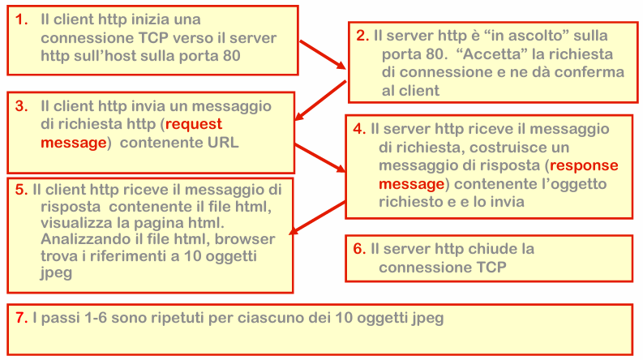
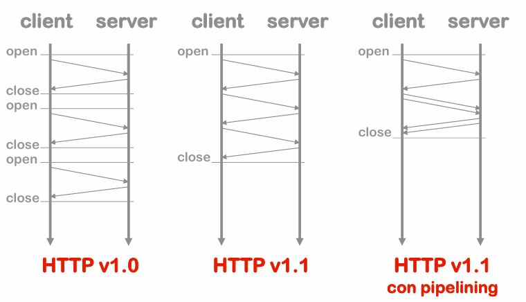
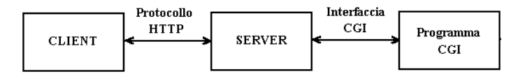
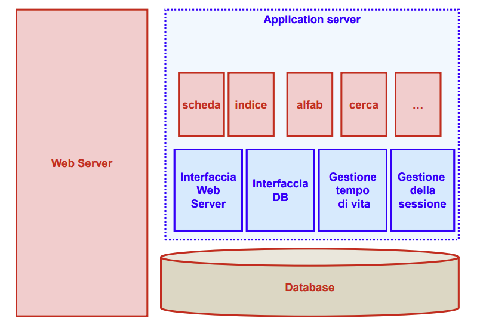
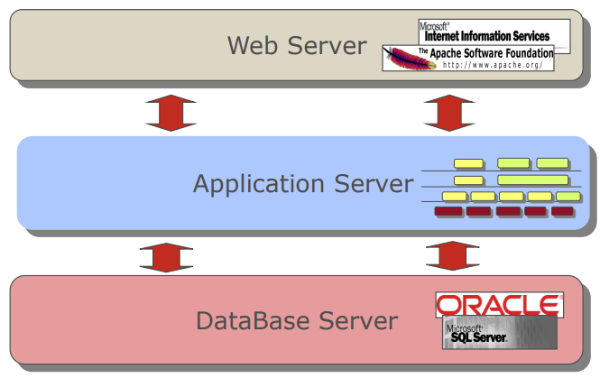
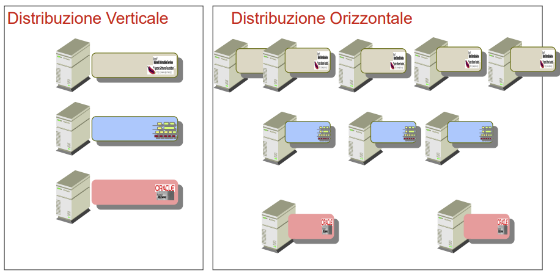
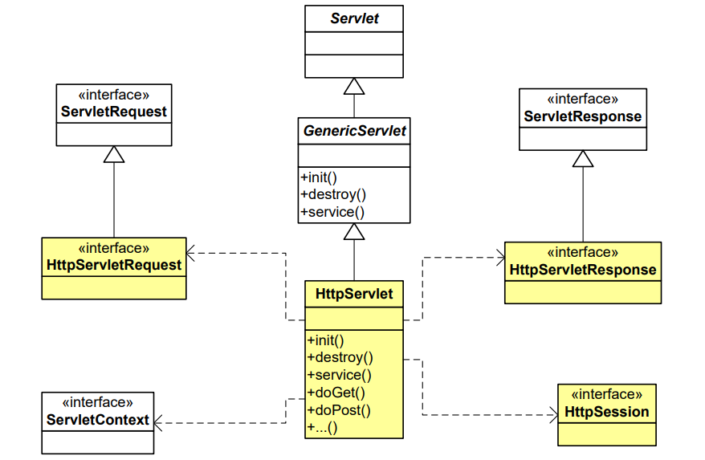
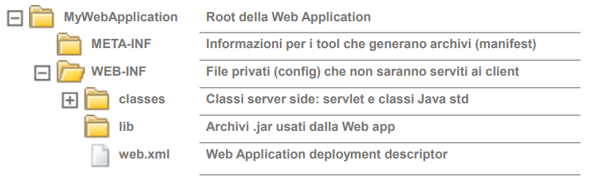

```{=latex}
\begin{center}
```


```{=latex}
\end{center}
```

\newpage
# IL PROTOCOLLO HTTP
Il protocollo **HTTP** (**H**yper**T**ext **T**ransfer **P**rotocol) è un protocollo di livello applicativo utilizzato per trasferire le risorse web. È in grado di gestire sia le richiesta inviate al server tramite URL sia le risposte inviate al client sotto forma di pagine.\
Ne client ne server mantengono, a livello di protocollo, uno stato (informazioni relative a messaggi precedentemente scambiati): è un protocollo **_stateless_**.

### La terminologia
Ci sono diverse entità in gioco:

* **Client**: programma applicativo che stabilisce una connessione per inviare richieste
* **Server**: programma applicativo che accetta connessioni al fine di ricevere richieste e inviare le risposte con le risorse corrispondenti
* **Connessione**: collegamento (circuito virtuale) stabilito a livello 4 (trasporto ISO/OSI) tra 2 applicazioni per comunicare
* **Messaggio**: è l'unità di base di comunicazione HTTP definita come una specifica sequenza di byte concettualmente atomica:
    - **Request**: messaggio HTTP di richiesta
    - **Response**: messaggio HTTP di risposta
* **Resource**: oggetto di tipo dato univocamente definito
* **URI**: **U**niform **R**esource **I**dentifier - identificatore unico di risorsa 

### Funzionamento di base
HTTP è un protocollo basato su TCP: sia client che server trasmettono le rechieste e le risponde su uno stream TCP.\
A titolo esemplificativo lo schema sottostante riporta il funzionamento di base richiedendo una pagina HTML e 10 immagini in formato jpeg:\
```{=latex}
\begin{center}
```

{#funzionamentoHTTP height=30%}

```{=latex}
\end{center}
```
\newpage
### Le diverse versioni
Esistono diverse versioni di HTTP ma quelle considerate in questo corso sono 2:

* HTTP v1.0
* HTTP v1.1 e v1.1 con pipelining

```{=latex}
\begin{center}
```

{#versioniHTTP height=30%}

```{=latex}
\end{center}
```

La differenza principale tra la 1.0 e 1.1 consiste nella possibilità del riutilizzo della stessa connessione HTTP per più richieste, difatti nella **versione 1.0** per **ogni richiesta** si apriva e chiudeva **una connessione**, mentre dall 1.1 in poi il server lascia aperta la connessione HTTP per eventuali nuove richieste
e la chiude solo nel caso in cui nell'header del messaggio HTTP sia specificata la volontà del client di chiudere la connessione oppure dopo un time out.\
Per migliorare le prestazioni di HTTP venne introdotto il pipelining che consiste nell'invio di molteplici richieste anche prima di aver ricevuto tutte le risposte. Il protocollo specifica che le risposte devono essere mandate **nello stesso ordine** delle richieste poichè non ci sono modi di ricondurre la risposta alla richiesta (non vi è, da protocollo, modo per associare richieste e risposte)\
Esistono ulteriori versioni di HTTP:

* HTTP/2: ha l'obiettivo di migliorare le performance pur mantenendo la compatibilità con v1.1. È basato su SPDY, protocollo open networking promosso da Google. In particolare introduce:

    - request-response multiplexing
    - header compression
    - server push

* HTTP/3: vuole migliorare HTTP basandolo sul nuovo protocollo di trasporto QUIC (invece che TCP). Introduce:

    - stream multiplexing
    - controllo di flusso per stream
    - realizzazione di connessioni a bassissima latenza

\

### I MESSAGGI HTTP

Un messaggio HTTP è composto da 2 strutture:

* Message Header: contiene le tutte le informazioni necessarie per l'identificazine del messaggio
* Message Body: contiene i dati trasportati dal messaggio

Esistono degli standard per ogni tipo di messaggio che non possono essere modificati.\
I messaggi di response contengono i dati relativi ai messaggi di request. I dati sono codificati nel formato specificato nell'header, solitamente sono in formato MIME (Multipurpose Internet Mail Extensions)

#### Header HTTP

Gli headers sono costituiti da coppie **nome:valore** che specificano le richieste del messaggio inviato/ricevuto. Ci sono headers di diverso tipo:

- Header generali di trasmissione:
    Data, codifica, versione, tipo di comunicazione ecc.
- Header relativi all'entità trasmessa
    Content-type, Content-length, data di scadenza ecc.
- Header riguardo alla richiesta effettuata
    Chi fa la richiesta, a chi viene fatta la richiesta, che tipo di caratteristiche il client può accettare, quale autorizzazione ecc.
- Header della risposta generata
    Che server da la risposta, che tipo di autorizzazione è necessaria

Il protocollo utilizza messaggi in formato ASCII.
Un esempio abbastanza completo di **richiesta**:
```
GET /search?q=Introduction+to+XML+and+Web+Technologies HTTP/1.1
Host: www.google.com
User-Agent: Chrome/38.0 (X11; U; Linux i686; en-US; rv:1.7.2) 
Gecko/20040803
Accept: text/xml,application/xml,application/xhtml+xml, 
text/html;q=0.9,text/plain;q=0.8,image/png,*/*;q=0.5
Accept-Language: da,en-us;q=0.8,en;q=0.5,sw;q=0.3
Accept-Encoding: gzip,deflate
Accept-Charset: ISO-8859-1,utf-8;q=0.7,*;q=0.7
Keep-Alive: 300
Connection: keep-alive
Referer: http://www.google.com/
```
##### I METODI DI RICHIESTA

\

###### **GET**

Serve per richiedere una risorsa ad un server, è il più utilizzato. È quello che viene attivato facendo click su un link ipertestuale di un documento HTML o specificando l'URL nel browser. Il passaggio dei parametri avviene tramite la parte < query > dell'URL. Una limitazione può essere che la lunghezza di un URL è limitata.

###### **POST**

Come GET serve per richiedere una risorsa, ma a differenza di quest'ultimo i parametri non sono passati all'interno dell'URL bensì nel body del messaggio di richiesta. Conseguentemente non ci sono limitazioni sulla lunghezza dei parametri di request. Viene spesso utilizzato per sottomettere dati di un form HTML ad una CGI. Tutto ciò non comporta la creazione di risorse sul server.

\

###### **PUT e DELETE**

Differentemente dal post creano (nel caso del PUT) e cancellano (nel caso del DELETE) risorse sul server all'URL specificato. Sono entrambi normalmente disabilitati sui server pubblici.

###### **HEAD, OPTIONS e TRACE**

L'HEAD è uguale al GET con la differenza che chiede al server di rispondere con solo headers relativi alla risposta ma senza body. Solitamente viene utlizzato per verificare la validità di un URL e se serve una autenticazione per quel URL.\
OPTIONS server per richiedere informazioni sulle opzioni disconibiliper la comunicazione\
TRACE è usato per invocare il loop-back remoto a livello applicativo del messaggio di richiesta. Viene utilizzato in diagnostica e testing dei servizi Web.

#### IL FORMATO DELLA RISPOSTA

```
HTTP/1.1 200 OK 
Connection: close
Date: Thu, 06 Aug 2008 12:00:15 GMT 
Server: Apache/2.3.0 (Unix) 
Last-Modified: Mon, 22 Jun 2008 …... 
Content-Length: 6821 
Content-Type: text/html
 
<!DOCTYPE HTML PUBLIC "-//W3C//DTD 
HTML 4.51 Transitional//EN">
 <html>...</html>
```

Quanto sopra fa vedere un esempio di HTTP response, che in v1.0 corisponde a chiudere la connession, mentre in v.1.1 il server mantiene aperta la connessione oppure la chiude se si aggiunge la clausola: ```Connection: close```.

##### I CODICI DI STATO 

\
Nella prima riga sono esposti protocollo e codice di stato. La prima cifra del codice di stato indica la classe di appartenenza ad una classe:

* **1xx** Informational: una risposta temporanea alla richiesta durante il suo svolgimento (sconsigliato da HTTP 1.0)
* **2xx** Successful: il server ha ricevuto, capito e accettato la richiesta
* **3xx** Redirection: il server ha ricevuto e capito la richiesta, ma sono necessarie altre azioni da parte del client per portare a termine la richiesta
* **4xx** Client Error: la richiesta del client non può essere soddisfatta per un errore da parte del client (richiesta non autorizzata o errore sintattico)
* **5xx** Server Error: La richiesta può essere corretta, ma il server non è in grado di soddisfare la richiesta per un problema interno

### I COOKIE

Parallelamente alle sequenze request/response, il protocollo preve una struttura dati che si muove come un tocken da client a server e viceversa: **i cookie**. I cookie possono essere generati da entrambe le parti, e dopo la loro creazione vengono mandati ad ogni trasmissione. Scopo dei cookie è quello di supportare un mantenimento di stato in nel protocollo HTTP (stateless).
\newpage
I cookie sono una collezione di stringhe: 

- Key: identificatore univoco all'interno di un dominio:path
- Value: valore associato al cookie (max 255 caratteri) 
- Path: posizione nell'albero del sito a cui è associato
- Domain: dominio dove è generato
- Max-age: numero di secondi di vita (opzionale)
- Secure: i cookie di questo tipo vengono trasferiti solo se si usa HTTPS (opzionale)
- Version: versione del protocollo di gestione dei cookie

### **AUTENTICAZIONE**

**Riconoscimento ip**
\
È una soluzione poco utilizzata perchè presenta diversi svantaggi dovuti a NAT, DHCP e spoofing (tecniche per presentarsi con un IP falso)

**HTTP basic**
\
Consiste nella notifica, da parte del server, della necessità di autorizzazione per accedere ad una determinata risorsa, si aprirà un prompt sul client per la richiesta di username e password che saranno inviate (criptate) al server alla successiva request.

**Form**
\
Si utilizza un form HTML normalmente con method=POST e valgono le stesse considerazioni fatte per HTTP Basic 

### SICUREZZA

Per la trasmissione di informazioni si necessita, semore più spesso, di sicurezza. Esistono 2 tipi di sicurezza per il canale di trasporto:

* SSL: Secure Sockets Layer
* TLS: Transport Layer Security

    - Sostituisce SSL
    - È alla base di HTTPS

Sostanzialmente viene posto un livello che si occcupa della gestione di confidenzialità, autenticità ed integrità della comunicazione HTTP e TCP. Si accede tramite https://...\
È tutto basato su crittografia a chiave pubblica e privata e tramite certificati per autenticare un server.

### ARCHITETTURE DISTRIBUITE PER IL WEB

* **Proxy**: programma applicativo in grado di agire sia come Client che come Server al fine di effettuare richieste per conto di altri Clienti. Le Request vengono processate internamente oppure vengono ridirezionate al Server. Un proxy deve interpretare e, se necessario, riscrivere le Requestprima di inoltrarle.
* **Gateway**: server che agisce da intermediario per altri Server. Al contrario dei proxy, il gateway riceve le request come se fosse il server originale e i Client non sono in grado di identificare che Response proviene da un gateway. Detto anche reverse proxy o server-side proxy.
* **Tunnel**: programma applicativo che agisce come “blind relay” tra due connessioni. Una volta attivo (in gergo “salito”) non partecipa alla comunicazione HTTP

### CACHE 

L'idea di base è memorizzare copie temporanee di documenti web al fine di ridurre l'utilizzo di banda e i tempi di attesa per il client. Una web cache memorizzano i documenti che la attraversano e, sotto specifiche condizioni, riutilizza questi documenti alle successive richieste del client.

#### USER AGENT CACHE

\
Lo user agent (browser) mantiene una cache delle pagine che ha visitato l'utente. Questo tipo di caching era importante in passato quando i client non avevano accesso a connessioni con banda larga. Tutt'ora è molto usato nei dispositivi mobili per permettere di lavorare anche con connettività intermittente e per ridurre i tempi di latenza.

#### PROXY CACHE

* **Forward Proxy Cache**: servono per ridurre le necessità di banda, il proxy intercetta il traffico e mette le pagine in cache in modo tale che alle successive richieste non si vada fino al server per scaricarle
* **Reverse (o server-side) Proxy Cache**: Gateway cache. Lavorano per conto del server per ridurre i carichi computazionali sulle macchine. I client non sono in grado di capire se le pagine arrivano dal server o dal gateway. Si utilizza ICP (Internet Caching Protocol) per il coordinamento fra le diverse cache, alla base per il Content Delivery Network.

\
HTTP definisce vari meccanismi che possono avere effetti collaterali per la gestione lazy dell'aggiornamento cache: 

* **Freshness**: controllatalato server da Expires response header e lato cliente da direttiva CacheControl: max-age
* **Validation**: può essere usato percontrollare se un elemento in cache è ancora corretto, ad es. nel caso in cui sia in cache da molto tempo (ad es. tramite richieste HEAD)
* **Invalidation**: è normalmente uneffetto collaterale di altre request che hanno attraversato la cache. Se per esempio viene mandata una POST, una PUT o una DELETE a un URL il contenuto della cache deve essere e viene automaticamente invalidato


# WEB DINAMICO

Il modello statico, quello visto fin'ora, con solo HTML e CSS è chiamato così perchè pur essendo basato sul concetto di ipertesto distribuito l'insieme dei concetti è prefissato staticamente, le pagine sono preparate a priori e non esistono contenuti composti dinamicamente in base ad una qualsiasi interazione con l'utente. È sicuramente un modello semplice, potente, di facile implementazione ed efficiente, tuttavia presenta evidenti limitazioni.\
Prima di tutte proprio la limitata interazione con l'utente e quindi l'impossibilità di produrre dei risultati sulla base di input dell'utente. Ad esempio non è possibile implementare un qualsiasi tipo di ricerca all'interno del sito web visitato.

## CGI

Una prima soluzione proposta per risolvere questo problema sono le **CGI** (Common Gateway Interface) presenti nel protocollo HTTP dalla versione 1.0. CGI è uno standard per le interfacce esterne con web server. I programmi scritti con questo tipo di standard prendono il nome di programmi CGI, possono essere scritti in un qualunque linguaggio di programmazione (C, PHP, Perl, Python ecc).
\newpage
L'interazione avviene nel seguente modo: 

1. il client invia una richiesta HTTP al server in cui chiede di eseguire un programma CGI con alcuni parametri in ingresso
2. Il server, attraverso l'interfaccia CGI, chiama il programma passandogli i parametri
3. Eseguite le operazioni, il programma rimanda al server i dati elaborati (pagina HTML) sempre tramite interfaccia CGI
4. Il server risponde al client con una HTTP response contenete i dati elaborati dal programma CGI

```{=latex}
\begin{center}
```



```{=latex}
\end{center}
```

I programmi CGI ed il server comunicano tramite:

- Variabili d'ambiente
- Parametri sulla linea di comando: usati con il metodo GET, limitativo perchè la linea di comando ha una lunghezza massima, quindi la quantità di dati è limitata
- Standard input: usato con il metodo POST
- Standard output: per restituire l'HTML di risposta

Prima in chiamare il programma CGI il server imposta alcune env. var:

* REQUEST_METHOD: method usato nel form
* QUERY_STRING: parte dell'URL dopo ?
* REMOTE_HOST: host che ha inviato la richiesta
* CONTENT_TYPE: tipo MIME dell'informazione contenuta nel body della richiesta (POST)
* CONTENT_LENGTH: lunghezza dei dati inviati
* HTTP_USER_AGENT: nome e versione del browser usato dal client

L'**output** è generato dopo l'elaborazione dei dati ed è comunicato al server tramite stdout, il server lo preleva e lo invia incapsulandolo in un messaggio HTTP.\
Purtroppo questa soluzione presenta diversi problemi:

- Problemi di **prestazioni**: ogni volta che viene invocata una CGI si crea un processo (probabilmente pesante) che viene distrutto al termine dell'elaborazione
- **Robustezza**: le CGI, soprattutto se scritte in C, possono essere poco robuste in quanto è difficile capire che cosa potrebbe accadere in caso di errore bloccante
- Poco **riutilizzo** di codice già scritto: ogni programma CGI deve reimplementare una serie di parti comuni (accesso a DB, logica di interpretazione delle HTTP request, gestione di stato)
- **Sicurezza**: scarse garanzie di sicurezza

Per ovviare al problema del riutilizzo del codice si potrebbe creare un'unica CGI che implementa diverse funzioni, ma si finirebbe per avere un'applicazione monolitica di difficile scalabilità e aggiornamento, in più cosa potrebbe succede se incappasse in errore? Nessuna funzionalità funzionerebbe più? Dipende dal linguaggio di programmazione, ma non si può correre questo rischio.

## APPLICATION SERVER

La soluzione migliore è quella di realizzare un contenitore in cui far vivere le funzioni server-side. Il contenitore si occupa di fornirei servizi di cui le applicazioni hanno bisogno:

- interfacciamento con il web server
- gestione del tempo di vita (attivazione on-demand delle funzioni)
- interfacciamento con in database
- gestione della sicurezza

La soluzione così pensata è modulare e le funzionalità ripetitive vengono portate a fattor comune. Un ambiente di questo tipo si chiama **application server**.


```{=latex}
\begin{center}
```

{#appServ height=280px}

```{=latex}
\end{center}
```

### MODELLI A CONTENIMENTO

Molte funzionalità possono non essre controllate direttamente ma lasciate come respondabilità ad un entità deletagata supervisore (detta **contenitore**) che se ne occupa. Solitamente se ne occupa introducendo politiche di default, evitando che si verifichino errori e controllando gli eventi. I contenitori (detti anche container, engine o middleware) possono occuparsi di azioni automatiche sgravando l'utilizzatore che deve solo specificare la parte di alto livello, non ripetitiva e fortemente dipendente dalla logica applicativa. Si vedranno a titolo esemplificativo: CORBA (per gli aspetti C/S), Engine per framework a GUI e Container per servlet. Questi ultimi possono ospitare componenti più trasportabili, riutilizzabili e mobili.\
Il container fornisce molte delle funzioni per supportare l'interazione con l'utente:

* Supporto al ciclo di vita: 

    - Attivazione/deattivazione del server
    - Mantenimento di stato
    - Persistenza trasparente e recupero delle informazioni

* Supporto al sistema di nomi (DNS):

    - Discovery del servizio
    - Federazione con altri container

* Supporto alla qualità del servizio:

    - Tolleranza ai guasti, selezione tra possibili deployment
    - Controllo della QoS richiesta e ottenuta

* Sicurezza

### APPLICATION SERVER E TECNOLOGIE SERVER SIDE

Due tecnologie storicamente diffuse nell'ambito degli application server sono: 

* .NET per componenti Microsoft ed evoluzioni
* Java J2EE per componenti EJB e Web Java-oriented

Altre tecnologie interessanti sono quelle basate su Perl, Python o JavaScript server side (node.js).\
Altre soluzioni di struttura più semplice che però non sono application server ma spesso solo interpreti sono:

- PHP o Ruby
- Le vecchie tecnologie ISAPI e ASP di Microsoft

In queste però si parla di moduli di estensione del Web server.

### LO STATO

L'interazione fra client e server può essere di 2 tipi:

* **Stateful**: esiste il concetto di stato dell'interazione e quindi l'n-esimo messaggio può essere messo in relazione con gli n-1 precedenti
* **Stateless**: non si tiene traccia dello stato, ogni messaggio è indipendente dagli altri

#### INTERAZIONE STATELESS

Un'interazione stateless è feasible senza generare grossi problemi solo se il protocollo applicativo è progettato con operazioni **idempotenti**. Le operazioni si dicono idempotenti se producono sempre lo stesso risultato indipendentemente dal numero di messaggi M ricevuti dal server stesso.

#### INTERAZIONE STATEFUL

In generale tutte le volte che abbiamo bisogno di personalizzazione delle richieste Web possiamo beneficiare di interazioni stateful. Per esempio se è prevista un'autenticazione è necessario tener traccia fra una chiamata e l'altra del fatto che l'utente si è autenticato in modo tale da non dover rifare l'autenticazione ad ogni request, e da qui nasce il concetto di **stato**.
\
Nelle applicazioni Web è possibili classificare precisamente lo stato:

* **Stato di esecuzione** (insieme di dati parziali per una elaborazione): rappresenta un'avanzamento in stato di esecuzione, può essere mantenuto in memoria lato server come stato di uno o più oggetti. Per sua definizione è volatile.
* **Stato di sessione** (insieme dei dati che caratterizzano una interazione con uno specifico utente): la sessione viene gestita di solito in modo unificato attraverso l'uso di istanze di oggetti specifici (supporto ad oggetti di sessione).
* **Stato informativo persistente** (ad esempio gli ordini inseriti in un eCommerce): viene normalmente mantenuto in una struttura persistente tipo un database.

\newpage
### LA SESSIONE

La sessione rappresenta lo stato associatoad una sequenza di pagine visualizzate dall'utente. Contiene tutte le informazioni necessarie durante l'esecuzione: le informazioni di sistema (IP di provenienza, lista delle pagine visualizzate, ...) e quelle di natura applicativa (nome e cognome, username, quanti e quali prodotti messi nel carrello ...). Lo **scope** di sessione è dato da:

- Tempo di vita dell'interazione con l'utente (*lifespan*)
- Accessibilità: usualmente concessa alla richiesta corrente e alle future provenienti dallo stesso processo browser

La **conversazione** rappresenta una sequenza delle pagine di senso compiuto (ad esempio tutte le pagine necessarie per comprare un prodotto), è univocamente definita dall'insieme delle pagine che la compongono e dall'insieme delle interfacce di I/O per la comunicazione (flusso della conversazione).\
Lo stato di sessione **deve** essere condiviso da client e server, inoltre è associato a uno o più conversazioni effettuate da ogni singolo utente, ne segue che ciascun user possiede il suo stato. Per gestire tutto ciò ci sono due tecniche: utilizzo dei **cookie** (storage lato client) e la gestione di uno stato sul server per ogni utente collegato (**session** e server side). Queste tecniche non sono necessariamente alternativa ma anche integrabili. La gestione della sessione è uno dei supporti orizzontali messi a disposizione di un application server.

### ARCHITETTURA FREQUENTE DEI SISTEMI WEB

```{=latex}
\begin{center}
```

{#arcSW height=280px}

```{=latex}
\end{center}
```

La struttura rappresentata in figura rispecchia i 3 principali servizi che realizzano un sistema Web, possono risiedere tutti sullo stesso HW oppure essere su macchine separate (**distribuzione verticale**). La distribuzione non necessita di nessun accorgimento specifico e solitamente viene realizzata per migliorare le performance soprattutto quando si separa il livello applicativo dal livello del DB. Così com'è rappresentata non prevede replicazione quindi non è utile per risolvere i problemi di fault tolerance.\
Per provvedere a questo problema si distribuisce orizzontalmente ogni livello: si replica il servizio su diverse macchine, purtroppo questo comporta importanti accorgimenti strettamente dipendenti dalla tecnologia in uso. La **distribuzione orizzontale** non è fatta solo per gestire la fault tolerance ma anche per distribuire e bilanciare il carico computazionale al fine di migliorare le performance.

```{=latex}
\begin{center}
```

{#distrOV height=280px}

```{=latex}
\end{center}
```

Per la natura di HTTP il **Web server** è stateless e quindi molto facile da replicare. Il fatto che IP è embedded in URL può essere gestisto sia tramite soluzione HW che SW. Si possono inoltre applicare politiche di load balancing con diverse euristiche usando i dispositivi appositi.\
Per la replicazione del livello di **application server** si parla principalmente di replicazione dello stato di sessione. Può però accedere che un application server utilizzi oggetti o componenti con stato per motivi di performance o altre necessità specifiche, alcuni framework permettono la replicazione con tecniche di clustering ma altri framework non sono in grado di replicare orizzontalmente. Tuttavia se si mantiene lo stato di sessione concentrato all'interno della sessione e la sessione viene gestita internamente attraverso i cookie è possibile realizzare un framework applicativo interamente stateless lato server, ottenendo così una realizzazione più semplice e primitiva di configurazione completamente replicabile orizzontalmente.\
La replicazione del **database** è molto delicata perchè deve mantenere il principio di atomicità delle transazioni. In più il database server è normalmente stateful, il che può creare non poche complicazioni nella replicazione. I database commerciali come Oracle e Microsoft SQL Server prevedono delle configurazioni di clustering in grado di gestire in modo trasparente un numero variabile di CPU e macchine distinte, anche se generalmente in numero basso (qualche unità).
\

## SERVLET

Prima di dare la definizione e le modalità d'uso delle servlet è necessario introdurre un po' di definizioni:

* **Web application**: è un gruppo di risorse server-side che nel loro insieme creano un'applicazione interattiva fruibile via web
* **Risorse server side**: includono classi server-side, JSP, risorse statiche (doc. html, css, immagini, ...), applet e JS e/o altri componenti che diventeranno attivi client-side, e informazioni di config e deployment
* **Web container**: forniscono un ambiente di esecuzione per web application, in generale garantiscono servizi di base alle applicazioni sviluppate secondo paradigma a componenti

\newpage
Una **servlet** è una classe (java) che fornisce un servizio comunicando con il client mediante protocolli di tipo request/response, tra questi il più diffuso è HTTP. Le servlet estendono le funzionalità di un web server generando contenuti dinamici e superando i classici limiti delle applicazioni CGI. Esse eseguono direttamente in un web container.\
A livello pratico tutte le servlet sono sottoclassi della classe `HttpServlet` che implementa vari metodi che si andranno a ridefinire. Tutte le classi che ci interessano si trovano all'interno del package `javax.servlet.http.*`.

```{=latex}
\begin{center}
```

{#servletUml height=280px}

```{=latex}
\end{center}
```

Gli oggetti **Request** rappresentano la chiamata fatta dal server al client. Sono caratterizzati da chi ha fatto la request e quali parametri e headers sono stati passati nella request.\
Gli oggetti **Response** rappresentano le informazioni restituite al client (in risposta alla request). In particolare contengono: status line (status code e status phrase), gli headers e il response body. Ha come interfaccia tipo l'interfaccia `HttpResponse` che espone metodi per:

* specificare lo status code
* indicare il content type (es text/html)
* ottenere un output stream
* indicare se l'output è bufferizzato
* gestire i cookie


### Il ciclo di vita di una servlet

Il Servlet container controlla e supporta automaticamente il ciclo di vita di una servlet.\
Se non esiste un'istanza della classe servelet nel container:\
\ \ Carica la classe della servlet\
\ \ Crea un'istanza della classe\
\ \ Inizializza la servlet (invocando `init()`)\
A regime:\
\ \ Invoca la servlet (`doGet()` o `doPost()`) passando gli oggetti di tipo `HttpServletRequest` e \
\ \ `HttpServletResponse`\
\newpage

#### **Servlet e multithreading**

In un modello normale c'è una sola istanza di servlet e un thread assegnato ad ogni request per la servlet anche se altre richieste sono già in esecuzione. Di conseguenza, avendo più thread che condividono una risorsa sola (servlet) si crea concorrenza: 

- il metodo `init()` è invocato una sola volta quando il web container crea la servlet
- `service()` e `destroy()` possono essere chiamati solo dopo il completamento di `init()`
- il metodo `service()`, e quindi `doGet()` e `doPost()`, può essere invocato da numerosi client in modo concorrente ed è quindi necessario gestire le sezioni critiche (a carico del programmatore) tramite l'uso di blocchi `synchronized`, semafori e mutex

Si può anche pensare ad un modello single-threaded ma è deprecato e altamente inefficiente. Per implementare ciò una servlet dovrebbe implementare l'interfaccia `SingleThreadModel`

#### I metodi del controllo del ciclo di vita

\
\
`init()`

> Viene chiamato una sola volta al caricamento della servlet. In questo metodo si può inizializzare l'istanza (ad es. si crea la connessione ad un DB).\
È definito nella classe `GenericServlet`

`service()`

> Viene chiamato ad ogni request. Chiama la `doGet()` o la `doPost()` a seconda della tipologia di request ricevuta.\
È un metodo astratto definito nella classe `GenericServlet`\
`HTTPServlet` fornisce un'implementazione di questo metodo che delega la richiesta a seconda del metodo:\
    \ \ \ - `doGet()`\
    \ \ \ - `doPost()`\
    \ \ \ - `doPut()`\
    \ \ \ - `doDelete()`

`destroy()`

> Viene chiamato una sola volta quando la servlet deve essere disattivata, solitamente serve per rilasciare le risorse acquisite.\
È definito nella classe `GenericServlet`

#### Gestione dello status code

\

È possibile definire lo status code della response tramite:

```java
    public void setStatus(int statusCode);
```

Mentre per gli errori:

```java
    public void sendError(int statusCode);
    public void sendError(int code, String message);
```

#### Gestione degli headers

Ci sono le funzioni per gestire gli headers della response:

```java
public void setHeader(String headerName, String headerValue); //imposta un header arbitrario
public void setDateHeader(String name, long millisec); // imposta la data
public void setIntHeader(String name, int headerValue); // imposta un header con valore intero 
```

Quelle elencate sopra sono generali ma esistono anche:

- `addHeader`, `addDateHeader`, `addIntHeader` aggiungono una nuova occorrenza dell'header dato
- `setContentType` configura il content-type. **Si usa sempre**
- `setContentLength` utile per la gestione di connessioni persistenti
- `addCookie` consente di gestire i cookie nella risposta
- `sendRedirect` imposta location header e cambia status code in modo da fare la redirezione

#### Gestione del contenuto

Per gestire il contenuto della response si possono utlizzare due metodi di `response`:

```java
public PrintWriter getWriter();
public ServletOutputStream getOutputStream();
```

Il primo è solitamente utile per restituire un testo nella risposta perchè mette a disposizione uno stream di caratteri.\
Il secondo mette a disposizione uno stream di byte quindi è più utile per l'invio di un'immagine ad esempio.

#### **L'oggetto request**

È un'istanza di una classe che implementa l'interfaccia `HttpServletRequest`, contiene i dati della request HTTP. Viene creato dal servlet container e passato come parametro ai metodi `doGet()` e `doPost()`. Fornisce metodi per accedere alle varie info (HTTP Request URL, HTTP Request headers, autenticazione, user info, cookie e session)\
\
**Ricorda!!**\
L'URL HTTP ha la seguente sintassi: `http://[host]:[port]/[request path]?[query string]`: il request path è composto dal contesto e dal nome della web application, la query string è composta da un insieme di parametri se la richiesta è in get (il metodo `getParameter(...)` di request ci permette di avvedere ai vari parametri)
\
\
Esistono tutti i vari metodi per accedere all'URL, agli headers e alle user info, autenticazione, cookie e sicurezza

### Il Deployment

Un'applicazione web deve essere installata sul server prima di poter essere utilizzata: questa operazione prende il nome di **deployment**. Esso comprende:

* La definizione del runtime environment di una web app
* La mappatura delle URL sulle servlet
* La definizione delle impostazioni di default dell'applicazione come la welcome page o la error page
* La configurazione delle caratteristiche di sicurezza dell'applicazione

La modalità con cui avviene il deployment è rappresentata dagli Web Archives (.war), non sono altro che dei file .jar con una struttura particolare.\
Per crearli si usa il comando jar ad esempio `jar -cvf newArchive.war myWebApp/*`

```{=latex}
\begin{center}
```
{#warStructure height=150px}
```{=latex}
\end{center}
```
La struttura di dir delle Web app è basata su Servlet 2.4 specification.\
web.xml è in sostanza un file di configurazione che contiene una serie di elementi descrittivi. Contiene l'elenco delle servlet attive sul server (nome e classe Java), il **loro mapping URL** e per ognuna permette di definire una serie di parametri nome-valore o di inizializzazione.\
Esempio di mappatura della servlet

```xml
<web-app>
<servlet>
 <servlet-name>myServlet</servlet-name>
 <servlet-class>myPackage.MyServlet</servlet-class>
</servlet>
<servlet-mapping>
 <servlet-name>myServlet</servlet-name>
 <url-pattern>/myURL</url-pattern>
</servlet-mapping>
</web-app>
```
E l'URL mappato su myServlet è `http://MyHost:8080/MyWebApplication/myURL`

### Servlet configuration

Una servlet accede ai propri parametri di configurazione mediante l'interfaccia ServletConfig. Ci sono 2 modi per accedere a oggetti di questo tipo:

- tramite il parametro passato al metodo `init()`
- tramite il metodo `getServletConfig()` della servlet, invocabile in qualsiasi momento

L'interfaccia `ServletConfig` espone un metodo per ottenere il valore di un parametro in base al nome: 

```java 
    String getInitParameter(String parName)
```
Esempio di parametro di configurazione:

```xml
<init-param>
 <param-name>parName</param-name>
 <param-value>parValue</param-value>
</init-param>
```

### Servlet context

Ogni Web application esegue in un contesto: corrispondenza 1:1 tra una Web-app e suo contesto. L'interfaccia `ServletContext` è la vista della Web application (del suo contesto) da parte della servlet. 